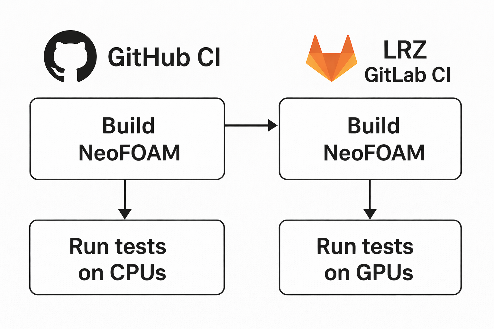

Continuous Integration
======================
The **NeoFOAM** project uses a two-level Continuous Integration (CI) system
to ensure correct builds, GPU compatibility, and automated benchmarking.

The main repository is hosted on **GitHub**, and GPU-based workflows are delegated
to **LRZ GitLab**, where jobs are executed on both **NVIDIA** and **AMD** GPUs.
The CI architecture for NeoFOAM is illustrated below.

--------------------------------
Continuous Integration on GitHub
--------------------------------
GitHub CI is responsible for managing the overall NeoFOAM CI workflow.

**Responsibilities:**

* Build and test NeoFOAM on **CPU** across different platforms (Linux, macOS, Windows).
* Push the source code and commit metadata to **LRZ GitLab**.
* Cancel outdated pipelines on LRZ GitLab for the same branch.
* Trigger new LRZ GitLab pipelines for GPU builds and benchmarks.

.. note::
   The GitHub CI acts as the *control layer* for all NeoFOAM CI operations.
   Developers interact only with GitHub — all LRZ GitLab pipelines are triggered automatically.

------------------------------------
Continuous Integration on LRZ GitLab
------------------------------------
The LRZ GitLab CI handles GPU-related operations.

**Responsibilities:**

* Build and test NeoFOAM on **NVIDIA** and **AMD** GPUs on Linux.
* Run benchmark jobs after successful build and test stages.
* Report the status and results back to GitHub for unified monitoring.

.. _ci-neofoam-workflow:

--------------------
Development Workflow
--------------------
The development workflow for NeoFOAM proceeds as follows:

#. A developer opens a pull request (PR) or pushes a commit to an existing PR on GitHub.
#. GitHub CI builds and tests NeoFOAM on CPUs.
#. GitHub CI pushes the same branch to LRZ GitLab.
#. GitHub CI cancels all pending or running LRZ GitLab pipelines for that branch.
#. GitHub CI triggers a **new LRZ GitLab pipeline**.
#. LRZ GitLab CI builds and tests NeoFOAM on GPUs.
#. *(Optional)* Benchmark jobs are executed after successful testing.
#. The developer monitors all results directly on GitHub.

.. _ci-neofoam-labels:

-------------------
Pull Request Labels
-------------------
NeoFOAM’s GitHub repository uses labels to control the CI behavior.

**Relevant Labels:**

* ``skip-build`` — Skip all build-and-test jobs on both GitHub and LRZ GitLab.
* ``benchmark`` — Enable GPU benchmarking jobs after successful build-and-test jobs.

These labels allow developers to customize the CI process according to their needs.

.. _ci-neofoam-summary:

-------
Summary
-------
The NeoFOAM CI system provides:

* Unified GitHub-driven CI management.
* Transparent CPU and GPU build workflows.
* Automatic synchronization between GitHub and LRZ GitLab.
* Branch-aware pipeline handling and cancellation.
* On-demand GPU benchmarking via PR labels.

.. seealso::

   * :ref:`ci-neofoam-workflow`
   * :ref:`ci-neofoam-labels`
