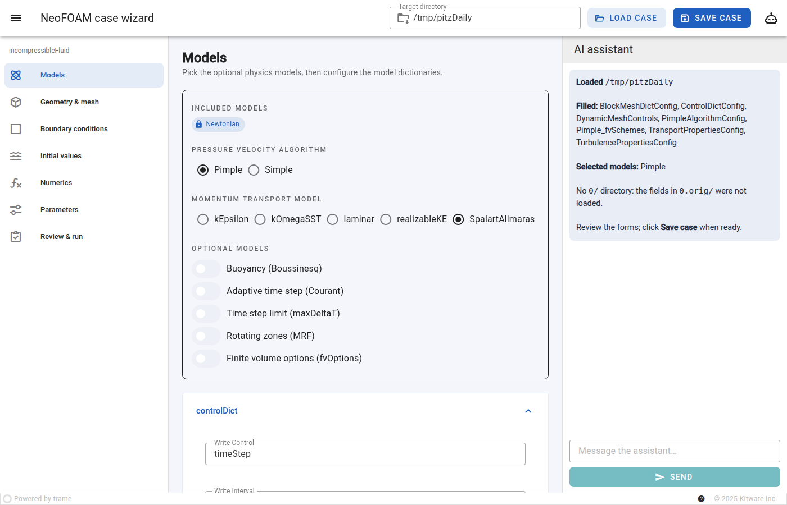
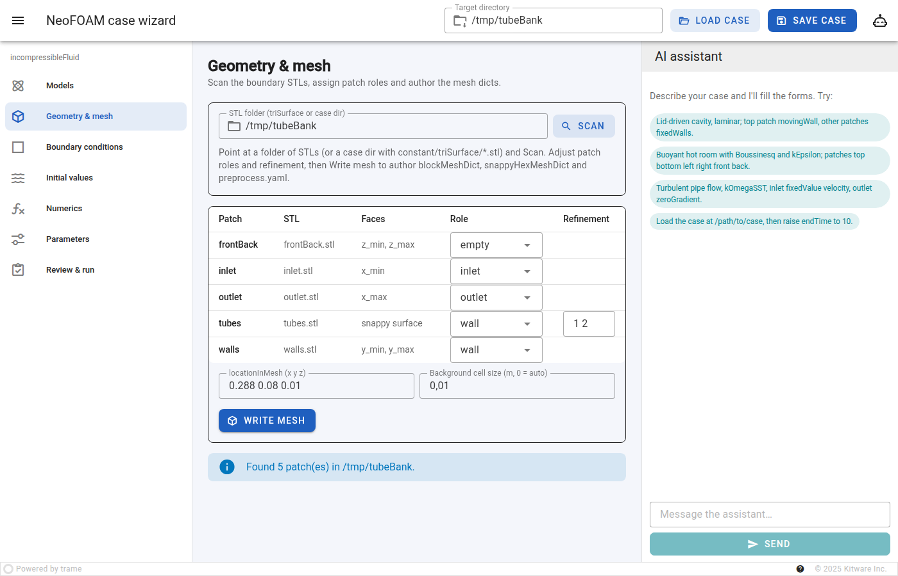
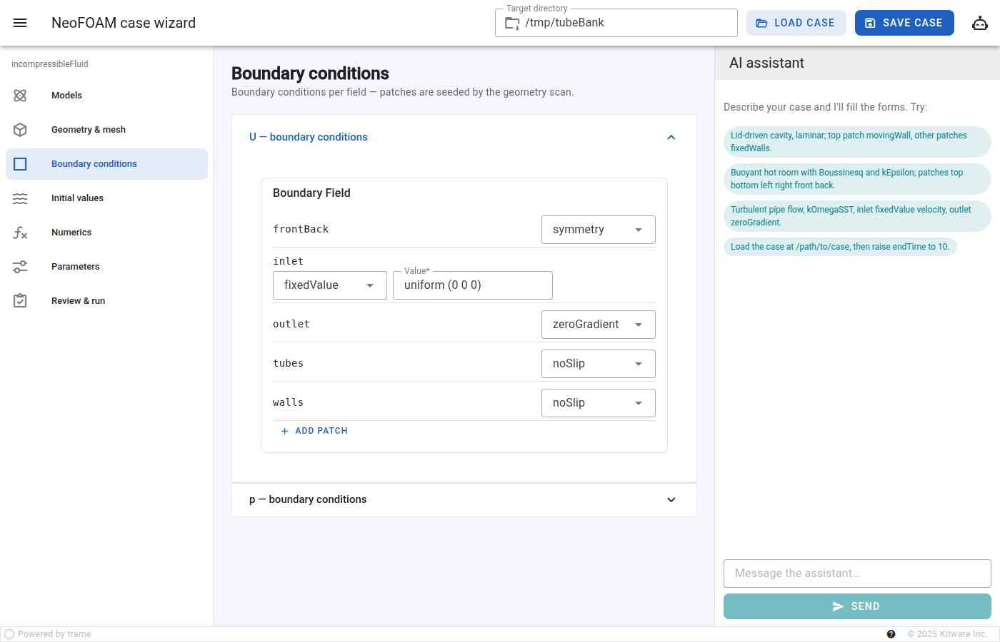
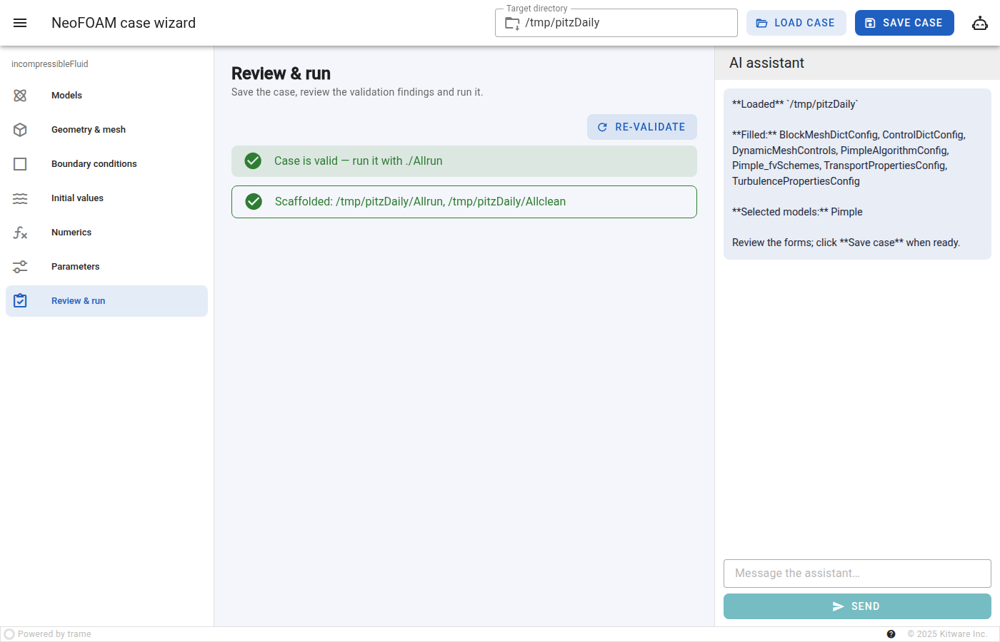

Set up a case with the case wizard
==================================

NeoFOAM ships an interactive **case wizard**: a web app that renders a solver's
configuration as forms, generated from the same pydantic configs the solver reads,
and (optionally) lets an AI assistant fill a whole case from a natural-language
description. ``neofoam ui`` starts it, so you can fill, save, validate and run a
case without hand-editing OpenFOAM dictionaries.

The wizard lays a case out as a guided journey, one step per entry of the left
drawer: **Models → Geometry & mesh → Boundary conditions → Initial values →
Numerics → Parameters → Review & run**.

Prerequisites
-------------

- NeoFOAM installed (see :doc:`../how-to/install`) with the ``ui`` extra, which is
  part of ``all``::

      pip install ".[ui]"

- *Optional* — to use the AI assistant, export an Anthropic key::

      export ANTHROPIC_API_KEY=sk-...

  Without a key the assistant only answers that it is unavailable; filling the
  forms by hand still works.

Step 1 — start the wizard
-------------------------

.. code-block:: bash

    neofoam ui

This serves the wizard on ``http://localhost:8080/`` and opens a browser tab.
``--solver`` picks the solver whose configs are edited (``incompressibleFluid``,
the default, ``incompressibleFluidNeoN`` or ``incompressibleVoF``); ``--port`` and
``--host`` change the address and ``--no-browser`` keeps the browser closed — see
:doc:`../reference/cli`.

Type the case directory into the toolbar's **Target directory** field. It must be
an absolute path (e.g. ``/home/me/cases/my_cavity``), so the wizard never writes
into the directory it was launched from.

.. figure:: ../_static/case_wizard_models.png
   :align: center
   :alt: The case wizard on the Models step, with the step drawer, the toolbar and the AI assistant drawer
   :width: 90%

   The wizard after start: the step drawer on the left, the **Models** step in the
   middle, the toolbar with **Target directory**, **Load case** and **Save case**.

To continue from an existing case, type its directory there and click **Load
case**: every config file of the case is read from disk into the forms (replacing
what they hold) and the models the case uses are selected. The fields — initial
values and boundary conditions with their patches — are read from ``0/`` only; a
case that keeps them in ``0.orig/`` loads without fields, and the report says so.
The **AI assistant** drawer opens with the result — what was loaded, and any file
that is present but does not validate or lacks keys of a model it otherwise sets
up (``missing solvers.U`` when the case groups it as ``"(U|nuTilda)"``). This needs
no API key.

   After **Load case**: the forms hold the case, the drawer reports what was loaded.

Step 2 — walk through the steps
-------------------------------

Each step shows its forms as expandable panels; an edit is taken over as you type,
there is no per-form submit.

- **Models** — pick one member of each model family (for ``incompressibleFluid``:
  the pressure-velocity algorithm, ``Pimple`` or ``Simple``, and the momentum
  transport model, e.g. ``laminar`` or ``kEpsilon``) and switch on optional models
  such as *Buoyancy (Boussinesq)*. Below the selection sit the model dictionaries:
  ``controlDict``, ``transportProperties``, ``turbulenceProperties``, … A form owned
  by a model is only shown while that model is selected.
- **Geometry & mesh** — enter a folder of boundary STLs (or a case directory with
  ``constant/triSurface/*.stl``) and click **Scan**. Give each patch found a role
  (``inlet``, ``outlet``, ``wall``, ``symmetry``, ``empty``) and a snappy surface
  its refinement levels, then click **Write mesh** to author ``blockMeshDict``,
  ``snappyHexMeshDict`` and ``preprocess.yaml``. The scan sets an empty **Target
  directory** to the scanned case and seeds the next step with the patches, each
  with a boundary condition matching its role.
- **Boundary conditions** — each field's ``boundaryField``, one row per patch.
- **Initial values** — each field's ``dimensions`` and ``internalField``.
- **Numerics** — ``fvSchemes`` and ``fvSolution`` of the selected models; the
  defaults are a runnable starting point.
- **Parameters** — optional: sweep any config over named variants and export a
  Snakemake workflow. It clones the saved case, so save first.
- **Review & run** — see step 4.

   **Geometry & mesh** after **Scan**: one row per patch, with its role and refinement.

   **Boundary conditions**: the scanned patches, each seeded from its role.

Step 3 — let the assistant fill the case (optional)
---------------------------------------------------

The toolbar toggles the **AI assistant** drawer. Describe the case, or click one
of the suggested prompts, e.g.:

    *Lid-driven cavity, laminar; top patch movingWall, other patches fixedWalls.*

The assistant fills the forms, selects the models it filled, writes the configs
into the target directory (if one is set) and replies with a summary. Follow-up
messages refine the same case. If patches are scanned, the same prompt also
assigns their roles.
The model is ``claude-haiku-4-5`` unless ``NEOFOAM_CASE_MODEL`` names another.

The assistant can also open an existing case (like **Load case**, from any
directory) and change it in the same turn:

    *Load the case at /home/me/cases/cavity, then raise endTime to 10.*

Every config file of the case is read from disk into the forms; the assistant only
changes what you asked for.

Step 4 — save, review and run
-----------------------------

Click **Save case** in the toolbar. The wizard switches to **Review & run**,
validates the forms against the solver's configs, writes the OpenFOAM dictionaries
and field files into the target directory, adds ``Allrun`` and ``Allclean`` and
checks the written case. Each finding names its file and, where known, a fix;
**Re-validate** repeats the check after an edit on disk. Once the case is valid,
run it:

.. code-block:: bash

    cd /home/me/cases/my_cavity
    ./Allrun

   **Review & run** after **Save case**: the case is valid and the run scripts are written.

``Allrun`` starts ``neofoam solver incompressiblefluid``, which builds the mesh
from ``system/preprocess.yaml`` before the time loop. The dictionaries the wizard
writes carry a proper ``FoamFile`` header, so the case is readable by OpenFOAM
without copying a template.

.. note::

   Prefer to drive the same pipeline from Python or an LLM without the web app?
   See :doc:`../auto_how-to/example_collect_and_save_configs` and the
   ``neofoam agent fill`` command, which fill a target case from a source case.
   How the wizard is built is described in :doc:`../reference/ui-architecture`.
