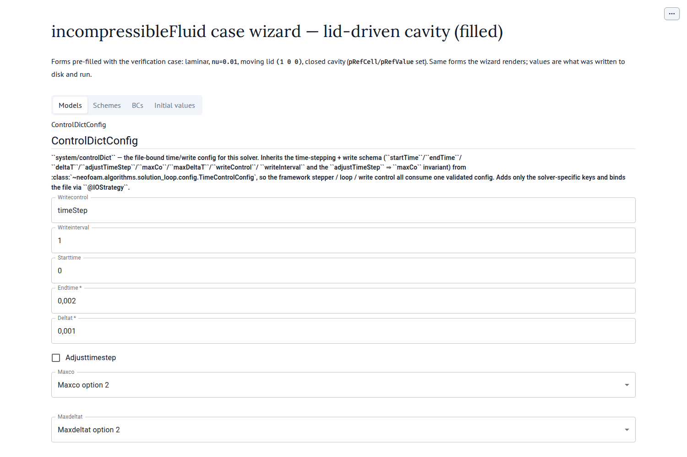
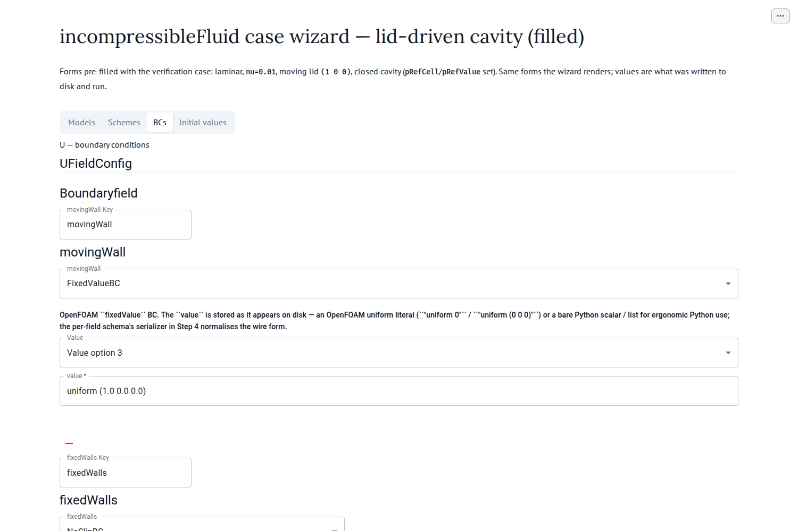

Scaffold a case wizard notebook
===============================

NeoFOAM ships an interactive **case wizard**: a `marimo <https://marimo.io>`_
notebook that renders the ``incompressibleFluid`` configuration as web forms and
(optionally) lets an AI agent fill a whole case from a natural-language
description. The ``neofoam agent wizard`` command scaffolds the notebook into a
directory of your choice so you can fill, save, and run a case without hand-editing
OpenFOAM dictionaries.

   The wizard lays a case out as a guided journey:
   **Models → Schemes → BCs → Initial values**.

Prerequisites
-------------

- NeoFOAM installed (see :doc:`../how-to/install`).
- The notebook extras::

      pip install marimo json-schema-widget

- *Optional* — to use the AI chat, export an Anthropic key::

      export ANTHROPIC_API_KEY=sk-...

  Without a key the chat is disabled and the manual form-filling wizard still
  works.

Step 1 — scaffold the notebook
------------------------------

Create a case directory and write the wizard into it:

.. code-block:: bash

    neofoam agent wizard my_cavity

This writes ``my_cavity/case_wizard.py``. The notebook is self-contained — it
imports its helpers from ``neofoam`` and operates on the directory it lives
in — so it is ready to run as-is. Use ``--name`` to change the file name or
``--force`` to overwrite an existing one.

Step 2 — open the wizard
------------------------

.. code-block:: bash

    marimo edit my_cavity/case_wizard.py

A browser tab opens with the wizard. It has four tabs:

- **Models** — ``controlDict``, transport and turbulence properties.
- **Schemes** — ``fvSchemes`` / ``fvSolution`` (what they need depends on the
  models chosen).
- **BCs** — each field's ``boundaryField``.
- **Initial values** — each field's ``internalField``.

Step 3 — fill the case
----------------------

Either fill the forms by hand (expand a section, edit, click that form's
**Submit**), or describe the case to the AI chat at the top, e.g.:

    *Lid-driven cavity, laminar; top patch movingWall at (1 0 0), the other
    patches fixedWalls.*

The agent fills the tabs and writes the case to disk. The screenshot below shows
the resulting velocity boundary conditions:

   ``U`` boundary conditions: ``movingWall`` fixed at ``uniform (1 0 0)``,
   ``fixedWalls`` no-slip.

Click **Save case** after any manual edits to (re)write the merged OpenFOAM
dictionaries into the directory.

Step 4 — add a mesh and run
---------------------------

The wizard writes the configuration and field files but not the mesh. Add a
``system/blockMeshDict`` and generate the mesh (with the bundled pybFoam
``blockMesh`` or your OpenFOAM install), then run the solver from the case
directory:

.. code-block:: bash

    cd my_cavity
    # ... create system/blockMeshDict and run blockMesh ...
    neofoam solver incompressiblefluid

The dictionaries the wizard writes carry a proper ``FoamFile`` header, so the
case is readable by OpenFOAM without copying a template.

.. note::

   Prefer to drive the same pipeline from Python or an LLM without the notebook?
   See :doc:`../auto_how-to/example_collect_and_save_configs` and the
   ``neofoam agent fill`` command, which fill a target case from a source case.
