# Open-closed cooling DrivAer variant with Static Mesh
## Authors
Original setup: Charles Mockett, Hendrik Hetmann and Felix Kramer (Upstream CFD GmbH), 2022-2023

Modified setup for OpenFOAM HPC Challenge (OHC-1): Mark Wasserman (Huawei) and Sergey Lesnik (Wikki GmbH), 2025

## Copyright
Copyright (c) 2022-2023 Upstream CFD GmbH

Copyright (c) 2024-2025 Huawei Technologies Co., Ltd.

Copyright (c) 2024-2025 Wikki GmbH

 This work is licensed under a <a rel="license" href="http://creativecommons.org/licenses/by-sa/4.0/">Creative Commons Attribution-ShareAlike 4.0 International License</a>.

## Configuration
The open-closed cooling modification of the DrivAer represents a typical industrial application. The case consists of a full car model with closed coolings and a complex underbody, without wheel rotation. The geometry is derived from the notchback variant of the Ford Open Cooling DrivAer (OCDA) (Hupertz, et al., 2018[^Hupertz]) that has a more complex underbody geometry and engine bay cooling channels than the original DrivAer[^TUMDrivAer]. The present case has static wheels and sealed (closed) cooling inlets, hence the name occDrivAer (open-closed cooling DrivAer). The setup was investigated as case 2 during the 2nd automotive CFD prediction workshop (AutoCFD2)[^AutoCFD2], and as case 2a in the subsequent AutoCFD3[^AutoCFD3] and AutoCFD4[^AutoCFD4] workshops.

The setup was modified to suit the requirements of the OpenFOAM HPC Challenge (2025), by opting for a steady-state RANS simulation, fixing the inner iterations of the SIMPLE solver, and providing pre-generated mesh files of various resolutions that are suitable for a static simulation.

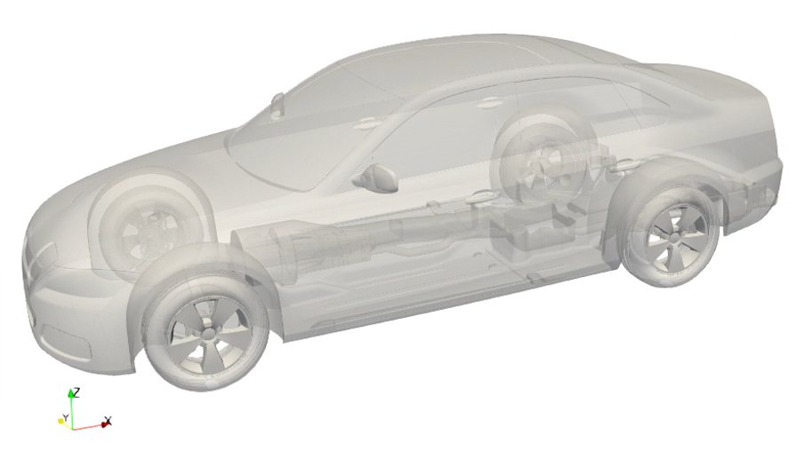

Figure 1: occDrivAer shape.

## Flow Parameters
- Air with a kinematic viscosity: $\nu = 1.507 \cdot 10^{−5}$
- Inlet velocity: $U=38.889$ m/s ($140$ km/h)
- Static ground and wheels
- Wheelbase: $L_\text{ref}=2.78618$ m
- Reynolds number: $\text{Re}=(U \cdot L_\text{ref}) / \nu = 7.1899 \cdot 10^{6}$ with wheelbase $L_\text{ref}$

## Numerical Setup
The coordinate system's origin is located in the middle of the front axle. From there, the computational domain spans 40m upstream and 80m downstream as indicated in Figure 2. The domain's height is 20m where the floor is located at -0.3176m. The width is 44m and spans from -22m to 22m.

Figure 2: Computational domain with grid levels for mesh refinement.

The grid levels in Figure 2 are chosen to resolve the turbulence in the focus regions sufficiently. The first level has a cell size of 1m that is split for each higher level by a factor of two.

## Mesh
The `fine` mesh was generated using a two-step snappyHexMesh approach and commences from a background blockMesh resolution of cell level $L_0=1$m. The major surface refinement level is $L_9=1.95$mm with the maximum feature refinement level of $L_{10}=0.96$mm. There are 2 prism layers with the wall closest cell having a wall-normal size of e.g. 0.8mm on the roof top. The mesh aims to be used with wall functions, and values of $y^+\gt 30$ are achieved for the major parts of the mesh, see Figure 3.

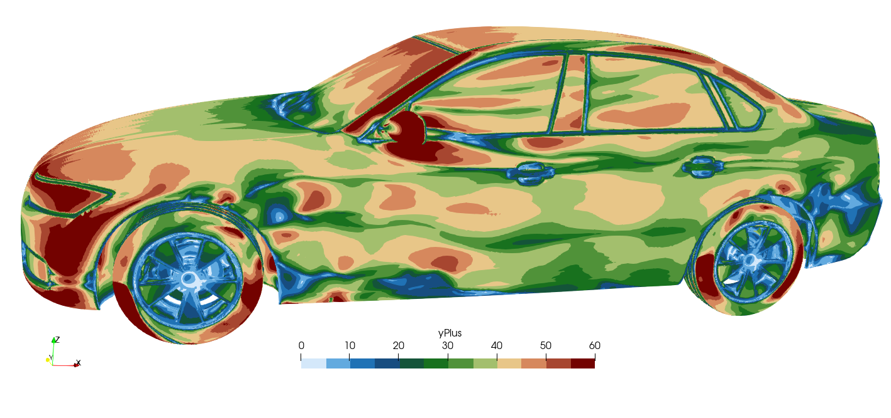

Figure 3: Snapshot of $y^+$ from initial RANS.

After generation of the background mesh, the mesh is refined and adapted to the surface using snappyHexMesh, resulting in a total of 236M cells.

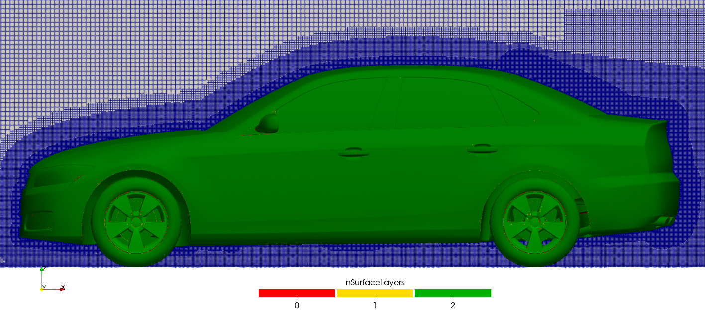

Figure 4: Side view on the mid cut of the mesh.

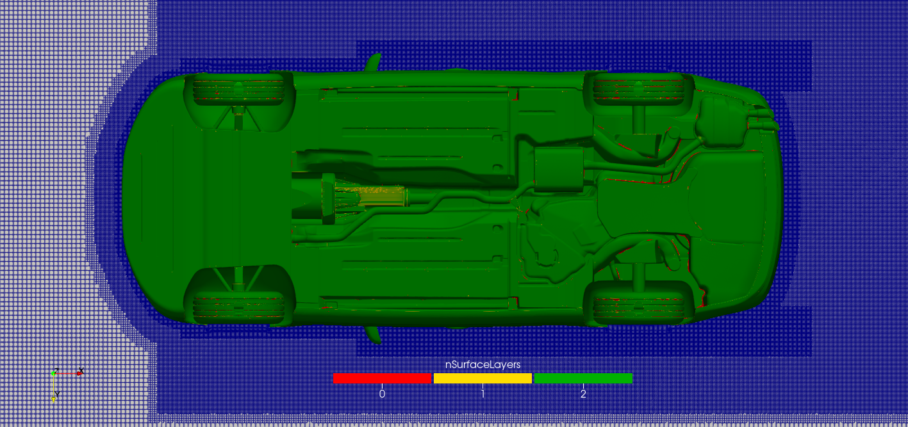

Figure 5: Underbody view on a plane cutting the front axle.

Two additional mesh resolutions, `medium` (110M cells) and `coarse` (65M cells), are also made available, and tested to work with the provided setup. These were created using the same procedure, but staring from a coarser background blockMesh.

## Instructions
### Prerequisites and additional information
- Known to run with OpenFOAM-v2412 on ARM and x86 architectures compiled with double precision (WM_PRECISION_OPTION=DP).
- Successfully tested with hierarchial decomposition on up to 512 processors

### Obtaining mesh files
The polyMesh files may be obtained from the following links:

- Coarse - <a rel="coarse" href="https://zenodo.org/records/15012221/files/polyMesh_65M.tar.gz?download=1">polyMesh_65M.tar.gz</a>
- Medium - <a rel="medium" href="https://zenodo.org/records/15012221/files/polyMesh_110M.tar.gz?download=1">polyMesh_110M.tar.gz</a>
- Fine - <a rel="fine" href="https://zenodo.org/records/15012221/files/polyMesh_236M.tar.gz?download=1">polyMesh_236M.tar.gz</a>

* There is no requirement to download all three sets of mesh files

After downloading, copy the tar file to the `constant/` folder, and untar with `tar -zxvf polyMesh_65M.tar.gz`.

### Running
- Modify the number of cores (nCores) and corresponding hierarchial decomposition coeffiecients (nHierarchical) in `system/include/caseDefinition`
- Modify `Allrun` script according to your environment (SLURM/PBS, OpenFOAM path, MPI, etc)
- Run `Allrun` script which decomposes the mesh for parallel execution, runs the RANS (simpleFOAM) solver for 2000 steps, and collects data for post-processing

### Post-processing
- Logs are stored under `logFiles`
- Post-processing data ($C_l$, $C_d$, $C_p$) is stored under `postProcessing`

## HPC Challenge
The case serves as the 1st OpenFOAM HPC challenge (OHC-1) that is a part of the 20th OpenFOAM Workshop in Vienna. The challenge consists of two tracks that are reflected in this setup as follows.
- Dictionary `fvSolution.fixedIter` must be used for the hardware track.
- Dictionary `fvSolution.fixedTol` serves as a starting point for the software track.
- Use `controlDict.noWrite` if you benchmark the solver performance only. Use `controlDict.withWrite` if you additionally benchmark the I/O performance.

A coded function object (FO) is provided for simpler and more accurate measurement of the wall-clock time per time step. A coded FO is compiled during the first execution of the solver and is stored in the in the `dynamicCode` directory within the case folder. If the compiled version is present, subsequent runs will use it directly. To avoid recompilation during runtime, it is recommended to copy the `dynamicCode` folder to any new case setup. The FO identifies when the number of time steps is below the minimum required by the statistical analysis and warns the user. This warning should be taken seriously when using the `fixedIter` setup since each time step is expected to have consistent duration. In contrast, the warning may be ignored when using the `fixedTol` setup.

## Preliminary Results
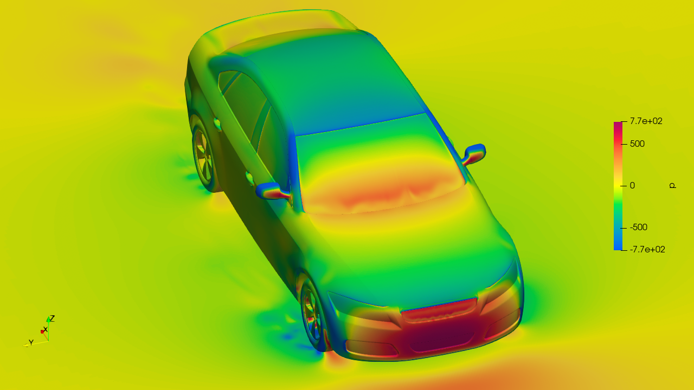

Figure 6: Pressure at the surface.

| 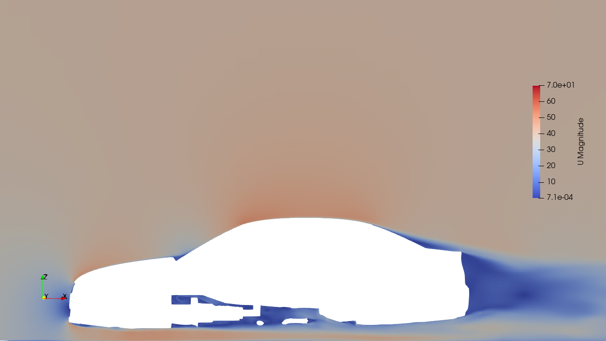 | 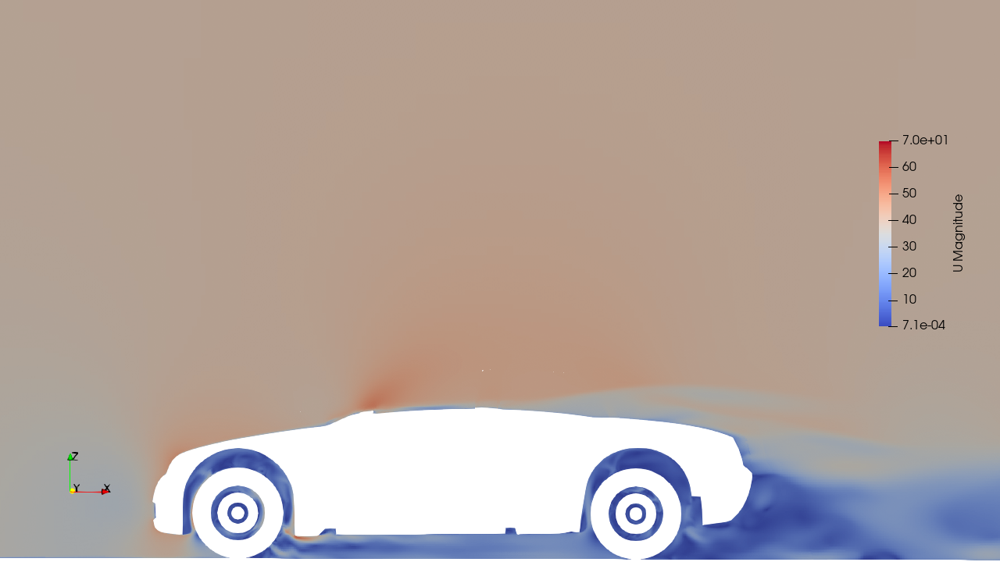 |
|-|-|
| Figure 7: Velocity slice at y = 0m. | Figure 8: Velocity slice at y = 0.75m. |

### Drag coefficient
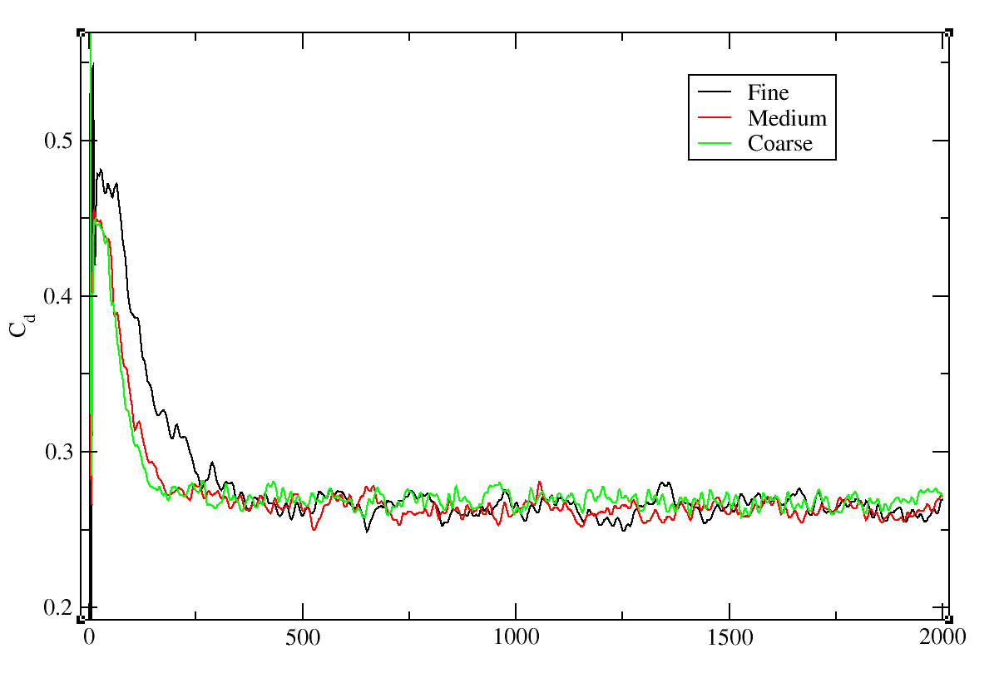

Figure 9: Drag coefficient evolution over iterations for the three mesh resolutions

### Residuals
| 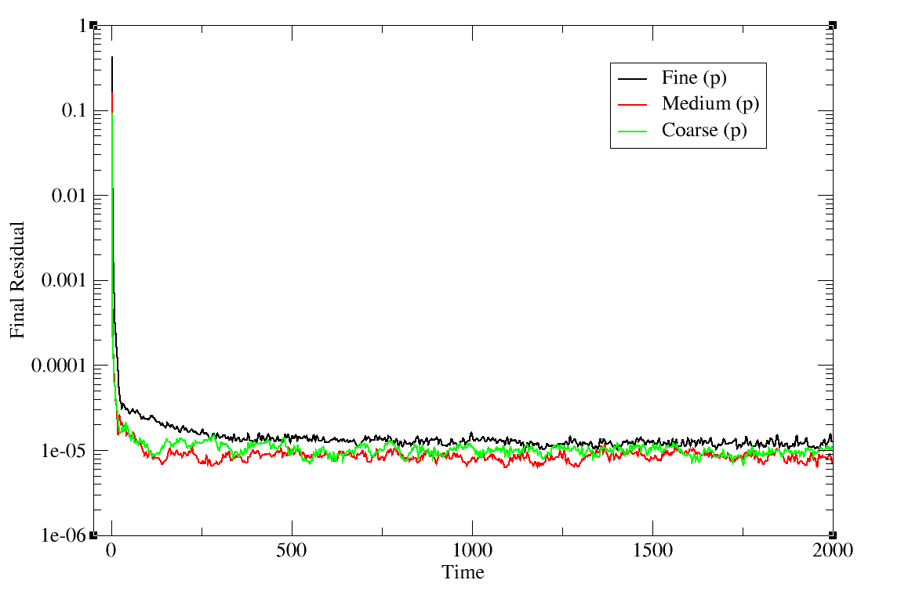 | 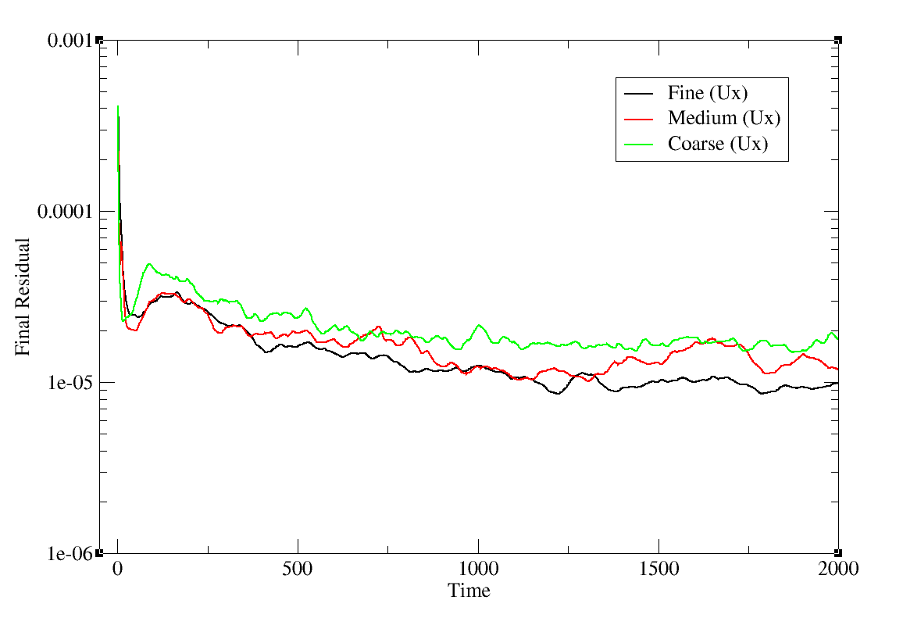 |
|-|-|
| 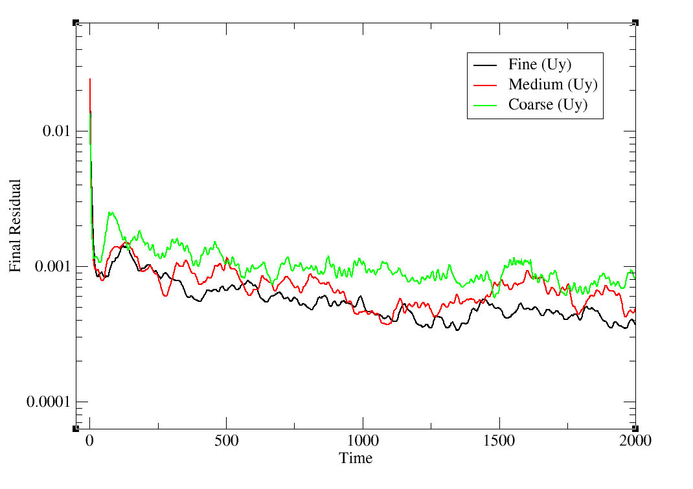 | 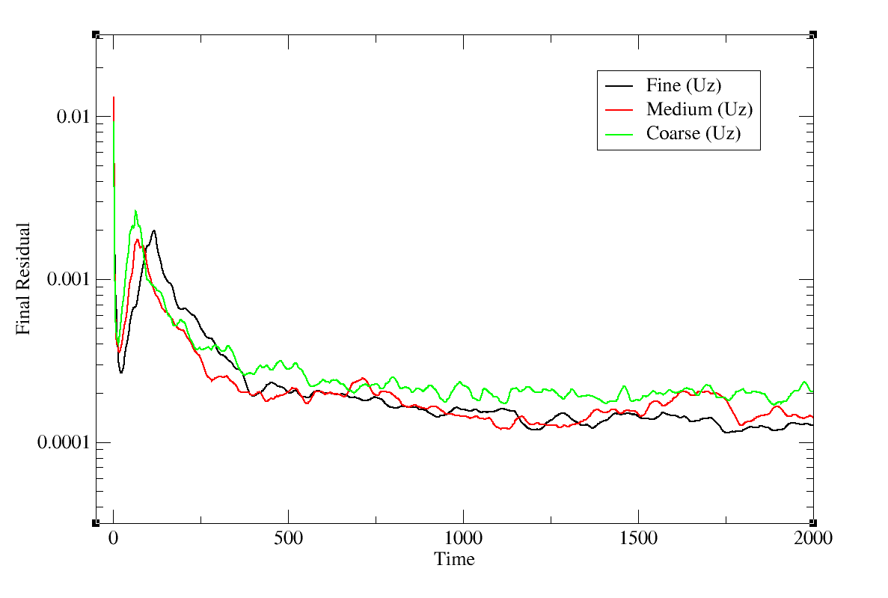 |

Figure 10: Various residual plots for the three mesh resolutions

## Footnotes
[^Hupertz]: Hupertz, B., Krüger, L., Chalupa, K., Lewington, N., Luneman, B., Costa, P., Kuthada, T., and Collin, C., “Introduction of a new full-scale open cooling version of the DrivAer generic car model,” Progress in Vehicle Aerodynamics and Thermal Management: 11th FKFS Conference,Stuttgart, September 26-27, 2017 11, Springer, 2018, pp. 35–60.
[^AutoCFD2]: https://autocfd.org/autocfd2
[^AutoCFD3]: https://autocfd.org/autocfd3
[^AutoCFD4]: https://autocfd.org/
[^TUMDrivAer]: https://www.epc.ed.tum.de/aer/forschungsgruppen/automobilaerodynamik/drivaer