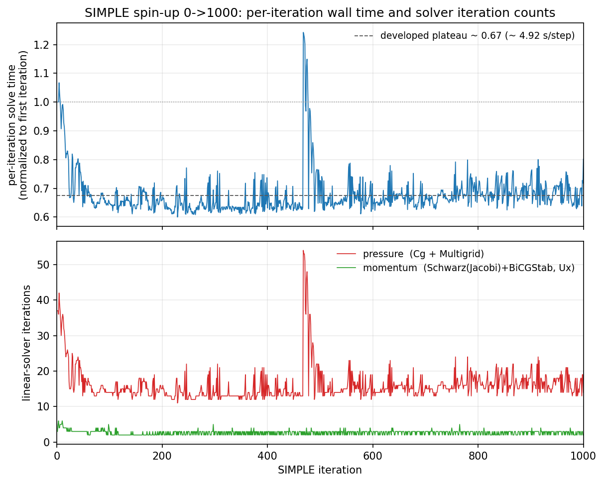
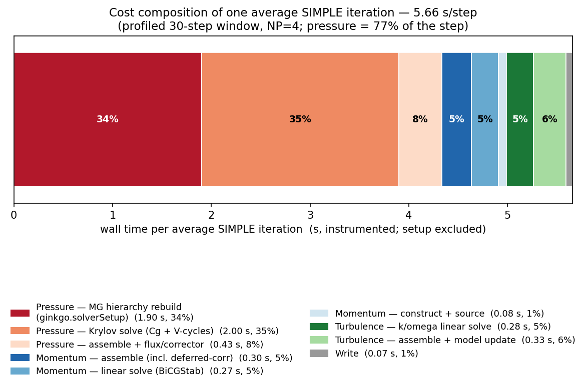
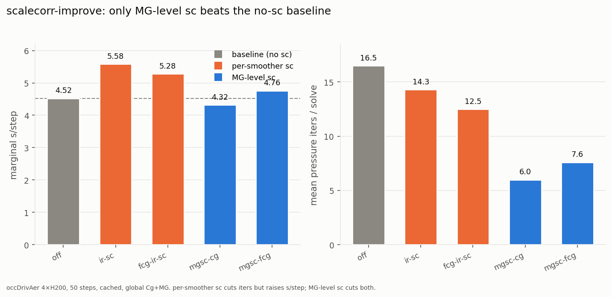
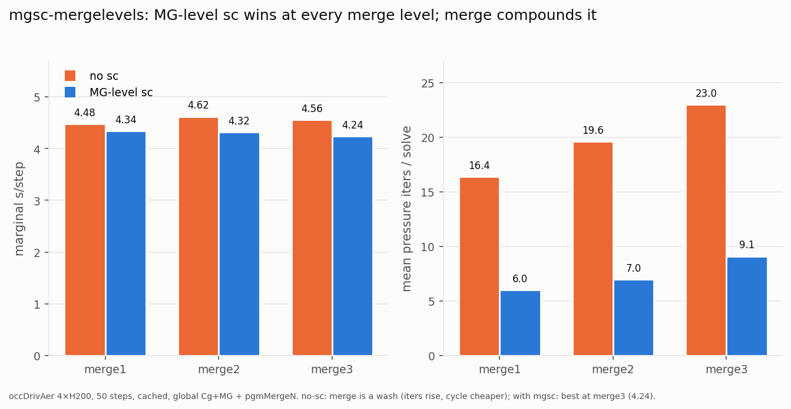
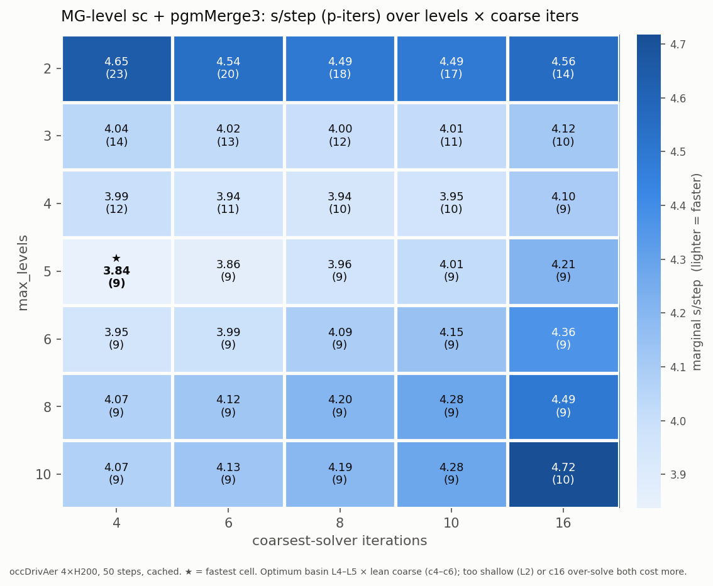

# Solver-optimization study for a GPU-native RANS solve on the occDrivAer case

**Date:** 2026-07-09
**Case:** `occDrivAerStaticMesh` — DrivAer, static mesh, kOmegaSST, steady SIMPLE
**Hardware:** 4× NVIDIA H200, one MPI rank per GPU (NP=4), coma cluster
**Solver:** `neoSimpleFoam` (NeoFOAM/NeoN), Ginkgo linear-algebra backend
**Study root:** `paperParamStudyResults/` (isolated from the earlier `paramStudyResults/`)

> **Status of this document.** Sections 1–3, the reference cost break-down in Section 4
> (Phases 0–1 of `OptimizationStudyPlan-2026-07-08.md`), and the clean overhead-free headline
> timing (Phase 2, §4.6: **6.564 s/step**, N=3) are complete and backed by the runs in
> `paperParamStudyResults/{spinup,cost-breakdown,reference}/`. The first restart-window sweep
> (Phase 3a — solver-hierarchy cache reuse, §4.9: **−29.6 % s/step at identical convergence**) is
> also complete for the decisive Cg+MG pair; the remaining Phase-3 sweeps are still to run. Where a
> result below is carried from the earlier cold-start studies rather than re-measured on the
> restart, it is flagged **[prior, cold-start]**.

---

## 1. Motivation

NeoFOAM/NeoN is a GPU-native re-implementation of an OpenFOAM-style finite-volume solver.
For a steady incompressible RANS solve the interesting question is not "does it run on the
GPU" but **where the wall-clock time actually goes once the flow is developed**, and which
of the available solver knobs move that number. This study answers both on a
production-scale automotive aerodynamics case.

Two methodological problems make a naive timing study misleading, and both motivate the
design here:

1. **Cold-start transients are not representative.** The first ~30 SIMPLE iterations from a
   uniform `0/` field are an atypical startup: the linear operator and RHS are far from their
   developed shape, iteration counts are inflated and erratic, and the *relative* cost of
   momentum vs. pressure vs. turbulence does not match the converged regime the paper cares
   about. Solver-tuning conclusions drawn from that window do not transfer. We therefore
   spin the case up **once** to a semi-converged restart (iteration 1000) and run every
   measured variant as a short, identical `1000 → 1030` window from that frozen field, so
   each variant sees a **representative operator and RHS**.

2. **Instrumentation perturbs the very number we want to report.** The Kokkos
   `space-time-stack` connector, the memory tools, `NEOFOAM_MEM_TIMELINE`, and `nsys` all add
   real wall-clock overhead. We therefore separate **profiling** (allowed to carry overhead;
   its outputs are *relative* attributions) from the **headline timing** (all instruments
   off). Profiling is collected first; the clean time-per-timestep is measured afterwards and
   is the only number used as a speedup denominator.

The result is a study whose per-iteration costs, iteration counts, and optimization deltas
are the ones that matter for a developed steady RANS solve — strictly apples-to-apples across
variants (identical start field, identical window length), and never contaminated by startup
transients or profiler overhead.

---

## 2. Test case and procedure

### 2.1 Case

| Property | Value |
|---|---|
| Geometry / model | DrivAer (occ variant), static mesh |
| Turbulence model | kOmegaSST (with omega wall-function + near-wall cell pin) |
| Algorithm | steady SIMPLE (`neoSimpleFoam`) |
| Mesh size | ~49.3 M internal cells per rank → **~197 M cells total** |
| Decomposition | `hierarchical`, `numberOfSubdomains 4`, one subdomain per H200 |
| Precision | fp64 baseline (reduced precision is a swept optimization) |
| Force output | GPU-native `neoForceCoeffs` reading the NeoN `VectorCollection` (OpenFOAM function objects cannot run with `neoSimpleFoam` — NO_REGISTER fields) |

### 2.2 The reference solver

The reference is deliberately the plainest correct CG+Multigrid stack, so every optimization
is measured against a neutral baseline:

- **`system/gko/p-multigrid.json`** — fp64 PCG (Ginkgo `Cg`) with a **global** (non-localized)
  Multigrid *preconditioner*, Pgm coarsening, `max_levels = 10`, default smoother.
- **No** solver caching, **no** scale-correction, **no** mixed precision, **no** PMIS.
- Momentum / k / omega are solved with a distributed `Schwarz(Jacobi)+BiCGStab`.

The same reference config is used both to generate the restart (Phase 0) and to produce the
cost break-down (Phase 1) — only the instrumentation differs. Running the reference in fp64
keeps the restart field solver-agnostic: spinning up with an aggressively-optimized solver
would bake solver-specific error into the "ground-truth" restart and contaminate every
downstream comparison.

### 2.3 Procedure (phases)

| Phase | Script | Purpose | Instrumentation |
|---|---|---|---|
| **0 — spin-up** | `phase0-paper-study-spinup.sh` | `0 → 1000` from uniform field, write only `1000/`; the one restart all later phases start from | none |
| **1 — cost break-down** | `phase1-paper-study-costbreakdown.sh` | decompose where the reference spends time on the developed field | `space-time-stack`, `memory-high-water-mark`, `NEOFOAM_MEM_TIMELINE`, `nsys` |
| **2 — clean reference** | `phase2-paper-study-reference.sh` | overhead-free time-per-timestep, N=3, the speedup denominator | **all off** (asserted unset) |
| **3 — optimization sweeps** | `phase3-paper-study-*.sh` | attack the largest cost contributors from Phase 1 | per-sweep |

**Harness isolation.** A forked `paper-study-common.sh` (copy of `param-study-common.sh`)
sets the results root to `paperParamStudyResults/<phase>/`, fixes `RESTART=1000` and
`STEPS=30`, pins every measured run to the `startTime=1000 / endTime=1030 /
writeInterval=1030` window, renames `reset_to_t0 → reset_to_restart` (drops every written
time except `0/` and `1000/`), and adds a `require_restart` preflight that aborts if
`processor0/1000/` is missing. The original scripts and `paramStudyResults/` are left
untouched.

### 2.4 Restart justification (Phase 0)

The spin-up ran the fp64 reference `0 → 1000`, writing the frozen restart to
`processor*/1000/`. At the restart point the flow is **semi-converged, not fully converged** —
exactly what the study needs so the sweeps still exercise the solver on a non-trivial
correction:

- Near iteration 1000 the momentum residuals have plateaued at a representative level
  (initial `Ux ≈ 7.9e-5`, `Uy ≈ 4.0e-3`, `Uz ≈ 1.1e-3`), converging in **2–3 BiCGStab
  iterations** per component.
- Pressure sits at a steady **~14–19 MG iterations per solve** (initial residual ~1.3e-3 →
  ~1.3e-5), i.e. a stable, developed operator rather than the inflated cold-start counts.
- Continuity error is small and steady (local sum ~3e-6, global ~1.8e-8), confirming the
  field is developed but still being corrected.



**Figure 2.4 — the cold-start transient the restart is designed to avoid.** *Top:* per-SIMPLE-iteration
wall time (marginal `ExecutionTime` delta), normalized to the first SIMPLE iteration's cost. The first
iteration's raw `ExecutionTime` (48.2 s) folds in the one-time ~44 s setup, so the normalization baseline
is the first *marginal* step time (7.30 s/step); the dotted line marks 1.0. *Bottom:* linear-solver
iteration counts per SIMPLE step for pressure (Cg + Multigrid) and momentum (Schwarz(Jacobi)+BiCGStab,
Uₓ). Both panels move together: over the first ~60 iterations the per-step cost falls from the inflated
cold-start value to a **developed plateau of ≈ 0.67× (≈ 4.92 s/step)**, driven almost entirely by the
pressure count settling from ~30–42 down to a stable **~13–21 (mean 15.9)**, while momentum holds flat at
**2–3**. The correlated late spike near iteration ~470 (pressure up to 54, timing up to 1.24×) is a
transient re-stiffening of the operator — exactly the kind of erratic, non-representative behaviour that
makes any timing or solver-tuning conclusion drawn from an arbitrary early window unreliable. Every
measured variant instead marches from the frozen `1000/` field, where the counts and per-step cost are on
this plateau.

This is the field every variant below marches from.

### 2.5 Cost composition of an average SIMPLE iteration

Before ranking optimizations it is worth fixing *where the wall time of one developed SIMPLE
iteration actually goes*. Phase 1 (`phase1-paper-study-costbreakdown.sh`) profiled the fp64
reference over the `1000 → 1030` restart window with the Kokkos `space-time-stack` connector
(`costbrk-spacetimestack-20260709-135745.kokkos-profile.txt`). The connector reports every
instrumented region as a per-call average; here we use the **recurring** per-iteration
`timeStep` region and deliberately **exclude the one-time `setup` region** (mesh read, field
init, first solver build — 40.2 s, profiled once and never repeated), since section 2.5 is about
the cost of a *representative* iteration, not the startup. The `timeStep` region totals 170 s
over the 30 profiled iterations, i.e. **≈ 5.66 s per average SIMPLE iteration** (instrumented;
the clean, overhead-free figure is 5.09 s/step marginal — §4.6 — but the *relative* composition
below is what matters and is instrument-independent).



**Figure 2.5 — one average SIMPLE iteration decomposed (setup excluded).** The bar is a single
average iteration (5.66 s); segments are mutually exclusive and sum to the `timeStep` region.

| Stage | segment | s/iter | % of iteration |
|---|---|---:|---:|
| **Pressure** (Cg + global Multigrid) | MG hierarchy rebuild (`ginkgo.solverSetup`) | 1.90 | **34 %** |
| | Krylov solve (Cg + V-cycles) | 2.00 | 35 % |
| | assemble + flux/corrector | 0.43 | 8 % |
| | **pressure subtotal** | **4.33** | **77 %** |
| **Momentum** (Schwarz+BiCGStab) | assemble (incl. deferred-correction) | 0.30 | 5 % |
| | linear solve | 0.27 | 5 % |
| | construct + source | 0.08 | 1 % |
| | **momentum subtotal** | **0.65** | **12 %** |
| **Turbulence** (k, omega) | k/omega linear solve | 0.28 | 5 % |
| | assemble + model update (grad, bounding, nut) | 0.33 | 6 % |
| | **turbulence subtotal** | **0.60** | **11 %** |
| Write | field/probe I/O | 0.07 | 1 % |
| **Total** | | **5.66** | **100 %** |

Three facts drive the entire optimization plan:

1. **Pressure is the iteration** — 77 % of every SIMPLE step (4.33 s of 5.66 s). Momentum
   (12 %) and turbulence (11 %) together are barely a quarter of the cost, so tuning them can
   never move the headline much.
2. **Half of the pressure cost is not numerical work.** The MG *hierarchy rebuild*
   (`ginkgo.solverSetup`, 1.90 s = 34 % of the whole iteration) is the Pgm coarsening + Galerkin
   products being reconstructed from scratch on **every** pressure solve, because the reference
   runs `cacheSolver=false`. It is nearly as large as the actual Cg/V-cycle solve (2.00 s, 35 %).
   This is the single biggest lever in the study and directly selects Strategy 3.1 (cache/precon
   reuse); §4.1 and §4.7 confirm it top-down and at the kernel level.
3. **The remaining pressure solve, then MG structure, are the next levers.** After the rebuild is
   amortized, the 35 % Krylov+V-cycle cost is what MG tuning (levels / coarse solver / coarsening)
   and the float MG preconditioner attack (Strategies 3.2/3.3); the ~5 % momentum-assemble
   deferred-correction remainder is the allocator-churn target (Strategy 3.4).

The full instrumented region tree, the GPU-vs-host split (the solve is host/overhead-bound), and
the kernel-level `nsys` confirmation of these same conclusions are in Section 4 (§4.1, §4.2, §4.7).

---

## 3. Optimization strategies

The plan explicitly does **not** pre-commit the sweep list: strategies are ranked from the
Phase-1 break-down (Section 4) and each maps to an existing tool whose *logic* is reused as a
`paper-`-prefixed, restart-window wrapper. The candidate strategies, and the prior evidence
that motivates each, are:

### 3.1 Solver + preconditioner cache reuse — *primary target*
**Tool:** `param-study-mg.sh cache-sweep` / `preconditionerRebuildInterval` logic → `phase3-paper-study-cache-compare.sh`.
The reference rebuilds the entire MG hierarchy from scratch **on every pressure solve**. Caching
the solver and refreshing the hierarchy in place amortizes that build.
**[prior, cold-start]** worth ~33 s / 18 % on the 30-step cold window at identical iteration
count. Section 4 shows this is the single largest contributor on the restart field as well, and
the Phase-3a run (§4.9) confirms it: **−29.6 % s/step at identical convergence**.

**How the cached multigrid refreshes its values (Ginkgo Strategy 1b, `update_matrix_value`).**
In steady SIMPLE the pressure matrix is *re-assembled every outer iteration* but its **sparsity
never changes** — only the numeric entries move as the velocity/flux fields update. That is
exactly the condition under which an AMG hierarchy can be reused. NeoN implements this in
`cacheOrUpdateSolver` / `findUpdatable` (`NeoN/src/linearAlgebra/ginkgo/ginkgoDistributed.cpp`):

1. **First solve — full generate (the expensive build).** `factory->generate(A)` constructs the
   Cg shell *and* its Multigrid preconditioner. The costly part is the preconditioner: the **Pgm
   aggregation** — the coarsening pass (sort/`spgeam`/reduce-heavy, the ~half of pressure GPU
   time seen in §4.7) that groups fine unknowns into aggregates and thereby fixes, for each
   level ℓ, the **prolongation Pℓ and restriction Rℓ = Pℓᵀ**, the level count, and every coarse
   operator's sparsity pattern. The generated solver is stored in `cachedSolver`, together with a
   **structure key** `{fine rows, #local nonzeros, #off-diagonal nonzeros}`.

2. **Later solves — in-place value update (the cheap refresh).** With `cacheSolver=true`, an
   unchanged structure key, and no periodic rebuild due, the cached solver is refreshed instead
   of rebuilt. `findUpdatable(cachedSolver)` walks the operator tree to the `gko::UpdateMatrixValue`
   facet — the Cg shell itself is *not* updatable, but its **bound preconditioner is**: for
   Cg+Multigrid it is the Multigrid; for the distributed `Cg + Schwarz{Multigrid}` the Schwarz
   patch forwards the call to each rank's local Multigrid; for MG-as-solver it is the top-level
   solver; for `Ir(scale_correction){Multigrid}` it is Ir's inner solver. The call
   `upd->update_matrix_value(A)` then recomputes **only the value-dependent data**:
   - the fine-level operator is re-pointed at the freshly assembled matrix (the Cg shell's own
     system matrix is refreshed zero-copy — local CSR viewed in place, non-local Coo re-filled —
     by `createGkoMtxDist`, so no copy is needed there);
   - at every level the **Galerkin coarse operator is re-formed by the triple product
     Aℓ₊₁ = Rℓ · Aℓ · Pℓ**, *reusing the frozen Pℓ/Rℓ from step 1* — i.e. the numeric entries
     are recomputed but the aggregation that produced Pℓ/Rℓ, the coarse sparsity patterns, and
     the smoother layout are **not**.

   So each cached solve **skips the Pgm aggregation entirely** and pays only the (much cheaper)
   Galerkin re-multiplication down the level chain plus the Krylov solve.

3. **Safety / drift control.** The structure key guards correctness: a remesh or topology change
   (rows/nnz differ) trips a mismatch and forces a fresh generate. `preconditionerRebuildInterval`
   bounds aggregation drift — `= 0` updates in place forever (used here), `= N > 0` forces a full
   rebuild every Nth solve so a reused aggregation cannot drift unboundedly as the operator
   evolves. The Phase-3a data (§4.9) shows **no drift over 250 solves** — the frozen aggregation
   gives the *same* mean pressure-iteration count (18.2) as rebuilding every solve — so interval 0
   is safe on this developed field. (A non-updatable Krylov config — Cg/PBiCGStab + Jacobi/ILU —
   has no `UpdateMatrixValue` facet, so it is regenerated every solve and only its scratch
   *Workspace* is recycled; that is the separate "Strategy 3" path, not hierarchy reuse.)

TODO @claude: what are the update costs compared to generation and solve?

### 3.2 Multigrid tuning (levels / coarse solver / coarsening)
**Tools:** `param-study-mg-level-sweep.sh`, `param-study-mg-coarse-solve.sh`, `param-study-mg-pmis.sh`.
Attacks the pressure V-cycle cost / iteration count:
- **Level sweep:** **[prior]** L10 is the sweet spot for the localized MG; depth plateaus past L10.
- **PMIS vs Pgm coarsening:** **[prior]** *localized* PMIS loses to Pgm (67 vs 53 iters, denser
  coarse grids); global PMIS is untestable on the current distributed path. Carry as a caveat,
  not a recommendation.
- **Scale-correction:** **do not combine** MG `scale_correction` with localized Schwarz —
  **[prior]** 9× slower (per-subdomain Rayleigh scaling inconsistent across the decomposition).

### 3.3 Mixed precision (float MG preconditioner)
**Tool:** `param-study-production-mp.sh` → `phase3-paper-study-mp.sh`.
Runs the MG *preconditioner* in float while the outer CG stays fp64. **[prior]** essentially
**free**: 144 s vs 145 s fp64, identical convergence (53 iters, continuity 1.6e-5). Full-float
inner solve is a loss and bf16 is still blocked in the distributed Schwarz path.

### 3.4 Assemble allocator churn (`UmpirePool`)
**Tool:** flip `allocator → UmpirePool` + `memPoolSize`, kill assemble temporaries.
**[prior]** the momentum-assemble host "remainder" was dominated by un-pooled Umpire raw
`cudaMalloc/cudaFree` (synchronous) per temporary; `memPoolSize` is silently ignored unless
`allocator=UmpirePool`. Section 4 re-checks how large this is on the restart field.

### 3.5 Tolerance / accuracy trade
**Tool:** `param-study-production-tol.sh` → `phase3-paper-study-tol.sh`. Trades pressure
iterations against continuity accuracy; used to place the production operating point.

### 3.6 Peak-memory reduction
**Tool:** `MemoryReductionPlan-2026-07-07.md`. Targets the device-pool high-water mark measured
in Section 4.4. Secondary to wall-time but relevant to fitting larger cases per GPU.

**Known caveat to keep freeing `LinearSystem` matrix values out of the loop:** releasing a
persistent `LinearSystem`'s values between solves diverges omega with a cached solver (stale
state); it needs NeoN-level cache invalidation, not a PDE-level release.

---

## 4. Results in detail

> ⚠️ **Absolute timings in §§4.1–4.14 are inflated by a GPU-oversubscription bug — see §4.15.**
> All runs before 2026-07-17 stacked 2 ranks on one GPU (~1.9× s/step, up to ~4.3× p-solve). The
> corrected champion, re-run numbers, and cost break-down are in §4.15; rankings mostly held but the
> p-solve ordering and the "localized is champion" conclusion are **reversed**.

All Phase-1 numbers below are from the reference config on the restart, window `1000 → 1030`
(30 SIMPLE iterations), `NEON_BUILD=profiling`, NP=4. **They carry instrumentation overhead by
design** — they are *relative* attributions, not the headline wall time.

### 4.1 Where the time goes — region wall-time attribution

From `space-time-stack` (`costbrk-spacetimestack-20260709-135745.kokkos-profile.txt`),
total profiled run 212.9 s. Percentages below are given **relative to the per-iteration
`timeStep` region** (170 s over 30 iterations = 5.67 s/step instrumented), which is the cost
that recurs every SIMPLE iteration; the one-time `setup` region (40.1 s, 18.9 % of the total
run) is excluded from the per-iteration accounting.

| Region | wall (s) | % of `timeStep` | note |
|---|---:|---:|---|
| **`pressureCorrector`** | 130.0 | **76.5 %** | pressure is the solve |
| &nbsp;&nbsp;`pEqn` | 118.0 | 69.4 % | |
| &nbsp;&nbsp;&nbsp;&nbsp;`p.linearSolve` | 117.0 | 68.8 % | ~3.9 s per pressure solve |
| &nbsp;&nbsp;&nbsp;&nbsp;&nbsp;&nbsp;**`ginkgo.solverSetup`** | **57.1** | **33.6 %** | **MG hierarchy rebuilt every solve** |
| &nbsp;&nbsp;`p.assemble` | 0.51 | 0.3 % | assemble is cheap for pressure |
| **`momentumPredictor`** | 19.6 | 11.5 % | |
| &nbsp;&nbsp;`momentum.assemble` | 9.05 | 5.3 % | of which `luw.applyCorr` 4.66 s (deferred-corr) |
| &nbsp;&nbsp;`momentum.linearSolve` | 8.16 | 4.8 % | |
| **`turbulenceCorrect`** | 18.1 | 10.6 % | |
| &nbsp;&nbsp;`omega.linearSolve` | 4.28 | 2.5 % | |
| &nbsp;&nbsp;`k.linearSolve` | 4.01 | 2.4 % | |
| `write` | 1.96 | 1.2 % | |

**Headline finding — pressure dominates, and half of the pressure solve is hierarchy rebuild.**
The bottom-up tree makes it unambiguous:

```
p.linearSolve          59.6 s   28.0 %   (of total run)
ginkgo.solverSetup     57.4 s   27.0 %   ← MG hierarchy rebuilt from scratch, every solve
neoSimpleFoam.setup    40.1 s   18.8 %   (one-time)
momentum.linearSolve    7.9 s    3.7 %
turbulenceCorrect       7.2 s    3.4 %
omega.linearSolve       4.0 s    1.9 %
k.linearSolve           3.7 s    1.8 %
```

`ginkgo.solverSetup` (27 % of the whole run, 33.6 % of every timestep) is **not** numerical
work — it is the MG preconditioner hierarchy being rebuilt on every single pressure solve. This
is the largest single lever in the study and directly selects **Strategy 3.1 (solver/precon
cache reuse)** as the primary optimization: the per-solve setup should collapse from ~1.9 s to a
periodic in-place refresh. The prior cold-start study measured exactly this win (~33 s / 18 %),
and the restart break-down confirms the target is real on the developed field.

### 4.2 GPU-vs-host split — the solve is host/overhead-bound

Across the `timeStep` region, only **4.4 %** of wall time is spent in Kokkos device kernels;
`ginkgo.solverSetup` and `p.linearSolve` report **0 % Kokkos** (the Ginkgo MG build and the
Krylov orchestration are host/MPI/allocator work, not NeoN kernels). This confirms the prior
cold-start figure (Kokkos ≈ 4.8 %) on the developed field: **the reference is host/overhead-bound,
not compute-bound.** The implication is that the highest-value optimizations are the ones that
remove host work (cache the hierarchy, pool the allocator) rather than ones that make the GPU
kernels faster.

### 4.3 Per-equation solver cost

From the developed-field logs (per SIMPLE iteration, restart window):

| Equation | solver | iters/solve | per-solve time | share of timestep |
|---|---|---:|---:|---:|
| **p** | Cg + global Multigrid | 13–21 (mode ~15–16) | ~3.9 s (incl. ~1.9 s setup) | **~69 %** |
| Ux/Uy/Uz | Schwarz(Jacobi)+BiCGStab | 2–3 | ~0.22 s (3 comps) | ~4.8 % |
| omega | Schwarz(Jacobi)+BiCGStab | 2 | ~0.08 s | ~2.5 % |
| k | Schwarz(Jacobi)+BiCGStab | 2–3 | ~0.09 s | ~2.4 % |

Pressure-iteration distribution over the 30-step window (`No Iterations`): 13×2, 14×4, 15×7,
16×5, 17×4, 18×4, 19×2, 20×1, 21×1 — a stable ~13–21, centred near 15–16, i.e. a developed
operator (contrast the erratic, inflated cold-start counts the restart was designed to avoid).
Continuity holds at local ~3e-6 / global ~1.8e-8 throughout.

### 4.4 Memory footprint

From `NEOFOAM_MEM_TIMELINE` (`costbrk-memtimeline-20260709-140120.log`), per-rank device pool:

| Point | current (MB) | high-water (MB) |
|---|---:|---:|
| `setup.end` / `step-start` (first) | 12 979 | 19 132 |
| after-UEqn (step 1) | 15 473 | 20 761 |
| after-turb (step 1) | 19 126 | 21 935 |
| **steady (step ≥2)** | **19 126** | **24 414** |
| reserved (pool actual) | — | 38 146 |

Peak device-pool high-water settles at **~24.4 GB/rank** (steady working set ~19.1 GB/rank),
against 38.1 GB reserved by the Umpire pool — comfortably within an H200's 141 GB but the
figure the memory-reduction plan (Strategy 3.6) targets. The step-over-step timeline is flat
after the first two steps, i.e. no per-iteration leak; the growth is the one-time build-up of
the pressure MG hierarchy and the turbulence fields, consistent with the `after-turb` step
carrying the peak.

### 4.5 Instrumentation-overhead sanity check

The same 30-step restart window under three instrumentation levels shows the overhead the
Phase-2 clean run is designed to remove (per-step, ExecutionTime delta / 30):

| Instrumentation | window Δ ExecutionTime | per-step |
|---|---:|---:|
| `memory-high-water-mark` + `NEOFOAM_MEM_TIMELINE` (lightest) | 49.02 → 196.74 s | **4.92 s/step** |
| `space-time-stack` (region tree) | 49.68 → 208.02 s | **5.28 s/step** |
| `nsys` full trace | (truncated at 8 steps) | heaviest, not comparable |

The spread (4.92 → 5.28 s/step) is entirely profiler overhead on an identical config and window,
which is exactly why the plan forbids using any of these as the headline number. The clean,
overhead-free time-per-timestep is measured separately in §4.6 below.

### 4.6 Clean reference timing (Phase 2) — the speedup denominator

Phase 2 (`phase2-paper-study-reference.sh`, N=3) runs the identical fp64 Cg+Multigrid reference
on the same `1000 → 1030` restart window with **every instrument off** (asserted unset). All
three runs completed clean (30 steps, exit 0) and the rebuilt binary's startup line confirms
`GPU-aware MPI: library-available=yes, NeoN-flag=on, executor=GPUExecutor, ranks=4 -> used=yes`,
i.e. these numbers are on the GPU-direct MPI path (halo exchange not host-staged; see §4.7 on MPI).

| run | steps | exec_s | s/step (total ÷ steps) |
|---|---:|---:|---:|
| reference-run1 | 30 | 197.58 | 6.5860 |
| reference-run2 | 30 | 196.66 | 6.5553 |
| reference-run3 | 30 | 196.56 | 6.5520 |
| **mean** | | | **6.5644 ± 0.0188 (sd, n=3)** |

The ±0.3 % shot-to-shot spread makes this a stable denominator. Two figures matter, and they
must not be conflated:

- **6.564 s/step — setup-inclusive**, the script headline (total `ExecutionTime` ÷ 30). It folds
  the one-time ~44.5 s startup (mesh read, field init, first solver build) into every step. This
  is the correct apples-to-apples denominator **for the 30-step-from-restart window**, because
  every optimization variant is measured over the exact same window with the same startup.
- **~5.09 s/step — marginal steady per-step**, the slope of `ExecutionTime` across the window
  (`(ET[30] − ET[1]) / 29`; setup ≈ 44.5 s removed). This is the developed per-timestep cost a
  long production run converges to, and it reconciles with the §4.5 light-profiler estimates
  (4.92–5.28 s/step) — confirming the `memory-hwm` / `NEOFOAM_MEM_TIMELINE` connectors add
  essentially **zero** wall-clock overhead; only the `nsys` full trace is heavy.

**Use 6.564 s/step as the headline denominator for the Section-3 sweeps** (same-window compares);
quote the ~5.09 s/step marginal when discussing the physical per-timestep cost. Both are dominated
by the pressure MG solve (§4.1) and its per-solve hierarchy rebuild (§4.7/§4.8), which is
what the sweeps attack.

### 4.7 Kernel-level break-down (nsys) — dispatch overhead, MG levels, and MPI

The `space-time-stack` tree in §4.1–4.2 tells us *which region* is expensive and that it is
host-bound, but it cannot see individual GPU kernels, CUDA-API waits, or the multigrid level
structure. The `nsys` trace (`costbrk-nsys-20260709-140444.rank0.*`, 8-step window
`1000 → 1008`, NVTX from `NEOFOAM_MEM_NVTX` + `NEON_GINKGO_PROFILE`) resolves all three at the
kernel/API level. **Caveat:** these are the *heaviest*-instrumented numbers in the study
(nsys per-step ≈ 6.1 s vs 4.9–5.3 s for the Kokkos tools) and only **rank 0** was exported to
SQLite; treat the percentages as relative attributions on one rank, not absolute wall time.

**Question 1 — total kernel-launch overhead: yes, fully quantifiable, and it is the story.**
Over the 8-step window (48.79 s of `timeStep`):

| Metric | Value | note |
|---|---:|---|
| Kernels launched | **95 179** (≈ 11 900 / step) | of which **79 982 (84 %) inside `pEqn`** |
| Kernel duration | mean 94.7 µs, **median 2.6 µs**, p90 78 µs | a few large SpMV/sort kernels; a huge tiny-kernel tail |
| GPU kernel-busy (union) | 8.99 s | **18.4 %** of window |
| GPU busy incl. memcpy/memset | 10.59 s | 21.7 % |
| **GPU idle** | **38.19 s** | **78.3 % of the window — the GPU is starved** |
| `cudaLaunchKernel` host API (the *pure* launch tax) | **0.323 s** | 95 179 calls × 3.40 µs → only **0.66 %** |
| **Host synchronization (the *dispatch* tax)** | **27.13 s** | **55.6 % of the window** |

The pure launch API cost is negligible (0.66 %). The real overhead is **synchronization-bound
dispatch** — the host blocks for 27.1 s waiting on the GPU between launches:

```
cuStreamSynchronize          86 560 calls   13.81 s      ← paired 1:1 with 86 560 cuMemcpyAsync
cudaStreamSynchronize_v3020  17 533 calls    5.51 s        (scalar D2H readbacks: dot/norm reductions)
cudaDeviceSynchronize_v3020   6 744 calls    4.69 s
cudaEventSynchronize_v3020    8 201 calls    3.13 s
                                     TOTAL   27.13 s   = 55.6 % of window
```

The `cuStreamSynchronize` count matches `cuMemcpyAsync` exactly (86 560): this is the classic
Krylov/MG pattern of copying a **single scalar** (a residual norm or dot-product) device→host
and stalling the stream to read it, tens of thousands of times per step. On top of this,
allocator churn costs another **3.07 s** (`cudaFree` 2.22 s / 17 579 calls + `cudaMalloc`
0.85 s / 17 733 calls — the un-pooled Umpire path of Strategy 3.4, now confirmed at the API
level). Per phase, the idle fraction is uniform and severe:

| Phase | wall (s) | GPU-busy (s) | GPU-idle | host-sync (s) | kernels |
|---|---:|---:|---:|---:|---:|
| **`pEqn`** | 32.61 | 5.40 | **83.4 %** | 18.70 | 79 982 |
| `momentumSolve` | 5.49 | 1.89 | 65.5 % | 3.46 | 2 685 |
| `kOmegaSST.correct` | 4.03 | 1.17 | 71.0 % | 3.12 | 6 798 |

**Takeaway:** "kernel launch overhead" narrowly (the `cudaLaunchKernel` call) is a non-issue;
the solve is throttled by **~27 s of per-kernel stream/event synchronization driven by ~95 k
mostly-tiny kernels**, 84 % of them in the pressure MG. This is the kernel-level face of the
same host-bound story §4.2 saw from above, and it reinforces the same levers: fewer, fatter
kernels and fewer scalar readbacks (batch/async the MG reductions), plus the pooled allocator.

**Question 2 — per-MG-level time: partially, by reconstruction (no native per-level markers).**
`NEON_GINKGO_PROFILE` did **not** emit per-level NVTX ranges — the V-cycle levels are not
directly labelled. They *can* be reconstructed from the SpMV kernel launch geometry: with
block size 256, `gridX × 256 ≈ level row count`, so bucketing `abstract_spmv` /
`abstract_classical_spmv` by `gridX` recovers the hierarchy. On rank 0 the finest level is
~17.3 M rows (≈ the 16.3 M cells/rank of this 65.3 M-cell case — the `gridX→rows` mapping thus
checks out), coarsening ~4× per level (consistent with Pgm aggregation):

| Level (proxy) | `gridX` | ~rows | SpMV GPU time (8 steps) | ~SpMV/step |
|---|---:|---:|---:|---:|
| **L0 (finest = mesh)** | 67 584 | ~17.3 M | **659 ms** | ~124 |
| L1 | 16 896 | ~4.3 M | 98 ms | ~141 |
| L2 | 4 224 | ~1.08 M | 281 ms | ~458 |
| L3 | ~2 170–2 790 | ~0.56–0.71 M | ~10 ms (summed) | ~250 |
| L4 | ~1 160–1 310 | ~0.30–0.34 M | ~1.4 ms | ~40 |
| L5 | ~540–670 | ~0.14–0.17 M | ~7 ms | ~330 |
| L6–L7 | ~290 / ~136 | ~74 k / ~35 k | <1 ms each | ~20 |

Two conclusions: (i) SpMV GPU time is concentrated at **L0 and L2** (~0.94 s of the ~1.1 s of
SpMV), while the deep coarse levels do **microseconds** of arithmetic — yet every one of their
SpMV/smoother kernels still pays the same ~3.4 µs launch **and a stream sync**, so the tail of
the 10-level hierarchy is nearly pure dispatch overhead. This is direct evidence for capping
`max_levels` / using a fatter coarse-grid solve (Strategy 3.2). (ii) Crucially, the SpMV solve
is **not** where the pEqn GPU time goes at all — splitting the 5.43 s of pEqn GPU-busy by kernel:

```
pEqn GPU-time split (rank 0, 8 steps):
  SETUP (sort/coarsen)  2.84 s  ← DeviceMergeSort* 2.26 s + spgeam + extract_diagonal + radixSort
  SOLVE (SpMV/dot/axpy) 2.59 s
```

**~half of the pressure GPU work is rebuilding the AMG hierarchy** (merge-sort–based Pgm
aggregation, `spgeam` Galerkin products, diagonal extraction) — every solve, because
`cacheSolver=false` / `preconditionerRebuildInterval=1`. This is the kernel-level confirmation
of §4.1's `ginkgo.solverSetup` = 33.6 %/step and independently re-selects **Strategy 3.1** as
the top lever.

**Question 3 — MPI / halo overhead: NOT resolvable from this trace; needs a targeted re-run.**
The trace was captured with `--trace=cuda,nvtx,osrt` — **no `mpi` (or `ucx`) trace domain** —
so MPI calls are *not* recorded as timed ranges. OpenMPI 5.0.10 is present and CUDA-aware
(`mca_accelerator_cuda`, `btl_smcuda`), but `libmpi`/`ompi_*` appear only in sampled
backtraces, never as durations. What we *can* say:

- The MPI/halo cost is **folded into** the 27.1 s of `*Synchronize` waits and the background
  `poll` (97 s across progress threads, off the critical path) — it is a *subset* of the idle
  time, not separately attributable here.
- Halo traffic is visible only indirectly: 48 928 D2H + 46 238 H2D copies (most are the scalar
  reduction readbacks above, not halos) and 5 029 D2D copies; with CUDA-aware `smcuda` the
  intra-node exchange likely rides device↔device over the shared-memory BTL and does not
  surface cleanly.
- Only rank 0 was exported to SQLite, so **cross-rank imbalance / communication wait cannot be
  computed** either (the other three `.nsys-rep` files were never converted; `nsys` is not on
  the analysis host to export them).

**To quantify MPI overhead we need one more run:** add the MPI domain to the nsys line —
`nsys profile --trace=cuda,nvtx,mpi,osrt …` (OpenMPI is supported) — and export **all four
ranks** to SQLite (`nsys export --type sqlite` per `.nsys-rep`). That yields per-rank
`MPI_*` range durations (`MPI_Waitall`/`MPI_Allreduce`/`MPI_Sendrecv`) and lets us separate
genuine communication wait from local synchronization stalls. Until then, MPI overhead is
**bounded above** by the idle time but not measured.

### 4.8 Reference decision list (Phase-3 seed)

Ranking the Phase-1 contributors and mapping each to its strategy:

1. **`ginkgo.solverSetup` — 27 % of run / 33.6 % of every timestep** → **cache/precon reuse**
   (Strategy 3.1). Largest lever; not numerical work. **Do first.**
2. **Pressure V-cycle / iteration count — remaining ~35 % of the pressure solve** → **MG tuning**
   (levels L10, coarse solver, coarsening) + **float MG preconditioner** (Strategy 3.2/3.3).
3. **Momentum assemble host remainder (`luw.applyCorr` deferred-corr, ~4.7 s)** → **`UmpirePool`
   allocator** + kill assemble temporaries (Strategy 3.4).
4. **Turbulence (k/omega) ~10 %** → mostly BiCGStab solve; lower priority.
5. **Peak ~24.4 GB/rank** → memory-reduction plan (Strategy 3.6), secondary to wall time.

### 4.9 Phase-3a result — solver-hierarchy reuse (cache vs rebuild)

The first Phase-3 sweep (`phase3-paper-study-cache-compare.sh`, a 2×2 of {Cg+global-Multigrid,
Multigrid-as-solver} × {rebuild every solve, cache + `update_matrix_value`}) at **250 SIMPLE
iterations per variant** from the iteration-1000 restart, all instrumentation off. The caching
mechanism is described in §3.1; here is what it buys. `marginal` is the `ExecutionTime` slope
(setup removed); `p̄` is the mean pressure iteration count over the 250 solves.

| variant | s/step (marg) | vs ref | p-iters min/**mean**/max | continuity | cache action |
|---|---:|---:|---|---:|---|
| **Cg+MG, rebuild** (reference) | 5.278 | — | 12 / **18.2** / 59 | 3.1e-6 | regenerate every solve |
| **Cg+MG, cached** ⭐ | **3.717** | **−29.6 %** | 12 / **18.2** / 58 | 3.1e-6 | build once, then reuse |
| MG-as-solver, rebuild | 10.717 | +103 % | 52 / **65.0** / 77 | 4.6e-6 | regenerate every solve |
| MG-as-solver, cached | 8.862 | +68 % | 52 / **63.1** / 65 | 4.6e-6 | build once, then reuse |

Two clean conclusions:

- **Cache reuse is the primary win and it is free of convergence cost.** Freezing the Pgm
  aggregation on solve 1 and refreshing only the Galerkin coarse-operator *values* thereafter
  (§3.1) cuts the pressure solve's per-iteration cost by **−29.6 %** (3.717 vs 5.278 s/step;
  wall 986 vs 1379 s over the window), and — the key robustness result — the reused hierarchy
  needs the **identical mean pressure iteration count (18.2)** as rebuilding from scratch every
  solve, with matching max (58 vs 59) and continuity (3.1e-6). The cache diagnostic confirms the
  mechanism engaged: **3 `rebuild(generate)` + ~247 `reuse(update_matrix_value)`** for `p` over
  the 250 solves (the raw reuse count also includes the always-cached k/omega solvers). Over 250
  developed-field solves there is **no measurable aggregation drift**, so `preconditionerRebuildInterval
  = 0` (update in place forever) is safe here — no periodic forced rebuild is needed.

- **Multigrid belongs as a preconditioner, not a solver.** Dropping the outer Cg and using the
  V-cycle as the standalone solver is a **~2× loss** (10.72 s/step, 52–77 pressure iterations vs
  12–59 for Cg+MG) — the Krylov acceleration is doing real work. Caching helps the MG-solver too
  (8.862 vs 10.72 s/step, −17 %, same value-update mechanism), but even cached it is **2.4× slower
  than cached Cg+MG** (8.86 vs 3.72) and still carries the large iteration count (mean 63). Caching
  cannot recover the missing Krylov acceleration. **Recommendation: keep Cg+global-Multigrid, turn
  caching on.**

*Data:* `paperParamStudyResults/cache-compare/{cgmg,mgsolver}-{nocache,cached}-20260709-184*.log`.

### 4.10 Phase-3b result — multigrid scale correction (a negative result)

Second Phase-3 sweep (`phase3b-paper-study-scalecorr.sh`, 50 steps/variant, all cached), isolating
the smoother **scale-correction** knob on both solver forms. Correction is applied per Ir smoother
(`gko::solver::scale_correction_mode`) with distinct pre/post smoothers: **forward** =
solve-then-Rayleigh-correct; **backward** = Rayleigh-correct-then-solve (matches OpenFOAM
`GAMGSolver::scale()`). The MG-level `scale_correction` boolean is left off. Three settings ×
two forms; each ON config differs from its OFF base in only the changed smoother mode(s).

| form | OFF (pre=none) | FWD-only (pre=forward) | ON (pre=fwd, post=back) |
|---|---:|---:|---:|
| **Cg + Multigrid** | **3.531** s/step, p̄ 16.5 | 3.985, p̄ 14.4 | **diverged** — p̄ 164, max 542 (killed at 13 steps) |
| Multigrid as solver | 8.673, p̄ 61.2 | 8.409, p̄ **42.3** | 10.303, p̄ 42.5 |

Three findings:

- **Scale correction does not beat plain cached Cg+MG (3.531 s/step, §4.9).** Forward correction
  *reduces* the pressure iteration count in both forms (Cg+MG 16.5→14.4; MG-solver 61→42) — the
  Rayleigh/Braess scaling genuinely improves the smoother — but the **extra per-sweep work (dot
  products + an extra matvec) outweighs the iteration saving** except marginally: on Cg+MG it is a
  net **+13 %** wall loss (3.53→3.99), on the MG-solver a slim **−3 %** win (8.67→8.41).
- **Backward post-correction is useless-to-harmful.** On the MG-solver it buys **no** further
  iteration drop over forward-only (42.5 vs 42.3) yet costs **+22 %** wall (10.30 vs 8.41) — pure
  overhead. Adding it to Cg+MG **diverges** (pressure iters 11→164→542 over 13 steps).
- **Why Cg+MG diverges: scale correction makes the preconditioner nonlinear.** The Rayleigh scale
  factor depends on the current residual, so the scale-corrected MG is a *variable/nonlinear*
  operator — which violates the fixed-SPD-preconditioner assumption of `Cg` and destroys its
  convergence. A scale-corrected MG must be paired with a **flexible** Krylov (FCG,
  `p-fcg-multigrid.json`) or run as a standalone solver — never plain Cg. **Recommendation: do not
  enable scale correction; the cached Cg+MG of §4.9 stays the best config.** (mergeLevels, by
  contrast, is a *linear* preconditioner change and stays Cg-compatible — see the mergeLevels plan.)

*Data:* `paperParamStudyResults/scalecorr/{cgmg,mg}-sc-{off,fwd,on}-20260709-20*.log`.

---

### 4.11 Phase-3c/3d — distributed MergedPgm and MG-*level* scale correction (revises §4.10)

> **⚠ Superseded in part — read §4.12 before acting on (b).** §4.11b's "MG-level scale correction wins"
> is **valid as measured here** but does **not** hold at the current operating point: a clean on/off
> control (pgmMerge2 + localized coarse + rel-tol coarse criterion, L4) makes sc a **7.7 % net loss**.
> sc's iteration benefit eroded from 2.75× to 1.79× as §4.11i/j and §4.13 made the baseline cycle
> cheaper, while its (constant) ~2.25× per-V-cycle communication bill did not. §4.12 has the mechanism,
> the measured collectives, and the finding that sc's **pre pass contributes nothing at all**.
> Every sweep from §4.11e onward pinned `scale_correction: true` — those optima are conditional on it.

Two follow-ups on the 07-13 rebuild. **Absolute-timing caveat:** this build runs ~25 % slower per
step than the §4.10 build (the plain Cg+MG baseline here is **4.52 s/step at p̄ 16.5**, vs §4.10's
3.53 s/step at the *same* p̄ 16.5 — identical iterations, so the gap is environment/build, likely the
added GPU fences in the recent NeoN commits, not solver behaviour). All comparisons below are
**same-session, relative**; single-run variance is ~20 % (a plain-Pgm baseline swung 4.56↔5.68 across
two identical runs), so trust the **p_iters** signal over small s/step gaps.

**(a) Global mergeLevels (distributed MergedPgm) — a wash, as in the localized study.** The
`neon::pgmMerge{N}` coarsener now has a distributed branch (`mergedPgm.hpp::generateDistributed`):
it runs Pgm `N` times on the distributed matrix, composes the block-diagonal prolongations
rank-locally, and takes the `N`-th inner Pgm's distributed coarse op as `A_merged` (cache reuse via
`update_matrix_value` engages). Correctness confirmed (converges, continuity ≈ plain Pgm). Result
(50 steps, cached): s/step gm1..gm4 ≈ 4.56 / 4.59 / 4.43 / 4.42 — **flat**. Per-solve p-time is
essentially constant (1983→1944 ms) while iterations rise (17→26): fewer levels make each V-cycle
cheaper, ~exactly cancelling the higher iteration count. **No net win**, matching the localized
`mergelevels-no-speedup` result. mergeLevels is Cg-compatible (a linear preconditioner change).

**(b) MG-*level* scale correction is the win — §4.10 tested the wrong mechanism.** §4.10 concluded
"scale correction never beats plain Cg+MG," but it only ever tested the *per-smoother* `Ir`
scale_correction. Ginkgo has a **second, distinct** mechanism — the Multigrid `scale_correction: true`
boolean (`core/solver/multigrid.cpp`) — which Rayleigh-scales at the **grid-transfer boundary** instead
of inside the smoother. Same session, 50 steps, cached, Cg+global-MG:

| variant | outer | scale-correction mechanism | p̄-iters | p_ms/solve | ms/iter | s/step |
|---|---|---|---:|---:|---:|---:|
| off | Cg | none (baseline) | 16.5 | 1918 | 116 | 4.520 |
| ir-sc | Cg | per-smoother fwd/bwd (= §4.10) | 14.3 | 2994 | 209 | 5.580 |
| fcg-ir-sc | FCG | per-smoother fwd/bwd | 12.5 | 2684 | 209 | 5.280 |
| **mgsc-cg** | **Cg** | **MG-level `scale_correction:true`** | **6.0** | **1763** | 294 | **4.320** |
| mgsc-fcg | FCG | MG-level | 7.6 | 2173 | 286 | 4.760 |



*Figure §4.11-1. scalecorr-improve mechanism sweep (global Cg+MG, cached, 50 steps), bars colored by
scale-correction family. Left: marginal s/step (dashed line = no-sc baseline). Right: mean pressure
iterations. Per-smoother sc (`ir-sc`, `fcg-ir-sc`) cuts iterations but raises s/step above the baseline
— a net loss; only the MG-level family (`mgsc-cg`, `mgsc-fcg`) cuts both, and `mgsc-cg` under plain Cg
is the single best. Generated by `plot_scalecorr_compare.py`.*

- **`mgsc-cg` cuts pressure iterations 16.5 → 6.0 (−64 %)** — rock-stable at 6/step — and is a **net
  win** (4.32 vs 4.52 s/step, −4 %), the first scale-correction config to beat plain Cg+MG. It beats
  the §4.10-style per-smoother form (`ir-sc`) by 23 %.
- **Why it wins is placement, not cheapness.** Both mechanisms use the same Rayleigh math
  (`sf = (δ·b)/(δ·Aδ)`, then `δ ← sf·δ + smoother(b−sf·Aδ)`) and both add an SpMV + 2 dot-allreduces +
  an extra smoother apply per application — so `mgsc-cg`'s V-cycle is the *most* expensive per iteration
  (294 ms/iter). It wins purely because it fixes the **right error**: per-smoother sc polishes the
  Jacobi relaxation (already adequate → iterations barely move, 16.5→14.3), whereas MG-level sc
  Rayleigh-scales (i) the fine correction before restriction (deflating the residual, `multigrid.cpp:664`)
  and (ii) the **prolonged coarse correction** before it is added back (`:742`). The latter directly
  corrects the systematic *magnitude* error of piecewise-constant Pgm aggregation — the actual weak
  spot of the method — so iterations collapse.
- **It did not need FCG.** §4.10 correctly noted scale correction makes the preconditioner nonlinear
  and that per-smoother *symmetric* sc diverged under Cg. MG-level sc is also nonlinear in principle,
  but empirically **plain Cg tolerated it** (50 steps, cont 3.1e-6, no stall) and was *faster* than
  FCG (4.32 vs 4.76 — FCG's extra orthogonalisation isn't worth it at 6 iters). FCG *does* rescue the
  per-smoother form (`fcg-ir-sc`: 50 steps, no divergence) but it stays a net loss — making a bad lever
  stable doesn't make it fast. **Recommendation: replace the §4.10 verdict — enable MG-level
  `scale_correction:true` under plain Cg (`p-multigrid-mgsc.json`).**

**(c) Are the Rayleigh factors recomputed every V-cycle? Yes — and it is only partly necessary.**
`Multigrid::apply_dense_impl` calls `run_mg_cycle` once per preconditioner apply (= once per Krylov
iteration), and inside it every level recomputes `sf` via two `compute_dot`s — downward
(`multigrid.cpp:674-675`) and upward (`:756-757`) — into scratch slots 8/9 that are **never persisted
across applies**. So for a solve of `k` iterations over an `L`-level hierarchy, sc issues
≈ `k·2·(L−1)·2` dot-product **allreduces** purely to (re)compute scale factors (~200 for `mgsc-cg`'s
6 iters × ~8 levels).

Is per-cycle recomputation *necessary*? The *a priori* argument was that `sf` corrects the
aggregation's mis-scaling — a property of the **operator `A`** (fixed within a solve), not of the
specific vector — so `sf` should be **nearly constant across V-cycles** and cacheable across
V-cycles/SIMPLE steps (piggy-backing the `update_matrix_value` cache, §4.9/§3.1), trimming ~200 small
allreduces per solve on this latency-bound case.

**Prototyped and TESTED (2026-07-13) — negative result: `sf` is NOT reusable; per-cycle recomputation
is load-bearing.** A prototype patch to Ginkgo's `multigrid.cpp` (env-gated `GKO_SC_RECOMPUTE_INTERVAL`:
1 = recompute every cycle = default; 0 = freeze after the first cycle; N = refresh every Nth cycle;
frozen `sf` + per-level "active" flag stored in the persistent `MultigridState`) was built into the
solver and swept via `investigate-frozen-sf.sh` on the `mgsc-cg` config (50 steps, cached):

| interval | behaviour | p̄-iters | result |
|---|---|---:|---|
| 1 (default) | recompute every cycle | 6 (settled) | baseline — regression check passed (reproduces §4.11b) |
| 0 | freeze after cycle 1 | **1000 (cap)** | **diverges every step** (cont 1.8e-4) |
| 2 | refresh every 2nd cycle | ~140, max 1000 | **intermittently diverges** — trace `9 965 207 1000 11 9 6 …`, only 8/19 steps settle ≤8 |
| 4, 8 | rarer refresh | — | not run — strictly staler than interval 2, so equal-or-worse (killed) |

So the hypothesis is **empirically refuted**: `sf` varies enough **between consecutive Krylov
iterations within a solve** that any staleness makes the coarse-grid correction the wrong magnitude,
flipping it from helpful to *harmful* → the outer solve fails to converge (hits the 1000-iter cap).
Freezing from cycle 1 (interval 0) is catastrophic; even refreshing every other cycle (interval 2) is
intermittently catastrophic. The physical intuition ("`sf` reflects fixed-`A` mis-scaling") was wrong
because early-iteration `δ`/`r` (large, from a zero initial guess) are geometrically unlike
late-iteration ones, and the Rayleigh quotient is genuinely vector-dependent, not operator-only.

**Conclusion:** the ~200 allreduces/solve that MG-level sc spends recomputing `sf` are **not**
redundant overhead — per-cycle recomputation is required for stability, so this is not a viable
optimisation. Keep the default (recompute every cycle). Prototype patch retained at
`frozen_sf_multigrid.patch` (repo root) for the record; not for merge. *Data:*
`paperParamStudyResults/frozen-sf/{sf1,sf0,sf2}-20260714-*.log`, driver `investigate-frozen-sf.sh`.

**(d) MG-level sc × mergeLevels — does fewer *levels* compound with fewer *iterations*?**
`investigate-mgsc-mergelevels.sh`, a same-session 2×3 grid ({no-sc, MG-level sc} × {plain Pgm,
pgmMerge2, pgmMerge3}), all Cg + global MG, cached, 50 steps. This also confirms MG-level sc drives
the distributed **MergedPgm** composed prolong/coarse operators (not just plain Pgm).

s/step (p̄-iters, p_ms/solve) — all 50 steps, cont ≈ 3.0–3.3e-6, no divergence:

| coarsening | no-sc | MG-level sc |
|---|---|---|
| plain Pgm (merge1) | 4.480 (16.4, 1912) | 4.340 (6.0, 1766) |
| pgmMerge2 | 4.620 (19.6, 1979) | 4.320 (7.0, 1676) |
| pgmMerge3 | 4.560 (23.0, 1957) | **4.240 (9.1, 1634)** ← best |

**Yes, they compound — and the mechanism is that sc removes exactly the penalty that made merging a
wash.** Read the two columns:

- **no-sc column (merging alone): a wash** — 4.48 / 4.62 / 4.56, no trend. Merging raises iterations
  16→20→23; the cheaper (fewer-level) V-cycle ~cancels it. (Confirms §4.11a / the localized null.)
- **sc column (merging on top of sc): monotone improvement** — 4.34 / 4.32 / 4.24, and per-solve
  p-time falls cleanly **1766 → 1676 → 1634 ms** while iterations rise only **6 → 7 → 9** (rock-stable
  traces, e.g. mgsc-m3 = `9 9 9 9…`). Per-iteration cost drops 294 → 239 → 180 ms/iter (fewer levels =
  cheaper cycle); sc holds the iteration count low, so the cheaper cycle is a *net* gain, not a wash.

The compounding is real but **modest in wall time**: the best cell, **MG-level sc + pgmMerge3
(`mgsc-m3`, 4.240 s/step)**, is ~2 % faster than sc-alone (4.34) and ~5 % faster than the plain-Pgm
baseline (4.48) — small relative to the ~20 % single-run variance, but backed by clean, monotone
p_ms and iteration trends, not noise. The *why* is the interesting part: merging coarsens the Pgm
aggregation (more mis-scaling → more iterations without sc), and MG-level sc corrects precisely that
mis-scaling — so the two levers are **complementary**, and sc converts merging from neutral to
slightly positive. This run also confirms **MG-level sc drives the distributed MergedPgm** composed
prolong/coarse operators correctly (`mgsc-m2/m3` converge, cont ≈ 3e-6).



*Figure §4.11-2. mgsc-mergelevels grouped by mergeLevel (global Cg+MG, cached, 50 steps): no-sc
(orange) vs MG-level sc (blue). Right panel (iterations) is the clearest: without sc, merging inflates
iterations 16→20→23 (a wash — the cheaper cycle cancels it); with MG-level sc, iterations stay low
(6→7→9) so the cheaper coarser cycle becomes a net gain, bottoming at merge3 (left panel, 4.24 s/step).
Generated by `plot_scalecorr_compare.py`.*

**Net recommendation for the paper:** the best global-MG pressure config found is **cached Cg +
global Multigrid + MG-level `scale_correction:true` + pgmMerge3** (`p-multigrid-mgsc-merge3.json`),
though the dominant, robust win is the MG-level scale correction itself (§4.11b); the mergeLevels
contribution on top is a small bonus.

*Data:* `paperParamStudyResults/scalecorr-improve/{off,ir-sc,fcg-ir-sc,mgsc-cg,mgsc-fcg}-20260713-*.log`,
`paperParamStudyResults/mgsc-mergelevels/*.log`; configs `system/gko/p-multigrid-mgsc*.json`;
drivers `investigate-global-scalecorr.sh`, `investigate-mgsc-mergelevels.sh`.

### 4.11e — levels × coarse-iterations sweep *under* MG-level scale correction

A gap the earlier MG-tuning left open: every prior `max_levels` / coarse-iteration sweep ran either
scale-correction OFF (`p-multigrid.L*.sc0`) or localized+precfloat — never on the global MG-level-sc
regime. That regime matters because sc collapsed the outer count to ~6–9 iterations, which shifts the
cost balance (the deep-level dispatch tail and the coarse solve are each a larger fraction of a
now-short solve). Full 2-D sweep on `p-multigrid-mgsc-m3-L*-c*` (MG-level sc + pgmMerge3), cached,
50 steps: `max_levels ∈ {2,3,4,5,6,8,10}` × `coarsest_solver max_iters ∈ {4,6,8,10,16}` (35 cells).



*Figure §4.11-3. Marginal s/step (mean pressure iters) across the 35-cell grid; lighter = faster,
★ = fastest. A clear **knee**: the optimum basin is **L4–L5 × lean coarse (c4–c6)**, fastest at
**L5c4 ≈ 3.9 s/step, 9 iters**. Both edges degrade — **too shallow** (L2: coarse grid too large for
the hierarchy, 14–23 iters) and **coarse over-solve** (c16: extra coarse work exceeds the ~1 iter it
saves). Depth past L6 plateaus then slowly worsens. Generated by `plot_mgsc_levels_coarse.py`.*

**Findings.** (i) Under MG-level sc the depth optimum drops to **L4–L5**, shallower than the L10
default — with iterations held at ~6–9 by sc, the deep-level dispatch tail is no longer worth its
cost. (ii) **Lean coarse wins**: c4–c6 beat c8 (the previous default) across the basin; c16 is worst
in every row. (iii) The knee is real, not monotone — L2 is *too* shallow (the coarse grid stays large,
iterations blow up to 14–23), so "fewer levels" only helps down to the L4–L5 floor. This refines the
§4.11d recommendation: the best global config is MG-level sc + pgmMerge3 at **L5, coarse≈4–6**, a few
percent under the L10/c8 point — though all within the ~20 % single-run variance, so the robust signal
is the *shape* (shallow-but-not-too-shallow, lean coarse), not the last decimal.

*Data:* `paperParamStudyResults/mgsc-levels-coarse/*.log`; configs `system/gko/p-multigrid-mgsc-m3-L*-c*.json`;
driver `investigate-mgsc-levels-coarse.sh`.

### 4.11f — global mgsc vs localized best: speed and memory

How does the best *global* config (§4.11e) compare to the standing *localized* best practice
(cached Schwarz{Multigrid}, plain Pgm — the `occdrivaer` production config)? Two axes, both on the
current build.

- **Speed:** localized is faster. Best localized (ml1, no MG-level sc) ≈ **3.14 s/step** (23.5 iters)
  vs global mgsc L4c8/L5c4 ≈ **3.9 s/step** (9 iters). MG-level sc is a big win *within* the global-MG
  family (~4.5 → 3.9) but does **not** overtake localized MG, which stays the faster regime on this
  case. (Cross-build caveat: the localized runs are the 07-10 build; a same-build localized re-run is
  the clean confirmation, not yet done.) Note sc does **not** port to localized (the per-subdomain
  Rayleigh scaling is the localized-scalecorr dead-end), so this global win can't simply be added to
  the faster localized solver.
- **Memory:** global mgsc is marginally lighter. Peak device memory (nvidia-smi, per rank, clean
  single-rank GPUs), 15-step run:

  | config | mean / rank | non-pool (−38 GB Umpire pool) |
  |---|---:|---:|
  | L4c8 (global mgsc + merge3) | **55,920 MiB** | 17,774 MiB |
  | localized (Schwarz{MG}, plain Pgm) | **57,129 MiB** | 18,983 MiB |

  **Localized uses ~1,210 MiB/rank MORE** (+2.2 % total; +6.8 % of the ~18 GB non-pool working set) —
  the deeper 10-level per-rank hierarchy vs the 4-level global merge3. Small, one run each, but
  consistent across both clean GPUs.

**Instrumentation note (important for any future memory comparison).** The NeoN `[mem]` `DEVICE_POOL`
probe reports **byte-identical** footprint (24.4 GB high-water) for these two configs and cannot
distinguish them: NeoN fields use the Umpire pool (`allocator=UmpirePool`, `memPoolSize 40` →
38,146 MiB reserved, config-independent), but the **Ginkgo MG hierarchy is allocated by
`gko::CudaAllocator` (raw cudaMalloc), OUTSIDE the pool** — the bridge hands Ginkgo a Kokkos-CudaSpace
executor whose allocator is `CudaAllocator`, not the Umpire pool (`ginkgo.cpp createGkoExecutor` →
`ext::kokkos::create_executor`, `spaces.hpp:229`). So **only nvidia-smi (total device memory) can
compare solver memory**; the pool probe measures the config-independent field/assembly footprint.

**Net:** a small speed↔memory trade — localized MG is faster (~3.1 vs ~3.9 s/step) but ~1.2 GB/rank
heavier; global MG + MG-level sc is slower but slightly leaner. The headline of this whole §4.11 thread
remains "best *global*-MG pressure config," not a new overall best.

*Data:* `paperParamStudyResults/solver-memory/{L4c8-mem,loc-mem}-*.{log,csv}`;
driver `measure-solver-memory.sh`.

### 4.11g — L5c4 detailed cost break-down: the bottleneck is synchronization

Instrumented run of the fastest sweep cell (**L5c4** = mgsc + pgmMerge3, max_levels=5, coarse=4,
cached) via `instrument-L5c4.sh` — space-time-stack (region tree), memory-hwm, and nsys (kernel-level),
30 steps. Unlike the §4.1/§4.7 reference break-down (uncached p-multigrid.json, momentumPredictor-heavy),
L5c4 is cached with a shallow 5-level hierarchy, so its profile is genuinely different.

**Region tree (space-time-stack, rank 0, % of total):**

| region | % | note |
|---|---:|---|
| **p.linearSolve** (pressure solve) | **33.9 %** | 76 % "remainder" = host/sync, not GPU kernels |
| └ ginkgo.solverSetup | 8.0 % | cached `update_matrix_value` (merged-Pgm coarse refresh) |
| momentumPredictor | 13.4 % | assemble 7 % + U-solve 4.2 % |
| turbulenceCorrect | 12.3 % | k/omega solve + assemble |

Only **27 % of wall time is in GPU kernels**; 73 % is host/sync/MPI. Caching is confirmed engaging
(`rebuild(generate) solve=1` → `reuse(update_matrix_value)` thereafter), so the 8 % `solverSetup` is
the per-solve coarse-operator refresh, not re-generation.

**nsys — the smoking gun (CUDA API time):** total GPU kernel work is only **20.3 s**, and

| CUDA API call | % of API time | calls | source |
|---|---:|---:|---|
| cuStreamSynchronize | 50.6 % | 252,140 | per-kernel stream sync (the §4.7 dispatch tail) |
| **cudaDeviceSynchronize** | **21.6 %** | **27,303** | **NeoN `Kokkos::fence()` (device-wide)** |
| cudaEventSynchronize | 8.4 % | 14,208 | event waits |
| cudaStreamSynchronize | 7.2 % | 30,713 | |

**≈88 % of CUDA-API time is synchronization; the GPU is idle ~80 %.** L5c4 is **synchronization-bound**,
not compute-bound — the shallow hierarchy cut the *kernel* count but the solve is still sync-limited,
so faster kernels won't help; **removing syncs is the only lever.** The scale-correction that gives
L5c4 its low iteration count is itself a leading sync source: per V-cycle per level it issues 2
dot-allreduces (Rayleigh `sf`) **plus a `copy_val_to_host(denom)` divide-by-zero guard** (a D2H sync,
~90×/solve) and many tiny `dense::scale` AXPY kernels (17,846 instances/run).

**Improvement directions, ranked:**
1. **Relax the recently-added NeoN device-wide fences** (`cudaDeviceSynchronize`, 21.6 % ≈ 17.5 s,
   27 k calls). These came in with recent commits ("Fence before all GPU memory releases in Vector",
   "Fence after async fill", "…at end of correctBoundaryConditions") — the same commits behind this
   build's ~25 % regression vs §4.10. `cudaDeviceSynchronize` is the heaviest sync (whole-device);
   auditing necessity and converting device-wide → stream-scoped could recover much of that regression.
   *Higher value, broader NeoN change — scoped separately.*
2. **Remove the per-correction host zero-check in MG-level sc** (`multigrid.cpp` `copy_val_to_host(denom)`)
   — replace with a device-side guarded reciprocal (`sf = num/(denom+ε)`; `num` and `denom` are both
   zero iff δ=0, so `sf=0/ε=0` there, a benign no-op). Removes ~90 D2H syncs/solve, math-preserving.
   *Low-risk, directly attacks the sc sync overhead — prototyped, see below.*
3. **Batch the sc allreduces / fuse the tiny scale kernels.** *Upstream Ginkgo; both scoped below.*

**Outcomes of #2 and #3 (2026-07-14):**

- **#2 prototyped — device-side zero-check SHIPPED.** Replaced the per-correction `copy_val_to_host(denom)`
  D2H guard with a device-side guarded reciprocal `sf = num/(denom+ε)` (num, denom both zero iff δ=0 →
  `sf=0`, benign). Verified **bit-identical L5c4 pressure iterations** (`10 9 9 9…`), ~0.5 % faster.
  Made permanent as a NeoN patch: `cmake/patches/ginkgo_mgsc_device_zerocheck.patch`, applied via the
  idempotent PATCH_COMMAND in `CxxThirdParty.cmake`.
- **#2 batched sc dots — attempted, DIVERGED, reverted.** Tried to merge the two per-point
  `compute_dot`s (each = local dot + `exec->synchronize()` + `all_reduce`) into one packed local dot +
  single length-2 `all_reduce`. The manual distributed reduction produced wrong `sf` (pressure iters
  100–1000 vs 9); reverted. Getting the strided-submatrix packing + collective correct is finicky and
  the expected payoff (~1–2 %) did not justify chasing the bug.
- **#3 kernel fusion — assessed, DECLINED.** Fusing the correction's `scale`+`add_scaled` pairs (e.g.
  `r = b−sf·Aδ`: 3 kernels→1; `x = sf·x+dp`: 2→1) needs a new fused `axpby`/`waxpby` op — Ginkgo has
  none. That is the full ~7-file op-addition path (declare in `dense_kernels.hpp`; ~15-line `run_kernel`
  lambda in `common/unified/matrix/dense_kernels.template.cpp` for cuda/hip/omp/dpcpp; reference impl;
  `GKO_REGISTER_OPERATION`; `Dense::axpby` method + header; distributed forwarding in
  `core/distributed/vector.cpp`; call sites) — medium effort, bug-prone (cf. #2). **Payoff is tiny:**
  the `dense::scale` kernels are 1.9 % of GPU time and GPU is only ~20 % of wall (§4.11g), so fusing
  halves ≈0.2 % of wall — and crucially Ginkgo element-wise ops are **async (no sync)**, so fewer
  launches cannot reduce the syncs that dominate a sync-bound solve. **Verdict: not worth it.**

**The real lever is #1 — audit the NeoN device-wide fences** (`cudaDeviceSynchronize` 21.6 % ≈ 17.5 s,
27 k calls; the same recent `Kokkos::fence()` additions behind this build's ~25 % regression vs §4.10).
That is a NeoN-side change (no Ginkgo surgery) targeting the dominant sync — ~100× the fusion payoff.
Scoping in §4.11h.

*Data:* `paperParamStudyResults/l5c4-costbreakdown/l5c4-{spacetimestack,memhwm,nsys}-*`;
driver `instrument-L5c4.sh`; patch `NeoN/cmake/patches/ginkgo_mgsc_device_zerocheck.patch`.

### 4.11h — scoping the NeoN device-wide fence audit (improvement #1)

`cudaDeviceSynchronize` was 21.6 % of CUDA-API time (§4.11g). `NeoN::fence(exec)`
(`core/executor/executor.hpp`) is a **global** `Kokkos::fence()` — the heaviest sync (all execution
spaces, whole device). `parallelFor` does **not** fence per kernel (only `fenceIfLogger`, off in
production), so the cost is the ~13 explicit `fence()` sites. The decisive fact: **Ginkgo runs on the
same Kokkos stream** as NeoN (`ginkgo.cpp:200`), so a fence between a NeoN kernel and a Ginkgo op that
reads its output is redundant (already stream-ordered).

**Inventory & classification:**

| site | when | classification |
|---|---|---|
| `dsl/solver.hpp:58,78` — before `solver.solve()` | per linear solve (U/p/k/omega) | **redundant** (assemble kernel → Ginkgo solve, same stream) |
| `ginkgoDistributed.cpp:153,206,288` — after build kernels | per solve | **redundant** (build kernel → `dist_mtx::create`, same stream) |
| `ginkgoDistributed.cpp:242` — after `widenOffDiagonalColumns` | first solve | **verify** (feeds `copy_to_array`/index_map — may be host/MPI read) |
| `boundary/volume/processor.hpp:73` — before MPI `communicate` | per proc-boundary per field per solve | **necessary** (MPI is not stream-ordered vs the send-buffer kernel) — but optimizable: make stream-scoped, or fence-once before communicating all boundaries |
| `forwardEuler.hpp:55`, `diagonalSolver.hpp:67,123`, `linearUpwind.cpp:138`, `sundials.hpp:218` | various | **assess individually** (not on the steady-SIMPLE hot path except forwardEuler/diagonal) |

**Plan (ranked):**
1. **Remove the redundant pre-solve / matrix-build fences** (`solver.hpp:58,78`;
   `ginkgoDistributed.cpp:153,206,288`) — provably stream-ordered with Ginkgo. Fire per solve (≈10/step).
   Low risk; validate by identical L5c4 convergence + no crash + s/step. *(First experiment.)*
2. **Make `NeoN::fence()` stream-scoped** (`exec_space.fence()` instead of global `Kokkos::fence()`) —
   cheaper for the *necessary* fences (halo) without removing them.
3. **Reduce halo-fence count** — restructure `correctBoundaryConditions` to fence once, then communicate
   all proc boundaries, instead of fence+communicate per boundary.

**First experiment done — flat.** Removed 5 redundant fences (`solver.hpp:58,78`;
`ginkgoDistributed.cpp:153,206,288`; the stream-ordered ones). L5c4: **bit-identical convergence, no
crash** (the stream-ordering reasoning holds — they were dead syncs, kept as cleanup) but **s/step
flat** (3.90 vs 3.88). So the pre-solve/matrix-build fences are **not** the sync mass.

**Attribution RESOLVED (attributed nsys — `--cudabacktrace=sync`, call-stack + NVTX, rank0, 10 steps).**
The 21.6 % was NOT one thing; the two dominant sync classes split cleanly:

- **`cuStreamSynchronize` (the biggest, ~14–28 s, was 50.6 %) = Ginkgo's distributed solve, not NeoN.**
  Top frames: `gko::LinOp::apply` (29.7 s — every SpMV), `MultigridState::run_mg_cycle`/`run_cycle`
  (~16 s), and **`RowGatherer::apply_finalize` → `gko::mpi::…i_all_to_all_v` → `ompi_…alltoallv`
  (11.2 s) — the distributed-SpMV halo exchange**, plus `ompi_request_default_wait_all`. This is
  *inherent distributed-multigrid communication* (one halo exchange per SpMV per level per iteration),
  exactly what the sc+merge iteration-reduction already attacks — not a fence, not removable without
  fewer iterations or comm/compute overlap.
- **`cudaDeviceSynchronize` (~6.3 s, was 21.6 %) = NeoN Vector construction/destruction.** All of it
  flows through `Kokkos::…static_fence`, and the callers are `Vector::~Vector()`→`SerialExecutor::free()`
  (2.9 s — fence in the alloc/free path) and `Vector::Vector(...)` ctors (~4 s — fence after async
  `fill`), invoked by the many temporaries in `PDE::assemble`, `computeGrad/grad/Laplacian`,
  `KOmegaSST::correct`. This *is* the "fence after async fill" / "fence before free" commit footprint —
  but it fires per-temporary, so the fix is **reducing temporary-Vector churn** (pool/reuse scratch,
  fuse expression temporaries), a NeoN architecture item — removing the fence itself risks the
  use-after-free / uninitialised-read those commits fixed.

**Revised plan.** The actionable NeoN-side lever is #1' = **cut temporary-Vector alloc/fill/free in the
assembly/gradient/turbulence hot paths** (targets the 6.3 s `cudaDeviceSynchronize`). The larger
`cuStreamSynchronize` mass is Ginkgo distributed comm — already addressed by the iteration-reduction
of §4.11b/e; further gains there need comm/compute overlap. The 5-fence cleanup is kept (correct, dead
syncs removed).

*Data:* `paperParamStudyResults/l5c4-costbreakdown/l5c4-nsysattr-*` (attributed trace); fence removals in
`NeoN/{dsl/solver.hpp, src/linearAlgebra/ginkgo/ginkgoDistributed.cpp}`; driver `instrument-L5c4.sh nsysattr`.

### 4.11i — localized coarse solve: killing the coarse-grid halo exchanges

The attributed halo analysis (§4.11h) plus the config structure exposed a specific waste: the L5c4
**coarsest solver** is `Ir(4) + Schwarz(Jacobi)` — the *preconditioner* (Schwarz+Jacobi) is localized,
but the `Ir` runs on the **global distributed coarse matrix**, so each of its 4 iterations forms the
residual via a distributed SpMV = a coarse-grid **halo exchange**. The coarse grid is tiny (~16
rows/rank after 5× merge3), so these move <1 KB but still pay the full ~1 ms collective barrier — pure
latency-bound overhead (they *are* the 821 sub-1KB `Alltoallv`/10 steps of §4.11h).

**Fix (config only): localize the coarse solve** — replace `Ir + Schwarz(Jacobi)` with
`Schwarz(Cg(10) + Jacobi)`, i.e. each rank solves its *local* coarse block with CG+Jacobi and no
distributed SpMV, so **no coarse halo exchange** (`p-multigrid-mgsc-m3-L5-c4-lcg.json`). Result vs the
global-coarse baseline (50 steps, cached):

| coarse solver | p̄-iters | s/step | cont |
|---|:-:|:-:|:-:|
| `Ir + Schwarz(Jacobi)` (global, halo/iter) | 9 | 3.880 | 3.2e-6 |
| **`Schwarz(Cg10 + Jacobi)` (localized, no halo)** | **9** | **3.740** (−3.6 %) | 3.2e-6 |

**Iterations unchanged (9→9)** — localizing the coarse solve cost *nothing* in convergence here,
because the tiny/deep coarse grid has such weak cross-rank coupling that ignoring it is as effective as
the global solve. The MPI-collective trace confirms the mechanism directly (rank0, 10 steps):

| collective | global coarse | localized coarse | Δ |
|---|:-:|:-:|:-:|
| **sub-1KB `Alltoallv` (coarse halos)** | **821 / 828 ms** | **5 / 5 ms** | **−99.4 %** |
| total `Alltoallv` | 4834 | 3944 | −890 |
| `Allreduce` (incl. coarse sc dots) | 3788 | 2934 | −854 |

The coarse-grid halos and coarse scale-correction dots are essentially eliminated. This is the best
micro-optimization of the §4.11g/h thread (beats dzc's ~0.5 % and the flat fence removal) — because it
targeted the identified latency-bound coarse collectives directly. **Caveats:** (1) total `MPI_Wait`
stayed ~flat (~30 s) — the *fine*-level exchanges + the ~40 % compute imbalance (§4.11h) still dominate
the residual wait, so this is a real but modest slice; (2) the zero convergence penalty is
**problem-specific** (favourable because the coarse grid is tiny/deep) — on a shallower hierarchy or
more ranks, localizing the coarse solve would weaken the correction and cost outer iterations; (3) it's
a pure config change, trivially adoptable, and localizes *only* the coarsest solve (fine/mid levels stay
global — they move real data and their coupling matters).

**Correction — comm/compute overlap already works (my §4.11h "stream sync serializes" note was wrong).**
Investigated Ginkgo's distributed SpMV (`core/distributed/matrix.cpp::apply_impl`): the GPU path is
`row_gatherer_->apply_prepare(b)` → local `diag_mtx_->apply` → `apply_finalize` (posts the MPI) →
`req.wait()`, and the gate `ev->synchronize()` is **`cudaEventSynchronize`** on just the gather kernel
(`cuda/base/event_kernels.cpp:46`), *not* a whole-stream sync — so the local SpMV is not serialized
against the collective. Empirical timeline check (do GPU kernels run *during* the `Alltoallv`?):
**fine-level (>128 KB) exchanges overlap 920/932 = 99 %; coarse-level (<1 KB) 0/821 = 0 %.** So the
overlap works at the fine levels and only fails at coarse levels — not from serialization, but because
there is **no compute to hide behind** (µs coarse SpMV vs ~1 ms coarse-collective latency). The
localized-coarse fix above *removes* exactly those non-overlappable coarse exchanges (821→5), so the two
are complementary: overlap covers the fine levels automatically, localization removes the coarse ones.
**No overlap win is left to chase** — the overlappable comm already overlaps; the residual is exposed
comm longer than the SpMV it hides behind (inherent), and MG's sequential level-dependency prevents
batching comm across levels. The remaining real lever is the ~40 % decomposition imbalance (§4.11h) — a
`decomposePar` weighting question.

**Rank-agglomeration coarse solve — a SCALE lever, not a 4-rank one.** The general fix for coarse-level
comm density is to *agglomerate* the tiny coarse problem onto fewer ranks (redundant/replicated solve):
one `allgather` per solve replaces the per-iteration coarse halos, and — unlike the localized-coarse
solve — it preserves the *exact* global coarse coupling, so it never loses convergence. At 4 ranks it is
**strictly dominated by localized-coarse** (both give 9 iters; agglomeration adds an allgather localized
doesn't need), because the coarse coupling is convergence-irrelevant here (localized == global == 9
iters). It earns its keep only as NP grows and localized starts *losing* iterations. Ginkgo has no
built-in — it needs a custom `LinOp` (gather distributed coarse Csr → replicated local solve → scatter).
Full design + correctness gates + the 4→256-rank crossover sweep in
`AgglomerationCoarseSolvePlan-2026-07-14.md`; build only ahead of a scale study.

*Data:* `paperParamStudyResults/mgsc-levels-coarse/L5c4lcg-*.log`,
`…/l5c4-costbreakdown/l5c4lcg-nsysmpi-*` (MPI trace); config `system/gko/p-multigrid-mgsc-m3-L5-c4-lcg.json`;
overlap analysis from the `l5c4-nsysattr-*` sqlite (MPI_COLLECTIVES_EVENTS × CUPTI_ACTIVITY_KIND_KERNEL).

### 4.11j — global mgsc + pgmMerge2 + localized-coarse: the `max_levels` knee

§4.11e found the levels×coarse optimum for **merge3** with the *old* global coarse solver (L5, coarse≈4).
Two things changed since: the coarse halos are now removed by the localized-CG coarse solve (§4.11i), and
merge2 coarsens half as fast per level as merge3 — so the `max_levels` knee had to be re-found for the
current-best building blocks. `phase3f-paper-study-mgsc-mergelevels-maxlevels.sh` sweeps `max_levels ∈
{2..10}` for the config **global Cg + Multigrid(scale_correction=true) + pgmMerge2 + localized-CG coarse**
(`system/gko/p-multigrid-mgsc-merge2-lcg.json`), 50 steps from the restart, cached.

| max_levels | p̄-iters | p_ms/solve | s/step | cont |
|---|---|---|---|---|
| 2  | 15.8 | 1394 | 3.900 | 3.3e-6 |
| 3  | 11.2 | 1290 | 3.800 | 2.9e-6 |
| **4**  | **8.4**  | **1116** | **3.660** | 3.2e-6 |
| **5**  | **7.5**  | **1117** | **3.660** | 2.5e-6 |
| 6  | 7.1  | 1152 | 3.740 | 3.2e-6 |
| 8  | 7.1  | 1320 | 3.920 | 3.1e-6 |
| 10 | 7.0  | 1475 | 4.080 | 3.1e-6 |

**A clean U around an L4–L5 = 3.66 s/step minimum** (3.90 → 3.80 → **3.66 → 3.66** → 3.74 → 3.92 → 4.08).
The two axes trade off cleanly: iterations fall *monotonically* with depth (15.8 → 7.0 — deeper hierarchies
resolve more low-frequency error per cycle), but per-cycle cost has its *own* minimum at L4–L5 (p_ms 1116)
and climbs past it (→ 1475 at L10). Past L5 the iteration count saturates at ~7 — the hierarchy already
bottoms out at the `min_coarse_rows=64` floor, so extra merged levels remove no work but still pay level
dispatch + coarse-op (re)assembly. The product bottoms out on the L4/L5 plateau.

**This is a new (small) best for the global path: L4/L5 = 3.66 s/step**, ~2 % under the merge3 +
localized-CG config (§4.11i, 3.74) and ~5 % under merge3 + global-coarse (§4.11e, 3.84). merge2 needs one
extra `max_levels` vs merge3 to reach the ~7-iter regime (it coarsens half as fast), but once there its
gentler per-level coarsening gives a marginally cheaper V-cycle. Convergence is clean at every depth (cont
2.5–3.2e-6, no divergence) — the merge2 + localized-CG-coarse combination is sound. **Caveat:** the L4–L5
plateau is flat to within run-to-run noise (~±0.5 %); the honest headline is "**L4–L5, ~3.66 s/step**", not
a sharp single-level optimum. L3's first pass was a startup-transient outlier (22 iters / 4.94 s/step);
FORCE-re-run it reads 11.2 iters / 3.80 s/step, in line with the monotonic trend.

*Data:* `paperParamStudyResults/mgsc-mergelevels-maxlevels/L{2..10}-2026*.log`; config
`system/gko/p-multigrid-mgsc-merge2-lcg.json`; driver `phase3f-paper-study-mgsc-mergelevels-maxlevels.sh`.

---

## 4.12 MG-level scale correction: mechanism, implementation, and cost

> **Status note.** §4.11b introduced MG-level scale correction (sc) as *the* win of the Phase-3 thread
> and every subsequent sweep (§4.11e/j, and the §4.13 rel-tol grid) pinned `scale_correction: true`.
> A clean on/off control at the *current* operating point shows that pin is **wrong**: sc is now a net
> **loss** (§4.12.5). This section derives why, from the algorithm down to the measured collectives.
> It **narrows** §4.11b rather than deleting it — sc genuinely won in the configuration §4.11b tested.

### 4.12.1 What it computes

Standard multigrid adds the prolonged coarse correction verbatim: `x += P·e`. That is only optimal if
the coarse operator faithfully represents the fine one in the range of `P`. With **aggressive,
unsmoothed aggregation** — plain Pgm, and worse under `pgmMerge{2,3}` where each level jumps 2–3 Pgm
steps — the coarse operator systematically **misestimates the magnitude** of the correction, because
piecewise-constant injection cannot represent the fine-level operator's action within an aggregate.
The direction of `P·e` is useful; its *scale* is not trustworthy.

Scale correction fixes the magnitude with a **1-D line search along the correction direction** — a
Rayleigh quotient. For a correction `δ` and residual `b`:

```
    sf = (δ · b) / (δ · A δ)          then use  sf · δ  instead of  δ
```

This is exactly the step length that minimizes the A-norm of the error along `δ` (for SPD `A`, cf.
§4.11-SPD: the pressure operator here *is* SPD — symmetric FVM Laplacian, non-singular thanks to the
`uniformFixedValue` outlet). It is inherited from **OpenFOAM's GAMG** (`GAMGSolverSolve.C`), which
carries it for the same reason: OpenFOAM's agglomeration is likewise aggressive and unscaled.

**The key structural consequence — sc is what makes DEPTH usable.** The scaling error compounds per
level, so the deeper the hierarchy, the more the unscaled corrections drift. §4.13's two grids show
this cleanly at tol 0.1 (steady-state s/step, outer iters):
TODO @claude, needs sc=ON (post and pre), sc=OFF, sc=backward

| max_levels | sc = ON | sc = OFF |
|---|---|---|
| L3 | 2.708 / 8.9 | **2.377 / 13.3** |
| L4 | **2.678 / 7.6** | 2.421 / 13.8 |
| L5 | 2.739 / 7.3 | 2.567 / 15.0 |
| L6 | 2.798 / 7.2 | 2.681 / 17.1* |
| L8 | — | 2.936 / 19.0 |

With sc, iterations **fall** with depth (8.9 → 7.2) — normal multigrid behaviour. Without sc they
**rise** (13.3 → 19.0) — deeper hierarchies converge *worse*, the signature of accumulated mis-scaling.
sc and depth are therefore **substitutes, not complements**: both attack low-frequency error, and sc's
real product is *permission to go deep*. At L8 the sc=OFF row is even **flat in the coarse tolerance**
(2.936–2.974) — once mis-scaling dominates, coarse-solve accuracy stops mattering at all.

### 4.12.2 How it is implemented (Ginkgo `core/solver/multigrid.cpp`)

Two independent passes per level per V-cycle, gated by one flag (line numbers = pristine build):
TODO @claude add code snippets

- **Gate** (:633) `do_scale = params.scale_correction && level < total_level - 1` — every level *except*
  immediately above the coarsest.
- **Pre-smooth pass** (:659–:700, guarded `do_scale && use_pre && pre_smoother`) — Rayleigh-scales the
  *pre-smoothed* iterate `δ_pre = x`, deflating `r` before restriction:
  `Aδ = A·δ_pre` → `sf = (δ_pre·b)/(δ_pre·Aδ)` → `δ_pre = sf·δ_pre + smoother(b − sf·Aδ)`.
- **Post-smooth pass** (:734–:781, guarded `do_scale`) — prolongs the coarse correction and scales it
  against the deflated residual: `δ_c = P·e`, `Aδ = A·δ_c`, `sf = (δ_c·r)/(δ_c·Aδ_c)`,
  `δ_c = sf·δ_c + smoother(r − sf·Aδ_c)`, `x += δ_c`. Its `else` branch (:779) is the *standard*
  `x += P·e` — i.e. **this pass owns the prolongation**, so disabling it must fall through to the else,
  not simply be skipped.
- **Workspace** (:393, :489) `storage.set_size(scale_correction ? 10 : 6, 0)` — sc costs 4 extra
  scratch vectors per level (ops 6–9: `acf`, `dp`, `alpha`, `denom`).

**NeoN patch — device-side zero check (`ginkgo_mgsc_device_zerocheck.patch`, shipped).** Stock Ginkgo
guards the reciprocal with `exec->copy_val_to_host(denom)` — a **synchronizing D2H copy at every
correction point, every level, every V-cycle** (~90/solve here), pure poison for a sync-bound solve.
The patch computes `sf = num/(denom + eps)` entirely on-device (`safe_inv_scale`). Safe because
`num = δ·b` and `denom = δ·Aδ` are both exactly zero iff `δ = 0`, so `sf = 0/eps = 0` degrades benignly
to `smoother(b)`. Bit-identical iteration counts, ~0.5 %.

### 4.12.3 Where the cost is — measured, not argued

sc is a config flag, so tracing **sc=ON vs sc=OFF** at identical settings (L4, coarse rel-tol 0.1) and
diffing isolates its communication exactly. Raw totals are **not** comparable (sc changes the outer
iteration count), so everything is normalized **per outer CG iteration = per V-cycle**
(`investigate-comm-attribution.sh` + `analyze-comm-attribution.py`, rank0, 10 steps):

| collective | sc = ON | sc = OFF | **delta = sc** |
|---|---|---|---|
| `MPI_Alltoallv` (SpMV halo) | 36.0 / 141.00 ms | 19.9 / 58.68 ms | **+16.1 / +82.32 ms** |
| `MPI_Allreduce` (dots) | 30.8 / 51.56 ms | 10.7 / 26.97 ms | **+20.1 / +24.59 ms** |
| **total** | **192.56 ms** | **85.65 ms** | **+106.91 ms** |

**Scale correction is ~55 % of all per-V-cycle communication and more than doubles it.** The two
mechanisms are separable because they emit different collective types:

- **`Alltoallv`** = one per distributed SpMV (`RowGatherer::apply_prepare/apply_finalize`). Sources:
  smoother residual, restriction, prolongation, outer Cg — **and sc's `A·δ`, twice per level**.
- **`Allreduce`** = one per dot/norm. Sources: outer Cg, stopping criteria — **and sc's Rayleigh dots**.

**The smoother is nearly innocent.** Its `Jacobi(max_block_size: 1)` is point-diagonal — *purely local,
zero collectives*. Its only traffic is the one residual-SpMV halo per application. The comm is sc's.

**Counter-intuitive but load-bearing:** sc's cost is **77 % its extra `A·δ` SpMV halos, only 23 % its
Rayleigh dots**. "Scale correction is expensive because of its dot products" is the natural guess and
it is **wrong** — the dots are cheap; the extra operator applications are not.

Over the window sc **raises total communication ~23 %** (14.4 s vs 11.7 s) *despite* nearly halving the
V-cycle count (75 vs 137). **sc trades communication for iterations.** That is why this solve is
sync-bound (§4.11g: ~88 % of CUDA-API time in sync): *the best-converging configuration is the one that
talks most.*

### 4.12.4 The pre pass is pure waste

An env-gated probe splitting the two passes (`NEON_MGSC_MODE = both|pre|post|none`, **NOT for merge**)
decomposes sc at L4/tol 0.1, 50 steps. Validation: `none` reproduces the independent sc=OFF control
(13.8 iters, 3.380 vs 3.360 naive) — the gating is correct.

| mode | outer iters | p_ms | s/step (naive) |
|---|---|---|---|
| **none** | 13.8 | 832 | **3.380** |
| **post** only | 9.3 | 942 | 3.480 |
| **both** | 7.6 | 1094 | 3.620 |
| **pre** only | 14.0 | 1359 | 3.900 |

**The pre pass delivers ZERO convergence benefit** — 14.0 iters vs 13.8 for no sc at all — while costing
real communication. It is strictly dominated; it is the worst of the four. **All of sc's convergence
benefit comes from the post pass**, which alone recovers ~⅔ of the gain (13.8 → 9.3) at materially lower
per-cycle cost than `both` (p_ms 942 vs 1094).

Mechanically this makes sense: the post pass scales **the coarse correction** — the quantity that is
actually mis-scaled. The pre pass scales the **pre-smoothed fine iterate**, which the smoother has
already treated and which carries no aggregation-induced scaling error to correct.

**Generalizable recommendation: `both` is never the right way to run scale correction.** Half its
communication buys nothing. Even where sc wins outright (the §4.11b regime), **post-only should
dominate `both`** — same mechanism, ~half the comm. §4.11b's recommendation should be re-tested in
post-only form before it stands as written. *(Acting on this needs a real config parameter — e.g.
`scale_correction: none|pre|post|both` — not the env probe.)*

### 4.12.5 Why it flipped: sc no longer pays

Clean on/off control (no profiler), L4 / rel-tol 0.1 / pgmMerge2 / localized-coarse, 50 steps:

| | outer iters | p_ms | s/step (naive) | cont |
|---|---|---|---|---|
| sc **ON** | 7.7 | 1100 | 3.640 | 2.89e-6 |
| sc **OFF** | 13.8 | 837 | **3.360** | 2.87e-6 |

**sc is a 7.7 % net loss.** The arithmetic is the whole story:

| | §4.11b config | current config |
|---|---|---|
| iteration reduction from sc | 16.5 → 6 = **2.75×** | 13.8 → 7.7 = **1.79×** |
| per-V-cycle comm added | ~2× | ~2.25× (measured) |
| verdict | sc **wins** | sc **loses** |

sc's *cost* is roughly constant (it is a property of the algorithm: 2 extra SpMVs + 4 dots per level).
Its *benefit* eroded, because **every other improvement in this thread attacked the same target**:
the localized coarse solve (§4.11i) removed the coarse halos, `pgmMerge2` shortened the hierarchy, and
the rel-tol criterion (§4.13) stopped over-solving the coarse block. Each made the **baseline** cycle
cheaper and better-converged, shrinking the gap sc had to close — until 1.79× no longer covered a
2.25× comm bill. **The optimizations cannibalized each other**: §4.11b's verdict was correct when
measured and quietly expired as its premises changed underneath it.

### 4.12.6 Consequences and open items

- **§4.11e/j and the §4.13 sc=ON grid are optima conditional on a wrong pin.** They are not wrong as
  measured, but they explore the inferior branch. The sc=OFF grid (§4.13) supersedes them.
- **Methodology lesson:** a flag validated *once* and then pinned across a sweep chain becomes an
  unexamined premise. Every later "best" inherits it. The cheap insurance is to re-run the on/off
  control at the *final* operating point, not only where the flag was introduced.
- **Depth and sc must be tuned jointly, never independently** (§4.12.1) — they are substitutes. The
  sc=ON optimum is L4; the sc=OFF optimum is L3 (and shallower may yet win — L2 pending).
- **Open — post-only in a winning regime:** does post-only beat `both` where sc wins (many ranks; a
  shallow hierarchy; stronger coarse coupling)? Needs the config parameter, not the env probe.
- **Open — the scale lever:** sc buys iterations with communication, so its verdict is *rank-count
  dependent*. At 4 ranks comm is cheap and sc loses. As NP grows, coarse-level surface-to-volume grows
  (§4.11i) and each collective gets relatively dearer — pushing sc *further* into loss, while making
  the localized-coarse and agglomeration levers (`AgglomerationCoarseSolvePlan-2026-07-14.md`) matter
  more. The 4-rank verdict should **not** be extrapolated without a rank sweep.

*Data:* `paperParamStudyResults/comm-attribution/` (sc on/off MPI traces; analyze with
`analyze-comm-attribution.py`), `…/sc-control/` (clean on/off), `…/sc-modes/` (pre/post/both/none),
`…/mgnosc-coarse-reltol/` vs `…/mgsc-coarse-reltol/` (the two grids; read with `./peek-grid.py`).
Probe: `NEON_MGSC_MODE` in `multigrid.cpp` (build-local, **not for merge**).

---

## 4.13 Coarse-solver relative tolerance × max_levels (2-D grids, both sc branches)

> **PROVISIONAL — sweep in flight.** The L2 row and FORCE re-runs of two transient cells are still
> running. Numbers below are steady-state and stable, but the shallow edge is not yet bracketed.

**Rel-tol replaces a fixed coarse iteration count.** §4.11j used a fixed coarse `max_iters` with no
early exit — the coarse Cg always burned the full count, over-solving easy blocks and under-solving
hard ones. Replacing it with a relative-residual criterion (`ResidualNorm`, `baseline:
initial_resnorm`, i.e. ‖r‖/‖r₀‖ < tol; the coarse solve starts from a zero guess so this equals
`rhs_norm`) plus an `Iteration(50)` safety cap lets the coarse solve adapt per level.
Driver: `phase3h-paper-study-mgsc-coarse-reltol.sh` (`SC=true|false`, `LEVELS`, `TOLS`);
read with `./peek-grid.py <study> [--fields]`.

**⚠ Metric correction — all earlier s/step figures in this thread are ~0.9 s too high.** The obvious
`ExecutionTime_final / steps` silently includes ~47 s of startup (mesh load, decomposition, solver
setup) amortized over a 50-step window. Steady state = `(ET_last − ET_first)/(steps − 1)`. Startup is
near-constant across configs (47.4–48.7 s over L3..L8, **both** sc branches), so all published
**rankings hold** — but absolute costs were overstated ~40 % and relative gaps compressed (the
sc=OFF win reads 8.8 % naive vs **11.2 %** steady). `peek-grid.py` reports steady state and prints what
the naive metric would have said, so the discrepancy stays visible. Tables below are steady-state.

**sc = OFF** (the better branch — §4.12.5), s/step / outer-iters:

| L\tol | 0.25 | 0.2 | 0.15 | 0.1 | 1e-2 | 1e-3 | 1e-4 |
|---|---|---|---|---|---|---|---|
| L2 | *pending* | | | | | | |
| **L3** | 2.478/16.0 | 2.427/14.8 | **2.372/13.8** | **2.377/13.3** | 2.498/12.3 | 2.519/11.9 | 2.523/12.1 |
| L4 | 2.471/15.4 | 2.453/14.7 | 2.424/14.2 | 2.421/13.8 | 2.517/13.1 | 2.583/13.0 | 2.596/13.0 |
| L5 | 2.576/15.9 | 2.571/15.6 | 2.563/15.4 | 2.567/15.0 | 2.626/14.3 | 2.702/14.3 | ⚠3.398/23.1 |
| L6 | 2.726/18.0 | 2.692/17.4 | 2.681/17.1 | ⚠3.244/26.4 | 2.724/16.2 | 2.798/16.2 | 2.853/16.2 |
| L8 | 2.936/19.0 | 2.942/19.0 | 2.943/18.9 | 2.974/19.5 | 2.967/18.8 | — | — |

**sc = ON** (superseded branch, kept for the §4.12 comparison), tol-0.1 column: L3 2.708/8.9,
**L4 2.678/7.6**, L5 2.739/7.3, L6 2.798/7.2. Full grid in `mgsc-coarse-reltol/`.

**Findings.**

1. **Best: sc=OFF, L3, tol 0.1–0.15 ≈ 2.37 s/step** — a *flat plateau*, not a sharp optimum (2.372 vs
   2.377 is noise). **11.2 % under the sc=ON optimum** (L4, 2.678).
2. **tol 0.1–0.15 is a genuine interior optimum, not a grid edge.** The first grid stopped at 0.1 and
   improved monotonically toward it — suggesting the optimum lay beyond. Extending to 0.15/0.2/0.25
   **refuted that**: the rows turn back up, so the monotone run was the right half of a U. **Four
   independent rows** (L3/L4 × sc-ON/OFF) minimize at 0.1–0.15 → this is a property of the coarse
   block's conditioning, independent of depth and of sc. The coarse solve wants ~a 10× residual
   reduction: no more, no less.
3. **Depth reverses with sc** (§4.12.1): sc=ON iterations fall with depth (8.9→7.2, optimum L4);
   sc=OFF they rise (13.3→19.0, optimum L3, monotone loss to L8). Tune depth and sc **jointly**.
4. **The loose-end cliff is sc-specific.** sc=ON/L4/0.25 collapses (17.6 iters, 4.820 naive) — the
   Rayleigh factor needs a usable coarse correction to scale, so starving it breaks down sharply.
   Plain prolongation (sc=OFF) degrades *gracefully* over the same range (16.0 iters at 0.25).
5. **Cost split at the optimum** (L3, sc=OFF; `peek-grid.py --fields`): step 2.372 s = **p 791 ms
   (33.4 %)** + U 664 ms (27.9 %) + k/omega 163 ms (6.8 %) + **non-solve remainder ~31.8 %**. The
   pressure solve is the largest single item but *not* a majority — further pressure-only tuning is
   capped at ~⅓ of the step, and the ~32 % non-solve remainder (assemble/grad/turbulence, cf.
   `[[occdrivaer-assemble-allocator-churn]]`) is now a comparable target.

**⚠ Two cells are startup transients, re-runs queued:** L5/1e-4 (23.1 iters vs 14.3 next door) and
L6/0.1 (26.4 vs 17.1/16.2 either side) — same signature as the §4.11j L3 outlier that resolved
22.1 → 11.2 on re-run. Excluded from all conclusions above.

*Data:* `paperParamStudyResults/mgnosc-coarse-reltol/` and `…/mgsc-coarse-reltol/`;
driver `phase3h-paper-study-mgsc-coarse-reltol.sh`; reader `peek-grid.py`.

---

## 4.14 mergeLevels (MergedPgm): mechanism, implementation, and cost

> Companion to §4.12. Both are OpenFOAM-GAMG-inherited mechanisms that alter the **grid hierarchy**;
> they interact (§4.14.5), and neither can be tuned in isolation from `max_levels`.

### 4.14.1 What it does

Plain Pgm (parallel graph match) is **pairwise** aggregation: each coarsening step merges roughly pairs
of cells, so the operator shrinks only ~2× per level. Reaching a 64-row coarsest grid from ~10⁷ cells
therefore needs ~17 levels, and **every level costs a full V-cycle visit**: pre-smooth, residual,
restrict, prolong, post-smooth — each with its own distributed SpMV and halo exchange. On this machine
the solve is latency/dispatch-bound (§4.11g), so *level count itself* is a first-order cost.

`mergeLevels` (OpenFOAM GAMG's parameter, hence `neon::pgmMerge{N}`) attacks that directly: **run Pgm
`N` times but expose the result as ONE multigrid level.** The intermediate grids are collapsed away —
a merge-3 level coarsens ~8× (2³) in a single V-cycle visit. The hierarchy becomes shorter and each
level coarsens more aggressively.

The trade is exact and unavoidable:

- **Fewer levels → cheaper V-cycle** (fewer smoother applications, fewer transfers, fewer halos).
- **More aggressive coarsening → worse coarse-grid approximation → more iterations.** Piecewise-constant
  injection across an 8× jump represents the fine operator far worse than across a 2× jump.

Which side wins is an empirical question, and on this case **it is a near-exact wash** (§4.14.4).

### 4.14.2 How it is implemented (`NeoN/include/NeoN/linearAlgebra/ginkgo/mergedPgm.hpp`)

`MergedPgm` is a Ginkgo `MultigridLevel` (`EnableLinOp` + `UpdateMatrixValue`), registered by name in
the GinkgoSolver ctor's registry as `neon::pgmMerge{1,2,3,4}` and selected via the config's
`mg_level` array. `merge_levels == 1` reproduces plain Pgm exactly.

**How it is wired up from a NeoFOAM case.** There is no `mergeLevels` keyword in `fvSolution`. The
pressure entry only names a Ginkgo configuration file —

```
solvers { p { configFile system/gko/p-champion-mgscpost-L6-tol01.json; cacheSolver true; ... } }
```

— and the coarsener is selected inside that JSON, next to `max_levels` / `cycle` / the smoothers:

```json
"preconditioner": { "type": "solver::Multigrid", "max_levels": 6,
                    "mg_level": [ "neon::pgmMerge2" ], ... }
```

`"neon::pgmMerge2"` is **not a Ginkgo type name** — `gko::config` resolves it as a *registry key*. The
`GinkgoSolver` ctor (`ginkgo.hpp:339-342`) emplaces four ready-made factories under
`neon::pgmMerge{1,2,3,4}`, each built by `makeMergedPgmFactory<scalar>(gkoExec_, N)`, using the same
named-string mechanism that exposes `neon::l1ScaledResidual` to the `criteria` array. Consequences
worth stating explicitly:

- **`N` is baked in at registration, not read from JSON.** The study's merge sweep is a sweep over
  *four registered names*, and merge-5+ would need a fifth `reg.emplace` and a rebuild — which is why
  `run-merge-sweep.sh` / `run-chain.sh` carry a rebuild step when a new `pgmMerge{N}` is introduced.
- **`deterministic = true`** is pinned by the helper (not the Ginkgo default), so the aggregation — and
  hence every reported iteration count — is reproducible run to run. The remaining factory parameters
  (`max_iterations = 15`, `max_unassigned_ratio = 0.05`, `skip_sorting = false`) are `MergedPgm`
  defaults and are forwarded unchanged to *each* inner Pgm.
- **`neon::pgmMerge1` ≠ `"pgm"`.** It is plain single-step Pgm driven through the merged code path
  (compose-by-index over one level, injection Csr rebuilt), which is what makes it the correct control
  arm: a merge-1 vs merge-2 difference cannot be blamed on the wrapper.
- **`max_levels` counts MERGED levels.** Effective Pgm depth ≈ `mergeLevels × max_levels`, so a fixed
  `max_levels` across merge settings is *not* an apples-to-apples comparison (§4.14.5) — merge-1 at L4
  bottoms out on a much finer grid than merge-3 at L4.
- Because the selection lives in the JSON and not in `fvSolution`, the sweep harnesses generate one
  config per cell with `jq` (`.preconditioner.mg_level = ["neon::pgmMerge2"]`) rather than editing the
  OpenFOAM dictionary. Note the generated file must have a plain basename — the OpenFOAM tokenizer
  rejects a `configFile` path with a leading-dot component.

**The composition trick — no SpGEMM.** The naive way to merge `N` Pgm steps is to multiply their
prolongations: `P_merged = P₁·P₂·…·P_N`. That is a chain of **Csr×Csr SpGEMMs**, and on operands this
size **cuSPARSE aborts with `INSUFFICIENT_RESOURCES`** — the original setup crash. The fix exploits a
property of the operands: Pgm prolongations are **injections** (each fine row maps to exactly one
aggregate, value 1). Composing injections is not multiplication — it is **index lookup**:

```
mergedAgg[i] = aggThis[mergedAgg[i]]        // composeAgg(), host-side, O(rows)
```

So the merged prolongation is built by composing the *aggregate maps* on the host and materializing one
injection Csr (`make_injection`), with `restrict_ = P_mergedᵀ`. **No SpGEMM, no cuSPARSE, no device
temporaries.** This is why merging is essentially free at setup.

**The coarse operator is free too.** The `N`-th inner Pgm's coarse op *already is* `P_mergedᵀ·A·P_merged`
— each inner Pgm formed its own Galerkin product, and the composition of Galerkin products over
composed injections is the Galerkin product of the composition. So `A_merged` is taken directly
(`set_multigrid_level(prolong_, coarse, restrict_)`); nothing is recomputed. This also preserves SPD
(§4.11-SPD: full-rank injections, `R = Pᵀ`), which is what keeps the coarse Cg valid.

**Distributed branch** (`generateDistributed`, dispatch on `DistributedBase`). The essential insight:
**the distributed Pgm prolongation is block-diagonal** — aggregation never crosses a rank boundary. So
the entire composition is **rank-local**: read each level's aggregation out of the prolong's *diag*
block (a RowGatherer), compose local index maps, build a local injection Csr, and re-wrap prolong/
restrict as block-diagonal distributed matrices with an empty off-diagonal — mirroring `pgm.cpp`'s own
`distributed_setup`. The coarse op stays fully distributed (it carries the correct off-diagonal
coupling), so **no communication is added by merging**; `dist_mtx = Matrix<Value,Index,gko::int64>`.

**Cache path.** `update_matrix_value` keeps the `update_matrix_value` reuse engaged (§4.9): the merged
prolongation is **structural and frozen**, so only values refresh — each retained inner Pgm scatters new
fine values into its frozen coarse structure (no SpGEMM) and the last one's refreshed coarse op is the
new `A_merged`. Retaining `levels_` exists precisely to make this value-only refresh possible.

### 4.14.3 Where the cost is

**Setup: ~free** (index composition on host, no SpGEMM), and `update_matrix_value` keeps it off the
per-solve path entirely once cached.

**Solve: the cost is not the merging — it is what merging does to convergence.** Merging removes
per-level work (halos, smoother applications, dispatch) and adds nothing; the *only* cost channel is the
degraded coarse approximation showing up as extra outer iterations. So unlike scale correction (§4.12),
which has a real per-V-cycle communication bill, **mergeLevels is a pure convergence trade** — which is
why it lands as a wash rather than a clear win or loss.

### 4.14.4 Measured: a near-exact wash

**Global, distributed MergedPgm** (§4.11a, 50 steps, cached, no sc): gm1..gm4 → **4.56 / 4.59 / 4.43 /
4.42 s/step — flat**. The mechanism is visible in the decomposition: per-solve pressure time is nearly
constant (1983 → 1944 ms) while **iterations rise 17 → 26**. Fewer levels made each V-cycle cheaper by
almost exactly what the extra iterations cost. The localized study reached the same verdict
(`[[mergelevels-no-speedup]]`: dispatch savings cancel a +51 % convergence loss; ml4 net slower).

**With MG-level sc** (§4.11d) the wash tilts slightly positive — sc + pgmMerge3 = **4.24** vs sc alone
4.32 — because sc *repairs* the aggressive coarsening's scaling error (§4.12.1), buying back some of the
iterations merging costs. That is a genuine interaction, not additivity.

### 4.14.5 mergeLevels × max_levels × sc — three knobs, one hierarchy

All three set **how much coarsening happens per V-cycle visit and how well it is scaled**, so they are
not separable:

- **mergeLevels ↔ max_levels are near-reciprocal.** merge-N coarsens ~2ᴺ per level, so merge2 needs
  *more* levels than merge3 to reach the same coarsest grid. Confirmed (§4.11j): the merge2 knee sits at
  **L4–L5** where merge3's sat at **L5** with ~⅔ the effective coarsening per level. Quoting a
  `max_levels` optimum without its `mergeLevels` is meaningless.
- **sc is what makes aggressive merging survivable** (§4.12.1). Merging *increases* the per-level
  scaling error that sc exists to correct — which is why merging looks better with sc on (4.24 vs 4.32)
  and why, with sc **off**, the best hierarchy is both **shallow and short** (§4.13: L3, and depth is a
  monotone loss out to L8).
- **Practical consequence:** the current best config (sc=OFF, L3, merge2, tol 0.1–0.15, ≈2.37 s/step)
  is a *joint* optimum. Any of these three knobs re-tuned alone will mislead — exactly the failure mode
  §4.12.6 documents for the pinned `scale_correction: true`.

### 4.14.6 Open items

- **merge1 vs merge2 on the sc=OFF branch is untested.** Every §4.13 cell used `pgmMerge2` (inherited
  from the sc=ON config). With sc off, aggressive coarsening loses its repair mechanism, so **plain Pgm
  (merge1) may now beat merge2** — the localized study already found ml1 best without sc
  (`[[mergelevels-no-speedup]]`). This is the same "pinned flag" trap as `scale_correction`, and it is
  the **highest-value next experiment**: a merge{1,2,3} × max_levels sweep at sc=OFF, tol 0.1.
- **Merging cannot reduce communication, only iterations.** Since it adds no comm and removes only
  per-level work, it cannot address the §4.12.3 finding that comm dominates. The comm levers remain
  localized-coarse (§4.11i), agglomeration (scale), and decomposition balance (§4.11h).

*Data:* §4.11a (`gm1..gm4`), §4.11d (sc × merge), §4.11j (merge2 `max_levels` knee);
implementation `NeoN/include/NeoN/linearAlgebra/ginkgo/mergedPgm.hpp` (committed, `enh/kOmegaSST`).

---

## 4.15 GPU-oversubscription correction — ALL absolute timings above are inflated (2026-07-17)

**A binding bug oversubscribed the GPUs for every study in this report.** `paper-study-common.sh`
exported `CUDA_VISIBLE_DEVICES=1,2,3,4`, but the h200 node indexes its 4 GPUs **0–3**. Device "4"
does not exist, so under `NP=4` two MPI ranks stacked onto **GPU1** (its `memory.used` ≈ 2× the
others) while **GPU0 sat idle** — a 3-GPU oversubscription, not 4-GPU parallelism. Fixed to
`0,1,2,3` (one rank per GPU).

### 4.15.1 Confirmed impact (clean 50-step A/B, iteration counts identical between arms)

| cell | bind `1,2,3,4` (stacked) | bind `0,1,2,3` (1/GPU) | p-solve | s/step |
|---|---|---|---|---|
| global no-sc L2/merge3 | 761.5 ms · 3.185 s/step | 177.3 ms · 1.661 s/step | **4.30×** | 1.92× |
| localized no-sc L6/merge3 | 732.6 ms · 3.096 s/step | 202.2 ms · 1.628 s/step | **3.62×** | 1.90× |

Iters were identical arm-to-arm (pure execution effect, not numerics), and the stacked arm
reproduced the plotted sweep values almost exactly (761↔763, 733↔733) — proof the figures were
taken oversubscribed. **Every absolute wall-time / s/step / ms number in §§4.1–4.14 is inflated
~1.9× on s/step and up to ~4.3× on p-solve.** Iteration counts, continuity errors, and convergence
behaviour are binding-independent and remain valid. The `~88% sync / GPU-idle / "comm-bound"`
framing of §4.11g and §4.12.3 is itself suspect: the idle GPU was idle because it waited on the
doubled GPU.

### 4.15.2 Re-run under the corrected binding (`rerun-corrected-binding.sh`, 318 min, 0 errors)

phase1 cost-breakdown, phase3 cache-compare, the 144-cell rel-tol grids (§4.13), and the 32-cell
merge-sweep (merge1/merge3; merge2 == the rel-tol anchor) were re-run one-rank-per-GPU. Corrected
optima (steady state `(ET_last−ET_first)/(steps−1)`; figures regenerated:
`reltol-grids-{pms,time,iters}.png`, `merge-sweep-pms.png`):

| variant (best cell) | p-solve | p-iters | s/step | study dir |
|---|---|---|---|---|
| **Global MG, sc post-pass, L6, tol 0.1** | **151 ms** | 8.4 | 0.790 | `mgscpost-coarse-reltol` |
| Global MG, sc **pre+post**, L6, tol 0.2 | 164 ms | 7.3 | (2.68)¹ | `mgscboth-coarse-reltol` |
| Global MG, no sc, L4, tol 0.15 | 174 ms | 14.2 | 0.810 | `mgnosc-coarse-reltol` |
| Localized Schwarz{MG}, L8, tol 0.25 | 210 ms | 26.9 | 0.776 | `localized-coarse-reltol` |
| Localized Schwarz{MG}, sc post, L8, tol 0.1 | 243 ms | 21.6 | 0.814 | `localizedsc-coarse-reltol` |

¹ The `sc pre+post` grid (2026-07-21) was run on the **profiling** (RelWithDebInfo) build — the
production `-O3` build now segfaults in distributed-Schwarz setup on the `enh/kOmegaSST` HEAD — so its
s/step (~2.68) is **not** comparable to the other rows' production s/step. Its **p-solve and p-iters
are cross-comparable** (Ginkgo is always compiled `-O3` regardless of the NeoN build; the profiling fp64
control reproduces the champion at 152 ms == the 151 ms above). Full both-pass grid in §4.15.4.

**Two conclusions in this report are REVERSED by the corrected data:**
1. **p-solve now orders normally with iterations** — fewest iters (global sc-post, 8.4) → lowest
   p-solve (151 ms); most iters (localized, 26.9) → highest (210 ms). The §4.13/§4.11f "wall time is
   inverse to iterations, localized MG is the champion" result was the oversubscription. Localized MG
   is now **last** on p-solve; the **champion is global MG sc-post, L6, tol 0.1, merge2**.
2. **On s/step all four variants are tied at 0.78–0.81** (~5% spread, within the ±~70 ms run-to-run
   noise of the non-solve part of the step). The binding bug — not the preconditioner choice — was
   the dominant term. This *supports* the manuscript's original global-branch recommendation.

### 4.15.3 Cost break-down of the corrected champion (`champion-costbreakdown.sh`)

space-time-stack region tree on the champion (global sc-post L6/tol0.1, **cached**,
`NEON_MGSC_MODE=post`), 30-step window, 8 outer iters, cont 3e-6. Shares of the marching `timeStep`
(profiled — absolute times inflated by profiler overhead, so read as RELATIVE):

| region | % of step |
|---|---|
| **pressureCorrector** | **51.8%** |
| ↳ `ginkgo.solverSetup` = cached MG coarse-op **refresh** (`update_matrix_value`) | **29.5%** |
| ↳ actual Krylov solve | 14.2% |
| ↳ p.assemble | 1.6% |
| **momentumPredictor** | **27.6%** (assemble 14.7 · construct 6.8 · solve 5.0) |
| **turbulenceCorrect** | **13.7%** (k+ω solve 4.1 · assemble 3.5) |
| remainder | ~7% |

**The champion's single largest cost is the per-solve coarse-operator REFRESH, not the Krylov solve.**
Caching engages (87 reuse / 3 rebuild over the window — build-once-reuse works, §4.9), yet the reuse
path still recomputes the Galerkin operators R·A·P for all 6 levels **every** solve
(`ginkgo.solverSetup`, 30 calls) at ~2× the iterate cost. This supersedes the §4.1 picture ("pressure
solve ~⅓ of the step"): pressure is back to ~52%, but ~⅗ of that is refresh, not iteration.
**Highest-value next lever = cut the coarse-operator refresh** (skip `update_matrix_value` for N solves
while the operator drifts little, or a cheaper incremental update) — bigger than any further
iteration-count tuning; momentum assemble/construct (~22%) is second. Device HWM ~14.0 GB/rank (Kokkos).
*Caveat:* profiled setup (many small kernels) is over-weighted, so 29.5% is an upper bound — confirm
with a non-profiled `preconditionerRebuildInterval` A/B before acting.

*Data:* `paperParamStudyResults/SUSPECT-OVERSUBSCRIBED.md` (scope of what is/ isn't re-run);
`ab-binding/` (the A/B), `champion-costbreakdown/` (the region tree + HWM); fix in
`paper-study-common.sh:32`. Scripts `rerun-corrected-binding.sh`, `ab-binding-confirm.sh`,
`champion-costbreakdown.sh` (committed, `enh/kOmegaSST`).

### 4.15.4 Scale-correction pre+post grid — post-only dominates (confirms §4.12.4)

The corrected rel-tol grids (§4.15.2) ran the MG scale correction **post-only** (`NEON_MGSC_MODE=post`).
The full two-pass form (`both` = pre AND post, mode 0) was never re-measured on the corrected build, so
`SC=both` was added to `phase3h-paper-study-mgsc-coarse-reltol.sh` and the identical 36-cell grid
(max_levels {2,3,4,5,6,8} × coarse rel-tol {0.25,0.2,0.15,0.1,0.01,0.001}, 50 steps, cached) was run.
Its panel is now the third column of `reltol-grids-{pms,iters}.png`.

| best cell | p-solve | p-iters | vs post-only champion |
|---|---:|---:|---|
| sc **post-only** (L6, tol 0.1) | **151 ms** | 8.4 | — (champion) |
| sc **pre+post** (L6, tol 0.2) | 164 ms | 7.3 | **+8.6 % p-solve, −1.1 iters** |

**Finding — the pre pass buys iterations but loses wall time.** Adding the pre-smooth scale-correction
pass cuts the outer count 8.4 → 7.3 (the extra Rayleigh scaling before restriction genuinely improves
the correction), but it is a **net loss on p-solve** (164 vs 151 ms, +8.6 %): each pre pass adds an
SpMV + two dot-Allreduces per level per V-cycle, and this solve is communication/sync-bound, so the
per-cycle comm outweighs the ~1.1-iteration saving. Depth/tol optimum is the same L5–L6 / loose-tol
corner as post-only (flat 164–173 ms across it). This **confirms §4.12.4 on the corrected build**:
*post-only should dominate `both`* — the pre pass is the mechanism's wasteful half. Keep the champion at
`NEON_MGSC_MODE=post`.

*Data:* `paperParamStudyResults/mgscboth-coarse-reltol/` (36 cells); driver `SC=both`
`phase3h-paper-study-mgsc-coarse-reltol.sh`; plotted by `plot_reltol_grids.py` (now a 2×3 with the
pre+post column). Profiling build (production `-O3` segfaults on distributed-Schwarz setup on this HEAD);
p-solve/p-iters cross-comparable with §4.15.2, s/step not (see footnote there).

---

## Reproduce

```
# Phase 0 — restart (once)
./phase0-paper-study-spinup.sh                 # → processor*/1000/

# Phase 1 — cost break-down (instrumented)
./phase1-paper-study-costbreakdown.sh          # → paperParamStudyResults/cost-breakdown/

# Phase 2 — clean headline (all instrumentation off, N=3)   [done: 6.564 s/step, §4.6]
./phase2-paper-study-reference.sh              # → paperParamStudyResults/reference/

# Phase 3 — sweeps, in the order set by §4.8
./phase3-paper-study-cache-compare.sh          # 3a: cache reuse  [done: −29.6% s/step, §4.9]
./phase3-paper-study-mg-*.sh                    # 3b: MG tuning    [pending]
./phase3-paper-study-mp.sh                      # 3c: mixed prec.  [pending]
```

**Data backing this report:**
`paperParamStudyResults/spinup/spinup-1000it-20260709-111720.log` (Phase 0),
`paperParamStudyResults/cost-breakdown/costbrk-spacetimestack-20260709-135745.*`,
`…/costbrk-memtimeline-20260709-140120.log`, `…/costbrk-nsys-20260709-140444.*`
(§4.7 kernel-level analysis is from `…-140444.rank0.sqlite`),
`paperParamStudyResults/reference/reference-run{1,2,3}-20260709-182*.log` (Phase 2, §4.6).

**To measure MPI overhead (open item from §4.7):** re-run the nsys instrument with the MPI
domain and export every rank —
`nsys profile --trace=cuda,nvtx,mpi,osrt …` then
`nsys export --type sqlite costbrk-nsys-*.rank{0..3}.nsys-rep`.
