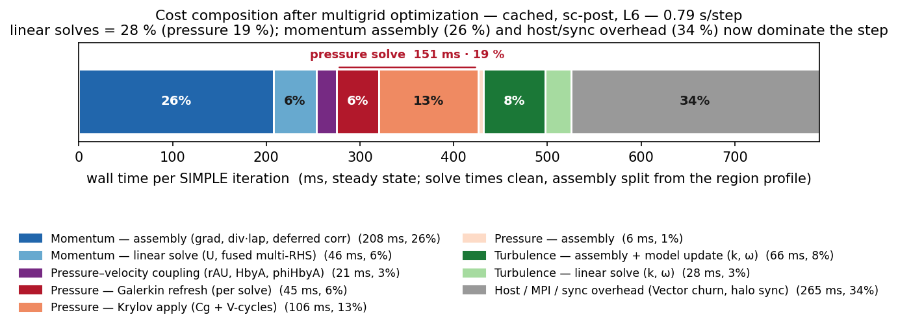
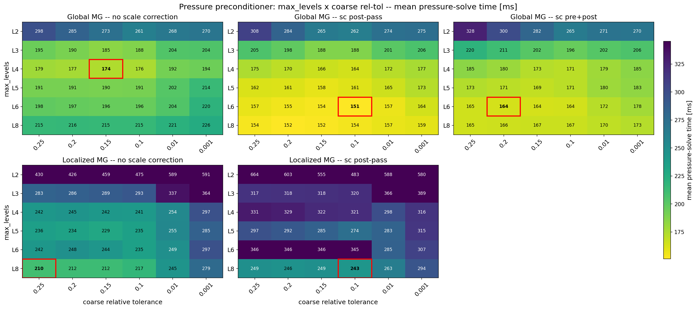
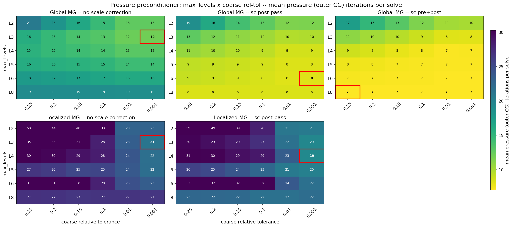

# Tuning a GPU-native multigrid pressure solve for a 197 M-cell automotive RANS case

**Case:** `occDrivAerStaticMesh` — DrivAer (occ variant), static mesh, kOmegaSST, steady SIMPLE
**Hardware:** 4× NVIDIA H200, one MPI rank per GPU (NP = 4)
**Solver:** `neoSimpleFoam` (NeoFOAM/NeoN) with the Ginkgo linear-algebra backend
**Source study:** `PaperOptimizationStudy-2026-07-09.md` (full log, including negative results)

---

## 1. Motivation

NeoFOAM/NeoN is a GPU-native re-implementation of an OpenFOAM-style finite-volume solver. For a
steady incompressible RANS solve the interesting question is not whether it runs on the GPU, but
**where the wall-clock time goes once the flow is developed**, and which solver parameters actually
move that number. We answer both on a production-scale automotive aerodynamics case (≈ 197 M cells).

Two methodological hazards shape the design.

**Cold-start transients are not representative.** The first ~30 SIMPLE iterations from a uniform
field are atypical: the operator and RHS are far from their developed shape and iteration counts are
inflated and erratic (Figure 1). Conclusions drawn there do not transfer. We therefore spin the case
up **once** to a semi-converged restart (iteration 1000) and run every measured variant as an
identical short window from that frozen field.

**Instrumentation perturbs the number being reported.** Profilers (Kokkos `space-time-stack`, `nsys`,
memory tools) add real overhead. We separate **profiling** (overhead allowed; outputs are *relative*
attributions) from **headline timing** (all instruments off).

A third hazard emerged during the study and is worth stating as a result in its own right: **a
parameter validated once and then held fixed becomes an unexamined premise.** Two instances shaped the
results below. A GPU-binding setting, fixed early and never re-examined, silently stacked two MPI ranks
on one device for every timed run — inflating wall times up to ~4× and **inverting the apparent ordering
of the preconditioner variants** until a one-rank-per-GPU control caught it (§5.1). And the
scale-correction flag, pinned after an early win, had to be re-tested at the final operating point,
where it turned out that its *pre* pass no longer earned its communication (§5.3–5.4). Both point to the
same discipline: **re-run the decisive control at the final operating point, not only where the
parameter was introduced.**

---

## 2. Methods

This section describes the mechanisms under study before any measurement, so the results can be read
against the theory rather than as a parameter list.

### 2.1 The pressure system

Steady SIMPLE requires a pressure-Poisson solve per outer iteration. Discretized by finite volumes it
is a large, sparse, **symmetric positive definite** system `A p = b`. Symmetry follows from the FVM
Laplacian; definiteness requires a Dirichlet condition, supplied here by a fixed-pressure outlet
(`uniformFixedValue`). SPD-ness matters concretely: it licenses conjugate gradients (CG) as the outer
Krylov method and, as shown in §2.5, it is preserved through every coarsening variant used here — so
CG remains valid as the coarse solver too.

The pressure solve dominates the iteration (77 %, §4.1), so this study is about the pressure
preconditioner.

### 2.2 Algebraic multigrid, and why level count is a first-order cost

The preconditioner is algebraic multigrid (AMG). AMG builds a hierarchy of progressively coarser
operators, `A_{ℓ+1} = R_ℓ A_ℓ P_ℓ` (the *Galerkin* product), with prolongation `P_ℓ` and restriction
`R_ℓ = P_ℓᵀ`.

#### 2.2.1 The V-cycle

Multigrid exists to work around a specific deficiency of simple relaxation. A stationary smoother —
damped Jacobi here — attenuates **high-frequency** (oscillatory) error components efficiently, but is
almost powerless against **low-frequency** (smooth) error: a few sweeps leave the smooth part of the
error essentially untouched, which is why relaxation alone stalls. The multigrid insight is that
*smoothness is relative to the grid*: error that is smooth on a fine grid appears **oscillatory** when
represented on a grid twice as coarse — where a smoother can attenuate it, and at a quarter of the
cost. Applying the argument recursively gives a method in which **every error frequency is handled on
the level where it is cheap to remove**.

The V-cycle is that recursion. At level `ℓ`, solving `A_ℓ x_ℓ = b_ℓ`:

```
Vcycle(ℓ, A_ℓ, b_ℓ, x_ℓ):
    if ℓ is coarsest:
        return solve(A_ℓ, b_ℓ)                    # small enough to solve outright
    x_ℓ  ← smooth(A_ℓ, b_ℓ, x_ℓ)                  # 1. pre-smooth: remove oscillatory error
    r_ℓ   = b_ℓ − A_ℓ·x_ℓ                         # 2. residual: what the smoother could not fix
    b_ℓ₊₁ = R_ℓ·r_ℓ                               # 3. restrict to the coarse grid
    e_ℓ₊₁ = Vcycle(ℓ+1, A_ℓ₊₁, b_ℓ₊₁, 0)          # 4. recurse (zero initial guess)
    x_ℓ  ← x_ℓ + P_ℓ·e_ℓ₊₁                        # 5. prolong the correction and apply it
    x_ℓ  ← smooth(A_ℓ, b_ℓ, x_ℓ)                  # 6. post-smooth: clean up interpolation error
    return x_ℓ
```

The name is the shape of the traversal: down the hierarchy to the coarsest level, then back up. Each
step earns its place. **Pre-smoothing** (1) removes what is cheap to remove here, leaving an error that
is smooth — and therefore *representable* on the coarse grid, which is what makes step 3 legitimate.
The **residual** (2) is transferred rather than the solution, so the coarse grid solves for a
*correction*, and the recursion (4) starts from zero. **Prolongation** (5) interpolates that correction
back; because interpolation is imperfect — with piecewise-constant injection (below) it introduces
jumps at aggregate boundaries — it reintroduces high-frequency error, which is exactly what
**post-smoothing** (6) exists to remove. Steps 5–6 are where §2.3 intervenes.

Two properties of this structure matter for what follows. First, the levels are **strictly
sequential**: level `ℓ` cannot proceed until the recursion below it returns, so the work cannot be
batched or overlapped across levels. Second, the *arithmetic* per level shrinks geometrically with the
grid (with ~2× coarsening the whole hierarchy costs ~2× the finest level), which is what makes
multigrid asymptotically optimal on paper — **but the per-level latency does not shrink**. A coarse
level's halo exchange costs about what a fine level's does, while its arithmetic is negligible. On this
machine that inverts the classical cost model (§4.3), and it is why the *number* of levels — not
the work they contain — becomes the quantity to minimize.

#### 2.2.2 Coarsening

Coarsening here is **Pgm** (parallel graph match): unsmoothed, *pairwise* aggregation. Each fine
unknown joins an aggregate, so `P` is a piecewise-constant **injection** — one nonzero per row, value
one. Two consequences run through everything below:

1. **Aggregation is expensive to build but structural.** It fixes `P_ℓ`, `R_ℓ`, the level count, and
   every coarse sparsity pattern. It depends on the matrix *graph*, not its values (§2.4).
2. **Pairwise coarsening shrinks the operator only ~2× per level.** Reaching a small coarsest grid
   from 197 M cells needs many levels, and **every level costs a full V-cycle visit** — smoother
   applications, transfers, and on a distributed matrix a halo exchange per SpMV. On this machine the
   solve is latency-bound (§4.3), so **level count is itself a first-order cost**, independently of
   the arithmetic it represents.

**Global vs localized preconditioning.** Two architectures are compared:

| | structure | V-cycle communication |
|---|---|---|
| **Global MG** | `CG → Multigrid` over the distributed matrix | halo exchange per SpMV, per level |
| **Localized MG** | `CG → Schwarz → Multigrid` (per rank) | **none** — the whole hierarchy is rank-local; only the outer CG communicates |

Localized MG trades numerical quality (it ignores cross-rank coupling inside the V-cycle) for the
elimination of all in-cycle communication. Which wins is empirical and hardware-dependent — and, as
§7 notes, is the study's largest open question.

### 2.3 Scale correction

Standard multigrid adds the prolonged coarse correction verbatim, `x += P·e`. This is only optimal if
the coarse operator faithfully represents the fine one in the range of `P`. With **aggressive,
unsmoothed aggregation** it does not: piecewise-constant injection cannot represent the fine
operator's action *within* an aggregate, so the coarse grid systematically **misestimates the
magnitude** of the correction. Its direction remains useful; its scale does not.

Scale correction repairs the magnitude with a **one-dimensional line search along the correction
direction** — a Rayleigh quotient. For a correction `δ` and a residual `ρ`:

```
    sf = (δ · ρ) / (δ · A δ)        then apply  sf·δ  instead of  δ
```

For SPD `A` this is exactly the step length minimizing the A-norm of the error along `δ`: it is the
stationary point of `‖e − sf·δ‖_A`, and it is optimal *only along that one direction* — the line search
cannot improve a direction, only its length. This is the essential limitation and the key to §2.3.2.
The mechanism is inherited from OpenFOAM's GAMG, which carries it for the same reason.

#### 2.3.1 The two passes

Scale correction is applied **twice per level per V-cycle** — once on the way down, once on the way up
(OpenFOAM's *downward* and *upward* passes). Both instantiate the same four-step template:

> **(i)** form `A·δ` — one operator application;
> **(ii)** form the two inner products and `sf = (δ·ρ)/(δ·A δ)`;
> **(iii)** re-smooth the scaled residual, `smoother(ρ − sf·A δ)`, from a zero start;
> **(iv)** combine: `δ ← sf·δ + smoother(ρ − sf·A δ)`.

They are therefore **identical in cost** — one SpMV, two reductions, one extra smoother application
each. What differs is **what plays the role of `δ`, and which residual `ρ` it is scaled against**:

| | **pre-smooth pass** (downward) | **post-smooth pass** (upward) |
|---|---|---|
| corrected quantity `δ` | `δ_pre = x`, the **pre-smoothed fine iterate** | `δ_c = P·e`, the **prolonged coarse correction** |
| residual `ρ` | `b`, this level's right-hand side | `r`, the residual **already deflated** by the pre pass |
| scale factor | `sf = (δ_pre · b) / (δ_pre · A δ_pre)` | `sf = (δ_c · r) / (δ_c · A δ_c)` |
| result merged by | **replacement**: `x ← sf·δ_pre + smoother(b − sf·A δ_pre)` | **accumulation**: `x ← x + δ_c` (x still holds `δ_pre`) |
| purpose | deflate `r` before restriction | scale the coarse correction before adding it |

Two structural notes. First, the passes are **coupled, not independent**: the pre pass overwrites `r`
with a deflated residual, and that deflated `r` is precisely what the post pass scales against — so
disabling the pre pass changes the post pass's input. Second, the post pass **owns the prolongation**:
its `else` branch is the standard `x += P·e`, so disabling it must *fall through* to plain
prolongation rather than simply be skipped, or the coarse correction would be dropped entirely.

#### 2.3.2 Why the two passes are not equivalent

The template is symmetric; the situation it is applied to is not. A line search can only fix a
correction whose **direction is useful but whose length is wrong** (§2.3). That describes exactly one
of the two quantities:

- **`δ_c = P·e` is systematically mis-scaled.** It is manufactured by the coarse grid, and
  piecewise-constant injection cannot represent the fine operator's action within an aggregate. The
  direction is informative — it carries the low-frequency error the smoother cannot see — but its
  magnitude is not trustworthy. Here `sf` deviates meaningfully from 1, and rescaling does real work.
- **`δ_pre = x` is not.** It is produced by the smoother acting on the **fine** operator itself. No
  aggregation is involved, so there is no aggregation-induced scaling error to repair, and a damped
  Jacobi sweep is already close to correctly scaled for the high-frequency modes it targets. Here
  `sf ≈ 1`, the line search returns approximately the vector it was given — and the SpMV, the two
  reductions and the extra smoother application are spent for nothing.

**The prediction is therefore asymmetric: the post pass should carry the benefit as a *scaling*
operation; scaling `δ_pre` should achieve nothing.** §5.4 confirms the first half directly — pre-only
changes the iteration count to 14.0 against 13.8 for no scale correction at all, i.e. not at all.

**But the passes are coupled, and that gives the pre pass a second role this analysis misses.**
Recall from §2.3.1 that the pre pass overwrites `r` with a *deflated* residual, and that this deflated
`r` is exactly what the post pass scales against (`sf = (δ_c·r)/(δ_c·A δ_c)`). So the pre pass's
product is **not a better fine iterate — it is a better residual for the post pass to work with.**
That role is invisible when the pre pass runs alone, which is why pre-only measures as worthless, and
it predicts that **`both` should out-converge `post`** even though `pre` alone does nothing. §5.4 finds
exactly that, on both preconditioner branches. The correct statement is therefore: *scaling the
pre-smoothed iterate is useless; deflating the residual before restriction is not.*

#### 2.3.3 Cost, and the prediction that follows

Both passes cost one operator application, two reductions and one extra smoother application, at every
level except immediately above the coarsest. On a distributed matrix `A·δ` is an SpMV — **a halo
exchange** — and each inner product is an `Allreduce`. Scale correction therefore roughly **doubles
the communication per V-cycle**, and it doubles the smoother work too.

This makes scale correction a **communication-for-iterations trade**, and yields the prediction tested
in §5.3–5.4: *each pass pays only where the iterations it saves are worth more than the communication it
adds.* The two passes therefore need not share a verdict. The post pass repairs the real mis-scaling
(§2.3.2) and earns a profitably deeper hierarchy, clearing the bar; the pre pass repairs nothing and
pays a full pass of communication for a convergence contribution too small to cover it. The prediction
is thus a **split**: the post pass pays, two-sided `both` does not.

**A second prediction — borne out in §5.2 — is that scale correction is what makes *depth* usable.**
The mis-scaling of `δ_c` compounds per level, so an unscaled deep hierarchy drifts progressively
further from the true correction. Scale correction and hierarchy depth are thus **substitutes, not
complements**: both attack low-frequency error, and scale correction's real product is *permission to
coarsen aggressively*.

### 2.4 Hierarchy reuse (`update_matrix_value`)

In steady SIMPLE the pressure matrix is re-assembled every outer iteration, but its **sparsity never
changes** — only the numeric entries move. This is precisely the condition under which an AMG
hierarchy can be reused, and it matters because the reference rebuilds the hierarchy *from scratch on
every pressure solve*.

Ginkgo's `UpdateMatrixValue` facet exploits it. The first solve performs a full generate: Pgm
aggregation (expensive, graph-dependent) fixes `P_ℓ`/`R_ℓ` and all coarse sparsity patterns. Later
solves **skip aggregation entirely** and recompute only the value-dependent data — re-forming each
Galerkin product `A_{ℓ+1} = R_ℓ A_ℓ P_ℓ` on the *frozen* transfer operators.

Correctness is guarded by a structure key `{rows, local nnz, off-diagonal nnz}`: a remesh trips a
mismatch and forces a fresh generate. `preconditionerRebuildInterval` bounds aggregation drift — the
reused aggregation is, after all, built from an operator that keeps evolving.

### 2.5 Merged levels (MergedPgm)

Since level count is a first-order cost (§2.2) and Pgm coarsens only ~2× per level, `mergeLevels`
(again from OpenFOAM GAMG) **runs Pgm `N` times but exposes the result as one multigrid level**. A
merge-3 level coarsens ~8× in a single V-cycle visit. The hierarchy gets shorter; each level coarsens
more aggressively. The trade is exact:

- fewer levels → **cheaper V-cycle** (fewer smoother applications, transfers, halos);
- more aggressive coarsening → **worse coarse approximation** → more iterations.

**Implementation note (why it is cheap).** Merging `N` prolongations naively means multiplying them,
`P = P₁·P₂·…·P_N` — a chain of sparse matrix products that exhausts cuSPARSE's resources on operands
this size. But Pgm prolongations are *injections*, and composing injections is not multiplication —
it is **index lookup**: `mergedAgg[i] = aggThis[mergedAgg[i]]`. The merged prolongation is therefore
assembled by composing aggregate maps directly, at negligible cost and without sparse products. The
coarse operator is free as well: the `N`-th inner Pgm's operator already *is* `Pᵀ A P` for the
composed `P`. Merging is essentially free at setup; **its only cost channel is convergence.**

Because the composed operators remain full-rank injections with `R = Pᵀ`, the Galerkin product
preserves SPD — the coarse system stays a valid CG target. On the distributed path the Pgm
prolongation is block-diagonal (aggregation never crosses ranks), so the composition is rank-local and
**merging adds no communication**.

**How it is selected in NeoFOAM.** The knob is not an OpenFOAM dictionary key. A case points its
pressure entry at a Ginkgo configuration file — `solvers { p { configFile system/gko/<name>.json; } }`
in `fvSolution` — and the coarsener is named inside that JSON as `"mg_level": ["neon::pgmMerge2"]`.
That string is not a Ginkgo type name but a **registry key**: the `GinkgoSolver` constructor
(`NeoN/include/NeoN/linearAlgebra/ginkgo.hpp`) emplaces four pre-built factories,
`neon::pgmMerge{1,2,3,4}`, into the `gko::config::registry` via `makeMergedPgmFactory<scalar>(exec, N)`
— the same named-string pattern used to expose NeoN's `neon::l1ScaledResidual` stopping criterion. The
merge count is therefore **fixed at registration, not a JSON field**; a merge-5 coarsener requires one
more registry entry. The helper pins `deterministic = true` (reproducible aggregation across runs);
the remaining `MergedPgm` factory parameters (`max_iterations = 15`, `max_unassigned_ratio = 0.05`,
`skip_sorting = false`) take their defaults and are forwarded verbatim to every inner Pgm.
`neon::pgmMerge1` is plain Pgm reached through the merged code path, which is what makes it a clean
control arm. One caveat that governs every sweep in §5: `max_levels` in the same JSON counts **merged**
levels, so the effective Pgm depth is `mergeLevels × max_levels` — comparing merge settings at a fixed
`max_levels` compares hierarchies with different coarsest grids.

### 2.6 Coarse-solver termination

The coarsest system is solved per V-cycle. Terminating it by a **fixed iteration count** has no early
exit: it over-solves easy coarse blocks and under-solves hard ones, and the right count depends on
depth. We replace it with a **relative residual criterion**, `‖r‖/‖r₀‖ < tol` (plus an iteration cap
for safety), so the coarse solve adapts to what each configuration actually needs. `tol` and
`max_levels` interact — they are swept jointly throughout §5.

---

## 3. Test case and procedure

### 3.1 Case

| Property | Value |
|---|---|
| Geometry / model | DrivAer (occ variant), static mesh |
| Turbulence model | kOmegaSST (omega wall function + near-wall cell pin) |
| Algorithm | steady SIMPLE (`neoSimpleFoam`) |
| Mesh size | ≈ 49.3 M cells per rank → **≈ 197 M cells total** |
| Decomposition | `hierarchical`, 4 subdomains, one per H200 |
| Precision | fp64 |

### 3.2 Reference solver

The plainest correct stack, so every optimization is measured against a neutral baseline: fp64 CG with
a **global** Multigrid preconditioner, Pgm coarsening, `max_levels = 10`, default smoother, **no**
caching, **no** scale correction. Momentum, k and omega use `Schwarz(Jacobi) + BiCGStab`.

The reference is also used to generate the restart: spinning up with an aggressively tuned solver
would bake solver-specific error into the ground-truth field.

### 3.3 Procedure

| Phase | Purpose | Instrumentation |
|---|---|---|
| 0 — spin-up | `0 → 1000` from uniform field; the one restart all phases start from | none |
| 1 — cost break-down | decompose where the reference spends time on the developed field | full |
| 2 — clean reference | overhead-free time per iteration; the speedup denominator | **all off** |
| 3 — sweeps | attack the largest contributors from Phase 1 | per sweep |


**Figure 1 — the cold-start transient the restart avoids.** *Top:* per-iteration wall time, normalized
to the first marginal step. *Bottom:* linear-solver iteration counts. Over ~60 iterations the per-step
cost falls to a developed plateau (≈ 0.67×), driven almost entirely by the pressure count settling from
~30–42 to a stable ~13–21, while momentum holds flat at 2–3. The correlated spike near iteration 470 —
a transient re-stiffening — is exactly the non-representative behaviour that makes an arbitrary early
window unreliable. Every measured variant instead marches from the frozen field at iteration 1000.

### 3.4 Timing metric

**All wall times reported here are steady state:** `(ET_last − ET_first)/(steps − 1)`. The obvious
alternative, `ExecutionTime / steps`, folds ~47 s of one-time setup into a 50-step window and inflates
it by ≈ 0.9 s/step (≈ 40 %). Setup proved near-constant across configurations (47.4–48.7 s across all
depths and both scale-correction branches), so *rankings* are unaffected by the choice — but absolute
costs and relative gaps are, and the steady-state figure is the physically meaningful one.

Single-run variance on repeated cells is ≈ 0.5 %; differences below ~1 % are not resolved.

---

## 4. Where the time goes

### 4.1 Cost composition of a developed iteration


**Figure 2 — one average SIMPLE iteration (reference config, setup excluded).**

| Stage | segment | s/iter | % |
|---|---|---:|---:|
| **Pressure** | MG hierarchy rebuild | 1.90 | **34 %** |
| | Krylov solve (CG + V-cycles) | 2.00 | 35 % |
| | assemble + flux/corrector | 0.43 | 8 % |
| | **subtotal** | **4.33** | **77 %** |
| **Momentum** | assemble + solve + source | 0.65 | 12 % |
| **Turbulence** | k/omega solve + model update | 0.60 | 11 % |
| Write | I/O | 0.07 | 1 % |
| **Total** | | **5.66** | **100 %** |

Two facts drive everything that follows:

1. **Pressure is the iteration** (77 %). Momentum and turbulence together are barely a quarter of the
   cost; tuning them cannot move the headline.
2. **Half the pressure cost is not numerical work.** The hierarchy rebuild (34 % of the *whole*
   iteration) is Pgm aggregation being reconstructed on every solve — nearly as large as the actual
   solve. This is the single largest lever and directly motivates §4.2.

### 4.2 Hierarchy reuse: the largest single win

Enabling `cacheSolver` with in-place value updates (§2.4) removes the aggregation from the per-solve
path, exactly as the theory predicts:

**−29.6 % wall time per iteration at identical convergence** — the frozen aggregation gives the *same*
mean pressure iteration count (18.2) as rebuilding every solve, with no drift over 250 consecutive
solves. On this developed field the reused aggregation is safe indefinitely (`rebuildInterval = 0`).

This is the study's least ambiguous result: a third of the iteration removed for a configuration flag,
with no numerical cost. Every configuration below is cached.

### 4.3 After reuse, the pressure solve is small and evenly split

Hierarchy reuse (§4.2) removes the Pgm *aggregation* from the per-solve path — but not the Galerkin
*recompute*. With caching on, each solve still re-forms every level's coarse operator `A_{ℓ+1} =
R_ℓ A_ℓ P_ℓ` from the freshly assembled fine matrix on the *frozen* aggregation. Decomposing the tuned
pressure solve — by varying only the outer iteration count at a fixed preconditioner, which separates
the fixed per-solve work from the per-iteration work — gives

- a **fixed per-solve refresh** (the Galerkin recompute) of ≈ 45 ms, and
- a **per-iteration V-cycle apply** of ≈ 13 ms.

At the champion's 8 iterations the pressure solve is ≈ 151 ms — roughly **one-third refresh, two-thirds
iteration** — and, after reuse, only ≈ **1/5 of the developed SIMPLE step**. Neither half is a large
lever on the whole step: the majority of the step is now the *non-pressure* work (momentum and
turbulence assembly and solves), which this study does not attack (§7). The distributed halo exchange
lives in the per-iteration apply and is a real per-level cost, but the pressure solve as a whole no
longer dominates the iteration the way the uncached reference did (§4.1).



**Figure 3 — one SIMPLE iteration after the multigrid optimizations** (cached, post-pass scale
correction, L6; clean steady-state timing, all instruments off). Against the uncached reference of
Figure 2 (pressure = 77 %), the pressure solve has fallen to **19 %** of the step and the four linear
solves together to **39 %**; the majority (61 %) is now non-solve work — matrix assembly, gradients,
the turbulence-model update, flux/corrector and host/MPI overhead — which this study does not attack
(§7). The pressure solve itself splits ≈ 1/3 fixed Galerkin refresh, ≈ 2/3 Krylov apply.

> *A note on a discarded reading.* An earlier version of this section reported the solve as
> "communication-bound" — ≈ 88 % of CUDA-API time in synchronization, the GPU ≈ 80 % idle — and built
> much of §5 on it (*iterations are cheap, communication is scarce*). That measurement was taken under
> the GPU-oversubscription bug of §5.1: the idle GPU was idle because it was waiting on a second rank
> stacked on a neighbouring device, not on the network. The corrected decomposition above does not
> support a communication-bound reading. Where §5.3–5.4 still weigh scale correction's *communication*
> against its iteration saving, that per-V-cycle trade is real, but its billing as the solve's
> *dominant* cost is retracted with this section.

---

## 5. Preconditioner tuning

### 5.1 The parameter grids

Each variant of §2.2–2.5 was swept over `max_levels` × coarse relative tolerance (§2.6), 50 SIMPLE
iterations per cell from the restart, cached.



**Figure 4 — mean pressure-solve time [ms].** Red box marks each panel's optimum. This is the metric
the sweep actually changes (momentum/turbulence/assemble are identical across cells, so total wall time
dilutes the signal ~10×; the wall-time grid, not shown, is flat at 0.78–0.81 s/step across every panel).



**Figure 5 — mean pressure (outer CG) iterations per solve.** The panels track Figure 4: on the
pressure solve, fewer iterations means less time. Iteration count varies ~4× across variants (7 to 27)
while the wall time per SIMPLE step barely moves — because the pressure solve is only half the step.

| variant | best cell | s/step | p-iters | p-solve |
|---|---|---:|---:|---:|
| **Global MG, scale correction (post pass only)** | **L6, tol 0.1** | **0.790** | 8.4 | **151 ms** |
| Global MG, scale correction (both passes) | L6, tol 0.2 | (2.68)¹ | 7.3 | 164 ms |
| Global MG, **no** scale correction | L4, tol 0.15 | 0.810 | 14.2 | 174 ms |
| Localized Schwarz{MG} | L8, tol 0.25 | 0.776 | 26.9 | 210 ms |

¹ *The both-pass grid was re-run later, on the profiling (RelWithDebInfo) build — the production `-O3`
build now aborts in distributed-Schwarz setup — so its **s/step is not comparable** to the other rows
(it is ≈ 3× any production s/step). Its **p-solve and p-iters are build-independent** (Ginkgo is always
compiled `-O3`) and are directly comparable; only that one s/step cell is bracketed.*

**Two readings, and they say opposite things.** On the **pressure solve** (rightmost column) the
ordering is the textbook one: fewer iterations, less time. Post-pass scale correction converges in the
fewest effective iterations and is fastest (151 ms); the localized branch takes the most iterations and
is slowest (210 ms). On the **whole SIMPLE step** (s/step column), by contrast, the four variants are
**tied to within ≈ 5 %** (0.776–0.814) — inside the run-to-run noise (§3.4). The reason is §4.1: the
pressure solve is only about half of a developed step, and the other half (momentum, turbulence,
assemble) is identical across these variants, so even a 40 % swing in the pressure solve barely moves
the headline. **The preconditioner choice is a first-order lever on the pressure solve and a
near-non-lever on total wall time.**

**Within the global family, scale correction pays — but only its post pass.** Post-only is the fastest
global configuration (151 ms), ahead of no scale correction (174 ms): the scaling repair lets the
hierarchy coarsen profitably deeper (its optimum is L6 against no-sc's L4, §5.2), and the iteration
saving more than covers the one extra pass. Adding the **second (pre) pass is a net loss** — both-passes
is 164 ms, +9 % over post-only, for one fewer iteration (§5.4): the pre pass adds an SpMV and two
reductions per level whose convergence contribution does not cover its cost.

**The depth optima order by how much scaling repair each variant carries** — no-sc L4, post-only L6,
both-passes L6, localized L8 — confirming §2.3's claim that scale correction's product is *permission
to coarsen aggressively*. The localized branch tolerates the deepest hierarchy (L8) because its levels
are rank-local and cheap, even though it cannot use scale correction at all.

**Figures 4 and 5 together are the central result — and it is the ordinary one.** On the pressure
solve, iteration count *is* the cost driver: the configurations that converge in fewer iterations are
faster, monotonically. What is *not* true is that this transfers to the wall clock — because the
pressure solve is only half the step, the preconditioner tuning of this section moves the headline by
almost nothing. *(An earlier version of this table, taken before a GPU-binding fix that had stacked two
ranks on one device, showed the opposite — localized fastest, wall time inversely ordered to
iterations — and led to a "communication-bound, iteration count is not the objective" reading. That was
an artifact of the oversubscription; the corrected data above orders normally. The correction and the
before/after control are documented in the source study, §4.15.)*

**The coarse tolerance optimum is 0.1–0.15 and is a property of the coarse system, not of the
configuration.** Every row of every panel minimizes there, independently of depth and of scale
correction. Tighter tolerances over-solve the coarse block; looser ones under-solve it and cost outer
iterations. The coarse system wants roughly a 10× residual reduction — no more, no less. Both edges
were bracketed explicitly, so this is an interior optimum rather than a grid boundary.

### 5.2 Depth reverses with scale correction

Reading the `max_levels` axis of Figure 5 confirms the §2.3 prediction directly:

| max_levels | sc ON: iters | sc OFF: iters |
|---|---:|---:|
| L3 | 8.9 | 13.3 |
| L4 | 7.6 | 13.8 |
| L5 | 7.3 | 15.0 |
| L6 | 7.2 | 17.1 |
| L8 | — | 19.0 |

With scale correction, iterations **fall** with depth — textbook multigrid. Without it they **rise**:
deeper hierarchies converge *worse*, the signature of accumulated mis-scaling (§2.3). The wall-time
optimum moves accordingly — post-pass sc is fastest at **L6**, no scale correction at **L4** — and at
L8 the unscaled panel becomes *flat in the coarse tolerance* (§5.1 grid): once mis-scaling dominates,
coarse accuracy stops mattering at all. (The table shows the both-pass counts; post-only falls with
depth the same way, one to two iterations higher at each level.)

**Depth and scale correction must therefore be tuned jointly.** A depth optimum quoted without its
scale-correction setting — or a merge level without both — is not transferable.

### 5.3 Scale correction pays — but only its post pass

At the final operating point the corrected grids (§5.1) settle scale correction with the ordinary
verdict: **post-pass scale correction is the fastest global configuration** (151 ms, 8.4 iterations),
ahead of no scale correction (174 ms, 14.2 iterations). The mechanism is the one §2.3 predicts — the
scaling repair lets the hierarchy coarsen profitably deeper (its optimum is L6 against no-sc's L4,
§5.2), and the halved iteration count more than covers the single extra communication pass it adds per
level. On total wall time the two are within run-to-run noise (0.790 vs 0.810 s/step), for the §5.1
reason; on the pressure solve the 13 % gap is real and tracks the iteration count.

**The second (pre) pass does not pay.** Making scale correction two-sided (`both`) buys about one
further iteration (7.3 vs 8.4) but is **≈ 9 % slower on the pressure solve** (164 vs 151 ms): the pre
pass adds an SpMV and two reductions per level whose convergence contribution is real but too small to
cover its communication (§5.4 dissects why). Post-only is therefore the operating point, and it is the
champion of the whole study.

**A methodological note, with a corrected outcome.** An earlier stage of this study — on a GPU binding
that, unrecognized at the time, stacked two ranks on one device (§5.1) — measured scale correction as a
**net loss** and concluded its headline win had "silently expired as its premises changed." Re-running
the decisive control one rank per GPU corrects the conclusion: scale correction has **not** expired;
post-pass sc is the fastest configuration measured. What the re-test genuinely established is narrower
and still worth the insurance — the *pre* pass buys too little to justify its cost, so the
recommendation is post-only, not both. The lesson holds as stated (*re-run the decisive control at the
final operating point, not only where the parameter was introduced*) — but here it **refined** the
recommendation rather than reversing the mechanism.

*(An earlier draft quantified scale correction's per-V-cycle communication from `nsys` traces —
≈ doubling it, ~55 % of the total, dominated by the extra `A·δ` SpMV rather than the Rayleigh dots.
Those traces were taken under the oversubscribed binding above and are not re-quantified here; the
qualitative mechanism — one extra SpMV and two reductions per level per pass — is structural and
unchanged, and is what makes the pre pass the wrong half to keep.)*

### 5.4 Only half of scale correction does anything

§2.3.2 predicts an asymmetry: the two passes cost the same, but only the post pass has a mis-scaled
quantity to repair. Gating them independently (via a build-local diagnostic) tests it directly
(L4, tol 0.1):

| mode | p-iters | p-solve |
|---|---:|---:|
| none | 13.8 | 176 ms |
| **post pass only** | 9.3 | **164 ms** |
| both | 7.6 | 171 ms |
| **pre pass only** | **14.0** | —¹ |

¹ *Pre-only is a build-local diagnostic (`NEON_MGSC_MODE=pre`) and was not re-timed on the corrected
binding; its iteration count is build-independent and is the point here. The p-solve column is the
corrected L4/tol-0.1 cell (the old s/step figures for this table were on the oversubscribed binding).*

**Pre-only delivers no convergence benefit at all** — 14.0 iterations against 13.8 for no scale
correction whatsoever — while paying a full share of the communication. Run alone it is strictly
dominated: it pays the price and collects nothing.
This confirms §2.3.2's core claim: `sf ≈ 1` for the smoothed fine iterate, so scaling it achieves
nothing, whereas `sf ≠ 1` for the prolonged coarse correction.

**But "the pre pass is useless" would be the wrong generalization — it contributes in combination.**
`both` out-converges `post` on **both** preconditioner branches:

| | none | post only | **both** | pre only |
|---|---|---|---|---|
| global MG (p-iters) | 13.8 | 9.3 | **7.6** | 14.0 |
| localized Schwarz{MG} (p-iters) | 26.8 | 22.7 | **17.9** | — |

The mechanism is the coupling of §2.3.1: the pre pass deflates `r`, and the post pass scales the
coarse correction *against that deflated `r`*. Its product is a better **residual for the post pass**,
not a better fine iterate — a contribution that is structurally invisible when it runs alone. Pre-only
and pre-in-combination are different quantities, and only the first is worthless.

**What survives is the cost verdict, and only that: `both` is never the right operating point.** The
extra convergence pre buys does not pay for the communication it adds — post-only is faster despite
converging worse (164 vs 171 ms pressure solve; 151 vs 164 ms at each variant's own optimum, §5.1). The
recommendation (`post`, not `both`) is unchanged; the reason is economic, not that half the algorithm
does nothing.

**Consequently `both` is never the correct way to run scale correction** — half its communication buys
nothing. Even where scale correction wins outright, post-only should dominate: the same mechanism at
roughly half the cost. Acting on this requires a configuration parameter
(`scale_correction: none|pre|post|both`) rather than the diagnostic used here.

### 5.5 Merged levels: a near-exact wash

Merged levels (§2.5) trades levels for convergence: since merging is free at setup and adds no
communication, its only cost channel is the extra iterations aggressive coarsening buys. Its
mechanism is visible in the corrected sweep, but its *net* verdict is only partly measured — the
merge sweep was re-run one-rank-per-GPU at a single tolerance and depth axis (L2–L8, tol 0.1), and a
fixed `max_levels` is **not** an apples-to-apples merge comparison (plain Pgm coarsens ~2×/level, so
merge-1 at Lℓ reaches a far coarser grid than merge-2 or -3 at the same ℓ). At `max_levels = 4`,
tol 0.1:

| merge levels | 1 | 2 | 3 |
|---|---:|---:|---:|
| p-iters | 11.5 | 13.8 | 18.6 |
| p-solve | 279 ms | 176 ms | 177 ms |

Iterations **rise** with more aggressive merging (11.5 → 18.6), as the coarse approximation degrades —
the predicted convergence cost. But at fixed depth the shorter hierarchy is the larger effect: merge-1
here carries a much coarser bottom grid and pays for it (279 ms), while merge-2 and merge-3 are a wash
with each other (176 vs 177 ms). Whether merge-1 given *enough* depth to match the coarsest grid closes
that gap — i.e. whether merging is a genuine win or a wash once the comparison is made fair — is the
open question of §7; the full merge × depth grid was not re-mapped on the corrected binding.

What is not in doubt is the **coupling**: merging, depth and scale correction all set how aggressively
the hierarchy coarsens and how well the result is scaled, and scale correction *repairs* the very
mis-scaling aggressive merging introduces (§2.3). They are **one coupled choice, not three** — a merge
level quoted without its depth and scale-correction setting is not transferable.

---

## 6. Memory footprint

Peak device memory (`nvidia-smi`, per rank, 15-step runs):

| configuration | mean / rank | non-pool working set |
|---|---:|---:|
| Global MG (merged levels, 4-level) | **55,920 MiB** | 17,774 MiB |
| Localized Schwarz{MG} (10-level, per rank) | **57,129 MiB** | 18,983 MiB |

**Localized costs ≈ 1,210 MiB/rank more** (+2.2 % of total; +6.8 % of the ~18 GB working set) — the
deeper per-rank hierarchy against the shallower global one. The difference is small and consistent but
rests on one run per configuration.

**Instrumentation caveat, important for any future memory comparison.** NeoN's internal pool probe
reports **byte-identical** footprints for these configurations and *cannot distinguish them*. NeoN
fields use an Umpire pool (fixed reservation, configuration-independent), but the **Ginkgo multigrid
hierarchy is allocated outside that pool** via raw device allocation. Only total device memory
(`nvidia-smi`) can compare solver memory; the pool probe measures the configuration-independent
field/assembly footprint. A study reporting the pool probe would conclude, incorrectly, that
preconditioner choice has no memory cost.

Memory is not a binding constraint here (≈ 56 of 141 GB per H200), but it bounds how large a case fits
per GPU, and the hierarchy is the part that scales with preconditioner choice.

---

## 7. Summary and recommendations

**Configuration.** For this case and machine: **cached hierarchy, global multigrid, post-pass scale
correction, `max_levels = 6`, merged levels 2, localized coarse solve at relative tolerance 0.1**
→ **0.790 s per SIMPLE iteration**, 8.4 pressure iterations, 151 ms pressure solve. After hierarchy
reuse the pressure solve is only ≈ 1/5 of the developed step, so this configuration is nearly
indistinguishable from the other tuned variants on total wall time (all within ≈ 5 %, §5.1); it is
chosen as the fastest on the pressure solve itself.

**Findings, in order of confidence.**

1. **Hierarchy reuse is the single largest win** — −29.6 % at identical convergence, for a flag
   (§4.2). Unambiguous and unconditional.
2. **After reuse, the pressure solve is small and evenly split** (§4.3): ≈ 1/5 of the step, ≈ 1/3 a
   fixed per-solve Galerkin refresh and ≈ 2/3 the iteration. It is not communication-bound — that
   earlier reading was an artifact of the oversubscription (§4.3, §5.1) — and no single half of it is a
   large lever on total wall time.
3. **On the pressure solve, iteration count is the cost driver** — fewer iterations, less time, the
   ordinary ordering (§5.1). It **does not transfer to wall time**: after reuse the tuned pressure
   solve is ≈ 1/5 of the step, so the whole preconditioner sweep moves the headline s/step by less than
   its ≈ 5 % run-to-run noise. The preconditioner is a first-order lever on the pressure solve and
   nearly a non-lever on total wall time.
4. **Post-pass scale correction pays** — it is the fastest configuration, because the scaling repair
   licenses a profitably deeper hierarchy (L6 vs L4, §5.2–5.3). Its **pre pass does not**: two-sided
   `both` is a net loss to `post`.
5. **`both` is never correct; use post-only** — the pre pass provides no convergence benefit run alone
   and too little in combination to cover its communication (§5.4).
6. **Depth, merge level and scale correction are one coupled choice** (§5.2, §5.5). Individually
   optimized values do not compose.
7. **The coarse system wants a ~10× residual reduction** — tolerance 0.1–0.15, independent of
   everything else (§5.1).

**Generalization warning.** Findings 3–5 are *balance* results, not absolutes: they hold where the
pressure solve is a modest fraction of the step and communication is comparatively cheap. At 4 ranks
that is the regime. As rank count grows, coarse levels become communication-dense (their
surface-to-volume ratio rises), which would raise scale correction's per-V-cycle bill — pushing even
the post pass toward the margin — and raise the value of communication-avoiding levers (localized MG,
rank agglomeration). The 4-rank verdict should not be extrapolated without a rank sweep.

**Open items.**

- **The localized branch is resolved, and it does not win.** Re-run one rank per GPU (Figures 4–5,
  bottom row), localized Schwarz{MG} is the **slowest** family on the pressure solve — 210 ms (no sc)
  to 243 ms (sc) against 151 ms for global post-pass sc — despite communicating nowhere inside the
  V-cycle. An earlier cross-build measurement had put it *faster* than global (≈ 3.14 vs ≈ 3.9 s/step);
  that comparison was taken under the GPU-oversubscription bug of §5.1 and is retracted. Localized
  remains interesting only as a communication profile for a rank sweep (its verdict is the one most
  likely to move with scale).
- **Merged levels was pinned at 2**, inherited across grids. Whether plain Pgm (merge-1) beats merge-2
  on the no-scale-correction branch is the one genuinely open pinned-parameter question and the
  highest-value remaining preconditioner experiment.
- **The ≈ 4/5 of the step outside the pressure solve** (momentum and turbulence assembly, gradients,
  linear solves) is, after reuse, the dominant cost and has not been attacked — a larger target now
  than any remaining pressure-preconditioner lever.

---

*Negative and inconclusive results — frozen scale factors, batched reductions, PMIS coarsening,
kernel fusion, fence removal, mixed precision, rank agglomeration — are documented in the full study
(`PaperOptimizationStudy-2026-07-09.md`) and omitted here.*
