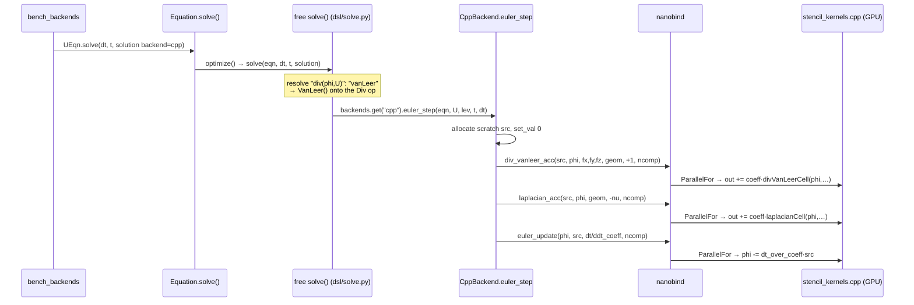
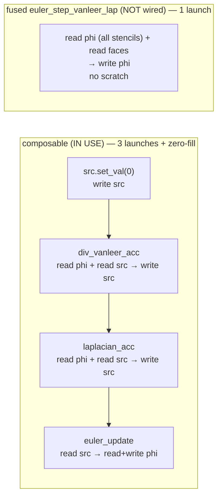
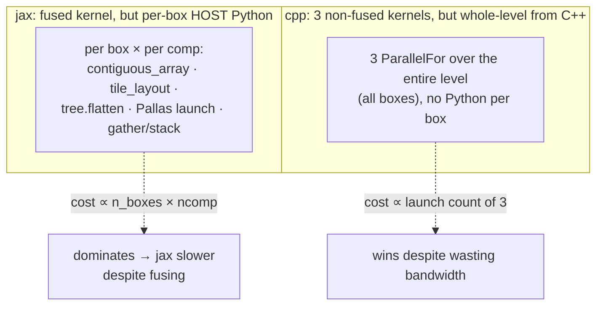

<!--
SPDX-License-Identifier: Unlicense
-->

# blockAMR cpp backend — where the kernels live & what the benchmark dispatches

> Companion to [`blockamr-equation-dsl-implementation.md`](./blockamr-equation-dsl-implementation.md).
> Branch `stack/blockStructured`. Answers three questions: where the C++ kernels
> are, what the benchmark's `Equation` actually calls when `backend=cpp`, and
> whether the composable cpp path wastes memory bandwidth vs a fused kernel.
> Line numbers as of the current `src/NeoN` submodule tip.

## TL;DR

Yes — **the cpp backend is non-fused** and does spend extra memory bandwidth,
exactly as expected. For `ddt(U) + div(phi,U) − laplacian(nu,U)` it launches
**one AMReX `ParallelFor` per term into a scratch MultiFab**, then a separate
Euler axpy — the field `phi` is streamed from DRAM **3×** plus a full scratch
array's worth of extra traffic. A **fused** kernel that does the same physics in
one pass already exists in the same file (`euler_step_vanleer_lap`) but the
backend does **not** use it. cpp still beats jax in the benchmark only because
jax's per-box host-Python overhead dwarfs the bandwidth jax saves by fusing.

## Where things live

| Concern | File | Symbols |
| --- | --- | --- |
| Div scheme classes (pydantic, `stencil_width`) | `src/neon/blockamr/schemes/div_schemes.py` | `Upwind`, `Linear`, `VanLeer`, `QUICK` |
| cpp backend (Python orchestration) | `src/neon/blockamr/backends/cpp_backend.py` | `CppBackend.euler_step` / `_accumulate` / `_scratch` |
| **C++ kernels (all `ParallelFor`)** | `src/bindings/blockAMR/stencil_kernels.cpp` | see below |
| Binding registration (nanobind) | same file, `registerStencilKernels` (`:1106`) | `m.def("div_vanleer_acc", …)` etc. |
| jax backend (fused Pallas, for contrast) | `src/neon/blockamr/backends/jax_backend.py` | `JaxBackend.euler_step` → `parallel_for` |

### The two kernel families in `stencil_kernels.cpp`

| Family | Functions (`:line`) | Passes | Used by `CppBackend`? |
| --- | --- | --- | --- |
| **Composable `*_acc`** (one term each, `out += coeff·op(phi)`) | `divUpwindAcc` `:233`, `divLinearAcc` `:265`, `divVanLeerAcc` `:297`, `divQuickAcc` `:329`, `laplacianAcc` `:360`, `gradAcc` `:386`, `sourceAcc` `:416`, `eulerUpdate` `:434` | 1 per term + axpy | **✅ yes** |
| **Fused `euler_step_*_lap`** (div + laplacian + Euler in one kernel) | `eulerStepVanLeerLap` `:455`, `…LinearLap` `:563`, `…UpwindLap` `:641`, `…QuickLap` `:716` | 1 total | ❌ no (perf baseline only) |

Bindings: `div_vanleer_acc` `:1491`, `laplacian_acc` `:1533`, `euler_update`
`:1572`; the fused `euler_step_vanleer_lap` `:1109`.

## What the benchmark's `Equation` calls when `backend=cpp`

The benchmark builds one equation and solves it with the disk-loaded `solution`
carrying `backend: cpp`:

```python
UEqn = Equation(exp.ddt(U) + exp.div(phi, U) - exp.laplacian(NU, U), schemes=schemes)
UEqn.solve(dt=dt, t=0.0, solution={"backend": "cpp", ...})
```



Term → kernel mapping (`CppBackend._accumulate`, `cpp_backend.py:120`):

| DSL term (benchmark) | scheme | C++ kernel launched | reads | writes |
| --- | --- | --- | --- | --- |
| `exp.div(phi, U)` | `VanLeer` | `div_vanleer_acc` | `phi`, `fx/fy/fz` | `src +=` |
| `exp.laplacian(nu, U)` | central (const γ) | `laplacian_acc` | `phi` | `src +=` |
| `exp.ddt(U)` | Euler | `euler_update` (axpy) | `src` | `phi -=` |

Each `*_acc` is its own `MFIter` + `ParallelFor` over the whole level
(all boxes) — **box-count invariant**, which is why cpp is flat in the sweeps.

## The bandwidth question, made concrete

Composable path, per step, for `div − laplacian` on an `ncomp=3` field
(`CppBackend.euler_step`, `cpp_backend.py:52`):



DRAM traffic over the solution field per Euler step:

| path | kernel launches | `phi` DRAM loads | scratch (`src`) traffic | fused | wired in? |
| --- | ---: | ---: | --- | :---: | :---: |
| **composable cpp** (measured) | 3 (+`set_val`) | **3×** | ~4 passes (fill + 2 RMW + read) | ✗ | ✅ |
| **fused cpp** (`euler_step_vanleer_lap`) | 1 | **1×** | none | ✓ | ❌ |
| **jax / Pallas** | 1 per box × ncomp | 1× (fused on-chip) | none in DRAM | ✓ | ✅ (but per-box Python) |

So the composable cpp path moves roughly **3× the field traffic plus a whole
scratch array** compared to the fused kernel. On a purely bandwidth-bound
stencil that is real, wasted DRAM bandwidth — your intuition is correct.

## Why cpp still wins anyway (the confounder)

The benchmark does **not** isolate fusion, because the two backends differ on a
second, larger axis — launch granularity:



jax saves DRAM traffic by fusing, but pays far more in host-side per-box
orchestration; cpp wastes DRAM traffic but launches 3 cheap whole-level kernels
with no Python. The bandwidth penalty is there — it's just **second-order** to
jax's overhead at every size measured.

## The experiment that would isolate your hypothesis

Compare **composable cpp** vs the **fused `euler_step_vanleer_lap`** — same
backend, same C++ launch path, no jax, no Python confounder. The gap between
them *is* the memory-bandwidth cost of not fusing. The fused kernel is already
in the binary (`stencil_kernels.cpp:455`, bound at `:1109`); it needs a thin
`CppBackend` variant that calls it directly instead of the accumulate loop.
Expected: fused cpp ≈ 2–3× less field traffic → faster on large, bandwidth-bound
boxes, and the first candidate to actually beat jax's fused kernel head-to-head.

## Provenance

Read directly from `div_schemes.py`, `backends/cpp_backend.py`,
`backends/jax_backend.py`, and `src/bindings/blockAMR/stencil_kernels.cpp` on
`stack/blockStructured`. Benchmark numbers from
`src/NeoN/benchmarks/blockamr/` (`results.csv`).
