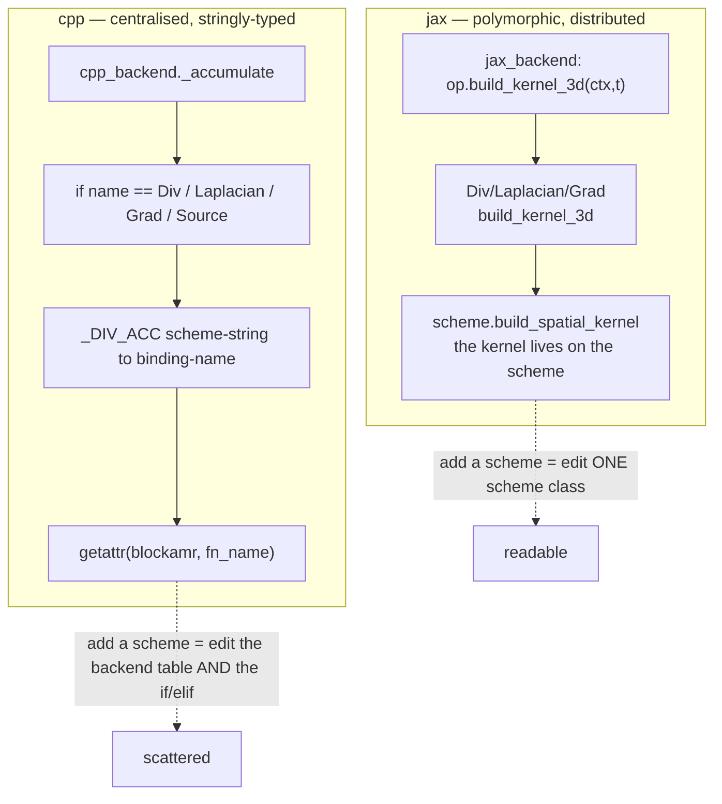
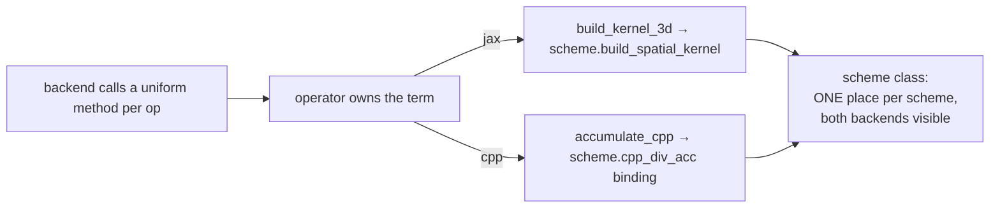

<!--
SPDX-License-Identifier: Unlicense
-->

# blockAMR cpp backend — refactor to mirror the jax/scheme structure

> Companion to [`blockamr-cpp-backend-kernels.md`](./blockamr-cpp-backend-kernels.md).
> Branch `stack/blockStructured`. Problem: the cpp backend does **not** follow
> the same per-scheme / per-operator dispatch the jax backend uses — the cpp
> kernel choice is hardcoded in one `if/elif` block plus a string table, and the
> scheme classes carry **no** cpp kernel. This report shows how to make cpp
> symmetric with jax so both read the same way.

## The asymmetry (what breaks readability)

On the **jax** side, "which kernel for this term+scheme" is answered by
polymorphism spread across two owners:

| Layer | jax owner | Symbol |
| --- | --- | --- |
| operator picks *how it discretises* | `Div` / `Laplacian` / `Grad` | `build_kernel_3d(ctx, t)` (`operators/div.py:37`) |
| scheme owns *its own kernel* | `Upwind`/`VanLeer`/`CentralDiffLaplacian` | `build_spatial_kernel(...)` (`schemes/div_schemes.py`) |

`jax_backend` never names a scheme — it just does
`op.build_kernel_3d(ctx, t)` for every op (`backends/jax_backend.py:46`) and the
scheme classes supply the kernel.

On the **cpp** side the same decision is **centralised and stringly-typed** in
the backend, and the scheme classes are not involved:

```python
# backends/cpp_backend.py  (current)
_DIV_ACC = {"Upwind": "div_upwind_acc", "Linear": "div_linear_acc",
            "VanLeer": "div_vanleer_acc", "QUICK": "div_quick_acc"}

def _accumulate(self, spatial_ops, cell_field, lev, t, src):
    geom = cell_field.mesh.geom(lev); phi = cell_field.mf[lev]; ncomp = cell_field.ncomp
    for sp_op in spatial_ops:
        name = type(sp_op).__name__            # dispatch on operator CLASS NAME
        coeff = sp_op.coeff
        if name == "Div":
            stype = _scheme_type(sp_op)         # dispatch on scheme TYPE STRING
            fn_name = _DIV_ACC.get(stype)
            if fn_name is None: raise NotImplementedError(...)
            faces = sp_op.face_field[lev]
            getattr(blockamr, fn_name)(src, phi, faces[0].mf, faces[1].mf, faces[2].mf,
                                       geom, coeff, ncomp)
        elif name == "Laplacian":
            gamma = sp_op.gamma
            if isinstance(gamma, (int, float)):
                blockamr.laplacian_acc(src, phi, geom, coeff * float(gamma), ncomp)
            else: raise NotImplementedError(...)
        elif name == "Grad":  blockamr.grad_acc(src, phi, geom, coeff)
        elif name == "Source": raise NotImplementedError(...)
        else: raise NotImplementedError(...)
```



Consequences: a new div scheme must be registered in **three** places
(the scheme class for jax, `SCHEME_REGISTRY`, and `_DIV_ACC` + the `if/elif` for
cpp); the backend hard-codes operator class names as strings; and a reader
cannot see "what does VanLeer do on cpp" by opening the `VanLeer` class.

## Target: the scheme/operator own the cpp kernel too

Mirror the jax two-layer split exactly. The **operator** gets an
`accumulate_cpp` that parallels `build_kernel_3d`; the scheme-specific binding
name lives on the **scheme**, parallel to `build_spatial_kernel`.



### 1. Scheme names its cpp binding (mirror of `build_spatial_kernel`)

```python
# schemes/div_schemes.py
class VanLeer(BaseModel):
    model_config = ConfigDict(frozen=True)
    type: Literal["VanLeer"] = "VanLeer"
    stencil_width: int = 2
    cpp_div_acc: ClassVar[str] = "div_vanleer_acc"     # NEW — cpp kernel, next to the jax one

    def build_spatial_kernel(self, face, dh, coeff=1.0):   # jax — unchanged
        return VanLeerDiv3D(face=face, dh=dh, coeff=coeff)
```

Now opening `VanLeer` shows *both* its jax kernel and its cpp binding in one
place — the symmetry the reader expects.

### 2. Operator delegates (mirror of `build_kernel_3d`)

```python
# operators/div.py
class Div(EqTerm):
    def build_kernel_3d(self, ctx, t):                     # jax — unchanged
        ...
        return self.scheme.build_spatial_kernel(face=face, dh=ctx.dh, coeff=self.coeff)

    def accumulate_cpp(self, src, cell_field, lev, geom):  # NEW — cpp mirror
        import neon.blockamr as blockamr
        faces = self.face_field[lev]
        acc = getattr(blockamr, self.scheme.cpp_div_acc)   # scheme owns the choice
        acc(src, cell_field.mf[lev], faces[0].mf, faces[1].mf, faces[2].mf,
            geom, self.coeff, cell_field.ncomp)
```

```python
# operators/laplacian.py
    def accumulate_cpp(self, src, cell_field, lev, geom):
        import neon.blockamr as blockamr
        if not isinstance(self.gamma, (int, float)):
            raise NotImplementedError("cpp backend: variable/callable gamma not supported")
        blockamr.laplacian_acc(src, cell_field.mf[lev], geom,
                               self.coeff * float(self.gamma), cell_field.ncomp)

# operators/grad.py
    def accumulate_cpp(self, src, cell_field, lev, geom):
        import neon.blockamr as blockamr
        blockamr.grad_acc(src, cell_field.mf[lev], geom, self.coeff)

# operators/source.py
    def accumulate_cpp(self, src, cell_field, lev, geom):
        raise NotImplementedError("cpp backend: Source term not supported")
```

The `NotImplementedError` guards move *onto the term that can't do it* — where a
reader looks — instead of an `else` branch in the backend.

### 3. Backend becomes a trivial loop (mirror of the jax fan-out)

```python
# backends/cpp_backend.py  (after)
def _accumulate(self, spatial_ops, cell_field, lev, t, src):
    geom = cell_field.mesh.geom(lev)
    for op in spatial_ops:
        op.accumulate_cpp(src, cell_field, lev, geom)
```

`_DIV_ACC`, `_scheme_type`, the operator-name strings and the whole `if/elif`
tree are deleted. Compare the two backends side by side:

| | jax | cpp (after) |
| --- | --- | --- |
| backend body | `op.build_kernel_3d(ctx, t)` per op | `op.accumulate_cpp(src, …)` per op |
| operator method | `build_kernel_3d` | `accumulate_cpp` |
| scheme method/attr | `build_spatial_kernel` | `cpp_div_acc` binding name |
| dispatch on type strings | none | none |

## What moves where

| Concern | Today | After |
| --- | --- | --- |
| div scheme → cpp binding | `_DIV_ACC` dict in backend | `cpp_div_acc` on each div scheme |
| operator selection | `if type(op).__name__ ==` in backend | virtual `op.accumulate_cpp` |
| "unsupported" guards | `else: raise` in backend | raised by the term itself |
| add a new div scheme | edit scheme + `SCHEME_REGISTRY` + `_DIV_ACC` + `if/elif` | edit the scheme class only |
| add a new backend | new `if/elif` island | new `op.<backend>` method per term |

## Migration steps (small, mechanical, test-covered)

1. Add `cpp_div_acc: ClassVar[str]` to `Upwind`/`Linear`/`VanLeer`/`QUICK`
   (values from the current `_DIV_ACC`). Pure data — no behaviour change.
2. Add `accumulate_cpp` to `Div`/`Laplacian`/`Grad`/`Source`, copying the exact
   body currently in the backend's matching branch (same bindings, same args).
3. Replace `CppBackend._accumulate` with the uniform loop; delete `_DIV_ACC` and
   `_scheme_type`.
4. Run `test/blockamr/test_backend_parity.py` and
   `test/blockamr/test_backend_dispatch.py` — behaviour is byte-identical
   (same kernels, same order), so parity must stay green. That green is the
   proof the refactor is pure.

## Notes / risks

- **Lazy import.** `operators/*.py` call `import neon.blockamr as blockamr`
  inside `accumulate_cpp` (as `cpp_backend` does today) to avoid an
  import cycle at module load. Alternatively resolve the binding once via a
  small `backends/cpp_kernels.py` shim.
- **Grad/Laplacian have no scheme variants yet**, so their binding is fixed on
  the operator, not the scheme — that's fine; the *pattern* still holds and
  extends the day a second laplacian/grad scheme appears.
- **This is orthogonal to fusion.** It keeps the composable per-term kernels
  (and their bandwidth cost, see the companion report); it only makes *choosing*
  them read like the jax path. A future fused-cpp variant would add a
  `fused_step_cpp` on the equation, not change this dispatch.
- **`ClassVar` on a frozen pydantic model** is a plain class attribute (not a
  field) — no schema impact, no validation change.

## Provenance

Read from `schemes/{div,laplacian,grad,ddt}_schemes.py`,
`operators/{div,laplacian,grad,source}.py`, `backends/{jax,cpp}_backend.py` on
`stack/blockStructured`.
