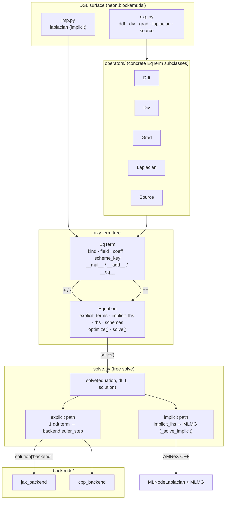
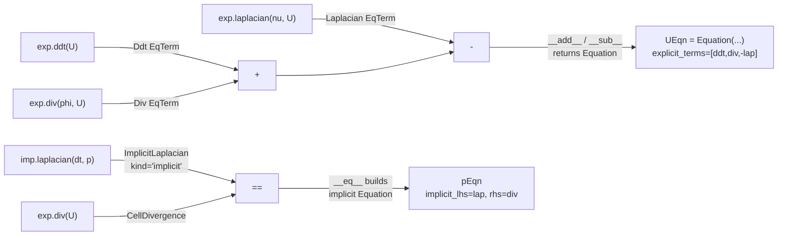
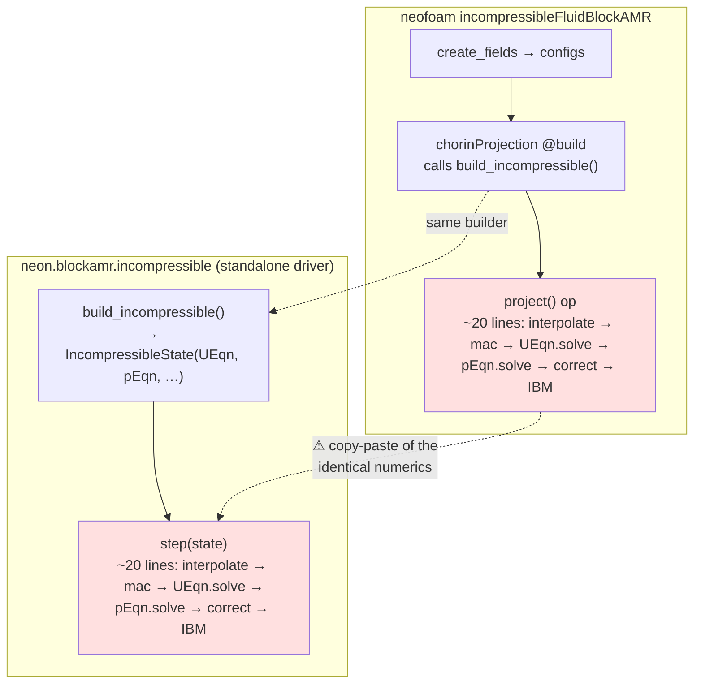
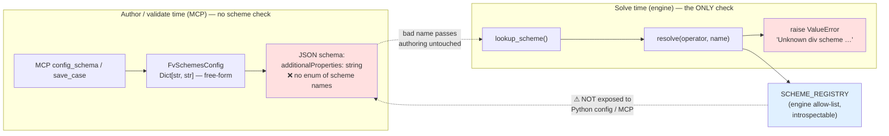

<!--
SPDX-License-Identifier: Unlicense
-->

# blockAMR `Equation` DSL — implementation review

> **Where the code lives:** branch `stack/blockStructured`, worktree
> `/.claude/worktrees/stack+blockStructured`. None of it is on `feat/turbNeoN`.
> DSL package: `src/NeoN/src/neon/blockamr/dsl/`. Engine driver:
> `src/NeoN/src/neon/blockamr/incompressible.py`. neofoam solver model:
> `src/neofoam/solver/incompressibleFluidBlockAMR/models/projection/chorinProjection.py`.
> Line numbers below are as of commit `2f505aede` (fvm-DSL phase 06).

## Summary

The blockAMR fvm-DSL is an OpenFOAM-flavoured Python equation language: `exp.*`
mirrors `fvc::` (explicit), `imp.*` mirrors `fvm::` (implicit). Terms
(`EqTerm`) compose lazily and immutably into an `Equation`; `Equation.solve()`
discretises and dispatches to either a JAX/C++ explicit Forward-Euler step or an
AMReX MLMG implicit solve. The `incompressibleFluidBlockAMR` solver **genuinely
uses this API** — its Chorin projection builds `UEqn`/`pEqn` from DSL terms and
advances them with `.solve()`; there is no bypass to raw engine calls for the
PDEs. All six refactor phases have landed and the pre-DSL shims are deleted.

**Assessment:** the API surface is clean and the solver-side usage reads like the
design doc's worked example. The weak points are all *internal*: the lazy design
is not yet paying for itself, "an Equation is a value" is contradicted by
per-step in-place mutation, and the load-bearing projection loop is copy-pasted
between the engine and the neofoam solver.

**Top proposals (detail in the last section):**

0. **MCP compatibility — make schemes registered & pre-run validatable.** The
   case-authoring MCP (merged in #364) sees blockAMR's `fvSchemes` as opaque
   `Dict[str, str]`; the *only* scheme-name check is the engine's solve-time
   `ValueError`. Surface the engine's `SCHEME_REGISTRY` as typed/enumerated config
   so bad scheme names fail at authoring time, like the reference solver already
   does. *(new — see the dedicated section below)*
1. **De-duplicate the projection loop** — engine `step()` and the neofoam
   `project()` op are two near-identical ~20-line copies of the same numerics.
   Have the op call a shared free function. *(highest value)*
2. **Stop mutating the equation each step** — `pEqn.implicit_lhs.sigma = dt` runs
   every timestep in two places. Pass `dt` through `solve()` instead, restoring
   the "Equation is an immutable value" property the docstrings claim.
3. **Reconsider the `==`-builds-an-equation trick** — the `__eq__` override forces
   identity hashing and makes terms unsafe in sets/dicts. A named `.eq(rhs)` (or
   `imp...equals(rhs)`) keeps the DSL readable without breaking Python's data model.
4. **Make `optimize()` earn its keep or drop the laziness claim** — it is an
   identity function today, so the whole "held lazily so optimize() can fuse"
   rationale currently buys nothing.
5. **Fold the pressure-gradient classes into the `EqTerm` hierarchy** —
   `PressureGradient`/`ScaledPressureGradient` are a parallel lazy type with their
   own `__rmul__`/`__neg__`/`evaluate`, duplicating `EqTerm`'s scaling.

## Architecture



Three homes for information, matching the API doc:

| Concern | Where it lives | Bound when |
| --- | --- | --- |
| **Terms** (what the PDE is) | `Equation(*terms)` | construction |
| **Discretisation** (`fvSchemes`) | `Equation(schemes=…)` | construction |
| **Linear solver / IBM** (`fvSolution`) | `.solve(solution=…)` | each solve |

## Building an equation (compile-time, nothing evaluates)



`Equation._absorb` sorts each term: `kind == 'implicit'` → `implicit_lhs`,
everything else → `explicit_terms` (`equation.py:38-53`). Schemes are stored as
**names** (`{"div(phi,U)": "vanLeer"}`) and resolved to scheme objects only at
solve time.

## Solving (run-time dispatch)

```mermaid
sequenceDiagram
    participant Op as neofoam project() op
    participant St as IncompressibleState
    participant Eq as Equation.solve()
    participant Free as solve() (free fn)
    participant Be as backend / AMReX

    Op->>St: U.fill_patch(); interpolate(U, phi)
    Op->>Be: mac_project(phi, sol_p)
    Op->>Eq: UEqn.solve(dt, t, sol_U)
    Eq->>Eq: optimize()  (identity)
    Eq->>Free: solve(eqn, dt, t, solution)
    Free->>Free: resolve schemes by name; check ngrow
    Free->>Be: backend.euler_step per level → average_down
    Op->>St: pEqn.implicit_lhs.sigma = dt   ⚠ mutation
    Op->>Eq: pEqn.solve(dt, t, sol_p)
    Eq->>Free: solve(eqn, ...)
    Free->>Be: _solve_implicit → MLNodeLaplacian + MLMG
    Be-->>St: p.grad stored on field
    Op->>Be: correct(U, -dt * exp.grad(p))
    Op->>Be: IBM.lookup(...).apply(U)  (if cylinder)
```

`solve()` is a single function that type-switches on the equation shape
(`solve.py:49-59`): `implicit_lhs is not None` → MLMG; else exactly one `ddt` →
explicit Euler; anything else is a `ValueError`.

## Two-layer usage — engine vs neofoam



Both call the same `build_incompressible()`, but `step()` and `project()`
re-implement the identical projection body independently — the module docstring
itself notes they "share the identical numerics oracle" (`incompressible.py:22`).

## MCP compatibility: schemes must be registered & validatable

The case-authoring MCP (merged in #364) fills and validates a solver's configs
from its introspected schema *before* a run. For blockAMR the scheme names are
**opaque strings end-to-end**, so the MCP can neither offer valid options nor
reject typos — the first signal a scheme name is wrong is a `ValueError` thrown
deep inside the engine solve, after the case has already launched.



**What exists.** The engine already has the allow-list: `SCHEME_REGISTRY`
(`schemes/registry.py:16`) maps `operator → {name → class}` and `resolve()` raises
a clear, option-listing `ValueError`. That is exactly the data an authoring-time
validator needs — it is just trapped on the wrong side of the run boundary.

**What's missing (blockAMR).**

- `FvSchemesConfig` (`incompressibleFluidBlockAMR/configs.py:152`) types every
  block as `Dict[str, str]`; `.resolve()` passes values through verbatim. A typo
  (`vanleer`, `guass`) survives pydantic, `load()`, and `save_case`.
- The MCP `config_schema` tool (`mcp/tools.py:86`) emits
  `cls.model_json_schema()`; for a `Dict[str, str]` that is an opaque object with
  no `enum`, so an agent has nothing to pick from.
- `save_case` (`mcp/tools.py:130`) validates only against that same permissive
  model — any string is accepted.
- There is no `available_schemes` / `list_schemes` MCP tool reflecting
  `SCHEME_REGISTRY`.

**The pattern is already in the repo.** The reference `incompressibleFluid`
solver types its schemes as `Literal`-tagged discriminated unions
(`foam/schemes/div.py`, wired in `foam/fv_configs.py:33`), which pydantic renders
as enumerated variants in the JSON schema — so its schemes *are* offered and
validated at authoring time. blockAMR should reach the same bar.

### P0 — register schemes once, validate at authoring time

Make `SCHEME_REGISTRY` the single source of truth and drive the config validation
from it, so the allow-list can never drift from what the engine accepts:

- **Minimum (name validation):** add a pydantic `field_validator` on
  `FvSchemesConfig` that checks each `operator → name` against
  `SCHEME_REGISTRY[operator]`, raising the same option-listing error at
  construction/`save_case` time. Small, immediate, closes the "typo launches a
  run then dies" hole.
- **Full MCP parity (enumerated schema):** generate `Literal`/`Enum` scheme types
  per operator *from* `SCHEME_REGISTRY` (e.g. `Literal[tuple(registry["div"])]`)
  so `model_json_schema()` carries the `enum` and the MCP can present valid
  choices — matching the `incompressibleFluid` discriminated-union pattern.
- **Discoverability:** optionally expose an `available_schemes` MCP tool (or fold
  the enum into `config_schema`) that reflects `SCHEME_REGISTRY`, so an agent can
  ask "what div schemes exist?" without a run.

Keeping one registry feeding both the engine `resolve()` and the config
enum/validator is what makes the schemes *registered and validatable* in the MCP
sense the reference solver already satisfies.

## Component walkthrough

- **`EqTerm`** (`eqterm.py:40`) — base term. `kind` string, operand `field`,
  scalar `coeff`, `coefficient` (phi / gamma / sigma), and a resolved `scheme`
  slot. `_scaled` copies with a new coeff; `__mul__`/`__neg__` scale;
  `__add__`/`__sub__` build an `Equation`; `__eq__` builds an *implicit* equation
  and therefore forces `__hash__ = object.__hash__` (module docstring warns terms
  must never go in sets/dicts).
- **`Equation`** (`equation.py:15`) — `explicit_terms` / `implicit_lhs` / `rhs` +
  a `schemes` name-dict. `temporal_ops`/`spatial_ops` filters, `required_ngrow`
  from the widest stencil, `optimize()` = identity seam, `solve()` = `optimize()`
  then delegate to free `solve()`.
- **`exp` / `imp`** — thin factories over `operators/`. `exp.div` overloads on
  arity (`div(phi,U)` → `Div`, `div(U)` → `CellDivergence`); `exp.grad` returns
  either `Grad` or the stored-gradient `PressureGradient`.
- **free `solve()`** (`solve.py:28`) — explicit path resolves schemes by name
  (mutating `sp_op.scheme`), validates ghost cells, runs `euler_step` per level +
  `average_down`; implicit path (`_solve_implicit`, `solve.py:199`) packs U,
  `compDivergence` → nodal RHS, MLMG solve, stores `p.grad`. Includes an
  `ImplicitSolveCache` on the field, keyed `(n_levels, sigma, bottomSolver)`, and
  a `has_dirichlet` agglomeration path for outflow conditioning.

## Improvement & simplification proposals

### P1 — De-duplicate the projection loop *(highest value, lowest risk)*

`incompressible.step()` (`incompressible.py:181-224`) and the neofoam `project()`
op (`chorinProjection.py:119-171`) are two hand-maintained copies of the same
~20 load-bearing numerics lines. Copy-paste of the *numerics oracle* is exactly
where drift is most dangerous.

The op already resolves `projection_state` (the `IncompressibleState`), so it can
call a shared free function directly:

```python
# neon/blockamr/incompressible.py
def project_once(state, *, fill_bcs=True):
    """The fractional step, no time bookkeeping — the single oracle."""
    ...  # the current body of step(), minus state.t += dt and CFL

def step(state):
    project_once(state)
    state.t += state.dt
    ...  # adaptive CFL
```

```python
# chorinProjection.py project() op
from neon.blockamr.incompressible import project_once
project_once(projection_state)
projection_state.t += projection_state.dt
```

One body, two callers — kills the drift risk the docstrings currently paper over
with a promise that they match.

### P2 — Stop mutating the equation every step

`pEqn.implicit_lhs.sigma = dt` / `.coefficient = dt` runs each timestep, in
**both** `step()` (`incompressible.py:213-214`) and `project()`
(`chorinProjection.py:157-158`). This directly contradicts the "an Equation is a
value … built once" claim (`incompressible.py:148-150`) and duplicates the redundant
`sigma`/`coefficient` assignment.

`dt` already flows into `solve(dt=…)`. Let `_solve_implicit` read `dt` from the
call (or accept `sigma=dt`) instead of reaching back to mutate the term. The
equation then stays a genuine value and P1's shared body needs no special-casing.
(If the current `sigma` cache key must stay, key the `ImplicitSolveCache` on the
passed-in `dt` rather than a mutated attribute.)

### P3 — Reconsider `==`-builds-an-equation

The `__eq__` override (`eqterm.py:104-109`) is elegant at the call site
(`imp.laplacian(dt, p) == exp.div(U)`) but costs real safety: identity hashing,
terms unusable as dict keys / set members, and `a == b` never meaning equality.
That is a sharp edge for a shared library type.

Options, in order of least churn:
- keep `==` but add a lint/`__hash__` guard test so misuse fails loudly;
- offer an explicit alias `imp.laplacian(dt, p).eq(exp.div(U))` and steer new code
  to it, leaving `==` as sugar;
- drop `==` entirely in favour of `Equation(lhs, rhs=…)` / `.eq()`.

Given it is used in exactly two places, the explicit form would remove a
whole class of foot-guns for little readability loss.

### P4 — Make `optimize()` real, or stop advertising laziness

`optimize()` is `return self` (`equation.py:81-87`), yet the lazy tree, the
"nothing evaluates until solve()" comments, and `required_ngrow` all exist to
feed it. Today the laziness buys nothing concrete. Either:
- land one real pass (e.g. cache resolved schemes / stencils so re-solving the
  same `Equation` each step doesn't re-run `lookup_scheme` and re-mutate
  `sp_op.scheme` at `solve.py:71-75` every timestep), or
- if no optimisation is planned soon, simplify the prose so the design isn't
  justified by a capability that doesn't exist.

The scheme-resolution-every-solve point is also a small efficiency win: it is
idempotent work repeated on every timestep for an equation that never changes.

### P5 — Unify the pressure-gradient classes with `EqTerm`

`PressureGradient` / `ScaledPressureGradient` (`exp.py:87-122`) are a second,
parallel lazy hierarchy with their own `__rmul__`/`__neg__`/`evaluate`,
re-implementing the scaling `EqTerm._scaled` already provides, and returning a
type that lives outside the `Equation` system (consumed only by `correct()`).
Folding them into an `EqTerm` subclass (or a small `LazyField` mixin shared with
`EqTerm`) removes the duplication and keeps `exp.grad(p)` inside one type system.

### P6 — Minor consistency / typing

- **Split the `solve()` type-switch.** The explicit and implicit paths share only
  a name. Two functions (`_solve_explicit`, `_solve_implicit`) behind a tiny
  dispatcher — or `solve()` polymorphic on an `Equation.is_implicit` — reads
  clearer than the current `if implicit_lhs … elif len(temporal_ops)==1 … else`.
- **De-stringify `kind`.** `kind ∈ {"temporal","spatial","implicit"}` as a bare
  string on a class attribute is easy to typo; an `enum` (or subclass marker)
  gives the checker something to hold.
- **Single source for `ngrow`.** `build_incompressible` recomputes the stencil
  width (`incompressible.py:114-117`) that `Equation.required_ngrow`
  (`equation.py:63-69`) already derives. Build the equation first, then size the
  field from `UEqn.required_ngrow`.

## Provenance

Written from a direct read of the source on `stack/blockStructured` @ `2f505aede`:
`dsl/{eqterm,equation,exp,imp,solve}.py`, `incompressible.py`, and
`chorinProjection.py`, cross-checked against the API design doc
`plans/blockAMR_Refactor/blockAMR-fvm-dsl-api.md`. All line numbers refer to that
commit; verify before acting if the branch has moved.
