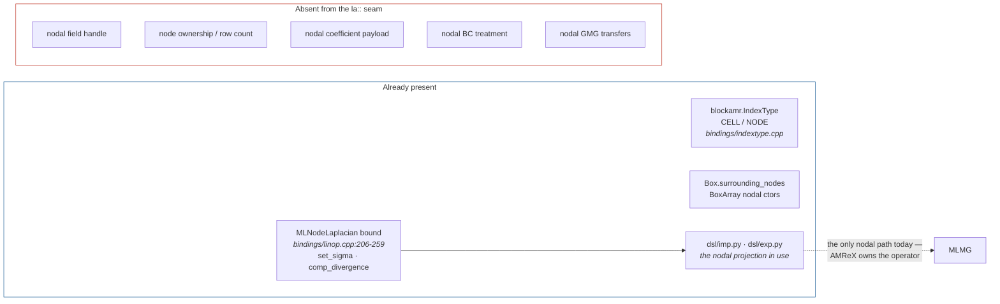
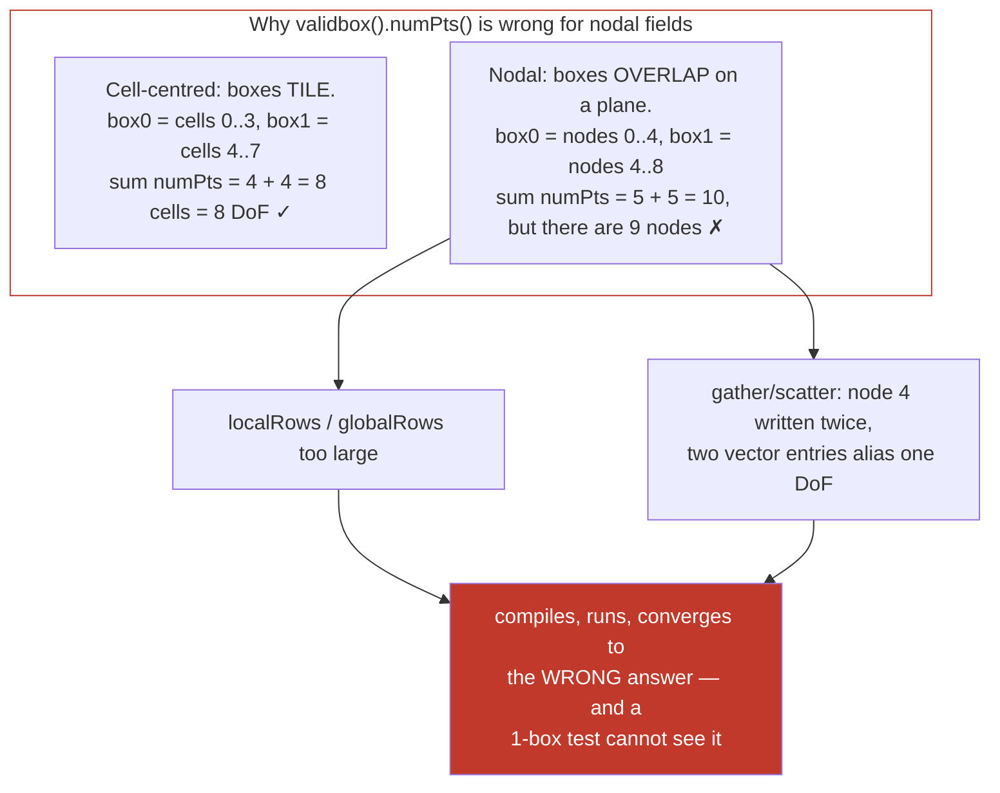
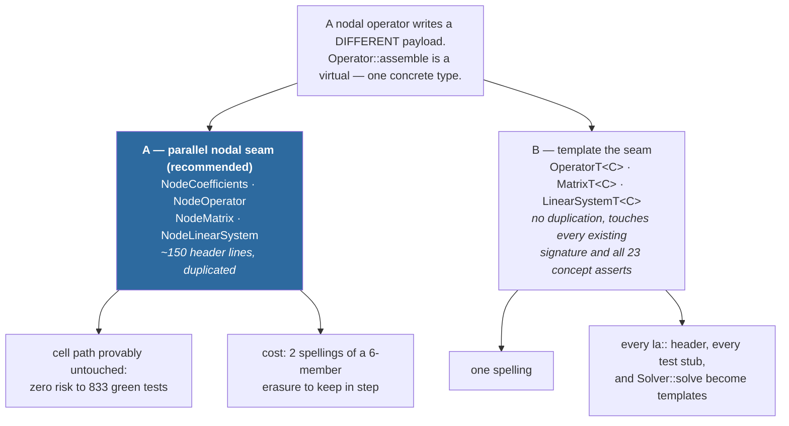
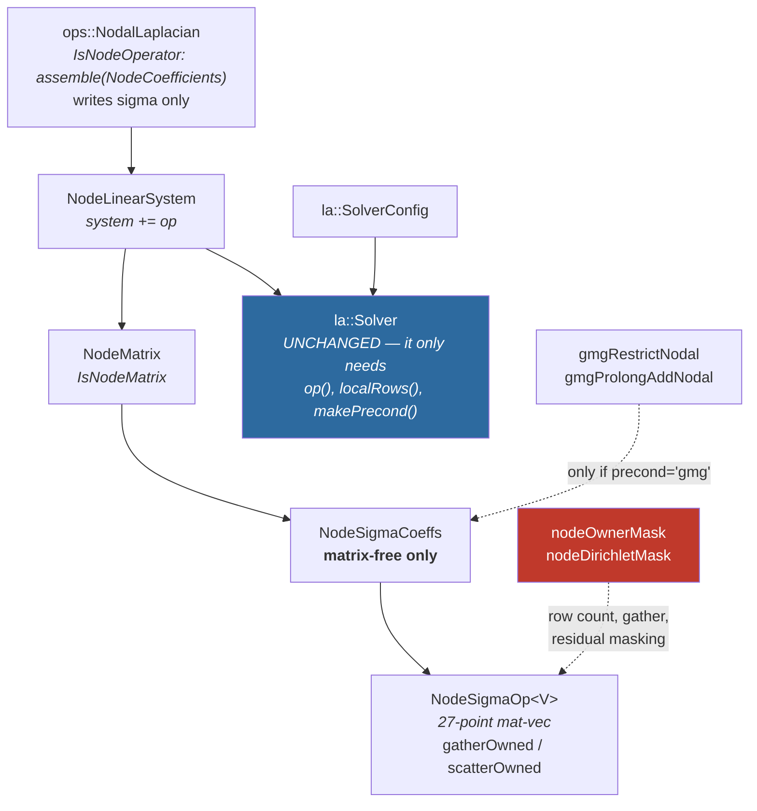

# Integrating a nodal matrix-free solver into the `la::` seam

Companion to [`blockamr-structure-review.md`](blockamr-structure-review.md). That document
describes the target architecture (one operator interface, two formats) and **R18**, the
decided flat/public coefficient storage. This one answers a narrower question: **what has to
be extended so a matrix-free operator on NODE-centred unknowns can live behind the same
seam.**

Everything below is written in R18's shape — fields flat and public, no trailing
underscores, `alpha` not `diag`. If R18 has not landed when this work starts, land it first;
retrofitting a nodal format onto `f_.mc.*` means editing every new signature twice.

---

## Summary

Nodal unknowns are **one of the two things keeping `la::` from replacing the MLMG path** (the
other is multi-level). The production solver's pressure projection is nodal: `exp.py:52`
notes the rhs is made nodal by `MLNodeLaplacian::compDivergence`, and `imp.py:15` builds
`MLNodeLaplacian` + `MLMG` lazily on first solve. So this is not a speculative feature — it
is the gap that makes `chorinProjection.py` unable to move to the seam.

Five things need extending. Four are mechanical. **One is a genuine correctness trap that
must be fixed before any nodal field is handed to Ginkgo:**

> `la::localCount` sums `mfi.validbox().numPts()` (`transfer.hpp:21-29`), and
> `FaceCoeffFields::globalRows()` uses `ba.numPts()`. For a **nodal** `BoxArray`, adjacent
> boxes **share their boundary node planes** — both counts therefore exceed the number of
> degrees of freedom, and `gather`/`scatter` map two vector entries onto the same node. There
> is no `OwnerMask` anywhere in `blockAmr` today.

This is silent: the code compiles, the solve runs, and the answer is wrong in a
mesh-decomposition-dependent way — a single box hides it completely, which is exactly the
configuration a first test would use.

| # | Extension point | Kind | Where |
|---|---|---|---|
| **E1** | Centring must become explicit in the field handles and `MeshLevel` | mechanical | `core/fieldLevel.hpp`, `core/meshLevel.hpp` |
| **E2** | **Owned-node counting and gather/scatter** | **correctness trap** | `linearAlgebra/transfer.hpp`, new `core/ownership.hpp` |
| **E3** | A nodal coefficient payload — 7-point `alpha/upper/lower` cannot express it | design | new `linearAlgebra/nodeSigmaMatrix.hpp` |
| **E4** | Nodal BCs constrain the DoF, they are not a ghost reflection | design | `core/bc.hpp` |
| **E5** | Nodal GMG restriction/prolongation | mechanical | `gmg/gmgKernels.hpp` |

---

## What already exists



Nodal support stops at the binding layer. `IndexType` is bound with `CELL`/`NODE`, `Box` has
`surrounding_nodes`, and `MLNodeLaplacian` is exposed with `set_sigma` /
`comp_divergence` — but nothing in `linearAlgebra/`, `operators/` or `core/` knows that a
field can be node-centred. `grep -rn 'nodal' include/NeoN/blockAmr` returns nothing.

---

## E1 — Centring must become explicit

`CellFieldLevel`'s name is a claim about index space that nothing checks. A nodal `MultiFab`
is still a `MultiFab`, so it fits the handle silently and every downstream stencil then reads
it with cell-centred loop bounds.

Add the distinct handle rather than a runtime flag — the whole point of `FaceFieldLevel` was
that a type stops a wrong pairing at compile time:

```cpp
// core/fieldLevel.hpp — alongside CellFieldLevel / FaceFieldLevel
/* @brief One NODE-centred field on one AMR level. Distinct from CellFieldLevel so a
 *        cell-centred stencil cannot silently consume a nodal field: the index space
 *        differs (n+1 per direction) and so do the valid-box loop bounds.
 */
struct NodeFieldLevel
{
    std::shared_ptr<amrex::MultiFab> mf;

    amrex::MultiFab& operator*() { return *mf; }
    const amrex::MultiFab& operator*() const { return *mf; }
};
```

`MeshLevel` holds one `BoxArray`, which for a nodal system must be the nodal one while the
coefficient `sigma` stays cell-centred — so both are needed at once:

```cpp
// core/meshLevel.hpp
struct MeshLevel
{
    amrex::BoxArray ba;                 // the CELL-centred layout, unchanged
    amrex::DistributionMapping dm;
    amrex::Geometry geom;

    // The nodal layout derived from ba. Same dm: node ownership follows the cell box that
    // produced it, which is what keeps sigma and phi on the same rank.
    amrex::BoxArray nodalBa() const { return amrex::convert(ba, amrex::IntVect::TheNodeVector()); }
};
```

Deriving it rather than storing a second `BoxArray` is deliberate: two stored layouts can
disagree, and `ba` is already documented as "the layout `make()` ALLOCATED the fields from".

---

## E2 — Owned-node counting: the correctness trap

This is the extension that must land first and be tested on **≥ 2 boxes**.



The fix is an ownership rule: every shared node is counted by exactly one box. AMReX
provides `amrex::OwnerMask`, and the conventional rule is *lowest box index wins*.

```cpp
// core/ownership.hpp — new
/* @brief Per-node ownership mask for a nodal layout: 1 where THIS box owns the node, 0 on
 *        the shared planes another box already counts. Nodal boxes overlap by one plane,
 *        so without this every count and every gather/scatter double-visits those nodes.
 *        Rule: lowest box index owns, which is what amrex::OwnerMask implements.
 */
std::unique_ptr<amrex::iMultiFab>
nodeOwnerMask(const amrex::BoxArray& nodalBa, const amrex::DistributionMapping& dm,
              const amrex::Periodicity& period);

// Rows THIS rank owns. The nodal twin of la::localCount, which must NOT be used on a
// nodal field.
std::size_t localCountOwned(const amrex::iMultiFab& ownerMask);
```

and `transfer.hpp` gains masked twins rather than a flag on the existing ones — a `bool
nodal` parameter on `gather` would be defaulted at 40 call sites and forgotten at one:

```cpp
// linearAlgebra/transfer.hpp
// Nodal gather/scatter. Traversal order is the SAME invariant as the cell-centred pair
// (MFIter untiled, then k,j,i) but SKIPS un-owned nodes, so the flat index advances only
// on owned DoFs. gatherOwned and scatterOwned must agree exactly, as gather/scatter do.
template<class V, class FA>
void gatherOwned(const FA& mf, const amrex::iMultiFab& own, V* buf, double scale);

template<class V, class FA>
void scatterOwned(const V* buf, FA& mf, const amrex::iMultiFab& own);
```

After a `scatterOwned` the un-owned planes hold stale data, so a nodal solve needs an
**ownership sync** (`OverrideSync`, or `FillBoundary` after zeroing un-owned nodes) before
the next mat-vec reads them. That is a new step with no cell-centred counterpart, and it is
the second place a 1-box test proves nothing.

> **Verification gate for E2, before any operator work:** build a 2-box and an 8-box nodal
> layout, assert `localCountOwned` equals the analytic node count `(nx+1)(ny+1)(nz+1)`, and
> assert `gatherOwned` followed by `scatterOwned` + sync round-trips a random field bitwise.

---

## E3 — The nodal coefficient payload

The 7-point cell layout **cannot represent the nodal operator**. `MLNodeLaplacian` computes
`div(sigma grad phi)` at nodes from a **cell-centred** `sigma` (`linop.cpp:205`,
`set_sigma`); in 3D that couples each node to the 8 surrounding cells, i.e. a 27-point nodal
stencil. There is no assignment of `alpha`, `upper[d]`, `lower[d]` that produces it.

The good news: the nodal payload is **smaller**, not bigger. One cell-centred field.

```cpp
// linearAlgebra/nodeSigmaMatrix.hpp — new, in R18's flat/public shape
class NodeSigmaCoeffs
{
public:
    NeoN::Executor exec;
    la::BcArray    bc;
    MeshLevel      mesh;      // ba/dm/geom are CELL-centred; mesh.nodalBa() is the unknowns'
    CellFieldLevel sigma;     // the ONLY coefficient: cell-centred, 27-point nodal stencil

    // Node ownership, shared with every copy like the fields: the mask depends only on the
    // layout, so it is built once in make() and never recomputed per solve.
    std::shared_ptr<amrex::iMultiFab> ownerMask;

    // Matrix-free only. There is deliberately no assembled twin: see "What not to do".
    std::shared_ptr<const gko::LinOp> op() const;
    bool isAssembled() const { return false; }
    void zero() { (*sigma).setVal(0.0); }
    Symmetry symmetry() const { return Symmetry::symmetric; }  // div(sigma grad) is self-adjoint
    std::size_t localRows() const { return localCountOwned(*ownerMask); }
    const NeoN::Executor& executor() const { return exec; }
    std::shared_ptr<const gko::LinOp> makePrecond(const SolverConfig& config) const;
    const char* name() const { return "NodeSigmaCoeffs"; }
};
```

`symmetry()` is hard-coded rather than derived: `div(sigma grad ·)` is self-adjoint by
construction, so there is no asymmetric nodal case to represent — and asserting it is
cheaper than carrying an `optional lower` that is always `nullopt`.

### The seam this needs: a parallel nodal erasure, not a generalised one

`Operator::assemble(Coefficients)` is a **virtual**, so it takes exactly one concrete
payload type. A nodal operator writes `sigma`, not `alpha`/`upper`/`lower`. Two ways out:



**Recommend A**, on the project's own stated grounds: `coefficients.hpp:32-35` says "Do not
generalise these types speculatively", and R18 already chose duplication over a shared layer
for exactly this trade. A also keeps the cell path bitwise untouched, which matters because
the cell path is the reference oracle for everything.

```cpp
// linearAlgebra/nodeCoefficients.hpp — the nodal twin of Coefficients
class NodeLinearSystem;

class NodeCoefficients
{
public:
    MeshLevel      mesh;
    CellFieldLevel sigma;   // written by the operator
    NodeFieldLevel rhs;     // NODAL rhs — MLNodeLaplacian::compDivergence's output shape
    NeoN::Executor exec;

private:
    friend class NodeLinearSystem;   // same gate: `system += op` is the only route
    NodeCoefficients(MeshLevel, CellFieldLevel, NodeFieldLevel, const NeoN::Executor&);
};

template<typename T>
concept IsNodeOperator = requires(const T t, NodeCoefficients c) {
    { t.assemble(c) } -> std::same_as<void>;
};
```

Note `rhs` is a `NodeFieldLevel` while `sigma` is a `CellFieldLevel` — the two centrings
meet inside one payload, which is precisely the mismatch E1's distinct types make visible
instead of accidental.

---

## E4 — Nodal boundary conditions

The cell-centred convention is a **ghost reflection**: `bcGhostFill` writes
`ghost = sign*interior` with `sign = -1` for Dirichlet, and the inhomogeneous form adds
`scale*g` with `scale = 2.0` because the face sits halfway between cell and ghost
(`bc.hpp:96-140`).

**None of that applies to a node on the boundary.** The boundary node *is* the boundary, so:

| | cell-centred | nodal |
|---|---|---|
| Dirichlet | `ghost = -interior`, value implied at the face | the **DoF itself is known** — its row is constrained/eliminated |
| Inhomogeneous Dirichlet | `+2g` into the ghost | `phi[node] = g` directly; the row leaves the system |
| Neumann | `ghost = +interior` | natural — the stencil is simply not extended outward |
| `scale` | `2.0` (Dirichlet) / `dx` (Neumann) | no analogue |

So a nodal Dirichlet is a **constraint**, not a reflection, and the mat-vec must keep those
rows consistent (identity row, or zero the residual there) or CG will chase a residual it
cannot reduce:

```cpp
// core/bc.hpp — nodal twin
/* @brief Nodal Dirichlet is a CONSTRAINT, not a ghost reflection: the boundary node IS the
 *        boundary, so its value is known and its row must not be relaxed. Mask is 0 on
 *        constrained (Dirichlet) boundary nodes, 1 elsewhere. Neumann needs no mask -- the
 *        stencil simply does not reach outward.
 */
std::unique_ptr<amrex::iMultiFab>
nodeDirichletMask(const amrex::BoxArray& nodalBa, const amrex::DistributionMapping& dm,
                  const amrex::Box& domain, const BcArray& bc);
```

The mask multiplies both the operator's output and the gathered residual, so a constrained
node contributes zero to the norm. Reusing `BcArray` unchanged is fine — the 6-side
`periodic/dirichlet/neumann` vocabulary is centring-independent; only its *implementation*
differs.

---

## E5 — Nodal GMG transfers

`gmgRestrict` is documented as valid "ONLY for a dx-INDEPENDENT density"
(`gmgKernels.hpp:285`) — it is an 8-child volume average, correct for cells. `gmgCoarsenFace`
applies `w = 0.25/scale` for faces. **Neither is a nodal transfer**, and this distinction
already caused the Dirichlet fold-coarsening bug, so it is worth being explicit rather than
reusing whichever one compiles.

Nodal transfers are:

```cpp
// gmg/gmgKernels.hpp
// Nodal restriction: INJECTION at coincident nodes (a coarse node IS a fine node), not an
// average. No dx factor: the nodal residual is a point value.
template<class T>
void gmgRestrictNodal(const GmgFab<T>& fine, GmgFab<T>& crse, bool onDevice);

// Nodal prolongation: trilinear interpolation from the 8 surrounding coarse nodes; the
// adjoint of gmgRestrictNodal up to the usual factor, which keeps the V-cycle symmetric
// and therefore usable by CG.
template<class T>
void gmgProlongAddNodal(const GmgFab<T>& crse, GmgFab<T>& fine, bool onDevice);
```

Two constraints inherited from the existing code:

- **Coarsening a nodal level** needs `(n+1)` odd per direction, i.e. `n` even at every level.
  `gmg_min_bottom` and the level-count logic must stop coarsening on that criterion, not the
  cell-centred one.
- These are device kernels reached from more than one CUDA TU, so they fall under the
  **"Class B" nvcc rule** the component already documents: declaration-only in the header,
  defined and *explicitly instantiated* in the `.cpp`. A missed instantiation is a null
  device function pointer **at runtime, not a link error**.

---

## How it fits together



**`la::Solver` and `SolverConfig` do not change.** The solver reaches a matrix only through
`op()`, `localRows()`, `executor()` and `makePrecond()` — all of which `NodeSigmaCoeffs`
provides. That is the payoff of the seam: a whole new discretisation arrives without the
solver, the config, or the Krylov machinery learning about it. Only `Solver::solve`'s
parameter type needs a nodal overload under option A.

---

## Staging

Each step has a check that fails loudly if the step is wrong. **E2 is first and is not
optional** — every later step silently inherits its bug.

| Step | Work | Verify |
|---|---|---|
| 1 | E1 handles + `MeshLevel::nodalBa()` | compiles; `nodalBa()` node count is `(nx+1)(ny+1)(nz+1)` |
| 2 | **E2** owner mask, `localCountOwned`, `gatherOwned`/`scatterOwned`, sync | **on 1, 2 and 8 boxes**: count equals the analytic node count; gather→scatter→sync round-trips bitwise |
| 3 | E4 Dirichlet mask | constrained nodes are exactly the non-periodic boundary planes; count matches by hand |
| 4 | `NodeSigmaOp<double>` mat-vec, no preconditioner | vs `MLNodeLaplacian::apply` on the same random field, to round-off — this is the oracle, and it already exists |
| 5 | `NodeSigmaCoeffs` + nodal seam (option A) + `ops::NodalLaplacian` | `system += op` reproduces step 4's operator bitwise |
| 6 | CG through `la::Solver`, `precond="none"` | converges; solution matches an `MLMG` solve of the same system to solver tolerance |
| 7 | E5 nodal GMG, `precond="gmg"` | same answer as step 6; iteration count ~flat in N (the whole point) |
| 8 | `float` mat-vec path | mirrors the cell path's fp32 story; re-measure, do not assume it transfers |

Step 4 is the leverage point: **`MLNodeLaplacian` is already bound and already correct**, so
the new operator has an independent oracle from the first line of code. That is a luxury the
cell-centred path did not have — §4 of the review notes `FaceCoeffSolver` had to serve as
both legacy path and oracle — and it means step 4 can be trusted before any of the seam
exists.

---

## What not to do

- **Do not add an assembled (CSR) nodal format** in the first pass. The 27-point stencil
  means ~27 entries/row against the cell path's 7, and the assembled path exists mainly as
  the cross-check that the matrix-free stencil is right — a job `MLNodeLaplacian` already
  does better here. Add it only if a direct/ILU solve is actually wanted.
- **Do not reuse `localCount`, `gather` or `scatter` on a nodal field.** Not "carefully" —
  the failure is silent and decomposition-dependent. If the nodal twins feel duplicative,
  that is the cheaper half of the trade.
- **Do not generalise `CellFieldLevel` into `FieldLevel<Centring>`.** `coefficients.hpp:32-35`
  argues against speculative generalisation of exactly these handles, and a template
  parameter would not have prevented the ownership bug, which is the real hazard.
- **Do not fold nodal Dirichlet into the diagonal** the way the cell path once folded it.
  That fold is what caused the coarsening bug fixed earlier in this branch; a constraint mask
  has no coarsening subtlety because it is idempotent.

---

## Open questions for the maintainer

1. **Multi-level or single-level first?** This plan is single-level, matching `la::`'s current
   limitation. The production nodal projection is multi-level, so a single-level nodal solver
   still cannot replace `chorinProjection.py`'s call — it removes one of the two blockers.
   Worth deciding whether that is a useful intermediate or whether both must land together.
2. **Option A (parallel nodal seam) or B (templated seam)?** A is recommended above and is
   consistent with R18/R8, but B is the answer if a third centring (face-centred unknowns,
   e.g. a MAC velocity solve) is on the roadmap. Two payloads justify duplication; three do
   not.
3. **Does the nodal path need `gmg_kokkos`?** The Kokkos V-cycle is where bf16 and the
   coefficient-precision knobs live. Nodal transfers would have to be ported there
   separately, and `gmgKokkos/` currently reaches into `gmg/`'s internals (§1.6), so doing
   both at once is more coupling than it looks.
