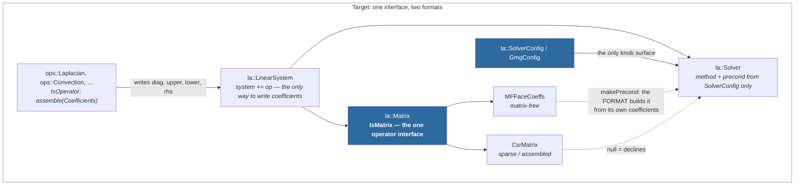
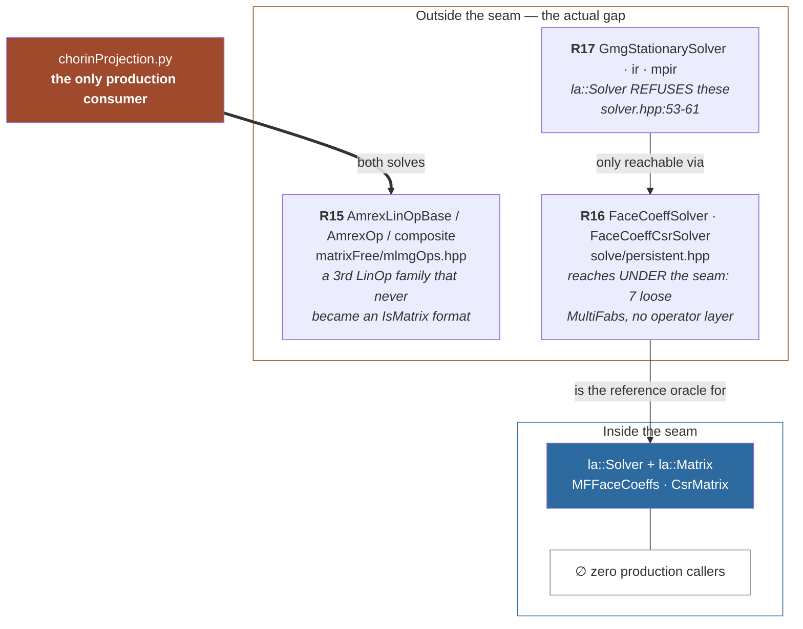
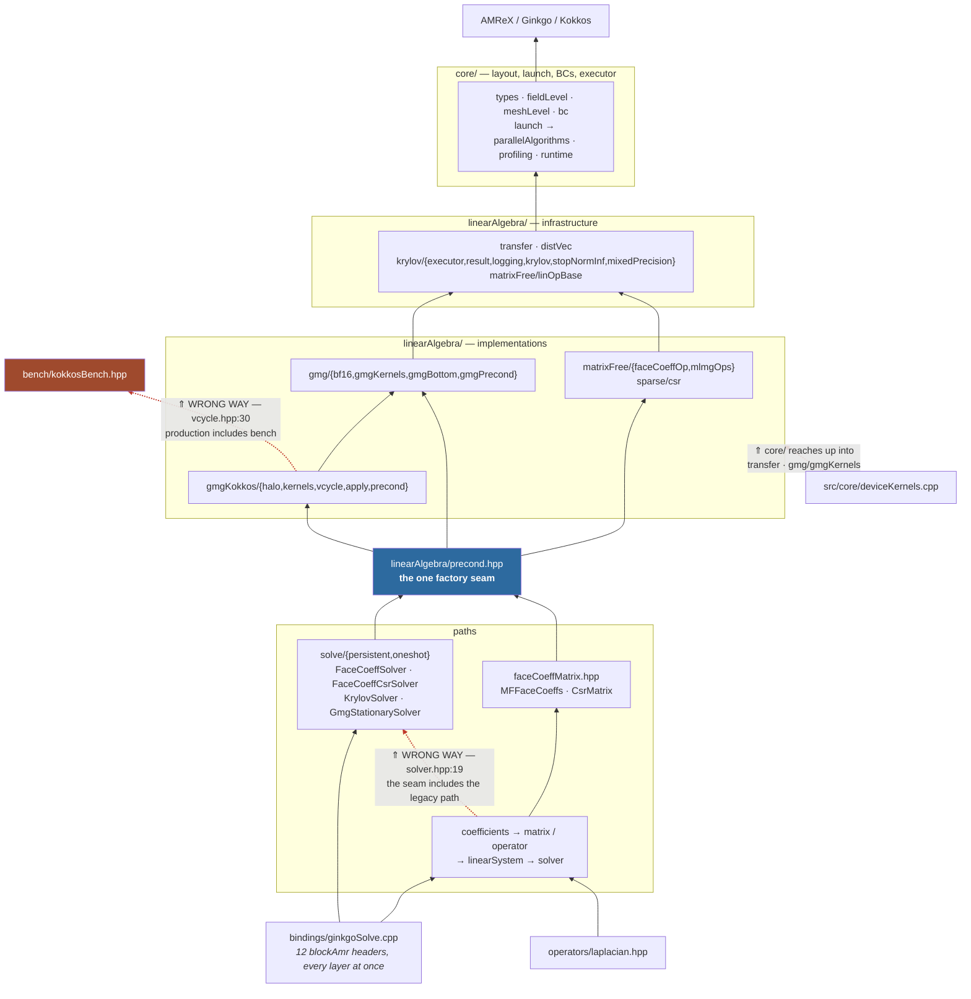
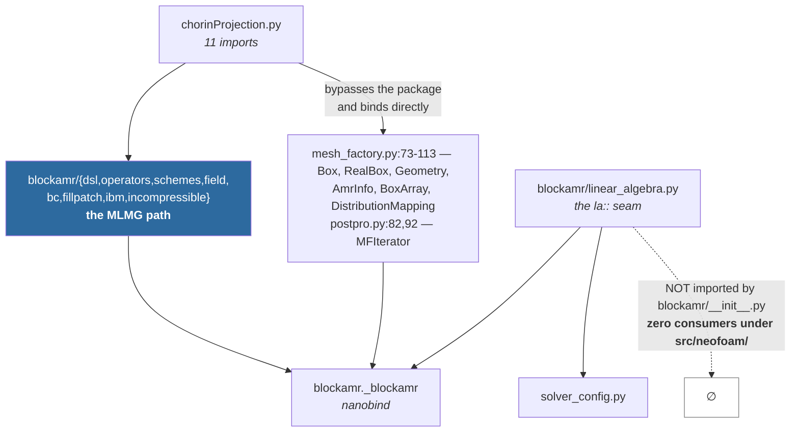
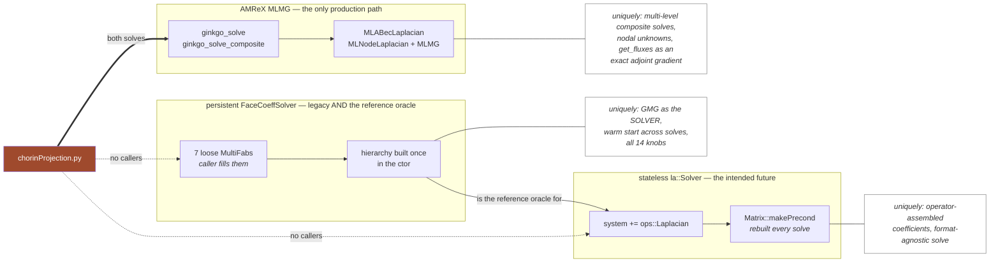

# `blockamr` — code structure and architecture review

## Summary

`blockamr` is ~26 700 lines wrapping AMReX + Ginkgo + Kokkos behind a Python API. The
architecture is sound: a type-erased `la::` seam, field-grouping handles that kill
positional-argument hazards, and an unusually strong test suite (833 passing, with bitwise
coefficient assertions and cross-format agreement checks). **Nothing here is a defect
hunt — the findings are all "the same thing is written down more than once".**

Four structural facts explain most of the friction:

1. **The V-cycle configuration exists in 9 places, 5 of them hand copies, with 3
   independent default lists and no test that they agree.** Adding one knob touches 9
   files; 5 C++ knobs are consequently unreachable from the `la::` seam. → R1
2. **`alpha - (aE+aW+aN+aS+aT+aB)` is hand-written 7 times** outside the helper that
   exists for it — in a component whose correctness contract is *bitwise agreement in a
   fixed association order*. → R2
3. **Production includes the benchmark.** `gmgKokkos/vcycle.hpp` includes
   `bench/kokkosBench.hpp` and the production V-cycle is constructed from a bench struct.
   The cause is a build split whose own comment says the reason is "history/inertia". → R3
4. **The same seven-field matrix has had three vocabularies.** One was just merged
   (`FaceCoeffFields` now holds a `MatrixCoefficients`); `Coefficients` and `GmgArgs`
   remain. Two types sharing a member name already produced a factual error in this
   review chain. → R4, R5

Two large questions are **maintainer decisions, not cleanups**, and no code should move
until they are answered: the half-landed stored-diagonal change (PROTOTYPE C1, 70 lines +
6 tests currently proving a cache is fresh for nobody, R10), and the bucket-dispatch
kernel path (1 273 Python lines, 19 % of the package, reachable only from tests, holding
the 2nd and 3rd copies of the 7-point Laplacian, R13).

Separately, the intended architecture — *one operator interface, two formats; set the
coefficients and let config options pick the solve* — **is already built and asserted in
the `la::` seam.** Three things sit outside it, and finishing that adoption is its own
track (R15–R17), described next.

**If only one thing is done: R1.** It removes 5 hand copies and 2 of 3 default lists, cuts
the cost of adding a preconditioner from 8–10 files to 3–4, is pinned by no test, and
touches 4 files.

### The intended shape — and it already exists

The design goal is: **a caller only says how to set the coefficients; the linear system is
solved by changing config options.** One operator interface, two formats behind it —
matrix-free and sparse.

**That architecture is already implemented and asserted.** `la::IsMatrix`
(`coefficients.hpp:74-101`) is the one interface; exactly two types satisfy it —
`MFFaceCoeffs` (matrix-free) and `CsrMatrix` (assembled/sparse), both `static_assert`ed at
`faceCoeffMatrix.hpp:367-368`. Coefficients are written only through
`Operator::assemble(Coefficients)`, and `system += op` is the only route to a
`Coefficients` (private ctor + single `friend`). Method and preconditioner come from
`SolverConfig` alone — `la::Solver` holds no factory and no format knowledge.

So this is **not a redesign recommendation. It is a finish-the-adoption recommendation**:
the seam is right, three things sit outside it. → R15, R16, R17



What is outside it today:



| Gap | What it means for "config options only" | Fix |
|---|---|---|
| **AMReX MLMG is a third operator family.** `AmrexLinOpBase`/`AmrexOp` are `gko::LinOp`s but not `IsMatrix` formats — no `coefficients()`, no `makePrecond`, no `zero()`. | The one path with production callers cannot be reached through `la::`. Switching to it is not a config change; it is a different API. | **R15** — wrap it as a third `IsMatrix` format, or state that MLMG is deliberately outside and the migration target is `MFFaceCoeffs`. |
| **`FaceCoeffSolver` reaches under the seam.** It takes 7 loose `MultiFab`s the caller must have filled itself; there is no operator layer, so "how to set the coefficients" is the caller's problem, not an `ops::` type's. | The legacy path is *also* the reference oracle (`test_la_boundary_conditions.py:36-38`), so it cannot simply be deleted. | **R16** — give `la::` an independent oracle, then make `FaceCoeffSolver` a thin adapter over `MFFaceCoeffs` rather than a parallel implementation. |
| **5 GMG knobs + 3 solver kinds are unreachable by config.** `la::Solver` refuses `gmg`/`ir`/`mpir` (`solver.hpp:53-61`); `aggLevel0Size`, `symmetric`, `bottomSolver`, `bottomMaxIter`, `bottomRtol` are not on the Python `GmgConfig`. | "Change a config option" is false for exactly the options that need the hierarchy as the solver. | **R1** (exposes the 5 knobs) + **R17** (decide whether GMG-as-solver is a `SolverConfig` value or permanently a different object). |

The refusals themselves are **correct and should stay**: `makePrecond` returning null to
decline, and `la::Solver` naming the alternative in its message, are capability negotiation
between a config and a format — the honest way to express "this combination has no
implementation". The bug is not that they refuse; it is that the same refusal is written
twice in two vocabularies (R11).

### Target coefficient storage — **decided** (R18)

The coefficient fields go **flat and public** in each format. `MatrixCoefficients` and
`detail::FaceCoeffFields` are deleted; `CellFieldLevel`/`FaceFieldLevel` stay.

```cpp
class MFFaceCoeffs {
public:
    NeoN::Executor                exec;
    la::BcArray                   bc;
    MeshLevel                     mesh;      // ba, dm, geom — dx and periodicity
    CellFieldLevel                alpha;     // the diagonal SOURCE, not the matrix diagonal
    FaceFieldLevel                upper;
    std::optional<FaceFieldLevel> lower;     // nullopt when symmetric

    // derived diagonal cache; written in place, so only the flag needs sharing
    CellFieldLevel        diagonal;
    std::shared_ptr<bool> diagonalDirty;

    FaceFieldLevel storedLower() const { return lower.value_or(upper); }
    Symmetry symmetry() const { return lower ? Symmetry::asymmetric : Symmetry::symmetric; }
};
```

`IsMatrix` then requires the **members**, not accessors — a data member and a member
function cannot share a name, and the members are the point:

```cpp
{ t.alpha } -> std::same_as<CellFieldLevel&>;
{ t.upper } -> std::same_as<FaceFieldLevel&>;
```

Three deliberate consequences, each accepted:

1. **Public fields are not a leak here.** An operator's whole job is to write these seven
   fields; `Coefficients` narrows *which* fields, never *whether* they are writable. The
   privacy was buying nothing an operator wasn't already entitled to.
2. **`diag` becomes `alpha` everywhere**, resolving §5.2's split in favour of the name that
   is true — the field is the diagonal *source*, not the matrix diagonal.
3. **The ~6 helper lines are duplicated across the two formats on purpose.** That is the
   price of deleting the shared `FaceCoeffFields` layer, and it is cheaper than the layer.

`Coefficients` survives as **the one bundle type**: it is the type-erasure parameter
(`Operator::assemble` is a virtual and needs one concrete type), it is the only place the
rhs — which lives on the system, not the matrix — joins the matrix fields, and its private
ctor keeps `LinearSystem` the sole builder, so `system += op` stays the only route. It is
also now the single site where the six fields get *ordered*, which is where a transposition
would otherwise hide.

One asymmetry: `MFFaceCoeffs` flattens its cache because `diagonal`'s `MultiFab` is written
**in place**, so `CellFieldLevel`'s own `shared_ptr` already shares it and only the flag
needs sharing. `CsrMatrix` cannot — reassembling **re-seats** `csr` with a new `LinOp`, and
a flat member assigned through one copy would leave other copies on the old one. So
`CsrMatrix` keeps `std::shared_ptr<Assembly>` as a shared *slot*; only its coefficient half
flattens.

### Proposed file tree

Changes are marked; everything unmarked stays put. This is the *destination* implied by
R1–R14, not a big-bang move — each line is reachable independently.

```
include/NeoN/blockAmr/
├── core/            bc  fieldLevel  launch  meshLevel  parallelAlgorithms  profiling  runtime  types
│                        └── + faceFluxLevel? …… only if a READ-ONLY handle lands (see below)
├── linearAlgebra/
│   ├── stencil.hpp  ←── NEW (R2). The single negSumDiag/loadFaceCoeffs/stencilOffDiag helper,
│   │                     templated <T,TC,C>. Serves gmg/, gmgKokkos/, sparse/, matrixFree/,
│   │                     so it cannot live in gmg/ as it does today.
│   ├── coefficients  ←── R4: `Coefficients` holds a `MatrixCoefficients`; `symmetric()` deleted
│   ├── faceCoeffMatrix  ←── R8: the 2 formats' 7 identical members via one mixin
│   ├── distVec  linearSystem  matrix  operator  precond  solverConfig  solver  transfer
│   ├── gmg/         bf16  gmgBottom  gmgPrecond  gmgKernels(−stencil helpers → ../stencil.hpp)
│   ├── gmgKokkos/   apply  halo  kernels  precond  vcycle
│   │                 └── + gmgOpts.hpp ←── R3: the V-cycle knob struct, so vcycle.hpp
│   │                     STOPS including bench/kokkosBench.hpp. Deletes KokkosGmgOpts'
│   │                     twin and apply.cpp's 13-line copy loop.
│   ├── krylov/      executor  krylov  logging  mixedPrecision  result  stopNormInf
│   │                 └── + krylovSolver.hpp ←── R7: `KrylovSolver`/`ISolver` move here from
│   │                     solve/persistent.hpp, so solver.hpp stops including the legacy path
│   ├── matrixFree/  faceCoeffOp  linOpBase  mlmgOps
│   ├── solve/       oneshot  persistent(−KrylovSolver → krylov/)
│   └── sparse/      csr
├── operators/       laplacian … the single home of the BC contract
└── bench/           cells  kokkosBench(−knobs → gmgKokkos/gmgOpts.hpp; keeps OpArgs/BenchResult/GmgResult)

src/blockAmr/
├── core/  linearAlgebra/  operators/  bench/   …… mirror the above
└── bindings/        amrcore box fillpatch geometry indextype init linop module multifab
                     plotfile stencilKernels tagbox tileLayout benchBindings
                     ginkgoSolve(1680 → ~1300)  ginkgoSolveStub
                     └── + laProbes.cpp ←── R6: the ~200 lines of la:: TEST-SUPPORT logic
                         (makeLaMatrix, writeField/writeCoefficients/writeDiagSource,
                         readCoefficients, MatrixKrylovSolver) leave the binding file.
                         They exist only because blockAmr has NO C++ test target — the
                         alternative fix is to add one.

python/blockamr/
├── eqterm.py  ←── R14: moved out of dsl/ to break the dsl ↔ operators cycle
│                  (survives today only because operators import the SUBMODULE)
├── dsl/  operators/  schemes/(− schemes_dict.py, R12iii: 0 call sites)  backends/  ibm/
└── cell_kernels · cell_accessor · bucket_dispatch · precomputed_dispatch · triton_kernels
    ←── R13, 1273 lines, DECISION REQUIRED: delete with their ~7 test files (needs
        Grad/Source `build_kernel_3d` first), or register as a supported backend.
```

Net effect: 3 new files, 2 struct deletions, 1 module move, ~1 300 lines of `ginkgoSolve.cpp`
relocated, and the production→bench include gone. No public Python signature changes —
`FaceCoeffSolver`'s 7-`MultiFab` ctor is a bound ABI and stays loose deliberately.

**The one prerequisite that keeps recurring:** R5 (pushing `CellFieldLevel`/`FaceFieldLevel`
down through `assembleFaceCoeffCsr`, `solveFaceCoeffs`, `GmgPrecondT::create`) and grouping
the face fluxes both stall on the same missing piece — a **read-only** field handle.
`FaceFieldLevel`'s accessor pair grants write access through a const handle by design, so
read-only consumers (every flux signature, most stencil readers) cannot adopt it without a
const-correct twin. One small addition unblocks both.

---

Scope: `src/NeoN/include/NeoN/blockAmr/` (43 headers), `src/NeoN/src/blockAmr/` (37 C++
sources incl. `bindings/`), `src/NeoN/src/blockAmr/python/blockamr/` (51 Python modules, 6719 lines),
and `src/neofoam/solver/incompressibleFluidBlockAMR/` (14 Python modules, 954 lines).
26 741 lines of C++/Python in the component itself.

Structural review, not a bug hunt. Every claim below is cited `file:line` and marked
**[V]** verified in code or **[I]** inferred. Paths are relative to
`/home/henning/libsAndApps/NeoFOAM/.claude/worktrees/feat+blockamr_ginkgo/`, with
`N/` = `src/NeoN/`.

**Mid-change warning.** Three agents were editing concurrently while this was written:
`coefficients.hpp`, `faceCoeffMatrix.hpp`, `core/fieldLevel.hpp`, `matrixFree/`, `sparse/`
(refactor) and comment volume across the other header directories. Comment *wording* and
the exact shape of `FaceCoeffFields` are therefore not reviewed — and one finding below
(F3) has already been partly fixed by that refactor. Everything else is structure that
survives comment churn.

---

## Executive summary

1. **The V-cycle configuration is written out by hand nine times, five of them
   field-by-field copies.** `GmgConfig` (`N/include/NeoN/blockAmr/linearAlgebra/solverConfig.hpp:81`),
   `parseSolverConfig`'s 27 parameters (`N/src/blockAmr/bindings/ginkgoSolve.cpp:103-168`),
   `PyLaSolver::__init__`'s 17 parameters + 17 `nb::arg` defaults (`ginkgoSolve.cpp:1571-1642`),
   `validateForCsr`'s 16 default comparisons (`N/src/blockAmr/linearAlgebra/solve/persistent.cpp:908-951`),
   `KokkosGmgOpts` (`.../gmgKokkos/apply.hpp:32`) + its copy loop (`.../gmgKokkos/apply.cpp:69-81`),
   `GmgArgs` (`.../bench/kokkosBench.hpp:100`), `GmgPrecondT::create`'s 20 positional
   arguments (`.../precond.cpp:57-83`), and the pydantic `GmgConfig` + `kwargs()`
   (`N/src/blockAmr/python/blockamr/solver_config.py:22-109`). Adding one V-cycle knob
   touches **9 files**. Three *independent default lists* for the same knobs exist with no
   test that they agree. **[V]** This is the single highest-value / lowest-risk cleanup in
   the component. → §3.1, §6.2, R1.
2. **`alpha - (aE+aW+aN+aS+aT+aB)` is hand-written in 7 places** outside the one helper
   (`stencilDiag`, `.../gmg/gmgKernels.hpp:70`) that exists for it:
   `gmgKokkos/vcycle.hpp:490`, `gmgKokkos/kernels.hpp:96`, `:133`, `sparse/csr.cpp:86`,
   `matrixFree/faceCoeffOp.cpp:54`, `:133`, `:358`. The component's whole correctness story
   is *bitwise agreement in a fixed association order*
   (`matrixFree/faceCoeffOp.hpp:27-33`), and that order is maintained by hand across all
   seven. **[V]** → §3.2, R2.
3. **Production includes the benchmark.** `linearAlgebra/gmgKokkos/vcycle.hpp:30` includes
   `bench/kokkosBench.hpp`, and the production Kokkos V-cycle is *constructed from the bench
   struct*: `Vcycle(const GmgArgs&)` (`vcycle.hpp:234`), fed by
   `gmgKokkos/apply.cpp:59-81`. `KokkosGmgOpts` exists only so `precond.hpp` need not name a
   bench header — and `apply.cpp` translates it straight back into `GmgArgs`, adding no
   information. The mechanical cause is the build: `gmg/` and `gmgKokkos/` compile into
   `blockamr_kokkos`, not `blockamr_solvers` (`N/src/blockAmr/CMakeLists.txt:64-72`), whose
   own comment says it is separate "by history/inertia … not because it needs to be one"
   (`:60-62`). **[V]** → §1.2, R3.
4. **The `la::` seam has exactly one C++ consumer, and it is a binding file.** No
   production C++ or Python path constructs an `la::Matrix`; the only call sites are in
   `ginkgoSolve.cpp` (and the concept-check TU). ~200 lines of *test-support logic* live in
   that binding — `makeLaMatrix`, `writeField`, `writeCoefficients`, `writeDiagSource`,
   `readCoefficients`, `MatrixKrylovSolver` (`ginkgoSolve.cpp:617-773`) — because
   "blockAmr has NO C++ test target" (`ginkgoSolve.cpp:602-606`, confirmed:
   `N/test/CMakeLists.txt:88-99` adds no `blockAmr` dir). `ginkgoSolve.cpp:613` says
   "When S5 lands its own solver, this goes"; S5 has landed (`PyLaSolver`, `:788`) and it
   has not gone. **[V]** → §1.3, §4, R6.
5. **The outer solver uses AMReX MLMG only, and never names any of the three paths.**
   `chorinProjection.py:220` (`mac_project` → `MLABecLaplacian`+`MLMG`) and `:253`
   (`pEqn.solve` → `MLNodeLaplacian`+`MLMG`); `dsl/solve.py:213-215` rejects any
   `solution["solver"] != "MLMG"`. Neither `FaceCoeffSolver` nor `blockamr.linear_algebra`
   appears anywhere under `src/neofoam/`. The real coupling is *implicit*:
   `chorinProjection.py:255` consumes `mlmg.get_fluxes` as the pressure gradient via
   `p.grad` (`dsl/solve.py:346-354`, `dsl/exp.py:46-47,104-105`), and `:134`/`:141` hand
   over MLMG-native `LinOpBCType` enums where the `la::` seam wants a 6-string list. So a
   path swap is not a config change. **[V]** → §4.
6. **`Coefficients` duplicates `MatrixCoefficients` by copy instead of composing it.**
   `coefficients.hpp:93-96` re-declares `mesh`/`diag`/`upper`/`lower` and
   `:111-113` copies them member-by-member out of the `MatrixCoefficients` it is handed —
   while `FaceCoeffFields` (post-refactor) *does* compose one (`faceCoeffMatrix.hpp:119`).
   Both types then carry a `symmetric()` (`:77`, `:105`); the second has **zero callers**
   (`laplacian.cpp:264` uses `c.lower.has_value()` instead). **[V]** → §3.3, §5.1, R4.
   *Note: the parent brief's correction that `Coefficients::symmetric()` has a caller at
   `ginkgoSolve.cpp:1081` is itself wrong — see "Corrections" at the end.*
7. **`la::Solver`, the "stateless seam", cannot compile without the legacy path's header.**
   `solver.hpp:19` includes `solve/persistent.hpp`, because the reusable Krylov machinery
   (`class KrylovSolver`, vector pack/gather/scatter/nullspace) lives in the *persistent
   solver's* header (`persistent.hpp:45-106`) rather than in `krylov/`, which holds only
   the free `buildKrylov` factory (`krylov/krylov.hpp:76`). **[V]** → §1.4, R7.
8. **The field-grouping types are adopted at exactly one ring and unpacked at every
   crossing below it.** `MeshLevel`/`CellFieldLevel`/`FaceFieldLevel` reach
   `coefficients.hpp`, `precond.hpp`, `faceCoeffMatrix.hpp` and `FaceCoeffOpT`'s ctor —
   then get re-expanded to 6–11 loose `MultiFab`s three lines later at every boundary:
   `precond.cpp:59-69`, `precond.cpp:197-204`, `faceCoeffMatrix.hpp:445-457`,
   `ginkgoSolve.cpp:710-718`, `:761-771`. `ux/lx/uy/ly/uz/lz` still appears in **21 files**,
   including inside `FaceCoeffOpT`'s own members (`faceCoeffOp.hpp:141-146`). Four
   7-loose-`MultiFab` signatures survive: `sparse/csr.hpp:31`, `solve/oneshot.hpp:55`,
   `solve/persistent.hpp:124`, `:152`. **[V]** → §3.4, §5.2, R5.
9. **Directory, namespace and build target disagree in 7 of 43 headers.** `core/bc.hpp`,
   `core/types.hpp`, `core/profiling.hpp` are in `namespace blockamr::la`;
   `gmgKokkos/{apply,halo,kernels,vcycle}.hpp` are in plain `blockamr` while their sibling
   `gmgKokkos/precond.hpp` is `blockamr::la`. `core/deviceKernels.cpp` defines
   `blockamr::la` symbols and is placed by an nvcc-ODR constraint, not by layering
   (`deviceKernels.cpp:19-23`). **[V]** → §1.5.
10. **The diffusion coefficient of one Laplacian has six names on the Python side.**
    `gamma` (`operators/laplacian.py:13`, `linear_algebra.py:155`), `sigma`
    (`dsl/imp.py:15` — and bound to **`dt`** at `incompressible.py:161`), `beta`
    (`operators/mac_project.py:37`, hard-set to 1.0 at `:177`), `b`/`b_coeffs`
    (`mac_project.py:179-188`), `nu` (`incompressible.py:151-157`), and `upper` in the
    matrix vocabulary. `alpha` means the cell-centred **diagonal source** at
    `linear_algebra.py:49` and MLMG's **always-zero scalar** at `mac_project.py:40,163`.
    `symmetric` is matrix symmetry; `symmetry` is a **slip-wall BC** (`bc.py:63,144`).
    `ux/uy/uz` are **velocity components** in `bc.py:166-183`; `lx/ly/lz` are **tile
    indices** in `triton_kernels.py:63-65`. **[V]** → §5.5, R12.
11. **~1000 lines of the Python package are unreachable from the package itself.** The
    live explicit driver calls only `build_kernel_3d` (`backends/jax_backend.py:42,281`),
    which exists on `Div` and `Laplacian` only — so `cell_kernels.py` (301),
    `cell_accessor.py` (187), `bucket_dispatch.py` (219), `precomputed_dispatch.py` (436)
    and `triton_kernels.py` (130) are reachable only from tests, while `Grad` and `Source`
    have no `build_kernel_3d` at all and would `AttributeError` on the live backend. Every
    scheme class carries **three** builders (`build_kernel`, `build_spatial_kernel`,
    `build_cpp_kernel` — `schemes/div_schemes.py:27,34,37` ×4) and the 7-point Laplacian is
    written **three** times (`cell_kernels.py:60`, `cell_kernels_3d.py:38`,
    `triton_kernels.py:39`). **[V]** → §3.7, R13.
12. **The tests will not obstruct most of the above, but they will pin two things hard.**
    864 collected tests in `N/test/blockAmr/` (74 files, 476 `def test_`, 189
    `parametrize`), plus 66 in `test/solver/incompressibleFluidBlockAMR/`, plus 23
    `static_assert`s in `coefficientsConcepts.cpp`. The *format-agreement* tests pin
    "csr == matrix-free == legacy `FaceCoeffSolver`" to 1e-12 or bitwise; the *bitwise
    coefficient* tests pin "the operator leaves the boundary face coefficient live and
    writes nothing to a symmetric low side". Both are load-bearing and both would resist
    a merge of the two coefficient types or a removal of either GMG implementation. **[V]**
    → §7.

---

## Dependency graph (verified)

Edges extracted mechanically from every `#include "NeoN/blockAmr/..."` in the component.
`⇑` marks an edge pointing the wrong way.



The three red edges are the whole of §1's layering finding: `gmgKokkos/vcycle.hpp:30`
(production → bench, R3), `solver.hpp:19` (the new seam → the legacy path, R7), and
`core/deviceKernels.cpp` reaching up into `linearAlgebra/` (R-none; §1.5 argues it is a
naming problem, not a layering one).

Build targets, which cut across the above (`N/src/blockAmr/CMakeLists.txt`):

| Target | Contents | Ginkgo? |
|---|---|---|
| `blockamr_solvers` (`:20-33`) | `core/{profiling,bc}`, `coefficientsConcepts`, `operators/laplacian`, `matrixFree/*`, `sparse/csr`, `krylov/krylov`, `precond`, `solve/*` | required |
| `blockamr_kokkos` (`:64-74`) | `bench/*`, `core/{runtime,deviceKernels}`, **`linearAlgebra/gmg/gmgKernels`**, **`linearAlgebra/gmgKokkos/{kernels,apply}`** | no |
| `_blockamr` (`:99-119`) | `bindings/*` (14 files + `ginkgoSolve.cpp`) | gated |

Python:



---

## §1 Layering and dependency direction

### Intended layers **[I, from the header prose]**

`core/` (layout + launch + BCs) → `linearAlgebra/` infrastructure (`transfer`, `distVec`,
`krylov/`, `linOpBase`) → coefficient handles (`coefficients.hpp`) → matrix formats
(`faceCoeffMatrix.hpp` over `matrixFree/` and `sparse/`) → preconditioners
(`precond.hpp` over `gmg/`, `gmgKokkos/`, `mlmgOps`) → solvers (`solver.hpp`, `solve/`) →
operators (`operators/`, declared to depend *on* `la`, never the reverse:
`coefficients.hpp:170-171`) → bindings → Python DSL.

That intent is stated and mostly held. The seven places it does not hold:

### 1.1 `precond.hpp` is the one deliberate inversion, and it works

`coefficients.hpp:139-168` puts `makePrecond` on the **matrix** concept, so a format builds
its own preconditioner. `precond.hpp:25-27` is declarations-only so
`faceCoeffMatrix.hpp` can call into `gmg/`/`gmgKokkos/`/`mlmgOps` without including them.
**[V]** This is the right call and is the only place in the component where the
declaration/definition split is used as a layering tool. Nothing to change.

### 1.2 Production includes bench — the real layering break

- `linearAlgebra/gmgKokkos/vcycle.hpp:30` → `bench/kokkosBench.hpp`. **[V]**
- `Vcycle`'s only constructor takes the bench struct: `Vcycle(const GmgArgs& args)`
  (`vcycle.hpp:234`), and `copyCallerCoeffs(const GmgArgs&, Level&)` (`:585`). **[V]**
- `gmgKokkos/apply.cpp:59-81` builds a `GmgArgs` from a `KokkosGmgOpts` — 13 assignments,
  zero transformation. **[V]**
- `apply.hpp:14-25` explains `KokkosGmgOpts` exists so the Ginkgo side and the Kokkos side
  share "nothing but this header and two double pointers" — but `GmgArgs` is what actually
  crosses, one file later.
- Mechanical cause: `gmg/gmgKernels.cpp`, `gmgKokkos/kernels.cpp`, `gmgKokkos/apply.cpp`
  and `bench/*` are all in `blockamr_kokkos` (`CMakeLists.txt:64-72`). `bench/` is
  additionally *Python-reachable* (`bindings/benchBindings.cpp`, 266 lines), so it is not a
  dev-only fence.
- `CMakeLists.txt:60-62`: "blockamr_kokkos (formerly blockamr_bench) remains a separate
  OBJECT library by history/inertia — it predates that fence being dropped — not because it
  needs to be one." **[V]** The maintainer already knows.

The one real constraint: `blockamr_kokkos` builds without Ginkgo, and
`core/deviceKernels.cpp` must be in it for exactly that reason (`deviceKernels.cpp:19-23`).
So the fix is not "merge the targets" but "move the V-cycle's knob struct out of
`bench/`" — see R3.

### 1.3 A binding file holding library logic

`bindings/ginkgoSolve.cpp` is 1680 lines and includes 12 `blockAmr` headers from every
layer. Beyond binding, it contains:

| `ginkgoSolve.cpp` | Lines | What it is |
|---|---|---|
| `parseSolverConfig` | 103-168 | 27-param config assembly (§3.1) |
| `bindPersistent<S>` | 173-… | template over the two persistent solvers |
| `MatrixKrylovSolver` | 617-644 | a `KrylovSolver` subclass — library code |
| `makeLaMatrix` | 646-674 | the format × symmetry factory (4 combinations) |
| `writeField` / `writeCoefficients` / `writeDiagSource` / `readCoefficients` | 679-773 | coefficient marshalling for tests |
| `PyLaSolver` | 788-796 | the Python-visible `la::Solver` façade + its 17-param ctor at 1571-1642 |

`ginkgoSolve.cpp:602-613` states the reason plainly: no C++ test target exists, so this is
the only place `la::Matrix` is reachable at all — and `:613` promised the S4 scaffolding
would be deleted once S5 landed. **[V]** S5 landed; it did not.

### 1.4 The stateless seam depends on the persistent path's header

`solver.hpp:19` includes `solve/persistent.hpp` to reach `la::KrylovSolver`
(`persistent.hpp:45-106`), then derives `SystemKrylovSolver` from it
(`solver.hpp:85-116`). `krylov/krylov.hpp` holds only free functions (`buildKrylov:76`,
`generateBasicSolver:92`, `makeCriteria:33`, `makeSolveResult:104,130`). **[V]** So the
class that is *shared* machinery lives in the file named after one of its two users.

### 1.5 `core/` reaching up, and namespace/directory drift

- `src/core/deviceKernels.cpp:27,29` includes `linearAlgebra/transfer.hpp` and
  `linearAlgebra/gmg/gmgKernels.hpp` and defines `blockamr::la` symbols. Justified in the
  file (nvcc extended-lambda ODR across TUs, `:5-23`), so this is a **documented,
  build-forced** violation, not an accident. **[V]**
- `core/bc.hpp:26` declares `using BcArray = std::array<int,6>` inside
  `namespace blockamr::la` — a `core/` header in the `la` namespace. Same for
  `core/types.hpp` and `core/profiling.hpp`. Meanwhile `gmgKokkos/{apply,halo,kernels,
  vcycle}.hpp` sit in plain `blockamr` while `gmgKokkos/precond.hpp` is `blockamr::la`, so
  one directory straddles two namespaces. 7 of 43 headers disagree with their directory.
  **[V]**

### 1.6 `gmgKokkos/` reaches sideways into `gmg/`'s internals

`gmgKokkos/halo.hpp:?`, `gmgKokkos/kernels.hpp`, `gmgKokkos/vcycle.hpp` all include
`linearAlgebra/gmg/gmgKernels.hpp` **[V]** (for `GmgFab<T>`, `GmgComputeT<T>`,
`gmgDiagFloor<T>`, `gmgRestrict`, `gmgCoarsenFace`, `gmgProlongAdd`). So the "second
implementation" is not independent: it shares the level fab type and the coarsening laws
and re-implements only the smoother/residual arithmetic (§3.2). That is arguably the right
split — but it means `gmg/gmgKernels.hpp` is really *shared* GMG infrastructure sitting one
directory too deep. **[I]**

### 1.7 `faceCoeffMatrix.hpp` as a hub

It includes 8 `blockAmr` headers spanning 5 subdirectories (`:21-29`) and is the only
header that names both concrete formats. At 577 lines with two classes whose non-`op()`
surface is identical (§3.3) this is the largest single-header concentration in
`linearAlgebra/`. **[V]** Currently being refactored — not reviewed further.

---

## §2 Responsibility boundaries

One line each; **⚠** marks more than one responsibility.

| Type | `file:line` | Single responsibility | Verdict |
|---|---|---|---|
| `MeshLevel` | `core/meshLevel.hpp:31` | carry one AMR level's `ba`/`dm`/`geom` as one value | clean (2 convenience methods, `dx()`, `fillHalo()`, both derived) |
| `CellFieldLevel` | `core/fieldLevel.hpp:27` | one cell-centred `MultiFab` handle with const-correct deref | clean |
| `FaceFieldLevel` | `core/fieldLevel.hpp:41` | the three direction `MultiFab`s of one face field | clean |
| `MatrixCoefficients` | `coefficients.hpp:70` | the four matrix-side write handles + their layout | clean; but `symmetric()` (`:77`) makes it *also* the symmetry oracle alongside `Symmetry` (§5.1) |
| `Coefficients` | `coefficients.hpp:85` | what an operator writes: matrix coefficients + rhs + executor | **⚠** it re-declares `MatrixCoefficients`' four members rather than holding one (`:93-96`, copied at `:111-113`) — two types to keep in sync, and it is the *gate* object too (private ctor, `friend LinearSystem`) |
| `FaceCoeffFields` | `faceCoeffMatrix.hpp:111` | the storage both formats own | **⚠** storage + allocation policy (`make`, `:124`) + the interface/storage symmetry split (`storedLower()`, `:182`) + row counting (`localRows`/`globalRows`, `:206,211`). Mid-refactor; already improved by composing `mc` (`:119`) |
| `MFFaceCoeffs` | `faceCoeffMatrix.hpp:229` | matrix-free format: `op()` is a `FaceCoeffOp` | **⚠** also owns a *derived-field cache with a freshness protocol* (`Diagonal`, `:383-387`; `diagonal()`, `:306`) whose only reader is a test binding (§3.5) |
| `CsrMatrix` | `faceCoeffMatrix.hpp:411` | assembled format: `op()` is a Ginkgo CSR | clean; also owns a lazy-assembly flag, which is intrinsic to being assembled |
| `la::Matrix` | `matrix.hpp:34` | value-semantic erasure over `IsMatrix` | clean — pure forwarding, 9 members, decides nothing (`:60`) |
| `la::Operator` | `operator.hpp:34` | value-semantic erasure over `IsOperator` + the `+=`-only gate | clean; the gate is the point (`:62-65`) |
| `la::LinearSystem` | `linearSystem.hpp:32` | non-owning (matrix, rhs) pair; sole friend of `Coefficients`/`Operator::assemble` | clean, 6 members, 40 lines |
| `la::Solver` | `solver.hpp:38` | run a `LinearSystem` through a Krylov method | **⚠** also the *refusal policy* for gmg/ir/mpir (`:53-61`) and the *precond-declined* error wording (`:65-72`); and it embeds a nested `SystemKrylovSolver` (`:85`) |
| `ops::Laplacian` | `operators/laplacian.hpp:74` | write face coefficients for implicit diffusion | **⚠** also the *sole* writer of the inhomogeneous rhs fold (`:62-65`, `laplacian.cpp:144` `foldBoundaryDatum`), which is an rhs concern, not a coefficient one — documented as "one writer, so no double count" |
| `FaceCoeffOpT<V>` | `matrixFree/faceCoeffOp.hpp:69` | the mat-vec | **⚠** also: pinned host staging (`owned_`, `:140`), the ghost-reflection BC application, the affine `applyBcOffset` (`:108`), *and* an optional self-computed diagonal (`diagOwned_`, `:154`) that is currently dead (`:59-61` "PROTOTYPE (C1) … the `diag` constructor argument is ignored") |
| `GmgPrecondT<T>` | `gmg/gmgPrecond.hpp:76` | the shipped AMReX-kernel V-cycle as a `gko::LinOp` | **⚠** two base classes (`AmrexLinOpBase` + `GmgApplyMf`), 20-arg ctor, and it owns hierarchy setup, 2 smoothers, λ-max power iteration (`:573`), bottom solve (`:619`) and the cycle (`:646`) in 731 lines |
| `Vcycle<Backend,T,TC>` | `gmgKokkos/vcycle.hpp:226` | the optimised V-cycle | **⚠** hierarchy setup + agglomeration + level-0 re-decomposition + precision conversion + flat-vector I/O + *bench reporting* (`boxesPerLevel():511`, `cellsPerLevel():521`, `sharedCoeffs():504`, `aggLevel0():507`) in 813 lines |
| `LevelT<T,TC>` | `gmgKokkos/vcycle.hpp:188` | one hierarchy level's fabs | clean |
| `FaceCoeffSolver` | `solve/persistent.hpp:117` | façade: pick one strategy at construction, forward `solve` | clean by design (`:108-116`), 1 member |
| `FaceCoeffCsrSolver` | `solve/persistent.hpp:148` | assembled persistent Krylov solve | **⚠** its constructor also carries `validateForCsr`'s 16-knob refusal policy (`persistent.cpp:908-951`, called `:973`) |
| `CsrMatrix::makePrecond` | `faceCoeffMatrix.hpp:483` | decline anything but none/mlmg | duplicates `validateForCsr`'s policy in a second vocabulary (§3.1) |

**Pattern.** The la:: seam types (`Matrix`, `Operator`, `LinearSystem`) are exemplary —
small, single-purpose, decide nothing. The concentration is all in the two GMG classes
(731 + 813 lines, 4–6 responsibilities each) and in `FaceCoeffOpT` (5). That is where a
maintainer's attention would pay off, and it is the part *no test can currently reach
except through a solve*.

---

## §3 Duplication

### 3.1 The solver/GMG configuration — 9 representations, 5 hand copies, 3 default lists

| # | Representation | `file:line` | Fields | Kind |
|---|---|---|---|---|
| 1 | pydantic `GmgConfig` | `python/blockamr/solver_config.py:22-94` | 10 | source of truth (Python) |
| 2 | `GmgConfig.kwargs()` | `solver_config.py:96-109` | 10 | **hand map** field → `gmg_*` string |
| 3 | pydantic `SolverConfig.kwargs()` | `solver_config.py:164-…` | 7 | **hand map** |
| 4 | `nb::arg` defaults on `PyLaSolver.__init__` | `ginkgoSolve.cpp:1625-1641` | 17 | **third default list** |
| 5 | `PyLaSolver.__init__` body | `ginkgoSolve.cpp:1592-1623` | 17 | **hand copy** |
| 6 | `parseSolverConfig` | `ginkgoSolve.cpp:103-168` | 27 params, 27 assignments | **hand copy** |
| 7 | C++ `GmgConfig` | `solverConfig.hpp:81-97` | 14 | source of truth (C++) |
| 8 | `validateForCsr` | `persistent.cpp:908-951` | 16 default comparisons | **hand copy (inverted)** |
| 9 | `KokkosGmgOpts` | `gmgKokkos/apply.hpp:32-73` | 14 | duplicate struct |
| 9a | `GmgConfig` → `KokkosGmgOpts` | `precond.cpp:172-191` | 10 | **hand copy** |
| 10 | `GmgArgs` | `bench/kokkosBench.hpp:100-181` | 14 knobs + 9 field ptrs | duplicate struct |
| 10a | `KokkosGmgOpts` → `GmgArgs` | `gmgKokkos/apply.cpp:59-81` | 13 | **hand copy** |
| 11 | `GmgPrecondT<T>::create` | `precond.cpp:57-83` | 20 positional args | flattening |

All **[V]**. Concrete consequences, not adjectives:

- **5 fields of C++ `GmgConfig` are unreachable from the `la::` seam**: `aggLevel0Size`,
  `symmetric`, `bottomSolver`, `bottomMaxIter`, `bottomRtol`. `ginkgoSolve.cpp:1609-1612`
  documents this as deliberate — but it is deliberate *because* the copy chain makes
  adding them cost four edits, and the same knobs *are* reachable through
  `FaceCoeffSolver` (`parseSolverConfig`, #6). So the two Python surfaces describe
  different cycles despite `linear_algebra.py:29` claiming otherwise. **[V]**
- **Three independent default lists** for the same knobs (#1, #4, #7). No test compares
  them; `coarsest_sweeps` is 16 in all three today and `precision` is `"fp32"` in all
  three, so they currently agree by coincidence of maintenance. **[V/I]**
- `KokkosGmgOpts` adds exactly **zero** information over `GmgArgs`'s knob half. Its own
  stated purpose (`apply.hpp:14-25`, keeping bench headers out of production) fails,
  because `apply.cpp` includes `vcycle.hpp` which includes `kokkosBench.hpp` anyway.

### 3.2 The negSumDiag stencil — 7 hand-written copies of one formula

`stencilDiag(alpha, c)` exists (`gmg/gmgKernels.hpp:70`) with a matching
`loadFaceCoeffs`/`stencilOffDiag` pair (`:51`, `:77`), used at 6 sites inside `gmg/`. Every
site *outside* `gmg/` spells it out instead: **[V]**

| Site | Context |
|---|---|
| `gmgKokkos/kernels.hpp:96` | `GmgGsCell::operator()` — the RB-GS smoother |
| `gmgKokkos/kernels.hpp:133` | `GmgResidRestrictCell::operator()` |
| `gmgKokkos/vcycle.hpp:490` | `residSumSq` |
| `sparse/csr.cpp:86` | CSR assembly diagonal |
| `matrixFree/faceCoeffOp.cpp:54` | `computeFaceCoeffDiag` (the stored diagonal) |
| `matrixFree/faceCoeffOp.cpp:133` | the mat-vec stencil |
| `matrixFree/faceCoeffOp.cpp:358` | the second mat-vec path |

`gmgKokkos/kernels.hpp:55` names the hazard itself: these "stay the character-for-character
twins of the `*Device` kernels". `matrixFree/faceCoeffOp.hpp:27-33` requires
`computeFaceCoeffDiag` to produce "bitwise what an inline derivation gives", i.e. the
association order `alpha - (aE+aW+aN+aS+aT+aB)` must be identical at all seven sites — and
that is guaranteed only by 7 people reading 7 lines carefully. **[V]** This is the highest
*risk-per-line* duplication in the component: it is arithmetic, it is bitwise-load-bearing,
and it is the exact thing a helper already exists for.

Note the constraint that makes this non-trivial: `gmg/gmgKernels.hpp`'s helpers take a
`FaceCoeffVals<T>` built from `Array4<const T>` where the Kokkos structs use
`Array4<const TC>` with a separate compute type `C = GmgComputeT<T>`
(`kernels.hpp:74,78`). So unifying needs the helper templated on `<T, TC>` — a real change,
not a mechanical one. **[I]**

### 3.3 The two matrix formats duplicate 5 members and 2 factories verbatim

`MFFaceCoeffs` and `CsrMatrix` (`faceCoeffMatrix.hpp:229`, `:411`) differ in exactly
`op()`, `makePrecond()`, `name()`, `isAssembled()`. Identical bodies: **[V]**

| Member | `MFFaceCoeffs` | `CsrMatrix` |
|---|---|---|
| `symmetric(exec, mesh, bc)` | `:236-242` | `:415-421` |
| `asymmetric(exec, mesh, bc)` | `:244-250` | `:423-429` |
| `coefficients()` | `:362-366` | `:501-505` |
| `zero()` | `:368-372` | `:507-511` |
| `symmetry()` | `:374` | `:513` |
| `localRows()` | `:376` | `:515` |
| `executor()` | `:378` | `:517` |

≈45 duplicated lines, plus two near-identical `shared_ptr<state>` dirty-flag structs
(`Diagonal:383`, `Assembly:525`). The header's own justification for one file — "the
formats therefore differ in exactly one thing" (`:44-45`) — is the argument for a shared
base or CRTP mixin, and against the current copy. **[I]**

Also duplicated: the **format × symmetry cross product** is enumerated as names three
times — `Matrix.{mf,csr}_{symmetric,asymmetric}` in nanobind, `makeLaMatrix`'s
string dispatch (`ginkgoSolve.cpp:655-673`), and two Python namespace classes with two
static methods each (`linear_algebra.py:85-151`). **[V]**

### 3.4 Same seven fields, three vocabularies, four surviving loose signatures

| Vocabulary | Where |
|---|---|
| `mesh, diag, upper, lower` | `MatrixCoefficients` (`coefficients.hpp:70`), `Coefficients` (`:85`) |
| `mesh, alpha, upper, lower` | `buildGmgHierarchy` (`precond.hpp:51`), `makeFaceCoeffPrecond` (`:81`) |
| `alpha, ux, lx, uy, ly, uz, lz` | `sparse/csr.hpp:31`, `solve/oneshot.hpp:55`, `solve/persistent.hpp:124`, `:152`, `gmgKokkos/apply.hpp:105`, `bench/kokkosBench.hpp:104-112`, `gmg/gmgPrecond.hpp:90`, `FaceCoeffOpT`'s members `faceCoeffOp.hpp:141-146` |

`ux` appears in **21 files**. Re-expansion sites where grouped→loose happens within a few
lines of receiving the grouped form: `precond.cpp:59-69` (11 args),
`precond.cpp:197-204`, `faceCoeffMatrix.hpp:445-457`, `ginkgoSolve.cpp:710-718`,
`:761-771`. **[V]** So `FaceFieldLevel`'s stated purpose — "removes the ux/lx/uy/ly/uz/lz
hazard: six adjacent parameters of identical type, where transposing two compiles cleanly"
(`core/fieldLevel.hpp:35-40`) — is achieved for one ring of call sites and re-introduced at
every boundary below it. **[I]** The maintainer's stated priority ("consistent use of the
field-grouping types") is exactly this.

### 3.5 A cache with a freshness protocol whose only reader is a test

`MFFaceCoeffs::diagonal()` (`faceCoeffMatrix.hpp:306-320`) + `Diagonal{diag,dirty}`
(`:383-387`) + `computeFaceCoeffDiag` (`matrixFree/faceCoeffOp.hpp:34`,
`faceCoeffOp.cpp:21-60`) implement lazy refresh of the stored fine-level diagonal.
Its only callers: `ginkgoSolve.cpp:1360`, `:1382`, `:1387` — all inside the test-facing
`_la_stored_diagonal` probe. **[V]** And the consumer it was built for does not read it:
`faceCoeffOp.hpp:59-61` — "PROTOTYPE (C1): faceCoeffOp.cpp currently **BYPASSES** the
stored diagonal — the `diag` constructor argument is ignored and both stencils recompute
`alpha - sum(faces)` inline". `MFFaceCoeffs::op()` passes it anyway (`:280`), and `:261-262`
repeats the note. **[V]** So ~70 lines of cache + invalidation machinery, plus 6 tests
(`test_la_stored_diagonal.py`), currently exist to keep fresh a field nothing consumes.
Either the C1 prototype flag comes off or the machinery is premature; that is a maintainer
call.

### 3.6 Python-side import structure

- `blockamr/__init__.py` does not import `linear_algebra` (`:9-16` lists 6 imports; the
  seam is absent). So `blockamr.linear_algebra` is opt-in with zero in-package importers —
  its 19 consumers are all under `N/test/blockAmr/` and `N/benchmarks/blockAmr/`. **[V]**
- **Four cycles, three of them deliberately broken by deferred imports** (11 deferred-import
  sites in total): `dsl.equation` ↔ `dsl.solve` deferred on *both* sides
  (`dsl/equation.py:97`, `dsl/solve.py:44,131`); `dsl.eqterm` ↔ `dsl.equation` deferred on
  one (`dsl/eqterm.py:93,105` vs top-level `dsl/equation.py:12`, caused by the OpenFOAM-style
  `==` overload); `blockamr` ↔ `blockamr.runtime` (`__init__.py:16` ↔ `runtime.py:6`), safe
  only because `__init__.py:9`'s star import already bound the names. **[V]**
- **One cycle is NOT broken**: `dsl/__init__.py:5` → `dsl/exp.py:10-14` → `operators/*` →
  top-level `from ..dsl.eqterm import EqTerm` (`operators/ddt.py:5`, `div.py:12`,
  `grad.py:8`, `laplacian.py:9`, `source.py:9`). It works only because a *submodule* can be
  imported while its parent package is half-initialised. Adding any
  `from ..dsl import <attribute>` inside `operators/` breaks package import. **[V]** Fragile
  by construction, and nothing marks it as such.
- 14 modules do top-level `import blockamr` — the package importing itself by absolute
  name, safe only because every use is `blockamr.X` at *call* time. `cpp_kernels.py:19-24`
  is the one module that noticed and deferred it. **[V]**
- The stale `__pycache__/linear_algebra.cpython-312.pyc` is the *only* `.pyc` in the source
  tree; its embedded source size (8145) matches `linear_algebra.py` but its mtime does not,
  so it is one edit stale and will regenerate. `git log --follow` shows `A` then two `M`s and
  no rename anywhere in the package. **[V]** It is the fingerprint of the one module with no
  in-package importer, not evidence of a move.

### 3.7 Python-side algorithm duplication

**The same kernel written twice, and only one half is live.** **[V]**

| Kernel | bucket/accessor version | 3D/`Array4` version |
|---|---|---|
| Laplacian (const γ) | `cell_kernels.py:22` `CellLaplacianKernel` (body `:60-63`) | `cell_kernels_3d.py:31` `Laplacian3D` (`:38-46`) |
| Laplacian (variable γ) | same class, flag `:33`, branch `:59` | *separate* class `cell_kernels_3d.py:49` |
| Upwind div | `cell_kernels.py:79` (`:108-116`) | `cell_kernels_3d.py:77` (`:86-98`) |
| Linear div | `cell_kernels.py:119` | `cell_kernels_3d.py:101` |
| QUICK div | `cell_kernels.py:159` | `cell_kernels_3d.py:123` |
| VanLeer div | `cell_kernels.py:237` (limiter split `:222`+`:226`) | `cell_kernels_3d.py:164` (limiter fused `:158`) |

What differs is the *data-binding protocol*, not the arithmetic: the bucket kernels **store**
their face/gamma buffers and need `eqx.tree_at` rebinding per box (`cell_kernels.py:42-56`),
the 3D kernels take `(box_id,i,j,k,phi)` and store nothing (`cell_kernels_3d.py:38`). That is
a real difference — but it is paid for by writing the stencil twice.

**Only the 3D half is reachable.** `build_kernel_3d` is called at
`backends/jax_backend.py:42` and `:281` and defined **only** on `Div`
(`operators/div.py:37`) and `Laplacian` (`operators/laplacian.py:30`). `build_kernel` is
called only from inside the operator classes themselves (`laplacian.py:55,68,81`,
`div.py:127`, `grad.py:29`); no driver in the package calls it. **[V]** Consequently
`cell_kernels.py` (301 lines), `cell_accessor.py` (187), `bucket_dispatch.py` (219),
`precomputed_dispatch.py` (436) and `triton_kernels.py` (130) — **1273 lines** — are
reachable only from `N/test/blockAmr/`. And `Grad` (`operators/grad.py:25`) and `Source`
(`operators/source.py:37`) implement `build_kernel` *only*, so `exp.grad(...)` /
`exp.source(...)` inside an `Equation` would `AttributeError` on the live jax path;
`exp.grad` works in `incompressible.py:217` only because `dsl/exp.py:46-48` returns a
`PressureGradient` reading the `.grad` that `dsl/solve.py:351-354` set from
`MLMG.get_fluxes`. **[V]**

**Three builders per scheme, inconsistently.** `schemes/div_schemes.py` gives all four
schemes `build_kernel` (`:27,49,69,91`), `build_spatial_kernel` (`:34,56,76,98`) and
`build_cpp_kernel` (`:37,59,79,101`) — 12 methods for 4 schemes;
`schemes/laplacian_schemes.py:22,34,51` has all three; `schemes/grad_schemes.py:66,70` has
only two. **[V]**

**A third Laplacian, and a phantom backend.** `triton_kernels.py:39-89` hardcodes the same
7-point stencil a third time. Nothing imports it and no scheme has a `build_triton_kernel` —
yet `__init__.py:49` validates `set_backend` against `("jax","pallas","triton")` while
`backends/__init__.py:11` provides `{"jax","cpp"}`. Only `jax` is in both sets; `"cpp"` — the
value `dsl/solve.py:88` actually reads from `solution["backend"]` — is *rejected* by
`set_backend`, and `set_backend`'s stored `_default_backend` is read by nothing. **[V]**
Two disjoint backend name sets in one package.

**Three forward-Euler drivers.** `backends/jax_backend.py:39` + `:162` (Pallas, axpy in
`FusedEulerKernel`, `cell_kernels_3d.py:227`); `bucket_dispatch.py:15` (nested `vmap`, axpy
inline at `:47`); `precomputed_dispatch.py:279` (stencil written straight into the loop).
Within `bucket_dispatch.py`, `process_bucket:15` and `evaluate_bucket:70` are the same ~45
lines differing in one (`:47` vs `:98`), and `process_flat:124`/`evaluate_flat:179` repeat the
split — where `jax_backend` gets the same split from two kernel classes instead. Within
`precomputed_dispatch.py`, `linear_euler_step:279`, `:322` and `:362` are three copies of one
body differing only in how the base address is formed (`:293` vs `:331-334` vs `:375`).
**[V]**

**Verbatim copy-paste, two instances:**
- `TOTAL_TIERS` (13-element list) + `_total_tier` are identical at `flattened_boxes.py:307,313`
  and `precomputed_dispatch.py:84,90` — even though `precomputed_dispatch.py:20` **already
  imports** `CELL_TIERS, _cell_tier, _next_power_of_2` from that same module. Adding two
  names to that import deletes the copy. **[V]** *Cheapest fix in the whole review.*
- `SchemesDict.lookup` (`schemes/schemes_dict.py:11-16`) and `lookup_scheme`
  (`schemes/registry.py:47-63`) implement the same try-key/try-`"default"`/fallback rule;
  `registry.py:51` says so ("preserving the SchemesDict fallback semantics"). `SchemesDict`
  is exported (`schemes/__init__.py:9`) and has **zero** call sites. **[V]**
- `build_fixed_buckets` (`flattened_boxes.py:183`) and `build_buckets` (`:250`) share the
  same per-box loop (`:199-217` vs `:264-290`); the second adds two parameters. **[V]**

**Four metadata layers over one contiguous buffer, on three C++ entry points:**
`tile_table.py:59` (`mf.tile_table`, 9 separate arrays, dead), `flattened_boxes.py:51`
(`mf.packed_tiles`, 5-int packing, live only via `operators/div.py:53`),
`backends/jax_backend.py:183` (`blockamr.build_tile_layout`, **the same 5-int packing**,
live). Likewise three `phi[i,j,k,comp]` accessors: `FlatCellRef` (`flat_refs.py:22`, whose
docstring says "Drop-in for CellArray"), `CellArray` (`array_types.py:34`), `CellAccessor`
(`cell_accessor.py:34`). **[V]**

---

## §4 The three solver paths



**The three paths are not three designs — they are one design at three stages of
adoption.** `la::` is the target shape (see *The intended shape*, above); `FaceCoeffSolver`
is the same machinery without an operator layer; MLMG is the one with users. The migration
is blocked by concrete capability gaps, tabulated below and turned into R15–R17.

| | AMReX MLMG | persistent `FaceCoeffSolver` | stateless `la::Solver` |
|---|---|---|---|
| Entry | `ginkgo_solve`, `ginkgo_solve_composite` (`oneshot.hpp:25,39`); `MLABecLaplacian`/`MLNodeLaplacian` via Python | `bindPersistent<FaceCoeffSolver>` / `<FaceCoeffCsrSolver>` (`ginkgoSolve.cpp:955-956`) | `PyLaSolver` (`ginkgoSolve.cpp:1570`) / `blockamr.linear_algebra.Solver` |
| Production consumers | **`chorinProjection.py:220,253` — the only ones** | none in `src/neofoam/` | none in `src/neofoam/`; not even imported by `blockamr/__init__.py` |
| Uniquely provides | multi-level composite solves; **nodal** unknowns; `get_fluxes` as an exact adjoint gradient | GMG **as the solver** (stationary V-cycle, `ir`, `mpir`); warm start across solves; caller-owned `MLMG` as precond; the full 14-knob `GmgConfig` | operator-assembled coefficients (`system += ops::Laplacian`); format-agnostic solve; a matrix that builds its own precond |
| Unique limitation | coefficients are AMReX's, not writable as face coefficients | takes 7 loose `MultiFab`s the caller must have already filled; no operator layer | single level; cell-centred only; **refuses** `gmg`/`ir`/`mpir` (`solver.hpp:53-61`); CSR refuses `gmg`/`gmg_kokkos` (`faceCoeffMatrix.hpp:483-490`); 5 GMG knobs unreachable |

**Which is the future? [I, but well-evidenced]** `la::` is. Everything in the design prose
points that way: `coefficients.hpp:32-35` ("Do not generalise these types speculatively"),
`faceCoeffMatrix.hpp:82-86` ("The **legacy** `blockamr::la::FaceCoeffSolver` path…"),
`linear_algebra.py:13-15` ("Use this instead of `FaceCoeffSolver` when the coefficients come
from a discretisation"). But it is not yet a replacement: it cannot express GMG-as-solver,
it is single-level, and it has zero production callers. **`FaceCoeffSolver` is
simultaneously the legacy path and the reference oracle** for the new one —
`test_la_boundary_conditions.py:36-38` calls it "the load-bearing test: it is the only one
that can tell a self-consistent wrong convention from the right one", and
`test_la_matrix_formats.py:118-127` builds a `FaceCoeffSolver` as `_reference_solve`. So it
cannot be deleted before the `la::` path has an independent oracle. **[V]**

**Where must a caller know which path it is on?**

- **In the outer solver: nowhere explicitly, and that is the trap.** There is no
  `if solver ==`, no path-typed argument, no differently-shaped return; both solves take the
  same dict and mutate in place (`chorinProjection.py:220`, `:253`). But two implicit
  commitments make a swap non-mechanical: **[V]**
  1. `chorinProjection.py:255` `correct(U, -dt * exp.grad(p))` silently changes meaning.
     `exp.grad` returns a `PressureGradient` reading `p.grad` **iff** the MLMG path set it
     (`dsl/exp.py:46-47`, `:104-105`; set at `dsl/solve.py:346-354` from
     `mlmg.get_fluxes`). Under any other path `p.grad` is unset and `exp.grad` falls back to
     a central-difference `Grad` — a different scheme, **not an error**.
  2. `chorinProjection.py:134,141` assign `blockamr.LinOpBCType` enum pairs from
     `pressure_domain_bc` (`bc.py:212-228`). The `la::` seam's BC vocabulary is a 6-string
     list (`linear_algebra.py:109`) → `la::BcArray` (`core/bc.hpp:26`). The BC handoff is
     path-shaped.
- **Inside C++**: the leakage is real and necessary in one place — `la::Solver::solve`
  refuses `gmg`/`ir`/`mpir` with a message naming the alternative (`solver.hpp:56-60`), and
  `Matrix::makePrecond` returns null to *decline*, leaving the caller to name the format
  (`solver.hpp:65-72`, `coefficients.hpp:128-138`). That is a legitimate capability
  negotiation, not leakage. **[V]**
- **Unnecessary leakage**: `CsrMatrix::makePrecond`'s decline list
  (`faceCoeffMatrix.hpp:485-487`) and `validateForCsr`'s 16-knob refusal
  (`persistent.cpp:908-951`) express *the same* policy — "the assembled path has no GMG
  hierarchy" — in two vocabularies, in two files, one per path. A caller switching format
  gets a different error class (null-decline vs throw) for the same reason. **[V]**

---

## §5 Naming and vocabulary consistency

### 5.1 "symmetric" means three different things

| Spelling | `file:line` | Means |
|---|---|---|
| `enum class Symmetry {symmetric, asymmetric}` | `coefficients.hpp:42` | does the matrix store a separate low side |
| `MatrixCoefficients::symmetric()` | `coefficients.hpp:77` | the same fact, as a bool — 2 callers (`faceCoeffMatrix.hpp:186`, `ginkgoSolve.cpp:1081`) |
| `Coefficients::symmetric()` | `coefficients.hpp:105` | the same fact again — **0 callers** |
| `lower.has_value()` | used directly at `laplacian.cpp:264`, `faceCoeffMatrix.hpp:196` | the same fact, spelled a fourth way |
| `GmgConfig::symmetric` (bool) | `solverConfig.hpp:93` | is the **V-cycle** self-adjoint (pre==post sweeps) — nothing to do with the matrix |
| Python kwarg `symmetric=` | `ginkgoSolve.cpp:123`, `:159` | sets `GmgConfig::symmetric`, i.e. the cycle |
| Python kwarg `symmetry="symmetric"` | `ginkgoSolve.cpp:648`, `:1112` | sets the **matrix** symmetry |

**[V]** So `symmetric=` and `symmetry=` are two Python kwargs on the same module meaning
unrelated things, and the matrix fact has four spellings, one of them dead. The `Symmetry`
enum is additionally collapsed straight back to a bool at 5 binding sites
(`ginkgoSolve.cpp:1013`, `:1069`, `:1167`, `:1249`, `:1498`) — it never survives to Python.

### 5.2 `alpha` vs `diag`; `upper/lower` vs `ux/lx/…`

- `alpha` and `diag` are the **same field** — the cell-centred diagonal *source*, not the
  matrix diagonal. `coefficients.hpp:50-51` spells it out: "diag — … STILL the diagonal
  SOURCE alpha, not the matrix diagonal". `MatrixCoefficients` says `diag`; every layer
  below says `alpha` (`precond.hpp:54`, `sparse/csr.hpp:34`, `persistent.hpp:127`,
  `gmg/gmgPrecond.hpp:90`, `gmgKokkos/apply.hpp:107`, `kokkosBench.hpp:105`). **[V]**
- Worse: **`diag` also names the matrix diagonal**, the derived
  `alpha - sum(faces)`. `MFFaceCoeffs::diagonal()` (`faceCoeffMatrix.hpp:306`),
  `computeFaceCoeffDiag`'s `diag` parameter (`faceCoeffOp.hpp:36`), `FaceCoeffOpT::diag_`
  (`:150`), `_la_stored_diagonal`'s `diag_out`. Two comments exist purely to keep them
  apart (`faceCoeffMatrix.hpp:164-169`, `ginkgoSolve.cpp:707-709`). **[V]** One name, two
  quantities, and the pair differs by the exact formula duplicated 7× (§3.2).
- `upper`/`lower` (grouped, `FaceFieldLevel`) vs `ux/lx/uy/ly/uz/lz` (loose) — §3.4.
- `storedLower()` vs `coefficients().lower`: deliberately different *types*
  (`FaceFieldLevel` vs `optional<FaceFieldLevel>`) so a mix-up cannot compile
  (`faceCoeffMatrix.hpp:172-181`). This one is done right and is the model the rest should
  follow. **[V]**

### 5.3 `gamma` / `beta` / `b`

- `gamma` is the diffusivity, the *operator's* input (`operators/laplacian.hpp:85`,
  `linear_algebra.py:154`). **[V]**
- `beta`/`b` are AMReX MLMG's names for the same role on the MLMG path:
  `mac_project.py:177,188` sets `alpha=0, beta=1` plus unit b-coefficients. **[V]** So
  crossing from the MLMG path to the `la::` path renames the diffusivity *and* changes
  `alpha` from "scalar 0" to "the cell-centred diagonal source field". The three paths
  speak three coefficient languages (§4 table).
- The `SolverConfig` string/enum pairs (`solver`+`solverKind`, `precond`+`precondKind`,
  `solverConfig.hpp:106-118`) are two spellings of one fact, but deliberately and with the
  reason stated ("several messages still interpolate the original spelling"). Fine. **[V]**

### 5.4 `precision` vs `coeff_precision`

Genuinely two things — field storage type vs coefficient storage type — and documented at
length (`kokkosBench.hpp:145-162`, `gmgKokkos/apply.hpp:42-50`,
`gmgKokkos/kernels.hpp:60-70`, `solver_config.py:61-94`). The name is fine; what is not is
that both live in 6 of the 9 config copies (§3.1) and are validated in a *seventh* place
(`vcycle.hpp:49-101` `parsePrecision`/`parseCoeffPrecision`) while `precond.cpp:42-53`
validates `precision` again for the *other* hierarchy with a different accepted set (`bf16`
rejected there). **[V]** So one field name, two accepted value sets, two validators.

### 5.5 One quantity, six names — the Python side is worse than the C++ side

**[V]** The diffusion coefficient of a Laplacian:

| Name | Where | Note |
|---|---|---|
| `gamma` | `operators/laplacian.py:13,24,44`; `linear_algebra.py:155,163`; `cell_kernels.py:23-65`; `cell_kernels_3d.py:50-64`; `schemes/laplacian_schemes.py:34-48`; `cpp_kernels.py:48-57` | explicit/matrix-free coefficient, and the `la::` seam's face coefficient |
| `sigma` | `dsl/imp.py:15-33`; `dsl/solve.py:227,234,290,353` | the **implicit** Laplacian's coefficient (`MLNodeLaplacian` sigma). `dsl/eqterm.py:12` lists `gamma`/`sigma` as alternates of one slot. **And at `incompressible.py:161,213-214` `sigma` is bound to `dt`** — so the name denotes a timestep in the live solver |
| `beta` | `operators/mac_project.py:37,40,70,163` | `MLABecLaplacian`'s scalar, hard-set to 1.0 at `:177` |
| `b` / `b_coeffs` / `b_mfs` | `operators/mac_project.py:164,179-188` | AMReX face `b`-coefficients — the same field `linear_algebra.py` calls `upper` |
| `nu` | `incompressible.py:151-157`; `precomputed_dispatch.py:280,322,362` | kinematic viscosity, i.e. the momentum Laplacian's `gamma` (`incompressible.py:157` `exp.laplacian(nu, U)`) |
| `upper` | `linear_algebra.py:108,117,141,150` (docstrings only) | the matrix band |

And one name, several quantities:

- **`alpha`** = the cell-centred **diagonal source** (`linear_algebra.py:49`
  `Matrix.diagonal_source(alpha)`; `solver_config.py:78`) *and* MLMG's always-zero **scalar
  `a`-multiplier** (`mac_project.py:40,70,163`, `:177` `lp.set_scalars(0.0, 1.0)`).
- **`b`** = a face coefficient (`mac_project.py:71`), the RHS vector
  (`solver_config.py:83,89`), and a box loop index (`flattened_boxes.py:199,264,378`,
  `operators/div.py:63-66`, `precomputed_dispatch.py:159-161`).
- **`symmetric`** = matrix symmetry (`linear_algebra.py:93-145`) — while **`symmetry`** is a
  **free-slip wall boundary condition**, native BC code 3 (`bc.py:63,68,144,193`). Two
  domains, one English word, no cross-reference. This is on top of the three C++ meanings in
  §5.1.
- **`ux`/`uy`/`uz`** = **velocity components** (`bc.py:166,170,183` `[ux, uy, uz]`), not
  matrix upper bands. **`lx`/`ly`/`lz`** = **local tile indices**
  (`triton_kernels.py:63-65`), not matrix lower bands. So the two most load-bearing
  identifier families in the C++ linear algebra are used for unrelated things in the Python
  package.
- **`diag`/`upper`/`lower`** appear in the Python package **only** in four docstring lines
  of `linear_algebra.py:108,117,141,150` — the module nothing imports. The matrix vocabulary
  has no other Python presence at all. **[V]**

### 5.6 `FaceFieldLevel` / `CellField` collide across the binding

`core/fieldLevel.hpp:18-21` justifies the `Level` suffix against "Python's CellField [being]
a MULTI-level container". But Python *also* has a `_FaceFieldLevel` (`field.py:132`,
re-exported at `__init__.py:10`) meaning one level of a Python `FaceField` — a different
thing from C++ `blockamr::FaceFieldLevel` (three direction `MultiFab`s). **[V]** One name,
two meanings, on either side of the same module boundary.

---

## §6 Extension cost

### 6.1 Add a second operator (e.g. `ops::Convection`) alongside `ops::Laplacian`

Files a developer must touch:

1. `include/NeoN/blockAmr/operators/convection.hpp` (new)
2. `src/blockAmr/operators/convection.cpp` (new)
3. `src/blockAmr/CMakeLists.txt:24` — add to `_blockamr_solvers_sources`
4. `src/blockAmr/linearAlgebra/coefficientsConcepts.cpp` — add `static_assert(IsOperator<…>)`
   beside `:190`, and any negative-form assert (this TU is the only compiler that ever sees
   these — `:12-16`)
5. `src/blockAmr/bindings/ginkgoSolve.cpp` — an `la_convection` factory beside
   `la_laplacian` (`:1516-1543`)
6. `python/blockamr/linear_algebra.py` — a `convection()` wrapper beside `:154`, plus
   `__all__`
7. tests: `test/blockAmr/test_la_linear_system.py` (and a bitwise coefficient test in the
   shape of `test_la_boundary_conditions.py:395-407`)

**7 files, of which 4 are the operator itself + build + concept + binding.** **This is
defensible** — the `IsOperator` concept is one member (`coefficients.hpp:172-177`), the
`+=` gate needs no registration, and `Coefficients` already carries mesh + executor so no
new plumbing is required. The la:: seam earns its keep here. **[V]**

Two frictions worth noting: an asymmetric operator needs the caller to have built the
matrix with `asymmetric()` (the format decides, not the operator —
`faceCoeffMatrix.hpp:244`, `linear_algebra.py:117`), and there is still no `ops::Ddt`, so
`alpha` is written out-of-band via `Matrix::diagonal_source` (`ginkgoSolve.cpp:733`,
`:1502`). **[V]**

### 6.2 Add a new preconditioner

1. `linearAlgebra/solverConfig.hpp:51-72` — `PrecondKind` enum + `parsePrecondKind` + the
   error message text
2. `linearAlgebra/precond.hpp` — declaration if it needs its own builder
3. `linearAlgebra/precond.cpp:113-224` — a branch in `makeFaceCoeffPrecond`
4. `linearAlgebra/faceCoeffMatrix.hpp:483-490` — `CsrMatrix::makePrecond`'s decline list,
   or the new precond is silently declined for CSR
5. `linearAlgebra/solve/persistent.cpp:856-859` (`forbidPrecondMlmg` calls) **and**
   `:908-951` (`validateForCsr`) if it brings knobs
6. `bindings/ginkgoSolve.cpp:103-168` (`parseSolverConfig`) **and** `:1571-1642`
   (`PyLaSolver`) **and** both `nb::arg` default lists, if it brings knobs
7. `python/blockamr/solver_config.py:22-109` — pydantic field + `kwargs()` entry
8. `src/blockAmr/CMakeLists.txt` if a new TU

**8 files minimum; 9–10 if it carries configuration.** **This is not defensible**, and
§3.1 is why: the config copy chain is 5 of those touches. A precond with three knobs
requires editing three struct definitions, three copy loops and three default lists.
**[V]**

### 6.3 Support multiple AMR levels through the `la::` seam

The seam is single-level *by construction*, and the constraint is spread across the type
system rather than concentrated:

| What must change | `file:line` |
|---|---|
| `MeshLevel` is one level — the name is load-bearing | `core/meshLevel.hpp:15-22` |
| `CellFieldLevel`/`FaceFieldLevel` are one level | `core/fieldLevel.hpp:16-21` |
| `MatrixCoefficients` holds one `MeshLevel` | `coefficients.hpp:72` |
| `Coefficients` copies it | `coefficients.hpp:93` |
| `IsMatrix::localRows()` is a scalar; `globalRows()` is `ba.numPts()` | `coefficients.hpp:157`, `faceCoeffMatrix.hpp:211-214` |
| `LinearSystem` holds one `MultiFab*` rhs | `linearSystem.hpp:70` |
| `FaceCoeffOpT` holds one `Geometry` and one set of field pointers | `faceCoeffOp.hpp:123,141-146` |
| `assembleFaceCoeffCsr` is single-**box**, let alone single-level | `sparse/csr.hpp:20-21` |
| Both GMG hierarchies coarsen one level's `BoxArray` | `gmg/gmgPrecond.hpp:394`, `gmgKokkos/vcycle.hpp:234` |
| `transfer.hpp` gather/scatter is one `FabArray` ↔ one flat vector | `transfer.hpp:47,83` |
| the composite MLMG path already exists and is separate | `solve/oneshot.hpp:39` `solveComposite` |

**≥11 headers/sources, and the `Level` suffix would have to stop being true.** **[V]**
This is a redesign, not an extension — and the honest reading is that it *should* be: the
composite path already exists on the MLMG side (`solveComposite`), the outer solver's
pressure unknown is **nodal** while the seam is strictly cell-centred (zero occurrences of
"nodal" anywhere in `linearAlgebra/` **[V]**), and every shipped case is `maxLevel 0`. So
multi-level through `la::` is dormant, and the cost is not evidence of bad structure so
much as of a boundary drawn at one level on purpose. The thing to *decide* is whether that
boundary is permanent. **[I]**

---

## §7 Test architecture

### Inventory **[V]**

| Suite | Files | `def test_` | Collected |
|---|---|---|---|
| `N/test/blockAmr/` | 74 | 476 | **864** |
| `test/solver/incompressibleFluidBlockAMR/` | 21 | 59 | 66 |
| `N/src/blockAmr/linearAlgebra/coefficientsConcepts.cpp` | 1 | — | 23 `static_assert` |

189 `parametrize` decorators account for the 476 → 864 expansion. The "~830" figure is the
first suite. **No C++ test target exists** (`N/test/CMakeLists.txt:88-99` lists 9
subdirectories, none of them `blockAmr`), which is why (a) `coefficientsConcepts.cpp` ships
inside the object library and (b) ~200 lines of test scaffolding live in
`bindings/ginkgoSolve.cpp` (§1.3). CI: `.github/workflows/build.yaml:173` plain pytest,
`:199` `mpirun -n 2 … -m mpi`; only `test_ginkgo_gmg_generality.py` is MPI-marked and it is
also the only file with `xfail` (15).

### What the format-agreement tests are really pinning **[V]**

Not "the answer is right" — **"two independently written matrices are the same matrix"**.

- csr vs matrix-free: `test_ginkgo_bc.py:858` `assert max_diff < 1e-8`;
  `test_la_matrix_formats.py:213-219` `assert diff < 1e-12`;
  `test_la_boundary_conditions.py:436-441` `np.testing.assert_array_equal(...)` on the
  coefficients themselves, then `:444` on the solution.
- new `la::` path vs legacy `FaceCoeffSolver`:
  `test_la_boundary_conditions.py:449` and `:511`;
  `test_la_matrix_formats.py:118-127` `_reference_solve`;
  `test_la_linear_system.py:429` (stats key sets must match).
- Python surface vs C++ probe, **bitwise**: `test_la_python_api.py:181-185`
  `assert float(api["res_norm"]).hex() == float(ref["res_norm"]).hex()` plus
  `assert_array_equal` on the solution.
- gmg vs gmgKokkos: `test_ginkgo_gmg_kokkos.py:153` `test_matches_the_shipped_gmg_
  preconditioner`, `:206` `assert np.array_equal(agg["sol"], ref["sol"])`;
  `test_gmg_kokkos.py:141`, `:154`, `:174`, `:206`, `:254`, `:273`, `:343`, `:378`
  ("bit for bit").
- The **bridge assertion** between the two GMG implementations *and* the bench:
  `test_gmg_kokkos.py:497` `assert bench["resid1"]/bench["resid0"] == pytest.approx(
  production, rel=1e-10)` ties the bench `amrex` column to
  `FaceCoeffSolver(solver="gmg", max_iter=1)`. This single line is why the bench cannot be
  fenced off from production without losing a correctness gate.
- Anti-vacuity twins exist and are good practice: `test_la_boundary_conditions.py:640`
  `assert diff > 1e-4`; `test_gmg_kokkos.py:195`, `:263`; `test_solver_norm.py:175`;
  `test_la_stored_diagonal.py:204` `assert np.max(np.abs(got - high_only)) > 1.0`.

### What the bitwise coefficient tests are really pinning **[V]**

That `ops::Laplacian` **leaves the boundary face coefficient live** and **writes nothing to
a symmetric low side**. `test_la_boundary_conditions.py:395-407` asserts `alpha must be
untouched` plus exact `u{x,y,z}`/`l{x,y,z}`; `test_la_linear_system.py:163-165`
`_assert_bitwise`, used at `:275-279` and `:380-384`. Both `faceCoeffMatrix.hpp:71-75` and
`operators/laplacian.hpp:54-58` name this test as the tripwire and say explicitly that
solve-level tests see nothing — the fold convention is invisible on the fine level and only
degrades the *coarse* levels (measured: 8/8/8 vs 12/13/14 iterations at 64/128/256³,
`laplacian.hpp:49-52`). This is the most valuable test in the component and the least
obvious.

### Which structural change each class of test obstructs

| Change | Obstructed by | Severity |
|---|---|---|
| Remove `gmgKokkos/` | `test_gmg_kokkos.py` (74), `test_ginkgo_gmg_kokkos.py` (28), `test_ginkgo_gmg_generality.py:1130`, refs in `test_la_python_api.py`, `test_ginkgo_bc.py` | ~105 tests deleted; the whole "same cycle, last bit" contract |
| Remove `gmg/` | all of the above **plus** `test_ginkgo_gmg{,_solver,_fp32,_ir,_knobs,_generality}.py` (153), `test_solver_norm.py`, `test_la_python_api.py`; and `test_gmg_kokkos.py:497` becomes unsatisfiable | infeasible |
| Merge `MatrixCoefficients` + `FaceCoeffFields` | **compile-time**: `coefficientsConcepts.cpp:41,54` (concept pins the exact return type, `coefficients.hpp:148-150`), `:161-167` member-type asserts, `:117,124,147` (`MatrixCoefficients` must *not* be an operator's argument). **run-time**: `test_la_matrix_formats.py:338-343`, `test_la_stored_diagonal.py` (6), `test_la_boundary_conditions.py:394-397` | high — but note `FaceCoeffFields` already *composes* an `mc` (`faceCoeffMatrix.hpp:119`), so the remaining duplication is `Coefficients` (§3.3), which is much cheaper to fix |
| Drop `FaceCoeffSolver` for `la::Solver` | 17 test files reference it; **as the oracle**: `test_la_boundary_conditions.py:449,511`, `test_la_matrix_formats.py:118-127`, `test_la_linear_system.py:429`, `test_gmg_kokkos.py:462`. **As persistence semantics no stateless seam can express**: `test_ginkgo_controls.py:164-165` (res_history resets per solve), `test_ginkgo_gmg_solver.py:167` (warm start), `test_ginkgo_precond.py` (caller-owned `MLMG`), `test_ginkgo_bc.py:938` (construction-time refusal) | blocked until the la:: path has an independent oracle |
| Change CSR assembly ordering | `test_la_boundary_conditions.py:576` pins the flattening `(k*N+j)*N+i` **and** ascending column order per row by list equality (`:620-622`), nnz totals (`:616-619`), and row lengths 7 / 7−non_periodic_dirs (`:629-633`); plus every bitwise test parametrized over `fmt="csr"` | high, and correctly so — this is the only property invisible to any solve |
| Unify the negSumDiag formula (§3.2) | nothing structurally; but every bitwise test becomes the regression gate, which is exactly what you want | **low** — the tests *help* here |
| Collapse the config copy chain (§3.1) | nothing found. No test asserts that the three default lists agree | **none** |

### Fixtures encoding structural assumptions **[V]**

- `N/test/blockAmr/conftest.py:13-18` — session-scoped autouse `with blockamr.runtime()`:
  AMReX/Kokkos init exactly once per process, **and finalized**.
- `test/solver/incompressibleFluidBlockAMR/conftest.py:39-55` — the same fixture
  **deliberately never finalizes**, because `amrex::Finalize` frees arena device memory
  after JAX/Kokkos have dropped the CUDA context (`CUDA error 709`). Two conftests, opposite
  lifetime policies, for one library. That is a real structural assumption about three CUDA
  context owners in one process.
- `N/test/blockAmr/_executors.py:8-19` — holds executor *classes*, not instances, so
  construction happens after the runtime fixture; and asserts blockAMR and NeoN memoize to
  the same Ginkgo executor/stream via `NeoN::la::ginkgo::getGkoExecutor`.
- `test/solver/…/verification_helpers.py` — imported as
  `incompressibleFluidBlockAMR.verification_helpers`, so 5 files fail collection without
  `PYTHONPATH=test/solver`.

---

## Ranked recommendations

Ranked by value / risk. **Blast radius** = files that must change.

| # | Change | Value | Risk | Blast radius | Decision needed |
|---|---|---|---|---|---|
| **R1** | **Collapse the config copy chain.** Bind `la::SolverConfig`/`GmgConfig` once as a nanobind class with `def_rw` fields (or route `PyLaSolver.__init__` and `parseSolverConfig` through one shared builder), so the C++ struct is the single default list. Replace `validateForCsr`'s 16 hand comparisons with a memberwise `operator==` against a default `GmgConfig`. | **very high** — removes 5 hand copies, 2 of 3 default lists, and 5 of the 8–10 touches in §6.2 | **low** — no test pins the copies; nanobind default handling is the only mechanical care needed | `solverConfig.hpp`, `ginkgoSolve.cpp` (2 sites), `persistent.cpp`, `solver_config.py`. **4 files** | Whether the Python `GmgConfig` should expose the 5 currently-unreachable fields (`aggLevel0Size`, `symmetric`, `bottomSolver`, `bottomMaxIter`, `bottomRtol`). **Maintainer call.** |
| **R2** | **One `negSumDiag` helper.** Template `gmg/gmgKernels.hpp`'s `loadFaceCoeffs`/`stencilDiag`/`stencilOffDiag` on `<T, TC, C>` and call them from the 7 hand-written sites (§3.2). | **very high** — this is bitwise-load-bearing arithmetic duplicated 7× | **medium** — must be bitwise-neutral; the existing bitwise + format-agreement tests are the gate and they are strong | `gmg/gmgKernels.hpp`, `gmgKokkos/kernels.hpp`, `gmgKokkos/vcycle.hpp`, `sparse/csr.cpp`, `matrixFree/faceCoeffOp.cpp`. **5 files** | Where the shared helper lives once it serves 3 subdirectories — `gmg/` is the wrong home. Suggest `linearAlgebra/stencil.hpp`. **Maintainer call.** |
| **R3** | **Move the V-cycle knob struct out of `bench/`.** Make `GmgArgs`' knob half a `linearAlgebra/gmgKokkos/` type (`KokkosGmgOpts` already *is* that type — delete one of the two), so `vcycle.hpp` stops including `bench/kokkosBench.hpp` and `apply.cpp`'s 13-line copy disappears. `bench/kokkosBench.hpp` keeps `OpArgs`/`BenchResult`/`GmgResult` and takes the knobs from the production header. | **high** — removes the production→bench include, one struct, one copy loop | **low–medium** — `bench/gmgVcycleBench.cpp` and `benchBindings.cpp` also construct it; `test_gmg_kokkos.py:497` must keep passing | `kokkosBench.hpp`, `gmgKokkos/apply.hpp`, `apply.cpp`, `vcycle.hpp`, `bench/gmgVcycleBench.cpp`, `benchBindings.cpp`, `precond.cpp`. **7 files** | Whether `blockamr_kokkos` and `blockamr_solvers` stay separate targets (`CMakeLists.txt:60-62` says the reason is gone). Not required for R3, but decides whether the directory layout can follow. **Maintainer call.** |
| **R4** | ~~**SUPERSEDED BY R18**, which deletes `MatrixCoefficients` outright rather than nesting it. R4's finding stands (the four members exist twice); its *fix* is no longer the chosen one.~~ **Make `Coefficients` hold a `MatrixCoefficients`** instead of copying its four members (`coefficients.hpp:93-96,111-113`), and delete `Coefficients::symmetric()` (0 callers). | **high** — one representation, matches what `FaceCoeffFields` already does | **low** — `laplacian.cpp` is the only reader and already uses `c.lower`/`c.diag`; a member rename ripples ~8 lines there and in `ginkgoSolve.cpp` | `coefficients.hpp`, `laplacian.cpp`, `coefficientsConcepts.cpp` (`:147` asserts non-constructibility), `ginkgoSolve.cpp`. **4 files** | Whether operators should write `c.mc.diag` or keep flat access via a forwarding accessor. Cosmetic but affects every future operator. **Maintainer call.** |
| **R5** | **Finish the field-grouping adoption downward.** Change `assembleFaceCoeffCsr` (`sparse/csr.hpp:31`), `solveFaceCoeffs` (`oneshot.hpp:55`) and `GmgPrecondT::create` (`gmgPrecond.hpp:90`) to take `CellFieldLevel`/`FaceFieldLevel`/`MeshLevel`, removing the 5 re-expansion sites (§3.4). | **high** — the maintainer's stated priority; kills the ux/lx transposition hazard at the remaining boundaries | **medium** — `GmgPrecondT::create` has a 20-arg positional call; `FaceCoeffSolver`/`FaceCoeffCsrSolver`'s *public* 7-`MultiFab` ctors are a bound Python ABI and must NOT change | `csr.hpp/.cpp`, `oneshot.hpp/.cpp`, `gmgPrecond.hpp`, `precond.cpp`, `faceCoeffMatrix.hpp`. **7 files** | How far down to push it. `FaceCoeffSolver`'s ctor is the Python ABI boundary and should stay loose; the layers *below* it should not. **Maintainer call.** |
| **R6** | **Delete the S4 test scaffolding from `ginkgoSolve.cpp`** as `:613` promised, now that `PyLaSolver` exists — or, if the probes are load-bearing (`_la_matrix_probe`, `_la_stored_diagonal`, `_la_coefficients_*`), move `MatrixKrylovSolver`, `makeLaMatrix` and the four marshalling helpers into a `bindings/laProbes.cpp` so the binding file stops being the library. | **medium–high** — 1680→~1300 lines, and separates "binds" from "is" | **low** if a move, **medium** if a delete: `test_la_matrix_formats.py` (19) and `test_la_python_api.py` (18) run through these | `ginkgoSolve.cpp`, new `laProbes.cpp`, `CMakeLists.txt`; tests only if deleted | **Are the S4 probes still needed now S5 has landed?** Only the maintainer can say. If yes, they are permanent test infrastructure and should be named as such. **Maintainer call.** |
| **R7** | **Move `KrylovSolver` (and `ISolver`) from `solve/persistent.hpp` to `krylov/`**, so `solver.hpp` stops including the legacy path's header (§1.4). | **medium** — makes the layer boundary real; prerequisite for ever retiring `persistent.*` | **low** — a header move plus 6 include edits; no behaviour | `persistent.hpp/.cpp`, `krylov/krylov.hpp` (or new `krylov/krylovSolver.hpp`), `solver.hpp`, `ginkgoSolve.cpp`, `CMakeLists.txt`. **5 files** | Whether `KrylovSolver`'s implementation moves out of `persistent.cpp` too (it is 120 of its 1027 lines) or only the declaration. |
| **R8** | ~~**DROPPED — R18 decides the opposite deliberately.**~~ R18 deletes the shared `FaceCoeffFields` layer and accepts ~6 duplicated helper lines per format as the price. The question R8 posed ("is the shared layer worth it?") is answered: no. Do **not** add a CRTP base or mixin. | — | — | — | **Answered by R18.** |
| **R9** | **Resolve the `symmetric`/`symmetry`/`Symmetry`/`has_value()` tangle** (§5.1): rename `GmgConfig::symmetric` → `symmetricCycle` and the Python kwarg with it; pick one spelling for the matrix fact. | medium (readability of the most confusable name in the component) | **medium** — `symmetric=` is a public Python kwarg on `FaceCoeffSolver`; renaming it is a user-visible break | `solverConfig.hpp`, `precond.cpp`, `persistent.cpp`, `ginkgoSolve.cpp`, `solver_config.py`, tests using `symmetric=`. **6+ files** | **Is `symmetric=` a public API?** If yes this needs a deprecation, and the enum-side cleanup should ship alone. **Maintainer call.** |
| **R10** | **Decide the fate of the stored diagonal** (§3.5): either lift `faceCoeffOp.cpp`'s PROTOTYPE-C1 flag so the mat-vec reads it, or delete `Diagonal`/`diagonal()`/`computeFaceCoeffDiag` and the 6 tests. | medium (70 lines + 6 tests currently prove a cache is fresh for nobody) | **low either way; high if guessed wrong** | `faceCoeffMatrix.hpp`, `faceCoeffOp.hpp/.cpp`, `ginkgoSolve.cpp`, `test_la_stored_diagonal.py`. **5 files** | **Purely a maintainer decision** — this is a half-landed performance change, not a structural defect. Do nothing until it is decided. |
| **R11** | Unify the "assembled path has no GMG hierarchy" policy now split between `CsrMatrix::makePrecond` (`faceCoeffMatrix.hpp:485-487`, null-decline) and `validateForCsr` (`persistent.cpp:908-951`, throw). | low–medium | medium — the two error *classes* are separately tested (`test_ginkgo_bc.py:938` expects a construction-time refusal) | `faceCoeffMatrix.hpp`, `persistent.cpp`, tests | Whether decline-vs-throw is a real distinction worth keeping. Probably yes while both paths ship. |
| **R12** | **Reconcile the Python backend name sets and delete the two verbatim copies.** Three separate, independent micro-fixes: (i) make `set_backend` (`__init__.py:38-52`) validate against `backends/__init__.py:11`'s actual keys `{"jax","cpp"}` — today it rejects the one value the dispatcher reads and its result is read by nothing; (ii) add `TOTAL_TIERS, _total_tier` to the existing import at `precomputed_dispatch.py:20` and delete `:84-93`; (iii) delete `schemes/schemes_dict.py` + its export (`schemes/__init__.py:9`), 0 call sites, superseded by `lookup_scheme`. | **high** for (i) — a user-facing selector that cannot select the working backend; medium for (ii)/(iii) | **very low** — (ii) and (iii) are pure deletions of unreferenced code | (i) `__init__.py`. (ii) `precomputed_dispatch.py`. (iii) `schemes/schemes_dict.py`, `schemes/__init__.py`. **4 files, independently landable** | (i) only: is `"pallas"`/`"triton"` a planned backend, or is the docstring aspirational? If planned, the fix is to register them, not to narrow the check. **Maintainer call for (i); (ii) and (iii) need none.** |
| **R13** | **Decide the fate of the bucket-dispatch kernel path** (§3.7): 1273 lines across `cell_kernels.py`, `cell_accessor.py`, `bucket_dispatch.py`, `precomputed_dispatch.py`, `triton_kernels.py` reachable only from tests, duplicating every stencil the live 3D path also implements. Either give `Grad`/`Source` a `build_kernel_3d` and delete the bucket path with its tests, or state it as a maintained alternative backend and register it in `backends/`. | **high** — it is 19 % of the package, it is where the 7-point Laplacian's second and third copies live, and it makes `exp.grad`/`exp.source` structurally unusable in an `Equation` | **medium** — ~7 test files exercise it (`test_bucket_dispatch.py`, `test_functor.py`, `test_schemes.py`, `test_laplacian.py`, `test_div.py`, `test_grad.py`, `test_source.py`); deleting them needs the `Grad`/`Source` gap closed first | delete: 5 modules + ~7 test files. keep: `backends/__init__.py` + a driver + a `build_*` naming convention | **Purely a maintainer decision.** Is the bucket/accessor dispatch a retired experiment or a supported path? Nothing in the code says, and the answer inverts the recommendation. Do not act until answered. |
| **R14** | **Mark or break the unbroken `dsl` ↔ `operators` cycle** (§3.6): it survives only because `operators/*` imports the *submodule* `..dsl.eqterm` rather than an attribute of `..dsl`. A one-line comment in `dsl/__init__.py` naming the constraint costs nothing; moving `EqTerm` to a leaf module (`blockamr/eqterm.py`) removes it. | medium (a future one-line import breaks package import with a confusing error) | low (comment) / low–medium (move: 6 import sites) | comment: 1 file. move: `dsl/eqterm.py` → `eqterm.py`, `dsl/{__init__,equation,exp,imp}.py`, `operators/{ddt,div,grad,laplacian,source}.py`. **1 or 10 files** | Whether `EqTerm` belongs in `dsl/` conceptually. The comment-only version needs no decision. |
| **R15** | **Decide MLMG's relationship to the seam.** `AmrexLinOpBase`/`AmrexOp` are `gko::LinOp`s but not `IsMatrix` formats (no `coefficients()`, `zero()`, `makePrecond`). Either add a third `IsMatrix` format wrapping them, or record in `matrixFree/mlmgOps.hpp` that MLMG is deliberately outside and `MFFaceCoeffs` is the migration target. | **high** — this is the gap between "one interface, two formats" as a design and as a fact; it is also the only path with production callers | **medium** — a wrapper must answer `coefficients()`, and AMReX owns those coefficients, not blockamr (§4 "unique limitation"); the honest wrapper may have to decline | `mlmgOps.hpp` (+ a new format if wrapping), `coefficientsConcepts.cpp` | **Is MLMG a format or an escape hatch?** If AMReX's coefficients cannot be surfaced as `MatrixCoefficients`, the answer is "escape hatch" and the fix is one comment, not a wrapper. **Maintainer call.** |
| **R16** | **Make `FaceCoeffSolver` an adapter over `MFFaceCoeffs`** rather than a parallel implementation of the same solve, so there is one matrix-free code path. Blocked on giving `la::` an independent oracle — today `FaceCoeffSolver` *is* the oracle (`test_la_boundary_conditions.py:36-38`, `test_la_matrix_formats.py:118-127`). | **high** — collapses the largest remaining duplication of solve logic; `persistent.cpp` is 922 lines | **high** — the public 7-`MultiFab` ctor is a bound Python ABI; the oracle role must be replaced *first*, or the tests that catch a self-consistent wrong convention lose their independent witness | `persistent.hpp/.cpp`, `faceCoeffMatrix.hpp`, plus a new analytic-solution oracle test | **What becomes the oracle?** An analytic solution, or MLMG. Until that exists R16 must not start. **Maintainer call, and it gates the whole migration.** |
| **R18** | **Flatten the coefficient storage — DECIDED, see *Target coefficient storage* above.** Delete `MatrixCoefficients` and `detail::FaceCoeffFields`; put `exec`, `bc`, `mesh`, `alpha`, `upper`, `lower` flat and **public** in each format, no trailing underscores, `diag` renamed `alpha`. `IsMatrix` requires the members instead of accessors. `Coefficients` stays as the one bundle type, built only by `LinearSystem`. Keep `CellFieldLevel`/`FaceFieldLevel`. | **high** — removes two indirection layers from every coefficient access (`f_.mc.diag` → `alpha`), deletes one of the two duplicate coefficient types, and settles the `alpha`/`diag` naming split | **medium** — 25 `MatrixCoefficients` mentions across 5 files; `IsMatrix` changes shape, so 4 stub types + ~23 `static_assert`s in `coefficientsConcepts.cpp` move with it; the bitwise coefficient and format-agreement tests are the gate and are strong | `coefficients.hpp`, `matrix.hpp`, `faceCoeffMatrix.hpp`, `linearSystem.hpp`, `coefficientsConcepts.cpp`, `laplacian.cpp`, `ginkgoSolve.cpp`. **7 files** | **Decided by the maintainer.** Public fields are accepted: an operator has to write all seven anyway, so privacy was buying nothing. Supersedes R4, drops R8. Remaining detail: whether `CsrMatrix`'s `Assembly` slot keeps the `dirty` flag or gains an explicit `markStale()`. |
| **R17** | **Decide whether GMG-as-solver is a config value or a different object.** `la::Solver` refuses `gmg`/`ir`/`mpir` (`solver.hpp:53-61`) because they want the hierarchy as the solver, with a different stopping test. Either add a `SolverConfig` route to them, or state the refusal as permanent API. | medium — it is the one place where "just change a config option" is documented to be false | low (documenting) / medium–high (implementing: a second stopping-test shape in `la::`) | `solver.hpp`, `solverConfig.hpp`, `linear_algebra.py` | **Purely a maintainer decision.** The current refusal is well-argued and may simply be right; if so the value is in saying so once, next to `SolverConfig`. |
| — | **Do NOT** merge `MatrixCoefficients` into a single type with the formats' storage, add a format registry, generalise the coefficient handles for a hypothetical non-`MultiFab` format, or introduce a preconditioner factory. `coefficients.hpp:32-35` argues against the third explicitly, `solver.hpp:36` against the fourth, and §7 shows the first is pinned by 23 `static_assert`s + 3 test files. | — | — | — | — |

**Suggested order.** Land R12(ii)+(iii) and R14-comment first — pure deletions and one
comment, no decisions, minutes of work. Then R1 → R2 → **R18** → R7 → R3 → R5. R4 and R8
are gone (superseded and dropped by R18). R6, R9, R10, R11, R12(i), R13 need a maintainer
decision before any code moves.

**R18 goes before R5**, not after: R5 pushes `CellFieldLevel`/`FaceFieldLevel` down into
`assembleFaceCoeffCsr`, `solveFaceCoeffs` and `GmgPrecondT::create`, and doing that against
`f_.mc.*` would mean touching those signatures twice. R2 goes first regardless — the
`negSumDiag` helper is bitwise-load-bearing and should land while the field spellings are
still the ones the existing tests were written against.

R15–R17 are the "one interface, two formats" completion and form their own track, ordered
by dependency: **R17 → R15 → R16.** R17 is nearly free and defines what `SolverConfig` is
allowed to promise. R15 answers whether MLMG is inside the interface, which determines
whether `MFFaceCoeffs` must reach feature parity with it. R16 is the payoff — one matrix-free
implementation instead of two — and **must not start before an independent oracle for `la::`
exists**, because `FaceCoeffSolver` is currently that oracle. R1 and R5 are prerequisites in
practice: R1 makes the 5 hidden knobs configurable, R5 pushes the grouped handles down to
the layers R16 would merge.

**If only one thing is done: R1.** It removes 5 hand copies and 2 of 3 default lists, cuts
the cost of adding a preconditioner from 8–10 files to 3–4, no test pins any of the copies,
and it touches 4 files none of which the concurrent refactors are editing.

---

## Corrections to existing analysis

`report/coefficients-vs-faceCoeffMatrix-cleanup.md`:

- Its claim (a) — *`MatrixCoefficients` and `FaceCoeffFields` hold the same seven fields in
  different vocabularies* — **was true and has been fixed** by the concurrent refactor:
  `FaceCoeffFields` now *contains* a `MatrixCoefficients mc`
  (`faceCoeffMatrix.hpp:119`) and every accessor reads through it (`:162,170,182,186,
  191-199,206,213`). The residue is `Coefficients` (§3.3, R4). **[V]**
- Its claim that **`Coefficients::symmetric()` has zero callers is CORRECT.** The parent
  brief's correction — that `ginkgoSolve.cpp:1081` calls it — is itself mistaken: at
  `:1072` `auto c = matrix.coefficients();` and `Matrix::coefficients()` returns
  **`MatrixCoefficients`** (`matrix.hpp:67`), so `:1081` `c.symmetric()` resolves to
  `coefficients.hpp:77`, not `:105`. A component-wide grep for `.symmetric()` finds exactly
  two call sites, both on `MatrixCoefficients` (`faceCoeffMatrix.hpp:186`,
  `ginkgoSolve.cpp:1081`). **[V]** — This is worth recording not to score a point but
  because it is a *symptom*: two types with the same member name, one a memberwise copy of
  the other, already caused a factual error in the review chain. That is the argument for
  R4.

`report/la-seam-in-incompressibleFluidBlockAMR.md`: its structural conclusion (the outer
solver is MLMG-only; the nodal-vs-cell-centred mismatch, not performance, is the blocker;
`mlmg.get_fluxes`-as-adjoint-gradient is the hidden dependency) is **sound and reproducible
[V]**. Its weaknesses: one grep result that cannot have been run as written; C++ line
citations drifted 5–9 lines because it was written against an uncommitted tree (now
`104792629`+); and a "add this test file" item for a file that already exists. Treat its
`src/NeoN/**/*.hpp` line numbers as approximate; its Python citations verified accurate.
