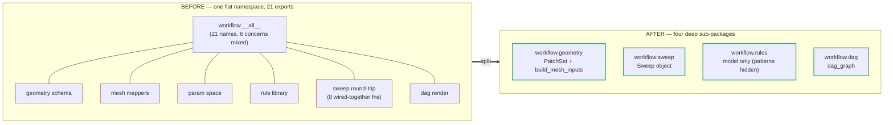
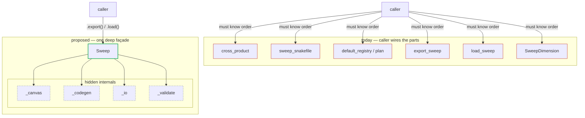

# `neofoam.tooling` — deepening the modules (interface change proposals)

*Date: 2026-07-15 — branch `polish/mcp`. Companion to
[`tooling-interface-map.md`](tooling-interface-map.md). Lens: Ousterhout, *deep modules*
+ "make the common case trivial, the rare case possible." This began as a **proposal** —
it sketches before/after interfaces and grades each move.*

> **Status: implemented.** All five moves below (§1 casebuild demotions +
> `CaseDir.read_field`, §2a `workflow.geometry`, §2b `Sweep` + the sweep package split,
> §2c `workflow.dag` + the empty `workflow/__init__`, §3 `rules` patterns off `__all__`)
> are done and green. The before/after snippets are the design record; the
> [interface map](tooling-interface-map.md) describes the resulting state and the closed
> gaps (G1–G5). One place the sketch differs from the shipped code: `Sweep` takes a
> `classes=` mapping (config classes for export-time validation) that the constructor
> sketch omits.

> **The target shape.** A deeper module = a *narrower* interface hiding *more*. Two
> concrete levers per package:
> 1. **Demote** names that are engines/internals/typing-only off `__all__` — every
>    export is a promise a caller can lean on, so fewer promises = a smaller surface to
>    learn and to keep stable.
> 2. **Raise the entry point** — replace a bag of free functions the caller must wire
>    together with one object/verb that does the wiring, so the common task is one call.

---

## 0. Summary — proposed interface sizes

| Package | `__all__` now | proposed | Headline move |
|---|---|---|---|
| `tooling` (init) | 2 | 2 | already deep — no change |
| `casebuild` | 14 | **~10** | hide the `run_tool` engine + `BoxMeshStep`; make `read_field` a `CaseDir` method |
| `workflow` | 21 (flat) | **3 sub-packages** | split into `geometry` / `sweep` / `rules` (+ `dag`); each a deep entry |
| `workflow.sweep` (new) | — | **~4** | one `Sweep` object replaces 8 wired-together free funcs |
| `workflow.geometry` (new) | — | **~6** | `build_mesh_inputs` becomes the deep entry (fixes G1) |
| `workflow.rules` | 17 | **~9** | drop the 8 path-pattern constants off `__all__` (fixes G3) |

Net effect: the two genuinely deep packages stay, the wide `workflow` grab-bag becomes
three small deep ones, and the three gaps from the interface map (G1 missing export, G2
bypass, G3 leaky constants) dissolve as a side effect.

---

## 1. `casebuild` — hide the engine, keep the verbs

**Friction today.** The interface mixes two levels: the *composition verbs* a caller
actually uses (`from_template`, `block_mesh`, `patch`, `configs`, `.build_at`) and the
*machinery under them* (`run_tool`, `BoxMeshStep`). A newcomer scanning 14 names can't
tell which are for them. `read_field` is a free function, so it's invisible from a
`CaseDir` in hand. `pipe()` is a second spelling of `|`.

**Before**

```python
from neofoam.tooling.casebuild import (
    from_template, block_mesh, patch, configs,
    run_tool, read_field, BoxMeshStep, pipe,   # engine + typing + a 2nd "compose"
)

case = (from_template(src) | block_mesh() | patch("system/controlDict", endTime=0.1)).build_at(dest)
U = read_field(case, "U")            # free fn — invisible from `case` itself
```

**After**

```python
from neofoam.tooling.casebuild import from_template, block_mesh, patch, configs

case = (from_template(src) | block_mesh() | patch("system/controlDict", endTime=0.1)).build_at(dest)
U = case.read_field("U")             # method — discoverable from the value you hold
# run_tool / BoxMeshStep / pipe still importable, just off __all__ (not user entry points)
```

Changes:

| Move | Before | After | Why deeper/easier |
|---|---|---|---|
| Demote the engine | `run_tool` in `__all__` | internal (`sweep_runner` imports it by module path, as it already does) | `run_tool` is a `ToolSpec` driver, never part of *composing* a case; hiding it removes the one export that invites misuse |
| Demote the model | `BoxMeshStep` in `__all__` | off `__all__` (still importable for tests) | typing-only detail of `box()`; not a user entry point |
| Discoverability | `read_field(case, name)` free fn | `CaseDir.read_field(name)` (lazy-imports `reader`) | you find it via the object you have; the method body keeps the lazy import, so `pipeline.py` stays numpy/subprocess-free at module top (preserves S6's *intent* while improving reach) |
| Collapse dup | `pipe()` **and** `\|` | keep `\|`, drop `pipe` from `__all__` | one spelling of "compose" — `\|` is the documented one |

**Risk:** low. All demotions keep the symbols importable (only `__all__`/docs shrink);
the `read_field` method is additive. The one judgment call is `read_field` location —
this trades a hair of `CaseDir` SRP for real discoverability; the lazy import keeps the
dependency-weight win that motivated S6.

---

## 2. `workflow` — split the grab-bag into three deep packages

**Friction today (G4).** 21 flat exports spanning six concerns. To run a sweep a caller
imports and hand-wires `cross_product`, `sweep_snakefile`, `SweepDimension`,
`default_registry`, `export_sweep`… — the module makes you assemble the pipeline it
already knows how to assemble. To go geometry→mesh they need `build_mesh_inputs`, which
isn't even exported (G1).

**Proposed layout**

```
workflow/
  geometry.py   → PatchSet, PatchEntry, PatchRole, BoundingBox,
                  build_mesh_inputs, block_mesh_dict, snappy_dict
  sweep/        → Sweep (deep facade) + the canvas/codegen/io/validate internals
  rules/        → unchanged model (patterns hidden — §3)
  dag.py        → dag_graph
```

`workflow/__init__` then re-exports a *small* curated set (or nothing, forcing the
sub-package import) — either way the six concerns stop sharing one flat namespace.



### 2a. `workflow.geometry` — one deep entry for geometry → mesh

**Before** — `build_mesh_inputs` isn't exported, so the caller deep-imports it and calls
the two low-level mappers itself:

```python
from neofoam.tooling.workflow.patch_set import PatchSet     # bypasses the package (G2)
from neofoam.tooling.workflow.mesh_inputs import build_mesh_inputs  # not in __all__ (G1)

patch_set = PatchSet.model_validate_json(manifest_text)
block_dict, snappy_dict = build_mesh_inputs(patch_set)
```

**After** — one package, `build_mesh_inputs` is the headline verb:

```python
from neofoam.tooling.workflow.geometry import PatchSet, build_mesh_inputs

patch_set = PatchSet.model_validate_json(manifest_text)
block_dict, snappy_dict = build_mesh_inputs(patch_set)   # exported now (fixes G1)
```

`block_mesh_dict` / `snappy_dict` stay as the lower-level mappers, but
`build_mesh_inputs` becomes the headline verb — the common case (both dicts from a
manifest) is one call. `mcp.tools` and `framework.validation.checks` import `PatchSet`
from here (fixes G2 — through an interface, not a submodule path).

### 2b. `workflow.sweep` — one `Sweep` object replaces eight functions

This is the biggest ease win in the layer.

```python
# BEFORE — caller wires the pipeline the module already understands
from neofoam.tooling.workflow import (
    SweepDimension, cross_product, sweep_snakefile,
    export_sweep, load_sweep, default_registry,
)
rows = cross_product(dims)
text = sweep_snakefile(default_registry().plan(enabled), solver, base_case, ...)
export_sweep(out, dims, solver=solver, base_case=base_case, ...)
loaded = load_sweep(out)

# AFTER — one object owns the round-trip
from neofoam.tooling.workflow.sweep import Sweep

sweep = Sweep(dimensions=dims, solver=solver, base_case=base_case)  # + enabled rules
sweep.export(out_dir)          # writes params.yaml, sweep.csv, Snakefile, sidecar
again = Sweep.load(out_dir)    # dims, rows, plan all derived; no header regex
```

`Sweep` hides `cross_product`, `sweep_snakefile`, the `RulePlan` resolution, and the
`sweep.meta.json` sidecar (S2) behind two verbs (`export` / `load`) plus read-only
properties (`.rows`, `.plan`, `.snakefile`). The canvas/codegen/io/validate modules
become package-internal (`workflow.sweep._canvas`, …) — still there, no longer part of
the public surface a new caller must navigate.



| | Before | After |
|---|---|---|
| Public names to run a sweep | ~8 | **2** (`Sweep` + maybe `SweepDimension`) |
| Ways to reach the same symbol | 3 (submodule / `sweep` facade / `workflow`) — G5 | 1 |
| Caller must know the pipeline order | yes | no — `Sweep` owns it |

### 2c. `workflow.dag` — trivial, just relocation

`dag_graph` moves to its own module so the DAG-render concern isn't mixed into the sweep
namespace. The call is unchanged — only the import path shortens:

```python
# Before
from neofoam.tooling.workflow.snakemake_dag import dag_graph
# After
from neofoam.tooling.workflow.dag import dag_graph
```

**Risk:** medium — this is a real move (new sub-packages, `__init__` re-export shims for
back-compat, callers in `mcp`/`ui` updated to the new paths). Do it as a pure
move + facade first (behavior-preserving), then introduce `Sweep` over the existing
free functions (which become its private helpers).

---

## 3. `workflow.rules` — take the path constants off the interface

**Friction today (G3).** 8 of 17 exports are on-disk path templates
(`MESH_CONFIG_PATTERN`, `SETUP_STAMP_PATTERN`, `RUN_DONE_PATTERN`, …). They must be
shared verbatim between the codegen and the packaged `.smk` bodies — a real constraint —
but a consumer who only wants the rule *graph* shouldn't see the storage layout.

**Before** — the rule *model* and the storage-layout *patterns* share one `__all__`, so a
graph consumer wades through 8 path strings to find the 9 model names:

```python
__all__ = [
    "RuleKind", "RuleSpec", "RuleRegistry", "RulePlan", "default_registry", "rules_dir",
    "MESH_DIM", "CAD_DIM", "DEFAULT_ENABLED",
    # storage layout leaking onto the interface:
    "MESH_CONFIG_PATTERN", "MESH_STAGE_STAMP", "CAD_CONFIG_PATTERN", "CAD_STAMP",
    "SETUP_CONFIG_PATTERN", "SETUP_STAMP_PATTERN", "RUN_DONE_PATTERN", "POST_DONE_PATTERN",
]
```

**After** — `__all__` is the deep model only; the patterns stay in the module as shared
internals:

```python
__all__ = [
    "RuleKind", "RuleSpec", "RuleRegistry", "RulePlan", "default_registry", "rules_dir",
    "MESH_DIM", "CAD_DIM", "DEFAULT_ENABLED",
]
# MESH_CONFIG_PATTERN, …, POST_DONE_PATTERN still defined below — sweep_codegen and the
# .smk headers import them by name, but they are no longer promised interface.
```

The 8 patterns stay defined in the module (so `sweep_codegen` and the `.smk` headers keep
importing them by name) but drop off `__all__` — they become "shared internals," not
promised interface. Zero code movement; `from … import PATTERN` still resolves.
Optionally group them under a single `Patterns` namespace object later if callers prefer.

**Risk:** near-zero — `__all__`/docstring only.

---

## 4. `tooling` init & `workspace` — leave them

Both are already at the target: 2 exports each, all machinery hidden. The top init's job
is precisely to *not* re-export the heavy sub-packages. No change; they're the reference
for what "deep" looks like here.

---

## 5. Ordering

Sequenced by payoff ÷ risk, each independently shippable:

1. **`rules` patterns off `__all__`** (§3) — near-zero risk, immediate surface shrink.
2. **`casebuild` demotions + `CaseDir.read_field`** (§1) — small, additive, high daily
   ease.
3. **`workflow.geometry` extraction** (§2a) — fixes G1 + G2, modest move.
4. **`workflow.sweep` → `Sweep` object** (§2b) — the big ease win; do it in two beats
   (move-behind-facade, then wrap in `Sweep`).
5. **`workflow.dag` relocation** (§2c) — cosmetic, fold into step 3/4's move.

---

## 6. Bottom line

Nothing here is a rewrite — it's mostly *subtraction from interfaces* plus one new
`Sweep` façade. The recurring pattern: the modules already contain the deep logic
(cross-product, plan resolution, mesh mapping, tool driving); today they hand the caller
the *parts*, and the proposal is to hand them the *result*. The three interface gaps
from the map report (G1/G2/G3) close as free consequences of §2a and §3, and the wide
`workflow` façade (G4/G5) becomes three narrow ones.
