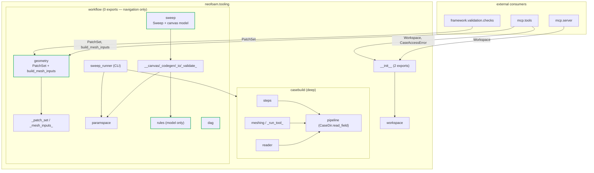

# `neofoam.tooling` — interface map (deep vs. shallow modules)

*Date: 2026-07-15 — branch `polish/mcp`. Scope: `src/neofoam/tooling/`. Lens: John
Ousterhout, *A Philosophy of Software Design* (2018) — **deep vs. shallow modules** and
**information hiding**.*

> **Status: implemented.** This started as a map + gap list (no code changed). The
> companion proposal [`tooling-deepen-interfaces.md`](tooling-deepen-interfaces.md) has
> since been carried out — the tables, diagram and gap statuses below describe the
> **post-refactor** state. All five gaps (G1–G5) are now closed or addressed; each
> gap section records how.

> **Ousterhout in one line.** A module's cost is its *interface* (what a caller must
> learn); its value is its *implementation* (what it does for them). A **deep** module
> hides a lot behind a small interface — high value ÷ low cost. A **shallow** module's
> interface is nearly as big as its implementation — you pay almost as much to call it
> as to inline it. The goal: few, narrow, deep modules; push complexity *down* out of
> interfaces.

---

## 1. The packages and their interfaces

Each package states its interface in its `__init__.py` docstring (the "Interface"
section) and exports exactly that set via `__all__`.

| Package | `__all__` size | Implementation | Depth | Verdict |
|---|---|---|---|---|
| `tooling` (top init) | **2** | re-exports the sandbox only | **Deep** | Ideal — 2 names, and it deliberately hides the two heavy sub-packages behind their own imports. |
| `tooling.workspace` | 2 | ~90 LOC of path confinement | **Deep** | One class, one job; all the `..`/symlink/absolute-escape logic is hidden. Textbook. |
| `tooling.casebuild` | **10** | ~510 LOC (pipeline + steps + tool engine + reader) | **Deep** | Narrow conceptual core (`Pipeline`, `\|`, `.build_at`); steps hide meshing/dict-patching/config-writing; `read_field` is a `CaseDir` method; `run_tool`/`BoxMeshStep`/`pipe` demoted to importable internals (§1). |
| `tooling.workflow` (top init) | **0** | navigation docstring only | **Deep** | Re-exports nothing — the six concerns stopped sharing one flat namespace; you import from the sub-module that owns your concern (G4/G5). |
| `tooling.workflow.geometry` | **7** | patch_set schema + mesh mappers | **Deep** | The one entry for geometry → mesh: `PatchSet` + `build_mesh_inputs` (the headline verb) over the `patch_set`/`mesh_inputs` internals (G1/G2). |
| `tooling.workflow.sweep` | **~11** | ~2000 LOC across 4 private modules | **Deep** | `Sweep` owns the export/load round-trip; the canvas node/edge model is the other public concern; `_canvas`/`_codegen`/`_io`/`_validate` are package-internal (§2b). |
| `tooling.workflow.rules` | **9** | ~380 LOC | **Deep** | Just the *model* (`RuleSpec`/`RuleRegistry`/`plan`); the 8 file-pattern constants are shared internals off `__all__` (G3). |
| `tooling.workflow.dag` | 4 | ~200 LOC | **Deep** | `snakemake --dag` → canvas nodes/edges; relocated from `snakemake_dag.py` (§2c). |

**Reading it:** the layer is now a set of small, deep modules. `tooling`/`workspace`/
`casebuild` were already deep; the former wide `workflow` facade is dissolved into four
deep sub-packages (`geometry`, `sweep`, `rules`, `dag`) plus the `sweep_runner` CLI and
`paramspace`, with the top `workflow/__init__` re-exporting nothing.

---

## 2. How the interfaces interact

Edges are **calls across a package/module interface**. "Via" names the symbols actually
crossing the boundary.

| Consumer | → Provider | Via (interface symbols) | Notes |
|---|---|---|---|
| `casebuild.steps` | `neofoam.io` | `DictFile`, `write_configs` | outward/down — correct layer edge |
| `casebuild.meshing` | `neofoam.tools`, `framework.tools.spec` | `blockMeshTool`, `snappyHexMeshTool`, `ToolSpec` | `run_tool` is generic over `ToolSpec`; only the thin wrappers name concrete tools |
| `casebuild.reader` | `casebuild._reader` | subprocess (`python -m …`) | field read isolated in its own process |
| `workflow.mesh_inputs` | `workflow.patch_set` | `PatchSet`, `PatchRole`, `BoxFace` | deterministic mapper over the schema |
| `workflow.sweep` (facade) | `sweep_canvas` / `sweep_codegen` / `sweep_io` / `sweep_validate` | re-exports 26 names | S1 split; facade keeps the old import surface |
| `workflow.sweep_io` | `paramspace`, `rules`, `sweep_canvas`, `sweep_codegen`, `sweep_validate` | `cross_product`, `RulePlan`, `SETUP_RULE`, `sweep_snakefile`, `validate_*` | the round-trip hub |
| `workflow.sweep_codegen` | `rules`, `paramspace` | `RulePlan`, `rules_dir`, `YamlParamSpace` | emits the Snakefile |
| `workflow.sweep_canvas` | `rules` | `RuleKind`, `RuleSpec`, patterns | branches on `RuleKind` (S3) |
| `workflow.sweep_validate` | `rules` | `CAD_DIM`, `MESH_DIM` | one shape-checker (S4) |
| `workflow.sweep_runner` | `casebuild`, `paramspace`, `framework.solver.*`, `tools.registry`, `io` | `run_tool`, `CaseDir/Pipeline/Step`, `resolve_solver` | runs on `framework.solver.registry` now (S8) — the `tooling → mcp` edge is gone |

**External consumers of the `tooling` interface** (what the surface is *for*):

| External module | Imports | From | Through the package interface? |
|---|---|---|---|
| `mcp.server` | `Workspace` | `neofoam.tooling` | ✅ yes |
| `mcp.tools` | `Workspace`, `CaseAccessError` | `neofoam.tooling` | ✅ yes |
| `mcp.tools` | `PatchSet`, `build_mesh_inputs` | `neofoam.tooling.workflow.geometry` | ✅ yes (was G1/G2 — now through the package) |
| `framework.validation.checks` | `PatchSet` | `neofoam.tooling.workflow.geometry` | ✅ yes (was G2 — now through the package) |

Both external callers keep their lazy, in-function imports (so `import neofoam.tooling`
stays stdlib-only) but now name `workflow.geometry`, not a submodule path.

---

## 3. Connection diagram

Every arrow is now a call through a stated interface — the three dashed "bypass" edges
from the pre-refactor map are gone (external geometry access goes through
`workflow.geometry`; `build_mesh_inputs` is exported). Green nodes are the four deep
`workflow` sub-package entry points; the italic `_…_` nodes are package-internal.

---

## 4. Gaps (all now closed or addressed)

Ordered by how much they undercut the "narrow, deep interface" goal. Each records the
change that closed it.

### G1 — `build_mesh_inputs` was public-in-practice but not on any interface — **fixed**
`mcp.tools` imported `build_mesh_inputs` from `neofoam.tooling.workflow.mesh_inputs`, a
name that was in no `__all__`. It is now the headline verb of the new
`neofoam.tooling.workflow.geometry` package (§2a), exported and documented; `mcp.tools`
imports it (and `PatchSet`) from there.

### G2 — external callers bypassed the package interface for `PatchSet` — **fixed**
`mcp.tools` and `framework.validation.checks` imported `PatchSet` from the
`patch_set` submodule. Both now import `PatchSet` from `workflow.geometry` — through the
package interface, so `patch_set.py` can be reorganised behind it. The imports stay lazy
and in-function, preserving the stdlib-only `import neofoam.tooling`.

### G3 — `rules` leaked 8 path-pattern constants onto its interface — **fixed**
`rules.__all__` dropped from 17 to 9: the 8 `{case}`/`{mesh}` file-pattern strings are
still *defined* in the module (the codegen and `.smk` bodies import them by name) but are
off `__all__` — shared internals, not promised interface (§3). A rule-graph consumer now
sees only the model.

### G4 — `workflow` was a wide facade, not a deep module — **addressed**
The 21-name flat namespace is dissolved into four deep sub-packages — `geometry`,
`sweep`, `rules`, `dag` — plus the `sweep_runner` CLI and `paramspace`. The top
`workflow/__init__` now re-exports **nothing** and serves as a navigation docstring, so
each concern lives behind its own small interface (§2, §2c).

### G5 — the `sweep` facade and its parts were both public — **fixed**
`sweep_canvas` / `sweep_codegen` / `sweep_io` / `sweep_validate` are now the
package-internal `sweep._canvas` / `_codegen` / `_io` / `_validate`; there is one public
path — `from neofoam.tooling.workflow.sweep import Sweep` (or the canvas model) — instead
of three (§2b). The `Sweep` object also collapses the eight wired-together free functions
into `export` / `load` + read-only `rows` / `plan` / `snakefile`.

---

## 5. Bottom line

The layer's **core abstractions were already deep** — `workspace`, `casebuild`, and the
top-level `tooling` init each hide substantial machinery behind a handful of names. The
refactor closed the concentrated, mechanical interface debt the map found:

- the **missing export** (**G1**) and the two **bypasses** (**G2**) are gone — geometry
  access is one package, `workflow.geometry`, with `build_mesh_inputs` as its verb;
- the **leaky constants** (**G3**) are off `rules.__all__`;
- the **wide facade** (**G4/G5**) is four deep sub-packages, and the `sweep` round-trip
  now has a single deep entry point, `Sweep`.

The work was mostly *subtraction from interfaces* plus one new `Sweep` façade; all public
imports either stayed stable or moved through a package interface, and the suite is green
(the two failing tests are pre-existing live-LLM credit errors, unrelated to this change).
