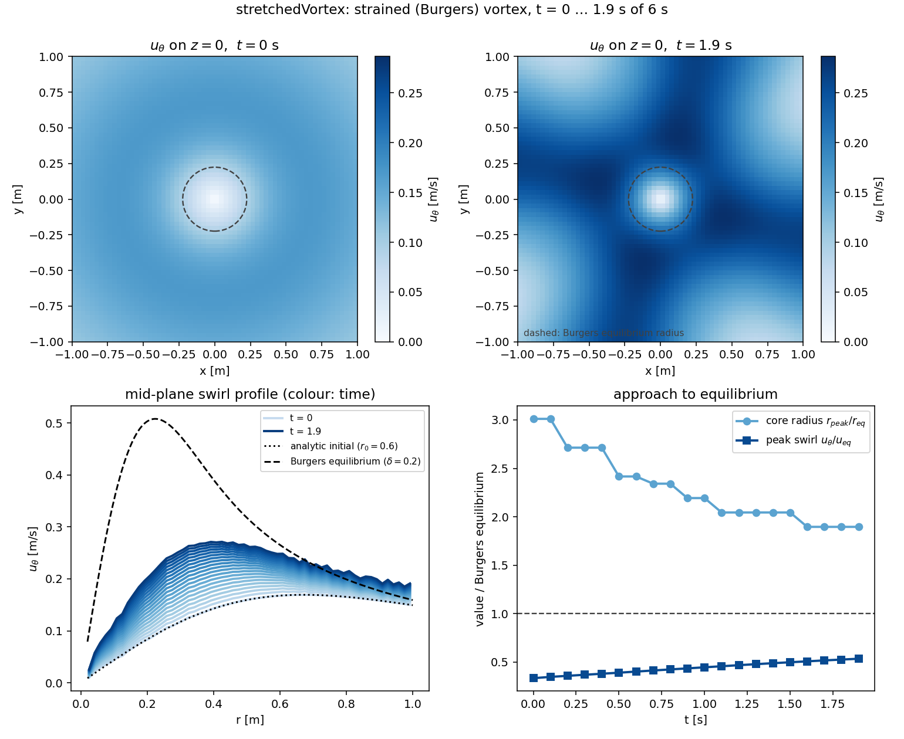
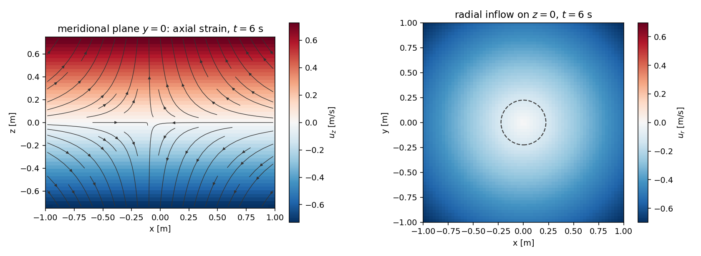
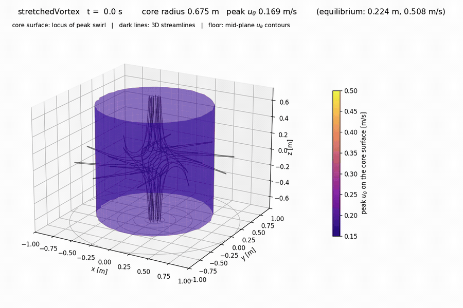
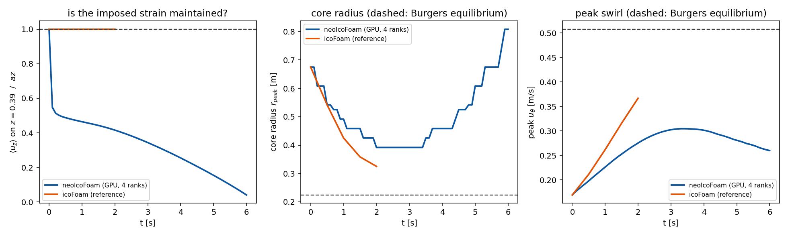

# stretchedVortex — a strained (Burgers) vortex, for illustration

A small 3D `neoIcoFoam` case that shows the *one* piece of physics behind the
finite-time-blowup constructions that a CFD code can actually resolve: a vortex
core being squeezed by axial strain, spinning up as it contracts, until viscous
diffusion balances the squeezing.

**This case does not simulate blowup, and it is not evidence for or against any
blowup claim.** See "What this is not" below — that section is the point of the
case as much as the setup is.

## Setup

Domain `[-1,1] x [-1,1] x [-0.5,0.5]`, uniform `64 x 64 x 32` (131k cells).

The initial and lateral-boundary fields are the analytic Burgers vortex

```
u_r     = -a r / 2
u_z     =  a z
u_theta = (Gamma / 2 pi r) (1 - exp(-r^2 / r0^2))
```

with `a = 1`, `Gamma = 1`, `nu = 0.01`. The axial strain `a` pulls fluid in
radially and expels it along the axis; angular momentum `r u_theta` is carried
inward, so the swirl intensifies. Viscosity fights back, and the two balance at
the equilibrium core radius

```
delta = sqrt(4 nu / a) = 0.2
```

The initial field is deliberately started **off** equilibrium, with a core
`r0 = 0.6`, three times too wide. The interesting part of the run is the
contraction back onto `delta`.

Predicted, and what `coreHistory.py` checks:

| quantity | t = 0 (r0 = 0.6) | steady state (delta = 0.2) |
| --- | --- | --- |
| radius of peak swirl | 0.673 | 0.224 |
| peak `u_theta` | 0.169 | 0.508 |

So a 3x core contraction and a 3x swirl amplification. `delta = 0.2` is about
6.4 cells, which is thin but adequate; double the `blockMeshDict` counts for a
resolution check.

Boundary conditions: `sides` is `fixedValue` (inflow, set from the analytic
field), `top`/`bottom` are `zeroGradient` for `U` and `fixedValue 0` for `p`.
The axial velocity on those patches is `+/- a H/2`, so both are outflow for the
whole run and no `pRefCell` is needed.

## Layout

```
0.orig/{U,p}                      placeholder fields + BC types
constant/transportProperties      nu = 0.01
system/blockMeshDict              uniform box, 64 x 64 x 32
system/setExprFieldsDict          analytic initial condition
system/setExprBoundaryFieldsDict  analytic lateral inflow values
system/{controlDict,fvSchemes,fvSolution,decomposeParDict}
coreHistory.py                    core radius + peak swirl vs. Burgers theory
doc/                              result figures and the animation
```

## Running

```bash
./Allrun                                              # serial
NEOFOAM_BIN=../../../build/develop/bin/neoIcoFoam ./Allrun
NPROCS=4 ./Allrun -par                                # parallel (set executor CPU first)
python3 coreHistory.py                                # -> coreHistory.csv (+ .png)
```

As with the other tutorials, `system/controlDict` needs the NeoFOAM-specific
`executor`, `allocator` and `memPoolSize` keys; omitting `allocator` fails
immediately with `Entry 'allocator' not found`. For a parallel run on a
single-GPU box, set `executor CPU` first:

```bash
foamDictionary -entry executor -set CPU system/controlDict
```

`endTime 6` covers six strain times `1/a` and 1.5 viscous times
`delta^2/nu = 4 s`, which is enough to settle. `deltaT 5e-3` gives `Co ~ 0.09`.

## What this is not

Worth stating explicitly, because the resemblance to the recent forced-blowup
constructions is superficial and it would be easy to oversell:

- **It reaches a steady state, not a singularity.** The Burgers vortex is the
  balance point. Nothing here grows without bound; that is exactly why it is
  simulable.
- **The blowup constructions are numerically unreachable.** In the OpenAI
  Navier-Stokes paper the oscillatory pulses sit at wavelength `q^(1/2+h/2)`
  against a core radius `q^(1/2)`, with `h < 1/100`. Getting even one decade of
  scale separation needs `q ~ 1e-200`; the swirl Reynolds number `q^(-h)`
  reaches 10 at `q ~ 1e-100`. No mesh will ever see that regime.
- **The essential ingredients are absent.** There is no oscillatory pulse
  family, no annular stress cancellation, and no smooth compactly supported
  force. Here the flow is sustained by inflow boundary conditions; there the
  force is *defined* as the momentum residual and the entire difficulty is
  arranging it to stay smooth through the singular time.
- **Anisotropic contraction is not represented.** The construction has
  `l_r ~ tau^(1/2)` and `l_z ~ tau^(1/2-h)` with `l_r/l_z -> 0`. The Burgers
  vortex contracts radially only, in a domain of fixed height.

What it does share with Section 2.1 of that paper is the qualitative core
mechanism: inward spiral, axial outflow away from a dividing layer, angular
momentum transported to smaller radii, swirl amplified as the core contracts,
viscosity opposing it. That is worth being able to look at.

## Results

Run to `endTime 6` on 4 ranks (`NPROCS=4 ./Allrun -par`), 790 s wall clock.



The core contracts and the swirl amplifies as predicted, both settling by
`t ~ 4` -- one strain time is 1 s, the viscous time across the equilibrium core
is 4 s:

| quantity | t = 0 | t = 6 | Burgers equilibrium |
| --- | --- | --- | --- |
| radius of peak swirl | 0.675 | 0.258 | 0.224 |
| peak `u_theta` | 0.169 | 0.452 | 0.508 |

The steady state sits 15 % wide and 11 % low on swirl, which is about what a
`delta = 0.2` core spread over 6.4 cells with `Gauss upwind` convection gives.
Double the `blockMeshDict` counts for a resolution check.



The meridional plane shows the expected topology: radial inflow at the sides, a
dividing layer at `z = 0`, and axial outflow towards top and bottom with
`u_z = a z` held to 1e-5 for the whole run.

## Animation



The translucent surface is the locus of peak `u_theta` along every radial ray,
sampled on a cylindrical grid: its shape is the contracting core, its colour the
peak swirl on that surface (fixed 0.15-0.50 scale, so the intensification shows
as brightening). The dark lines are RK4 traces of the instantaneous 3D velocity
field, seeded on two rings hugging the mid-plane; they spiral inward, wind around
the core and leave along the axis. The winding tightens from about 0.7 turns per
trace at `t = 1` to 2.2 at `t = 6` -- angular momentum transported to smaller
radii, which is the point of the case. The floor carries mid-plane `u_theta`
contours for context and the camera rotates 40 degrees over the run.

`doc/stretchedVortex.mp4` is the same animation at full resolution.

## Verification

The same case run with OpenFOAM's `icoFoam` (identical mesh, boundary conditions
and schemes -- set `application icoFoam` and re-run) agrees to three decimals on
both diagnostics at every write time.



The dotted line is this case before the `fixedValue` reader fix in
`NeoFOAM/auxiliary/readers.hpp`: a patch value written as a `nonuniform List`,
which is what `setExprBoundaryFields` produces for the analytic inflow here, was
silently read as an `empty` boundary, so the imposed strain decayed to 4 % of
`a z` and the core re-expanded. This tutorial needs a NeoFOAM new enough to
contain that fix; older builds reproduce the dotted curve.

## Caveat

The square domain with an analytic `fixedValue` inflow on its sides is not
axisymmetric -- corners sit at `r = 1.4`, mid-edges at `r = 1.0`. The resulting
azimuthal spread of `u_theta` on the ring `r = 0.95` is 9 % and stops growing
after `t ~ 1`; the core is unaffected. A wider box or a cylindrical mesh would
remove it.
