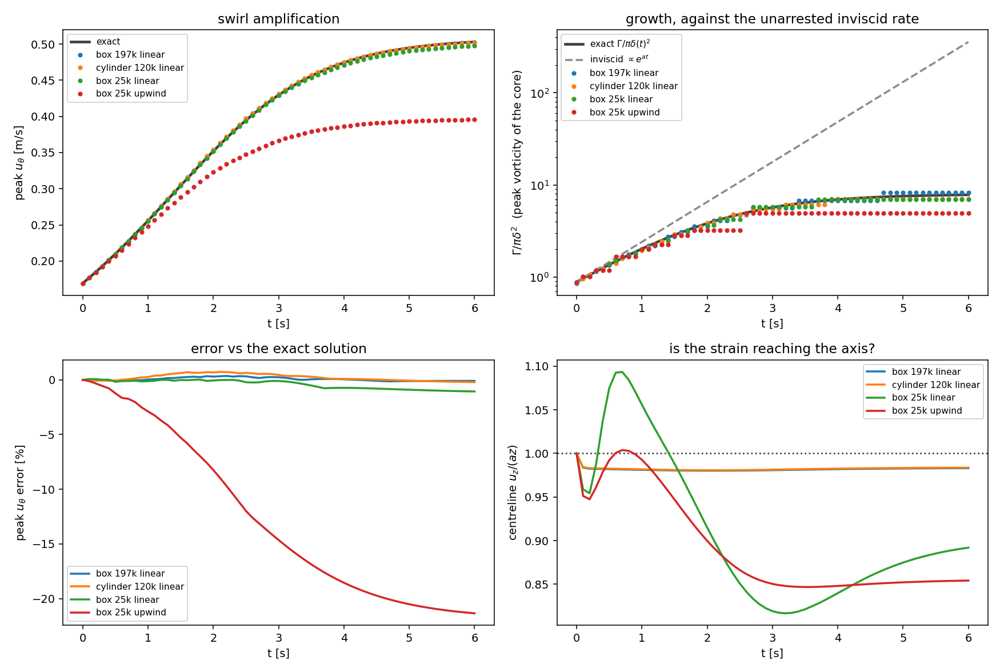
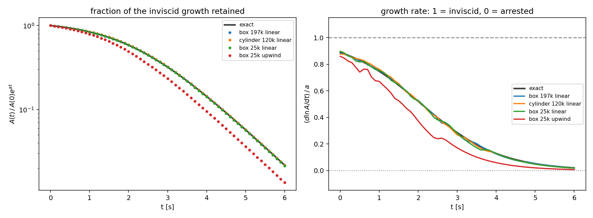

# stretchedVortex — a strained (Burgers) vortex, for illustration

A small 3D `neoIcoFoam` case that shows the *one* piece of physics behind the
finite-time-blowup constructions that a CFD code can actually resolve: a vortex
core being squeezed by axial strain, spinning up as it contracts, until viscous
diffusion balances the squeezing.

**This case does not simulate blowup, and it is not evidence for or against any
blowup claim.** See "What this is not" below — that section is the point of the
case as much as the setup is.

## Setup

Domain `[-1,1] x [-1,1] x [-0.75,0.75]`, uniform `64 x 64 x 48` (197k cells).

The initial and lateral-boundary fields are the analytic Burgers vortex

```
u_r     = -a r / 2
u_z     =  a z
u_theta = (Gamma / 2 pi r) (1 - exp(-r^2 / r0^2))
```

with `a = 1`, `Gamma = 1`, `nu = 0.01`. The axial strain `a` pulls fluid in
radially and expels it along the axis; angular momentum `r u_theta` is carried
inward, so the swirl intensifies. Viscosity fights back, and the two balance at
the equilibrium core radius

```
delta = sqrt(4 nu / a) = 0.2
```

The initial field is deliberately started **off** equilibrium, with a core
`r0 = 0.6`, three times too wide. The interesting part of the run is the
contraction back onto `delta`.

That contraction has a closed form. With Gaussian vorticity the core radius
obeys `d(delta^2)/dt = 4 nu - a delta^2`, so

```
delta(t)^2 = 4 nu / a + (delta_0^2 - 4 nu / a) exp(-a t)
```

and the case has a known answer at **every** write time, not just at the end:

| quantity | t = 0 | t = 2 | t = 6 | steady state |
| --- | --- | --- | --- | --- |
| radius of peak swirl `1.121 delta(t)` | 0.673 | 0.324 | 0.226 | 0.224 |
| peak `u_theta` `0.638 Gamma / (2 pi delta(t))` | 0.169 | 0.352 | 0.503 | 0.508 |

`coreHistory.py` measures both and prints the error against this solution.
`delta = 0.2` is about 6.4 cells, which is thin but adequate.

For a resolution study use `setMeshDensity.py` rather than editing the dict:

```bash
python3 setMeshDensity.py 2 --deltaT   # twice the cells per direction, Courant held
python3 setMeshDensity.py 0.5          # half
python3 setMeshDensity.py --dx 0.02    # target a spacing instead
```

It rewrites the cell counts in `blockMeshDict`, reports how many cells span
`delta` and what the Courant number becomes, and optionally scales `deltaT` to
hold it. Counts are forced even and the mesh stays uniform: the prescribed
boundary flux balances only because cell centres are symmetric about the axis
(see "Setup"), and `coreHistory.py` reads the counts back out of the dict so it
follows along.

Boundary conditions: velocity is `fixedValue` from the analytic field on **every**
patch, including `top`/`bottom`. The exact solution has `du_z/dz = a` there, so
`zeroGradient` would be inconsistent with it at any resolution -- and prescribing
a value that is already known costs nothing. Pressure is therefore Neumann
everywhere and its level is pinned by `pRefCell`/`pRefValue` in
`system/fvSolution`.

Two consequences worth knowing before changing anything:

- `neoIcoFoam` does not call `adjustPhi` yet, so nothing rescales the outflow to
  match the inflow: the prescribed boundary flux has to balance by itself. It
  does, exactly (the strain part is constant per face, the swirl part cancels by
  symmetry) -- measured net flux 0 against a throughput of 6.0. Any change to the
  expressions or to the mesh symmetry has to preserve that; watch the continuity
  error the solver prints.
- Every patch is a nonuniform `fixedValue`, which needs a NeoFOAM new enough to
  read such patches. Older builds silently treated them as `empty`.

The half-height is 0.75 rather than 0.5 so that the boundary values -- which use
the equilibrium core and are constant in time, while the real solution has
`delta(t)` -- cannot influence the core: viscous information travels
`sqrt(nu T) = 0.245` over the run, and the axial velocity advects away from the
mid-plane everywhere.

## Layout

```
0.orig/{U,p}                      placeholder fields + BC types
constant/transportProperties      nu = 0.01
system/blockMeshDict              uniform box, 64 x 64 x 48
system/setExprFieldsDict          analytic initial condition
system/setExprBoundaryFieldsDict  analytic values on every patch
system/{controlDict,fvSchemes,fvSolution,decomposeParDict}
coreHistory.py                    core radius + peak swirl vs. exact delta(t)
stretchedVortex.pvsm              ParaView state reproducing the animation
makeParaViewState.py              regenerates that state with pvpython
setMeshDensity.py                 rescale the mesh for a resolution study
compareRuns.py                    compare several runs against the exact solution
doc/                              result figures and the animation
```

## Running

```bash
./Allrun                                              # serial
NEOFOAM_BIN=../../../build/develop/bin/neoIcoFoam ./Allrun
NPROCS=4 ./Allrun -par                                # parallel (set executor CPU first)
python3 coreHistory.py                                # -> coreHistory.csv (+ .png)
```

As with the other tutorials, `system/controlDict` needs the NeoFOAM-specific
`executor`, `allocator` and `memPoolSize` keys; omitting `allocator` fails
immediately with `Entry 'allocator' not found`. For a parallel run on a
single-GPU box, set `executor CPU` first:

```bash
foamDictionary -entry executor -set CPU system/controlDict
```

`endTime 6` covers six strain times `1/a` and 1.5 viscous times
`delta^2/nu = 4 s`, which is enough to settle. `deltaT 5e-3` gives `Co = 0.28`
at the top and bottom of the domain, where `|u_z| = a H/2` is largest. The run
takes about 1360 s on 4 ranks -- the taller domain is 197k cells against the
131k of a half-height 0.5 box.

## What this is not

Worth stating explicitly, because the resemblance to the recent forced-blowup
constructions is superficial and it would be easy to oversell:

- **It reaches a steady state, not a singularity.** The Burgers vortex is the
  balance point. Nothing here grows without bound; that is exactly why it is
  simulable. Concretely, the core amplification `A = Gamma/(pi delta^2)` obeys

  ```
  d(ln A)/dt = a - 4 nu / delta^2
  ```

  so the growth rate is **bounded above by the strain rate `a` at every instant**,
  for any `delta > 0`: tightening the core only makes the viscous term larger and
  pushes the rate down. It decays monotonically to zero at `delta^2 = 4 nu / a`.
  Measured, the rate peaks at 0.89 `a` at `t = 0` and ends at 0.02 `a`.

  Blowup needs the growth rate itself to become unbounded, not merely positive.
  Even switching viscosity off only pins the rate at `a`, giving `A ~ exp(a t)` --
  unbounded as `t -> infinity` but finite at every finite time. With a diverging
  strain `a(t) ~ 1/tau` the quasi-steady core gives `A ~ 1/tau` and
  `d(ln A)/dt ~ 1/tau`, which is a genuine finite-time singularity.
- **The blowup constructions are numerically unreachable.** In the OpenAI
  Navier-Stokes paper the oscillatory pulses sit at wavelength `q^(1/2+h/2)`
  against a core radius `q^(1/2)`, with `h < 1/100`. Getting even one decade of
  scale separation needs `q ~ 1e-200`; the swirl Reynolds number `q^(-h)`
  reaches 10 at `q ~ 1e-100`. No mesh will ever see that regime.
- **The essential ingredients are absent.** There is no oscillatory pulse
  family, no annular stress cancellation, and no smooth compactly supported
  force. Here the flow is sustained by inflow boundary conditions; there the
  force is *defined* as the momentum residual and the entire difficulty is
  arranging it to stay smooth through the singular time.
- **Anisotropic contraction is not represented.** The construction has
  `l_r ~ tau^(1/2)` and `l_z ~ tau^(1/2-h)` with `l_r/l_z -> 0`. The Burgers
  vortex contracts radially only, in a domain of fixed height.
- **The strain rate is held constant here and diverges there.** This is the
  reason nothing in this case grows without bound. The paper's core satisfies
  `|u_z|/l_z ~ tau^(-1)`, and that ratio *is* the axial strain rate, so it blows
  up as `tau -> 0`; the velocity scales follow, `|u_theta|, |u_z| ~ tau^(-1/2-h)`
  with the azimuthal component vanishing on the axis, so the axial velocity on
  the centreline is itself unbounded. Here `a = 1` for all time, so `u_z = a z`
  on the axis is fixed by construction: only the vorticity amplifies, and even
  that saturates at `Gamma/(pi delta^2)` once viscosity balances the squeezing.

  The two are consistent, which is a useful check on both. Put `a(t) = 1/tau`
  into the Burgers balance and the paper's scalings come back out:
  `delta^2 ~ 4 nu / a = 4 nu tau` gives `l_r ~ tau^(1/2)`, and the axial velocity
  at the core's own height, `a l_z ~ tau^(-1) tau^(1/2-h)`, gives `tau^(-1/2-h)`.
  Only the `h`, which comes from the axial anisotropy, is missing. Reproducing
  the growth would mean a time-dependent strain, which `readers.hpp` cannot map
  yet.

What it does share with Section 2.1 of that paper is the qualitative core
mechanism: inward spiral, axial outflow away from a dividing layer, angular
momentum transported to smaller radii, swirl amplified as the core contracts,
viscosity opposing it. That is worth being able to look at.

## Results

Run to `endTime 6` on 4 ranks (`NPROCS=4 ./Allrun -par`), 1360 s wall clock.


The core contracts from 0.675 to 0.225 and the peak swirl grows from 0.169 to
0.502, and by `t = 6` the mid-plane profile lies on the analytic equilibrium
curve. The measured history follows the exact `delta(t)` throughout, not just at
the end:


| | peak `u_theta` error | centreline `u_z` vs `a z` |
| --- | --- | --- |
| worst over the whole run | 0.37 % | 0.05 % |
| mean over the whole run | 0.14 % | < 0.01 % |

Global continuity error runs at ~4e-20, twelve orders below what an outflow that
needs rescaling produces.

OpenFOAM's `icoFoam` on the identical case -- same mesh, boundary conditions and
schemes, only `application` changed -- agrees with `neoIcoFoam` to 2.3e-04 on
peak `u_theta` at every write time (the crosses in the figure), so the residual
error above is the discretisation, not either solver.


The meridional plane shows the expected topology: radial inflow at the sides, a
dividing layer at `z = 0`, axial outflow towards top and bottom, with `u_z = a z`
held all the way onto the axis.

## Animation


The translucent surface is the locus of peak `u_theta` along every radial ray:
its shape is the contracting core, its colour the peak swirl on that surface
(fixed 0.15-0.50 scale, so the intensification reads as brightening). The dark
lines are RK4 traces of the instantaneous 3D velocity field, seeded on two rings
hugging the mid-plane; they spiral inward, wind around the core and leave along
the axis. The winding tightens from about 0.7 turns per trace at `t = 1` to 2.2
at `t = 6` -- angular momentum transported to smaller radii, which is the point
of the case. The floor carries mid-plane `u_theta` contours and the camera
rotates 40 degrees over the run.

`doc/stretchedVortex.mp4` is the same animation at full resolution.

### Reproducing it in ParaView

`stretchedVortex.pvsm` is a ParaView state that builds the same picture from the
written fields -- run the case, then from this directory:

```bash
paraview --state=stretchedVortex.pvsm
```

The state references `case.foam` relatively, so it resolves against whichever
copy of the case you load it from. It sets up:

- an iso-surface of `|omega| = 1` for the core, coloured by `u_theta`. Vorticity
  decays monotonically outwards so one level gives one tube; an iso-surface of
  `u_theta` has two branches -- inside and outside the swirl peak -- and the
  outer shell hides the core. On the axis `|omega| = Gamma/(pi delta^2)`, so it
  grows 0.88 -> 8 as the core contracts and the tube first appears at `t ~ 0.25`;
- streamlines seeded on a line through the mid-plane, tubed for visibility;
- the mid-plane slice coloured by `u_theta` for context.

Press play to animate over the 60 written times. `makeParaViewState.py`
regenerates the state (`pvpython makeParaViewState.py case.foam out.pvsm`) if you
want to change the levels or the seeding.

Built with ParaView 5.13. Note that `FeatureEdges` on this reader's output
segfaults 5.13, which is why the domain outline uses the reader's own outline
representation.

## Comparing configurations

`compareRuns.py` puts any number of finished runs side by side against the exact
solution -- a different mesh, a different convection scheme, a different density:

```bash
python3 compareRuns.py box=. cylinder=../stretchedVortexCylinder -o doc/methodComparison.png
```

Each argument is `label=path`. The mesh is read from `0/Cx,Cy,Cz` when they exist
and from a single-block `blockMeshDict` otherwise, so a box run and an O-grid run
plot together.



The lower panels are where methods separate; the upper ones agree at plotting
accuracy. Bottom right is worth watching independently of the error panel: a
coarse run can track the peak swirl well while losing the strain near the axis.

`--blowup` instead asks how much of the *unarrested* growth each run keeps:

```bash
python3 compareRuns.py --blowup box=. cylinder=../stretchedVortexCylinder -o doc/blowupComparison.png
```



Left is `A(t) / A(0) exp(a t)`, the fraction of the inviscid trajectory still
retained; right is `d(ln A)/dt / a`, which starts near 0.89 and decays to zero as
viscosity arrests the contraction. Since every run here shares one `a` and one
`nu`, they must all arrest at the same physical time -- the exact curve is the
target, and a run sitting *below* it is over-dissipating rather than being
"further from blowup". Moving a case genuinely closer to blowup means changing
`nu` or `a`, not the mesh.

In the growth panel, `delta` is inferred from the measured core radius
(`delta = r_peak / 1.121`) rather than from a vorticity gradient -- that is what
lets the same script read any mesh, at the cost of inheriting the radial binning
resolution. The dashed line is the same vortex with `nu = 0`, which would grow as
`exp(a t)` without bound; the gap that opens after `t ~ 2.5` is the viscous
arrest, and it is the reason this case has a steady state at all.

## Caveat

The remaining approximation is that the prescribed boundary values use the
equilibrium core and are constant in time, while the true solution has
`delta(t)`. The domain half-height keeps that mismatch away from the core (see
"Setup"), and what survives is the sub-percent error tabulated above. Removing it
entirely needs a time-dependent Dirichlet condition, which `readers.hpp` does not
currently map.

The square cross-section is not axisymmetric -- corners sit at `r = 1.4`,
mid-edges at `r = 1.0` -- which leaves a 4 % azimuthal spread in `u_theta` on the
ring `r = 0.95`. It does not grow with time and the core is unaffected.
